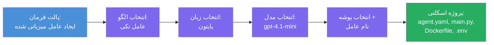

# ماژول ۳ - ایجاد یک عامل میزبانی‌شده جدید (توسط افزونه Foundry به‌صورت خودکار ایجاد شده)

در این ماژول، شما از افزونه Microsoft Foundry برای **ایجاد یک پروژه عامل میزبانی‌شده جدید** استفاده می‌کنید. این افزونه کل ساختار پروژه را برای شما تولید می‌کند - شامل `agent.yaml`، `main.py`، `Dockerfile`، `requirements.txt`، یک فایل `.env` و پیکربندی اشکال‌زدایی VS Code. پس از ایجاد ساختار، این فایل‌ها را با دستورالعمل‌ها، ابزارها و تنظیمات عامل خود شخصی‌سازی می‌کنید.

> **مفهوم کلیدی:** پوشه `agent/` در این آزمایشگاه نمونه‌ای است از آنچه افزونه Foundry هنگام اجرای این فرمان scaffold تولید می‌کند. شما این فایل‌ها را از ابتدا نمی‌نویسید - افزونه آن‌ها را ایجاد می‌کند و سپس شما آن‌ها را اصلاح می‌کنید.

### روند دستیار Scaffold


---

## گام ۱: باز کردن دستیار ایجاد عامل میزبانی‌شده

۱. کلیدهای `Ctrl+Shift+P` را فشار دهید تا **Command Palette** باز شود.
۲. تایپ کنید: **Microsoft Foundry: Create a New Hosted Agent** و آن را انتخاب کنید.
۳. دستیار ایجاد عامل میزبانی‌شده باز می‌شود.

> **راه جایگزین:** همچنین می‌توانید این دستیار را از نوار کناری Microsoft Foundry → کلیک روی آیکون **+** کنار **Agents** یا راست کلیک و انتخاب **Create New Hosted Agent** باز کنید.

---

## گام ۲: انتخاب قالب

دستیار از شما می‌خواهد یک قالب انتخاب کنید. گزینه‌هایی مانند موارد زیر مشاهده خواهید کرد:

| قالب | توضیح | زمان استفاده |
|----------|-------------|-------------|
| **Single Agent** | یک عامل با مدل، دستورالعمل‌ها و ابزارهای اختیاری مخصوص خود | این کارگاه (آزمایشگاه ۰۱) |
| **Multi-Agent Workflow** | چندین عامل که به صورت متوالی همکاری می‌کنند | آزمایشگاه ۰۲ |

۱. گزینه **Single Agent** را انتخاب کنید.
۲. روی **Next** کلیک کنید (یا انتخاب به‌صورت خودکار ادامه می‌یابد).

---

## گام ۳: انتخاب زبان برنامه‌نویسی

۱. گزینه **Python** را انتخاب کنید (برای این کارگاه توصیه شده).
۲. روی **Next** کلیک کنید.

> **C# نیز پشتیبانی می‌شود** اگر ترجیح می‌دهید از .NET استفاده کنید. ساختار scaffold مشابه است (از `Program.cs` به جای `main.py` استفاده می‌کند).

---

## گام ۴: انتخاب مدل

۱. دستیار مدل‌هایی که در پروژه Foundry شما مستقر شده‌اند را نشان می‌دهد (از ماژول ۲).
۲. مدلی که مستقر کرده‌اید را انتخاب کنید - مثلاً **gpt-4.1-mini**.
۳. روی **Next** کلیک کنید.

> اگر هیچ مدلی نمی‌بینید، به [ماژول ۲](02-create-foundry-project.md) بازگردید و ابتدا یک مدل مستقر کنید.

---

## گام ۵: انتخاب محل پوشه و نام عامل

۱. یک پنجره انتخاب فایل باز می‌شود - پوشه هدفی که پروژه در آن ساخته خواهد شد را انتخاب کنید. برای این کارگاه:
   - اگر تازه شروع می‌کنید: هر پوشه‌ای را انتخاب کنید (مثلاً `C:\Projects\my-agent`)
   - اگر داخل مخزن کارگاه کار می‌کنید: یک زیرپوشه جدید در مسیر `workshop/lab01-single-agent/agent/` ایجاد کنید
۲. یک **نام** برای عامل میزبانی‌شده وارد کنید (مثلاً `executive-summary-agent` یا `my-first-agent`).
۳. روی **Create** کلیک کنید (یا Enter را فشار دهید).

---

## گام ۶: صبر کنید تا ساختار کامل شود

۱. VS Code یک **پنجره جدید** با پروژه scaffold شده باز می‌کند.
۲. چند ثانیه صبر کنید تا پروژه به طور کامل بارگذاری شود.
۳. باید فایل‌های زیر را در پنل Explorer (`Ctrl+Shift+E`) ببینید:

```
📂 my-first-agent/
├── .env                ← Environment variables (auto-generated with placeholders)
├── .vscode/
│   └── launch.json     ← Debug configuration (F5 to run + Agent Inspector)
├── agent.yaml          ← Agent definition (kind: hosted)
├── Dockerfile          ← Container configuration for deployment
├── main.py             ← Agent entry point (your main code file)
└── requirements.txt    ← Python dependencies
```

> **این ساختار همان ساختار پوشه `agent/` در این آزمایشگاه است.** افزونه Foundry این فایل‌ها را به‌طور خودکار ایجاد می‌کند - نیازی نیست آن‌ها را به صورت دستی بسازید.

> **یادداشت کارگاه:** در این مخزن کارگاه، پوشه `.vscode/` در **ریشه فضای کاری** قرار دارد (نه در داخل هر پروژه). این پوشه شامل فایل‌های مشترک `launch.json` و `tasks.json` است که دو پیکربندی اشکال‌زدایی دارد - **"Lab01 - Single Agent"** و **"Lab02 - Multi-Agent"** - هر کدام به مسیر درست چرخه کاری آزمایشگاه اشاره می‌کنند. وقتی کلید F5 را فشار می‌دهید، پیکربندی متناسب با آزمایشگاهی که روی آن کار می‌کنید را از فهرست کشویی انتخاب کنید.

---

## گام ۷: هر فایل ایجاد شده را بفهمید

لحظه‌ای وقت بگذارید و هر فایلی را که دستیار ایجاد کرده بررسی کنید. درک آن‌ها برای ماژول ۴ (شخصی‌سازی) اهمیت دارد.

### ۷.۱ `agent.yaml` - تعریف عامل

فایل `agent.yaml` را باز کنید. شبیه این است:

```yaml
# yaml-language-server: $schema=https://raw.githubusercontent.com/microsoft/AgentSchema/refs/heads/main/schemas/v1.0/ContainerAgent.yaml

kind: hosted
name: my-first-agent
description: >
  A hosted agent deployed to Microsoft Foundry Agent Service.
metadata:
  authors:
    - Microsoft
  tags:
    - Azure AI AgentServer
    - Microsoft Agent Framework
    - Hosted Agent
protocols:
  - protocol: responses
    version: v1
environment_variables:
  - name: AZURE_AI_PROJECT_ENDPOINT
    value: ${PROJECT_ENDPOINT}
  - name: AZURE_AI_MODEL_DEPLOYMENT_NAME
    value: ${MODEL_DEPLOYMENT_NAME}
dockerfile_path: Dockerfile
resources:
  cpu: '0.25'
  memory: 0.5Gi
```

**فیلدهای کلیدی:**

| فیلد | هدف |
|-------|---------|
| `kind: hosted` | اعلام می‌کند که این یک عامل میزبانی‌شده است (مبتنی بر کانتینر، مستقر شده در [Foundry Agent Service](https://learn.microsoft.com/azure/foundry/agents/overview)) |
| `protocols: responses v1` | عامل یک نقطه پایانی HTTP سازگار با OpenAI با آدرس `/responses` را ارائه می‌دهد |
| `environment_variables` | مقادیر `.env` را به متغیرهای محیطی کانتینر در زمان استقرار نگاشت می‌کند |
| `dockerfile_path` | به Dockerfile ای که برای ساخت تصویر کانتینر استفاده می‌شود اشاره می‌کند |
| `resources` | تخصیص CPU و حافظه برای کانتینر (۰.۲۵ CPU، ۰.۵Gi حافظه) |

### ۷.۲ `main.py` - نقطه ورود عامل

فایل `main.py` را باز کنید. این فایل اصلی پایتون است که منطق عامل شما در آن قرار دارد. Scaffold شامل:

```python
from agent_framework.azure import AzureAIAgentClient
from azure.ai.agentserver.agentframework import from_agent_framework
from azure.identity.aio import DefaultAzureCredential
```

**واردسازی‌های کلیدی:**

| واردسازی | هدف |
|--------|--------|
| `AzureAIAgentClient` | اتصال به پروژه Foundry شما و ایجاد عوامل از طریق `.as_agent()` |
| [`DefaultAzureCredential`](https://learn.microsoft.com/azure/developer/python/sdk/authentication/credential-chains#defaultazurecredential-overview) | انجام احراز هویت (Azure CLI، ورود به VS Code، شناسه مدیریت شده یا سرویس پرینسیپل) |
| `from_agent_framework` | عامل را به عنوان یک سرور HTTP که نقطه پایانی `/responses` را ارائه می‌دهد بسته‌بندی می‌کند |

روند اصلی این است:
۱. ایجاد یک Credential → ایجاد یک client → فراخوانی `.as_agent()` برای گرفتن یک agent (مدیریت زمینه async) → پیچیدن آن به عنوان سرور → اجرا

### ۷.۳ `Dockerfile` - تصویر کانتینر

```dockerfile
FROM python:3.14-slim

WORKDIR /app

COPY ./ .

RUN pip install --upgrade pip && \
    if [ -f requirements.txt ]; then \
        pip install -r requirements.txt; \
    else \
        echo "No requirements.txt found" >&2; exit 1; \
    fi

EXPOSE 8088

CMD ["python", "main.py"]
```

**جزئیات کلیدی:**
- از `python:3.14-slim` به عنوان تصویر پایه استفاده می‌کند.
- همه فایل‌های پروژه را به `/app` کپی می‌کند.
- `pip` را بروزرسانی می‌کند، وابستگی‌ها را از `requirements.txt` نصب می‌کند و اگر آن فایل وجود نداشته باشد سریعا شکست می‌خورد.
- **درگاه ۸۰۸۸ را باز می‌کند** - این درگاه مورد نیاز برای عوامل میزبانی‌شده است. آن را تغییر ندهید.
- عامل را با اجرای `python main.py` راه‌اندازی می‌کند.

### ۷.۴ `requirements.txt` - وابستگی‌ها

```
agent-framework-azure-ai==1.0.0rc3
agent-framework-core==1.0.0rc3
azure-ai-agentserver-agentframework==1.0.0b16
azure-ai-agentserver-core==1.0.0b16
debugpy
agent-dev-cli
```

| بسته | هدف |
|---------|---------|
| `agent-framework-azure-ai` | ادغام Azure AI برای چارچوب عامل مایکروسافت |
| `agent-framework-core` | هسته زمان اجرای ساخت عوامل (شامل `python-dotenv`) |
| `azure-ai-agentserver-agentframework` | زمان اجرای سرور عامل میزبانی‌شده برای Foundry Agent Service |
| `azure-ai-agentserver-core` | انتزاعات هسته سرور عامل |
| `debugpy` | پشتیبانی اشکال‌زدایی پایتون (امکان اشکال‌زدایی با F5 در VS Code) |
| `agent-dev-cli` | رابط خط فرمان توسعه محلی برای آزمایش عوامل (استفاده شده توسط پیکربندی اشکال‌زدایی/اجرای پروژه) |

---

## درک پروتکل عامل

عوامل میزبانی‌شده از طریق پروتکل **OpenAI Responses API** ارتباط برقرار می‌کنند. در هنگام اجرا (محلی یا ابری)، عامل یک نقطه پایانی HTTP واحد ارائه می‌دهد:

```
POST http://localhost:8088/responses
Content-Type: application/json

{
  "input": "Your prompt here",
  "stream": false
}
```

سرویس Foundry Agent این نقطه پایانی را فراخوانی می‌کند تا درخواست‌های کاربر را ارسال کرده و پاسخ‌های عامل را دریافت کند. این همان پروتکلی است که توسط API OpenAI استفاده می‌شود، بنابراین عامل شما با هر کلاینتی که قالب پاسخ‌های OpenAI را پشتیبانی می‌کند سازگار است.

---

### نقطه بررسی

- [ ] دستیار scaffold با موفقیت پایان یافته و یک **پنجره جدید VS Code** باز شده است
- [ ] همه ۵ فایل را می‌توانید ببینید: `agent.yaml`، `main.py`، `Dockerfile`، `requirements.txt`، `.env`
- [ ] فایل `.vscode/launch.json` موجود است (اشکال‌زدایی با F5 را فعال می‌کند - در این کارگاه در ریشه فضای کاری با پیکربندی‌های اختصاصی آزمایشگاه قرار دارد)
- [ ] هر فایل را خوانده و هدف آن را می‌فهمید
- [ ] درک کرده‌اید که درگاه `8088` الزامی است و نقطه پایانی `/responses` پروتکل است

---

**قبلی:** [۰۲ - ایجاد پروژه Foundry](02-create-foundry-project.md) · **بعدی:** [۰۴ - پیکربندی و کدنویسی →](04-configure-and-code.md)

---

<!-- CO-OP TRANSLATOR DISCLAIMER START -->
**سلب مسئولیت**:  
این سند با استفاده از سرویس ترجمه ماشینی [Co-op Translator](https://github.com/Azure/co-op-translator) ترجمه شده است. در حالی که ما برای دقت تلاش می‌کنیم، لطفاً توجه داشته باشید که ترجمه‌های خودکار ممکن است حاوی اشتباهات یا نواقصی باشند. سند اصلی به زبان بومی آن باید به عنوان منبع معتبر در نظر گرفته شود. برای اطلاعات حیاتی، ترجمه حرفه‌ای انسانی توصیه می‌شود. ما مسئول هیچ گونه سوء تفاهم یا برداشت نادرست ناشی از استفاده از این ترجمه نیستیم.
<!-- CO-OP TRANSLATOR DISCLAIMER END -->