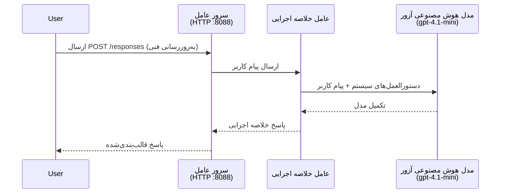
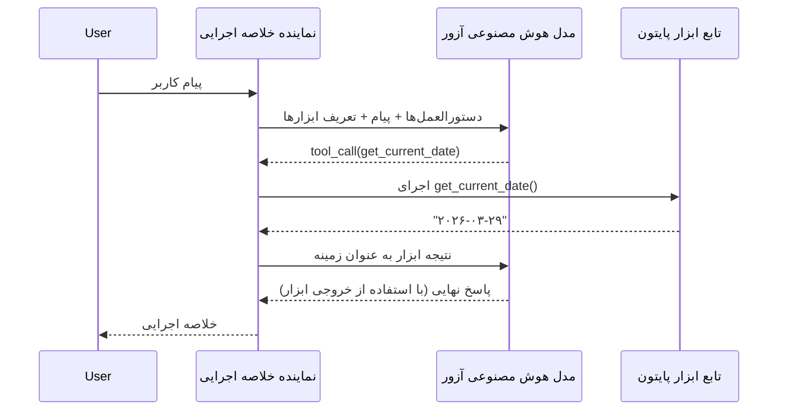

# ماژول ۴ - تنظیم دستورالعمل‌ها، محیط و نصب وابستگی‌ها

در این ماژول، فایل‌های خودکار-اسکافولد شده‌ی عامل از ماژول ۳ را سفارشی می‌کنید. اینجا جایی است که اسکافولد عمومی را به **عامل خودتان** تبدیل می‌کنید - با نوشتن دستورالعمل‌ها، تنظیم متغیرهای محیطی، اختیاری افزودن ابزارها، و نصب وابستگی‌ها.

> **یادآوری:** افزونه Foundry فایل‌های پروژه شما را به صورت خودکار ایجاد کرده است. حالا باید آنها را ویرایش کنید. پوشه [`agent/`](../../../../../workshop/lab01-single-agent/agent) را برای یک مثال کامل از یک عامل سفارشی شده ببینید.

---

## اجزا چگونه با هم کار می‌کنند

### چرخه‌ی درخواست (عامل تک‌نفره)


> **با ابزارها:** اگر عامل ابزار ثبت شده داشته باشد، مدل ممکن است به جای تکمیل مستقیم، فراخوانی ابزاری را بازگرداند. فریم‌ورک ابزار را به صورت محلی اجرا می‌کند، نتیجه را به مدل برمی‌گرداند و مدل پاسخ نهایی را تولید می‌کند.


---

## مرحله ۱: تنظیم متغیرهای محیطی

اسکافولد یک فایل `.env` با مقادیر جایگزین ساخته است. شما باید مقادیر واقعی خصوصیات پروژه Foundry را از ماژول ۲ وارد کنید.

1. در پروژه اسکافولد شده خود، فایل **`.env`** را باز کنید (در ریشه پروژه قرار دارد).
2. مقادیر جایگزین را با جزئیات واقعی پروژه Foundry خود جایگزین کنید:

   ```env
   PROJECT_ENDPOINT=https://<your-account>.services.ai.azure.com/api/projects/<your-project>
   MODEL_DEPLOYMENT_NAME=gpt-4.1-mini
   ```

3. فایل را ذخیره کنید.

### این مقادیر را از کجا پیدا کنیم

| مقدار | نحوه یافتن |
|-------|------------|
| **نقطه انتهایی پروژه** | نوار کناری **Microsoft Foundry** را در VS Code باز کنید → روی پروژه خود کلیک کنید → آدرس URL نقطه انتهایی در نمایش جزئیات نشان داده می‌شود. شبیه به `https://<account-name>.services.ai.azure.com/api/projects/<project-name>` است |
| **نام استقرار مدل** | در نوار کناری Foundry، پروژه خود را باز کنید → بخش **Models + endpoints** را ببینید → نام کنار مدل مستقر شده آمده است (مثلاً `gpt-4.1-mini`) |

> **امنیت:** هرگز فایل `.env` را به کنترل نسخه ارسال نکنید. این فایل به طور پیش‌فرض در `.gitignore` قرار دارد. اگر نیست، آن را اضافه کنید:
> ```
> .env
> ```

### جریان متغیرهای محیطی چگونه است

زنجیره نگاشت این است: `.env` → `main.py` (خواندن از طریق `os.getenv`) → `agent.yaml` (نگاشت به متغیرهای محیطی کانتینر در زمان استقرار).

در `main.py`، اسکافولد این مقادیر را به این صورت می‌خواند:

```python
PROJECT_ENDPOINT = os.getenv("AZURE_AI_PROJECT_ENDPOINT") or os.getenv("PROJECT_ENDPOINT")
MODEL_DEPLOYMENT_NAME = os.getenv("AZURE_AI_MODEL_DEPLOYMENT_NAME", os.getenv("MODEL_DEPLOYMENT_NAME", "gpt-4.1-mini"))
```

هر دو متغیر `AZURE_AI_PROJECT_ENDPOINT` و `PROJECT_ENDPOINT` قبول می‌شوند (در `agent.yaml` از پیشوند `AZURE_AI_*` استفاده شده است).

---

## مرحله ۲: نوشتن دستورالعمل‌های عامل

این مهم‌ترین مرحله سفارشی‌سازی است. دستورالعمل‌ها شخصیت، رفتار، قالب خروجی و محدودیت‌های ایمنی عامل شما را تعریف می‌کنند.

1. فایل `main.py` را در پروژه خود باز کنید.
2. رشته دستورالعمل‌ها را پیدا کنید (اسکافولد یک دستورالعمل پیش‌فرض/عمومی شامل شده است).
3. آن را با دستورالعمل‌های دقیق و ساختاربندی شده جایگزین کنید.

### دستورالعمل‌های خوب شامل چه مواردی می‌شوند

| بخش | هدف | مثال |
|------|-----|-------|
| **نقش** | عامل چه کسی است و چه کاری انجام می‌دهد | "شما یک عامل خلاصه اجرایی هستید" |
| **مخاطب** | پاسخ‌ها برای چه کسانی است | "رهبران ارشدی که دانش فنی محدودی دارند" |
| **تعریف ورودی** | چه نوع درخواست‌هایی را پردازش می‌کند | "گزارش‌های فنی حوادث، به‌روزرسانی‌های عملیاتی" |
| **قالب خروجی** | ساختار دقیق پاسخ‌ها | "خلاصه اجرایی: - چه اتفاقی افتاد: ... - تأثیر تجاری: ... - گام بعدی: ..." |
| **قوانین** | محدودیت‌ها و شرایط رد | "اطلاعاتی فراتر از داده شده اضافه نکن" |
| **ایمنی** | جلوگیری از سوءاستفاده و توهم | "اگر ورودی نامشخص است، درخواست توضیح اضافی کن" |
| **مثال‌ها** | زوج ورودی/خروجی برای هدایت رفتار | شامل ۲-۳ مثال با ورودی‌های مختلف |

### نمونه: دستورالعمل‌های عامل خلاصه اجرایی

در اینجا دستورالعمل‌هایی که در ورکشاپ در [`agent/main.py`](../../../../../workshop/lab01-single-agent/agent/main.py) استفاده شده:

```python
AGENT_INSTRUCTIONS = """You are an "Explain Like I'm an Executive" agent.

Purpose:
Your job is to translate complex technical or operational information into
clear, concise, and outcome-focused summaries that can be easily understood
by non-technical executives.

Audience:
Senior leaders with limited technical background who care about impact,
risk, and what happens next.

What you must do:
- Rephrase the input so it is understandable to a non-technical audience
- Prioritize clarity, brevity, and outcomes over technical accuracy
- Remove technical jargon, logs, metrics, stack traces, and deep root-cause details
- Translate technical causes into simple cause-and-effect statements
- Explicitly call out business impact
- Always include a clear next step or action
- Maintain a neutral, factual, and calm executive tone
- Do NOT add new facts or speculate beyond the input

Standard Output Structure (always use this wording):

Executive Summary:
- What happened: <plain-language description>
- Business impact: <clear, non-technical impact>
- Next step: <clear action or mitigation>

Rules:
- Keep responses under 100 words
- Do NOT add facts beyond the input
- If input is unclear, ask for clarification
"""
```

4. رشته دستورالعمل‌های موجود در `main.py` را با دستورالعمل‌های سفارشی خود جایگزین کنید.
5. فایل را ذخیره کنید.

---

## مرحله ۳: (اختیاری) افزودن ابزارهای سفارشی

عوامل میزبانی شده می‌توانند **توابع پایتون محلی** را به عنوان [ابزار](https://learn.microsoft.com/azure/foundry/agents/concepts/tool-catalog) اجرا کنند. این یک مزیت کلیدی عوامل میزبانی شده بر پایه کد نسبت به عوامل صرفاً متنی است - عامل شما می‌تواند منطق سروری دلخواه را اجرا کند.

### ۳.۱ تعریف یک تابع ابزار

یک تابع ابزار را به `main.py` اضافه کنید:

```python
from agent_framework import tool

@tool
def get_current_date() -> str:
    """Returns the current date in YYYY-MM-DD format."""
    from datetime import date
    return str(date.today())
```

دکوریتور `@tool` یک تابع معمولی پایتون را به ابزار عامل تبدیل می‌کند. مستندات تابع تبدیل به توضیحات ابزار می‌شود که مدل مشاهده می‌کند.

### ۳.۲ ثبت ابزار در عامل

هنگام ایجاد عامل توسط مدیر زمینه `.as_agent()`، ابزار را به پارامتر `tools` بدهید:

```python
async with AzureAIAgentClient(
    project_endpoint=PROJECT_ENDPOINT,
    model_deployment_name=MODEL_DEPLOYMENT_NAME,
    credential=credential,
).as_agent(
    name="my-agent",
    instructions=AGENT_INSTRUCTIONS,
    tools=[get_current_date],
) as agent:
    server = from_agent_framework(agent)
    await server.run_async()
```

### ۳.۳ چگونه فراخوانی ابزار کار می‌کند

1. کاربر یک درخواست ارسال می‌کند.
2. مدل تصمیم می‌گیرد که آیا به ابزار نیاز است (بر اساس درخواست، دستورالعمل‌ها، و توضیحات ابزارها).
3. اگر ابزار لازم باشد، فریم‌ورک تابع پایتون شما را به صورت محلی (درون کانتینر) اجرا می‌کند.
4. مقدار بازگشتی ابزار به عنوان زمینه به مدل ارسال می‌شود.
5. مدل پاسخ نهایی را تولید می‌کند.

> **ابزارها در سمت سرور اجرا می‌شوند** - آنها درون کانتینر شما اجرا می‌شوند، نه در مرورگر کاربر یا مدل. این به شما امکان دسترسی به پایگاه داده‌ها، APIها، سیستم فایل یا هر کتابخانه پایتونی را می‌دهد.

---

## مرحله ۴: ایجاد و فعال‌سازی محیط مجازی

قبل از نصب وابستگی‌ها، یک محیط پایتون جدا ایجاد کنید.

### ۴.۱ ایجاد محیط مجازی

یک ترمینال در VS Code باز کنید (`` Ctrl+` ``) و اجرا کنید:

```powershell
python -m venv .venv
```

این یک پوشه `.venv` در دایرکتوری پروژه شما ایجاد می‌کند.

### ۴.۲ فعال‌سازی محیط مجازی

**PowerShell (ویندوز):**

```powershell
.\.venv\Scripts\Activate.ps1
```

**Command Prompt (ویندوز):**

```cmd
.venv\Scripts\activate.bat
```

**macOS/Linux (بش):**

```bash
source .venv/bin/activate
```

باید `(.venv)` در ابتدای پرامپت ترمینال شما ظاهر شود، که نشان‌دهنده فعال بودن محیط مجازی است.

### ۴.۳ نصب وابستگی‌ها

با فعال بودن محیط مجازی، پکیج‌های لازم را نصب کنید:

```powershell
pip install -r requirements.txt
```

این نصب می‌کند:

| پکیج | هدف |
|--------|-------|
| `agent-framework-azure-ai==1.0.0rc3` | ادغام Azure AI برای [Microsoft Agent Framework](https://learn.microsoft.com/agent-framework/overview/) |
| `agent-framework-core==1.0.0rc3` | محیط اجرای اصلی برای ساخت عوامل (شامل `python-dotenv`) |
| `azure-ai-agentserver-agentframework==1.0.0b16` | محیط اجرایی سرور عامل میزبانی شده برای [Foundry Agent Service](https://learn.microsoft.com/azure/foundry/agents/overview) |
| `azure-ai-agentserver-core==1.0.0b16` | انتزاعات اصلی سرور عامل |
| `debugpy` | دیباگ کردن پایتون (فعال‌کردن دیباگ F5 در VS Code) |
| `agent-dev-cli` | CLI توسعه محلی برای تست عوامل |

### ۴.۴ تأیید نصب

```powershell
pip list | Select-String "agent-framework|agentserver"
```

خروجی مورد انتظار:
```
agent-framework-azure-ai   1.0.0rc3
agent-framework-core       1.0.0rc3
azure-ai-agentserver-agentframework 1.0.0b16
azure-ai-agentserver-core  1.0.0b16
```

---

## مرحله ۵: تأیید احراز هویت

عامل از [`DefaultAzureCredential`](https://learn.microsoft.com/azure/developer/python/sdk/authentication/credential-chains#defaultazurecredential-overview) استفاده می‌کند که روش‌های مختلف احراز هویت را به ترتیب زیر امتحان می‌کند:

1. **متغیرهای محیطی** - `AZURE_CLIENT_ID`، `AZURE_TENANT_ID`، `AZURE_CLIENT_SECRET` (خدمت پرینسیپال)
2. **Azure CLI** - جلسه `az login` شما را استفاده می‌کند
3. **VS Code** - از حسابی که وارد VS Code شده‌اید استفاده می‌کند
4. **Managed Identity** - هنگام اجرای در Azure (در زمان استقرار) استفاده می‌شود

### ۵.۱ تأیید برای توسعه محلی

حداقل یکی از روش‌های زیر باید کار کند:

**گزینه A: Azure CLI (توصیه شده)**

```powershell
az account show --query "{name:name, id:id}" --output table
```

مورد انتظار: نام و شناسه اشتراک شما نشان داده می‌شود.

**گزینه B: ورود به VS Code**

1. گوشه پایین-چپ VS Code را برای آیکون **Accounts** بررسی کنید.
2. اگر نام حساب شما را می‌بینید، احراز هویت شده‌اید.
3. در غیر این صورت، روی آیکون کلیک کنید → **Sign in to use Microsoft Foundry**.

**گزینه C: خدمت پرینسیپال (برای CI/CD)**

```powershell
$env:AZURE_TENANT_ID = "<your-tenant-id>"
$env:AZURE_CLIENT_ID = "<your-client-id>"
$env:AZURE_CLIENT_SECRET = "<your-client-secret>"
```

### ۵.۲ مشکل رایج احراز هویت

اگر به چند حساب Azure وارد شده‌اید، مطمئن شوید اشتراک درست انتخاب شده است:

```powershell
az account set --subscription "<your-subscription-id>"
```

---

### نقاط بررسی

- [ ] فایل `.env` شامل `PROJECT_ENDPOINT` و `MODEL_DEPLOYMENT_NAME` معتبر است (جایگزین نیست)
- [ ] دستورالعمل‌های عامل در `main.py` سفارشی شده است - آنها نقش، مخاطب، قالب خروجی، قوانین و محدودیت‌های ایمنی را تعریف می‌کنند
- [ ] (اختیاری) ابزارهای سفارشی تعریف و ثبت شده‌اند
- [ ] محیط مجازی ایجاد و فعال شده است (`(.venv)` در پرامپت ترمینال دیده می‌شود)
- [ ] `pip install -r requirements.txt` بدون خطا کامل می‌شود
- [ ] `pip list | Select-String "azure-ai-agentserver"` نشان می‌دهد پکیج نصب شده است
- [ ] احراز هویت معتبر است - `az account show` اشتراک شما را باز می‌گرداند یا در VS Code وارد شده‌اید

---

**قبلی:** [۰۳ - ایجاد عامل میزبانی شده](03-create-hosted-agent.md) · **بعدی:** [۰۵ - تست به صورت محلی →](05-test-locally.md)

---

<!-- CO-OP TRANSLATOR DISCLAIMER START -->
**توضیح مسئولیت**:  
این سند با استفاده از سرویس ترجمه ماشینی [Co-op Translator](https://github.com/Azure/co-op-translator) ترجمه شده است. در حالی که ما در تلاش برای دقت هستیم، لطفاً به این نکته توجه داشته باشید که ترجمه‌های خودکار ممکن است شامل اشتباهات یا نادرستی‌هایی باشند. سند اصلی به زبان بومی آن باید به عنوان منبع معتبر در نظر گرفته شود. برای اطلاعات حیاتی، ترجمه حرفه‌ای انسانی پیشنهاد می‌شود. ما در قبال هرگونه سوتفاهم یا تفسیر نادرست ناشی از استفاده از این ترجمه مسئولیتی نداریم.
<!-- CO-OP TRANSLATOR DISCLAIMER END -->