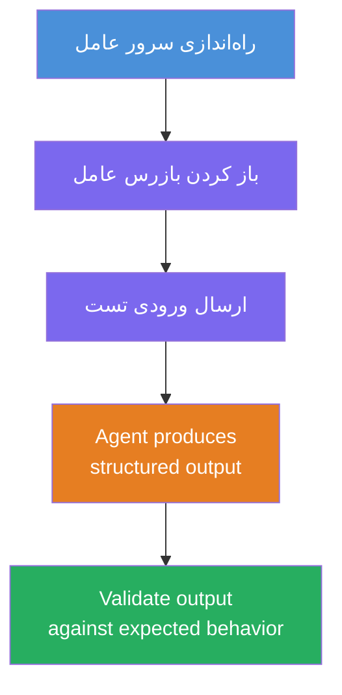
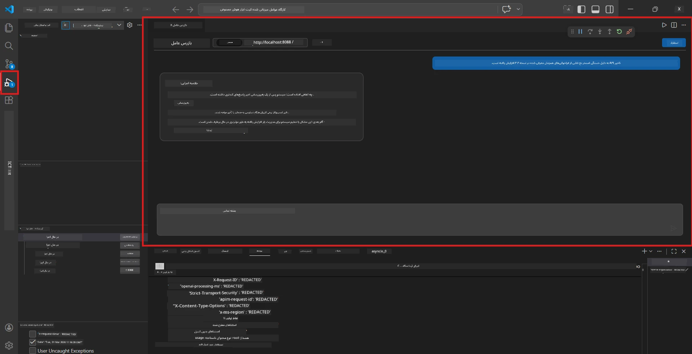
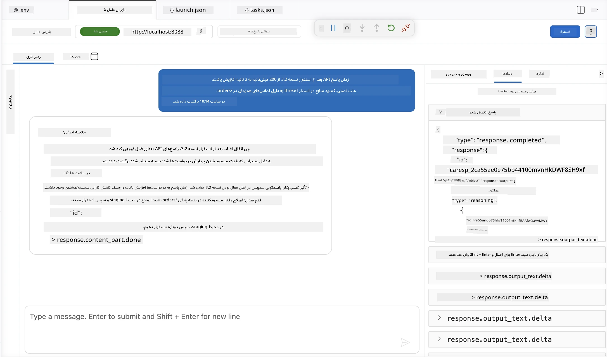

# ماژول ۴ - تست محلی

⏱️ ~۱۰ دقیقه

در این ماژول، عامل (Agent) خود را به صورت محلی اجرا کرده و صحت عملکرد آن را با استفاده از **تست‌های عملکردی مسیر خوشبینانه** (happy-path functional tests) اعتبارسنجی می‌کنید. شما از Agent Inspector (رابط گرافیکی بصری) یا تماس‌های مستقیم HTTP برای تأیید اینکه عامل پاسخ‌های ساختاریافته و دقیقی تولید می‌کند، استفاده خواهید کرد.

### روند آزمایش محلی



---

## گزینه ۱: فشار دادن F5 - دیباگ با Agent Inspector (توصیه شده)

### شروع دیباگر

۱. پوشه **executive-summary-agent/** را مستقیماً در VS Code باز کنید (`File → Open Folder`).
۲. پنل **Run and Debug** را باز کنید (`Ctrl+Shift+D`).
۳. از منوی کشویی گزینه **Debug Local Agent Server** را انتخاب کنید.
۴. دکمه **F5** را فشار دهید (یا روی ▶ Start Debugging کلیک کنید).

> ⚠️ **مهم: مفسر پایتون خود را انتخاب کنید**
> اگر خطای "ModuleNotFoundError" دریافت کردید یا دیباگر اجرا نشد، باید به VS Code بگویید از محیط مجازی شما استفاده کند:
  > ۱. دکمه `Ctrl+Shift+P` را فشار دهید و **Python: Select Interpreter** را تایپ کنید.
  > ۲. مفسری که در پوشه `.venv` پروژه شما قرار دارد را انتخاب کنید (مثلاً `.\.venv\Scripts\python.exe` در ویندوز).
  > ۳. جلسه دیباگ را مجدداً راه‌اندازی کنید.
> اگر هنوز خطا دریافت می‌کنید، به صورت دستی فایل `tasks.json` را به شکل زیر به‌روزرسانی کنید:
  > ۱. به فایل `.vscode/tasks.json` بروید
  > ۲. دستور خطی که با `Run Agent/Workflow HTTP Server` برچسب زده شده را پیدا کنید
  > ۳. مقدار دستور را به شکل زیر به‌روزرسانی کنید: `"value": "${workspaceFolder}/.venv/bin/python",`

### چه اتفاقی می‌افتد

۱. سرور HTTP روی `http://localhost:8088/responses` شروع به کار می‌کند.
۲. پنل **Agent Inspector** به طور خودکار باز می‌شود - یک رابط مکالمه بصری برای تست.
۳. نقاط توقف (breakpoints) در فایل `main.py` فعال هستند.

به ترمینال نگاه کنید برای:
```
Starting executive summary hosted agent
Executive agent server running on http://localhost:8088
```

> **اگر Agent Inspector باز نشد:** دکمه `Ctrl+Shift+P` را فشار دهید → **Foundry Toolkit: Open Agent Inspector** را انتخاب کنید.



> *ممکن است تصویر نشان‌دهنده برندینگ قدیمی 'AI TOOLKIT' از نسخه‌های قبلی افزونه باشد.*

---

## گزینه ۲: تست از طریق ترمینال (جایگزین)

عامل را در یک ترمینال راه‌اندازی کنید و درخواست‌ها را از ترمینال دیگری ارسال کنید:

```bash
# ترمینال ۱: شروع عامل
cd executive-summary-agent/
source .venv/bin/activate
python main.py
```

```bash
# ترمینال ۲: ارسال تست (کرل)
curl -sS -X POST http://localhost:8088/responses \
  -H "Content-Type: application/json" \
  -d '{"input": "The API latency increased due to thread pool exhaustion caused by sync calls in v3.2.", "stream": false}'
```

---

## تست‌های سناریو: اعتبارسنجی عملکرد مسیر خوشبینانه

هر **سه سناریو** زیر را اجرا کنید. این‌ها صحت تولید خروجی ساختاریافته و درست توسط عامل شما را برای ورودی‌های واقعی تأیید می‌کنند.



### سناریو ۱: حادثه IT - افزایش تأخیر API

**ورودی:**
```
The API latency increased from 200ms to 2s after deploying v3.2.
Root cause: thread pool starvation from synchronous calls in /orders.
Rolled back at 10:14.
```

**رفتار مورد انتظار:**
- ✅ ساختار "Executive Summary" را دنبال می‌کند (چه اتفاقی افتاد / تأثیر کسب‌وکار / گام بعدی)
- ✅ هیچ اصطلاح فنی ندارد (هیچ "thread pool"، هیچ "/orders" و هیچ "v3.2")
- ✅ تأثیر کسب‌وکار را به وضوح بیان می‌کند (مثلاً کاربران با تأخیر مواجه شدند)
- ✅ شامل یک گام بعدی است (مثلاً رفع مشکل انجام شده، نظارت برقرار شده)

---

### سناریو ۲: خط لوله داده - خطای ETL

**ورودی:**
```
The nightly ETL job failed because the upstream schema changed. APAC dashboards show missing data.
```

**رفتار مورد انتظار:**
- ✅ شکست در تازه‌سازی داده‌ها را به زبان ساده خلاصه می‌کند
- ✅ تأثیر داشبورد APAC را ذکر می‌کند
- ✅ شامل یک گام اصلاحی برای رفع مشکل است
- ✅ هیچ واژه فنی مانند "ETL"، "schema" یا دیگر اصطلاحات فنی را ذکر نمی‌کند

---

### سناریو ۳: امنیت - نمایش اعتبارنامه

**ورودی:**
```
Static analysis flagged a hardcoded secret in the repository.
The secret may have been exposed in commit history.
```

**رفتار مورد انتظار:**
- ✅ مسئله اعتبارنامه/امنیت را به زبان قابل فهم مدیران توصیف می‌کند
- ✅ خطر احتمالی را (دسترسی غیرمجاز) بیان می‌کند
- ✅ اقدام اصلاحی (چرخش اعتبارنامه، ممیزی) را ذکر می‌کند
- ✅ شامل اصطلاحاتی مانند "static analysis"، "commit history" یا "hardcoded" نیست

---

## معیارهای اعتبارسنجی

برای هر سناریو، موارد زیر را بررسی کنید:

| # | معیار | شرط موفقیت |
|---|----------|---------------|
| ۱ | **ساختار** | پاسخ از قالب "Executive Summary" با هر سه نکته استفاده کند |
| ۲ | **زبان ساده** | هیچ اصطلاح فنی که یک مدیر اجرایی نفهمد نباشد |
| ۳ | **دقت** | خلاصه به ورودی مرتبط باشد - هیچ جزئیات ساختگی نداشته باشد |
| ۴ | **اختصار** | پاسخ کمتر از ۱۰۰ کلمه باشد |
| ۵ | **گام بعدی** | یک اقدام یا کاهش ریسک واضح بیان شود |

---

## نکات دیباگ

| مشکل | رفع مشکل |
|-------|-----|
| عامل شروع نمی‌شود | مقادیر `.env` را بررسی کنید، مطمئن شوید venv فعال است، دستور `pip install -r requirements.txt` را اجرا کنید |
| پاسخ خالی یا عمومی | دستورالعمل‌های `main.py` را مرور کنید - مطمئن شوید فرمت خروجی مشخص شده است |
| پاسخ شامل اصطلاحات تخصصی است | قوانین "حذف اصطلاحات فنی" را در دستورالعمل‌ها تقویت کنید |
| Agent Inspector باز نمی‌شود | `Ctrl+Shift+P` → **Foundry Toolkit: Open Agent Inspector** |
| خطاهای مدل در ترمینال | مقدار `AZURE_AI_MODEL_DEPLOYMENT_NAME` را دقیقاً بررسی کنید (حساس به حروف) |

---

### ✅ چک‌پوینت

- [ ] عامل بدون خطا به صورت محلی شروع به کار کند
- [ ] Agent Inspector باز شود و یک رابط گفتگو نشان دهد (در صورت استفاده از F5)
- [ ] **سناریو ۱** (حادثه IT) - خلاصه اجرایی ساختاریافته، بدون اصطلاح فنی
- [ ] **سناریو ۲** (خط لوله داده) - خلاصه مرتبط با تأثیر کسب‌وکار
- [ ] **سناریو ۳** (هشدار امنیتی) - ارتباط ریسک مناسب
- [ ] همه پاسخ‌ها از ساختار خروجی تعریف شده پیروی کنند

> **پاسخ‌های خود را ذخیره کنید** (کپی یا اسکرین‌شات بگیرید) - شما آن‌ها را با نتایج ابری در ماژول ۰۶ مقایسه خواهید کرد.

---

**قبلی:** [۰۳ - پیکربندی و کدنویسی](03-configure-and-code.md) · **بعدی:** [۰۵ - استقرار در Foundry →](05-deploy-to-foundry.md)

---

<!-- CO-OP TRANSLATOR DISCLAIMER START -->
**سلب مسئولیت**:
این سند با استفاده از سرویس ترجمه هوش مصنوعی [Co-op Translator](https://github.com/Azure/co-op-translator) ترجمه شده است. در حالی که ما در تلاش برای دقت هستیم، لطفاً توجه داشته باشید که ترجمه‌های خودکار ممکن است شامل خطاها یا نادرستی‌هایی باشند. سند اصلی به زبان مادری خود باید به عنوان منبع معتبر در نظر گرفته شود. برای اطلاعات حیاتی، ترجمه حرفه‌ای انسانی توصیه می‌شود. ما در قبال هرگونه سوء تفاهم یا برداشت نادرست ناشی از استفاده از این ترجمه مسئولیتی نداریم.
<!-- CO-OP TRANSLATOR DISCLAIMER END -->