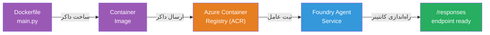
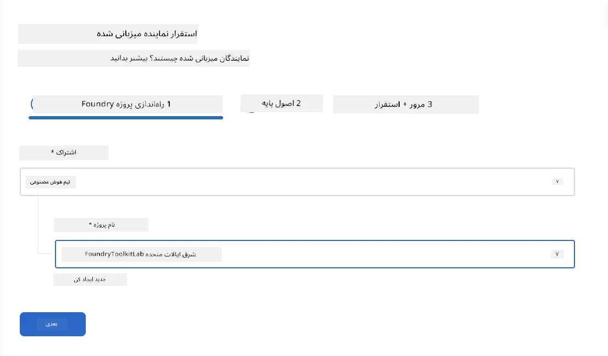
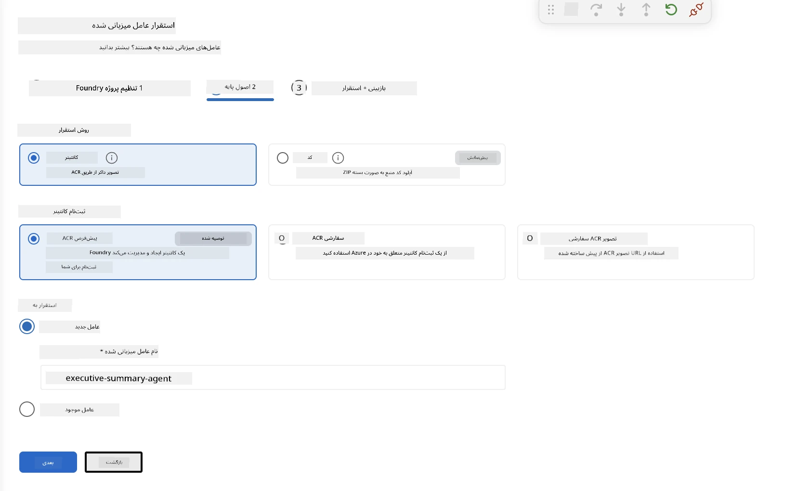
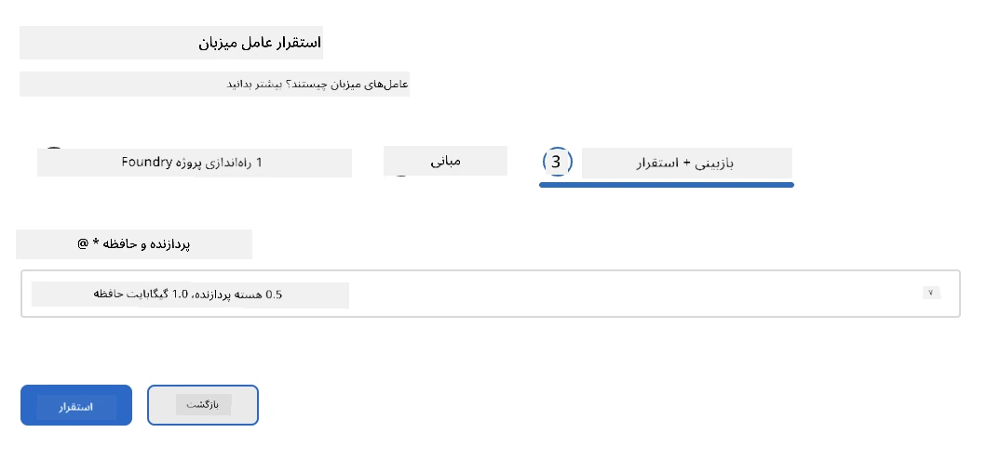
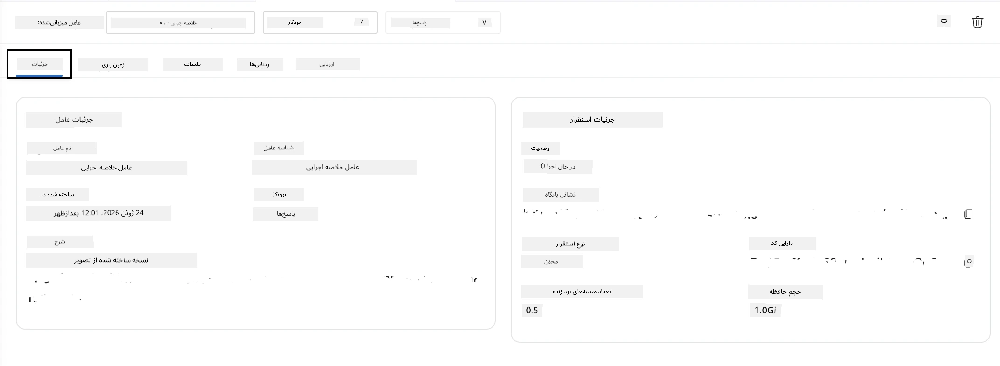

# ماژول ۵ - استقرار در سرویس Foundry Agent  

⏱️ ~۱۰ دقیقه  

> ⚠️ **کاربران مسیر B:** این ماژول نیازمند اشتراک Foundry است. اگر از Foundry Local استفاده می‌کنید، به [ماژول ۰۷ - خلاصه](07-summary.md) بروید. شما با موفقیت جریان توسعه محلی را کامل کرده‌اید!  

در این ماژول، عامل آزمایش‌شده محلی خود را به عنوان یک **عامل میزبانی‌شده** به Microsoft Foundry مستقر می‌کنید. استقرار شامل ساخت یک ایمیج کانتینر، پوش کردن آن به Azure Container Registry، و راه‌اندازی عامل در زیرساخت مدیریت‌شده Foundry می‌شود.  

### خط لوله استقرار  

  
---  

## بررسی پیش‌نیازها  

قبل از استقرار، مطمئن شوید که:  

- [ ] عامل تمام ۳ سناریوی محلی از [ماژول ۰۴](04-test-locally.md) را پشت سر گذاشته است  
- [ ] نقش **Azure AI User** را در سطح پروژه دارید ([ماژول ۰۱، تخصیص RBAC](01-setup.md#deploy-a-model--assign-rbac))  
- [ ] در VS Code وارد حساب Azure شده‌اید (آیکون حساب نام شما را نمایش می‌دهد)  

---  

## گام ۱: شروع استقرار  

### گزینه A: استقرار از Agent Inspector (توصیه شده)  

اگر Agent Inspector باز است (از تست محلی):  
۱. روی دکمه **Deploy** در بالای سمت راست (آیکون ابر ↑) کلیک کنید.  

### گزینه B: استقرار از Command Palette  

۱. دکمه‌های `Ctrl+Shift+P` را فشار دهید → **Foundry Toolkit: Deploy Hosted Agent**.  

---  

## گام ۲: پیکربندی استقرار  

جادوگر از شما می‌پرسد:  

  

| پرسش | انتخاب |  
|--------|-----------|  
| **اشتراک** | اشتراک Azure شما |  
| **پروژه هدف** | پروژه Foundry شما (مثلاً `workshop-agents`) |  

برای ادامه روی **بعدی** کلیک کنید تا عامل‌تان را پیکربندی کنید.  

  

| پرسش | انتخاب |  
|--------|-----------|  
| **روش استقرار** | کانتینر |  
| **ثبت کانتینر** | **ACR پیش‌فرض** (Microsoft Foundry یکی را برای شما ایجاد و مدیریت می‌کند) |  
| **استقرار روی** | عامل جدید (نام، `executive-summary-agent`) |  

برای مرور و استقرار عامل‌تان روی **بعدی** کلیک کنید.  

  

| پرسش | انتخاب |  
|--------|-----------|  
| **پردازنده و حافظه** | **۰.۲۵ هسته CPU، ۰.۵ گیگ حافظه** (کافی برای ورکشاپ) |  

---  

## گام ۳: استقرار و پایش  

۱. روی **Deploy** کلیک کنید.  
۲. پانل **Output** را مشاهده کنید (از لیست کشویی **Microsoft Foundry** را انتخاب کنید).  
۳. استقرار مراحل زیر را طی می‌کند:  
   - **ساخت Docker** - ایجاد کانتینر از Dockerfile شما  
   - **ارسال Docker** - پوش تصویر به ACR (۱ تا ۳ دقیقه در اولین استقرار)  
   - **ثبت عامل** - ایجاد عامل میزبانی‌شده در Foundry  
   - **شروع کانتینر** - با هویت مدیریت‌شده سیستم آغاز می‌شود  

۴. هنگام اتمام، اعلانی ظاهر می‌شود:  
   > **my-agent با موفقیت مستقر شد.** `مشاهده لاگ‌ها` `اجرای عامل`  

۵. روی **اجرای عامل** کلیک کنید تا Agent Playground باز شود.  

  

### مقادیر وضعیت استقرار  

| وضعیت | معنی |  
|--------|---------|  
| **در حال اجرا** | کانتینر آماده است، عامل پاسخ می‌دهد |  
| **در حال انتظار** | کانتینر در حال راه‌اندازی - ۳۰ تا ۶۰ ثانیه صبر کنید |  
| **ناموفق** | لاگ‌ها را بررسی کنید (به عیب‌یابی زیر مراجعه کنید) |  

---  

## خطاهای رایج در استقرار  

| خطا | علت اصلی | راه‌حل |  
|-------|-----------|-----|  
| مجوز `agents/write` رد شد | نقش **Azure AI User** در سطح پروژه وجود ندارد | [ماژول ۰۱، تخصیص RBAC](01-setup.md#deploy-a-model--assign-rbac) |  
| Docker اجرا نمی‌شود | Docker Desktop شروع نشده است | Docker Desktop را اجرا کنید → دستور `docker info` را بررسی کنید |  
| مجوز ACR | هویت مدیریت شده نمی‌تواند تصویر را دریافت کند | به [ماژول ۰۸ - عیب‌یابی](08-troubleshooting.md) مراجعه کنید |  

---  

### ✅ نقطه بررسی  

- [ ] استقرار بدون خطا انجام شده است  
- [ ] عامل در زیر **Hosted Agents (Preview)** در نوار کناری Foundry نمایش داده می‌شود  
- [ ] وضعیت کانتینر **در حال اجرا** است  
- [ ] تب Agent Playground باز شده و جزئیات عامل و آدرس انتهایی نمایش داده شده است  

---  

**قبلی:** [۰۴ - تست محلی](04-test-locally.md) · **بعدی:** [۰۶ - تایید در Playground →](06-verify-in-playground.md)  

---

<!-- CO-OP TRANSLATOR DISCLAIMER START -->
**سلب مسئولیت**:
این سند با استفاده از سرویس ترجمه هوش مصنوعی [Co-op Translator](https://github.com/Azure/co-op-translator) ترجمه شده است. در حالی که ما در تلاش برای دقت هستیم، لطفاً توجه داشته باشید که ترجمه‌های خودکار ممکن است شامل خطاها یا نادرستی‌هایی باشند. سند اصلی به زبان مادری خود باید به عنوان منبع معتبر در نظر گرفته شود. برای اطلاعات حیاتی، ترجمه حرفه‌ای انسانی توصیه می‌شود. ما در قبال هرگونه سوء تفاهم یا برداشت نادرست ناشی از استفاده از این ترجمه مسئولیتی نداریم.
<!-- CO-OP TRANSLATOR DISCLAIMER END -->