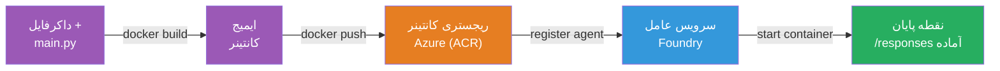
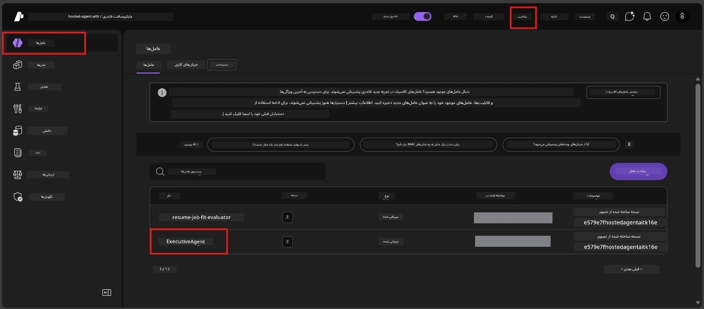

# ماژول ۶ - استقرار در سرویس Foundry Agent

در این ماژول، عامل خود را که به‌صورت محلی آزمایش شده است، به Microsoft Foundry به عنوان یک [**عامل میزبان شده**](https://learn.microsoft.com/azure/foundry/agents/concepts/hosted-agents) مستقر می‌کنید. فرآیند استقرار یک تصویر کانتینر داکر از پروژه شما می‌سازد، آن را به [Azure Container Registry (ACR)](https://learn.microsoft.com/azure/container-registry/container-registry-intro) ارسال می‌کند و یک نسخه عامل میزبان شده در [Foundry Agent Service](https://learn.microsoft.com/azure/foundry/agents/overview) ایجاد می‌کند.

### خط لوله استقرار


---

## بررسی پیش‌نیازها

قبل از استقرار، موارد زیر را بررسی کنید. نادیده گرفتن این موارد رایج‌ترین علت شکست‌های استقرار است.

1. **عامل تست‌های محلی را با موفقیت گذرانده است:**
   - شما تمام ۴ تست در [ماژول ۵](05-test-locally.md) را انجام داده‌اید و عامل به درستی پاسخ داده است.

2. **شما نقش [Azure AI User](https://learn.microsoft.com/azure/foundry/concepts/rbac-foundry#built-in-roles) را دارید:**
   - این نقش در [ماژول ۲، مرحله ۳](02-create-foundry-project.md) اختصاص داده شده است. اگر مطمئن نیستید، اکنون بررسی کنید:
   - Azure Portal → منبع **پروژه** Foundry شما → **Access control (IAM)** → برگه **Role assignments** → نام خود را جستجو کنید → تأیید کنید که **Azure AI User** در لیست است.

3. **شما وارد حساب Azure در VS Code شده‌اید:**
   - در گوشه پایین-چپ VS Code نماد حساب‌ها را بررسی کنید. نام حساب شما باید قابل مشاهده باشد.

4. **(اختیاری) Docker Desktop در حال اجرا است:**
   - Docker فقط زمانی لازم است که افزونه Foundry از شما برای ساخت محلی درخواست کند. در اکثر موارد، افزونه به‌طور خودکار ساخت کانتینرها را در حین استقرار مدیریت می‌کند.
   - اگر Docker نصب دارید، تأیید کنید که در حال اجراست: `docker info`

---

## مرحله ۱: شروع استقرار

دو روش برای استقرار دارید - هر دو به همان نتیجه می‌رسند.

### گزینه ‌الف: استقرار از Agent Inspector (توصیه شده)

اگر عامل را با دیباگر اجرا می‌کنید (F5) و پنل Agent Inspector باز است:

1. به **گوشه بالا-راست** پنل Agent Inspector نگاه کنید.
2. روی دکمه **Deploy** (نماد ابر با فلش رو به بالا ↑) کلیک کنید.
3. جادوگر استقرار باز می‌شود.

### گزینه ‌ب: استقرار از Palette فرمان

1. `Ctrl+Shift+P` را فشار دهید تا **Command Palette** باز شود.
2. تایپ کنید: **Microsoft Foundry: Deploy Hosted Agent** و آن را انتخاب کنید.
3. جادوگر استقرار باز می‌شود.

---

## مرحله ۲: پیکربندی استقرار

جادوگر استقرار شما را در پیکربندی راهنمایی می‌کند. هر پرسش را پر کنید:

### ۲.۱ انتخاب پروژه هدف

1. یک منوی کشویی پروژه‌های Foundry شما را نشان می‌دهد.
2. پروژه‌ای را که در ماژول ۲ ایجاد کرده‌اید انتخاب کنید (مثلاً `workshop-agents`).

### ۲.۲ انتخاب فایل عامل کانتینر

1. از شما خواسته می‌شود نقطه ورود عامل را انتخاب کنید.
2. **`main.py`** (پایتون) را انتخاب کنید - این فایلی است که جادوگر برای شناسایی پروژه عامل شما استفاده می‌کند.

### ۲.۳ پیکربندی منابع

| تنظیمات | مقدار پیشنهادی | توضیحات |
|---------|------------------|----------|
| **CPU** | `0.25` | مقدار پیش‌فرض، برای کارگاه کافی است. برای بارهای تولیدی افزایش دهید |
| **حافظه (Memory)** | `0.5Gi` | مقدار پیش‌فرض، برای کارگاه کافی است |

این مقادیر با مقادیر در `agent.yaml` مطابقت دارند. می‌توانید مقادیر پیش‌فرض را قبول کنید.

---

## مرحله ۳: تأیید و استقرار

1. جادوگر یک خلاصه استقرار با موارد زیر نشان می‌دهد:
   - نام پروژه هدف
   - نام عامل (از `agent.yaml`)
   - فایل کانتینر و منابع
2. خلاصه را بررسی کرده و روی **Confirm and Deploy** (یا **Deploy**) کلیک کنید.
3. پیشرفت در VS Code را مشاهده کنید.

### چه اتفاقی در طول استقرار می‌افتد (مرحله به مرحله)

استقرار یک فرآیند چندمرحله‌ای است. برای دنبال کردن آن پنل **Output** در VS Code را باز کنید (از منوی کشویی "Microsoft Foundry" را انتخاب کنید):

1. **ساخت Docker** - VS Code یک تصویر کانتینر داکر از `Dockerfile` شما می‌سازد. پیام‌های لایه داکر را خواهید دید:
   ```
   Step 1/6 : FROM python:<version>-slim
   Step 2/6 : WORKDIR /app
   ...
   Successfully built abc123def456
   ```

2. **ارسال Docker** - تصویر به **Azure Container Registry (ACR)** مرتبط با پروژه Foundry شما ارسال می‌شود. این ممکن است در اولین استقرار ۱ تا ۳ دقیقه طول بکشد (تصویر پایه >100MB است).

3. **ثبت عامل** - Foundry Agent Service یک عامل میزبان جدید ایجاد می‌کند (یا نسخه جدید اگر عامل قبلاً وجود داشته باشد). متادیتای عامل از `agent.yaml` استفاده می‌شود.

4. **شروع کانتینر** - کانتینر در زیرساخت‌های مدیریت شده Foundry شروع می‌شود. پلتفرم یک [شناسه مدیریت شدهٔ سیستم](https://learn.microsoft.com/azure/foundry/agents/concepts/agent-identity) اختصاص می‌دهد و نقطه پایان `/responses` را فراهم می‌کند.

> **اولین استقرار کندتر است** (Docker باید همه لایه‌ها را ارسال کند). استقرارهای بعدی سریع‌تر هستند چون Docker لایه‌های بدون تغییر را کش می‌کند.

---

## مرحله ۴: بررسی وضعیت استقرار

پس از تکمیل فرمان استقرار:

1. نوار کناری **Microsoft Foundry** را با کلیک روی آیکون Foundry در نوار فعالیت باز کنید.
2. بخش **Hosted Agents (Preview)** زیر پروژه خود را باز کنید.
3. باید نام عامل خود را ببینید (مثلاً `ExecutiveAgent` یا نامی که در `agent.yaml` است).
4. **روی نام عامل کلیک کنید** تا باز شود.
5. یک یا چند **نسخه** (مثلاً `v1`) را خواهید دید.
6. روی نسخه کلیک کنید تا **جزئیات کانتینر** نمایش داده شود.
7. فیلد **وضعیت** را بررسی کنید:

   | وضعیت | معنی |
   |--------|---------|
   | **Started** یا **Running** | کانتینر در حال اجراست و عامل آماده است |
   | **Pending** | کانتینر در حال راه‌اندازی است (۳۰-۶۰ ثانیه صبر کنید) |
   | **Failed** | کانتینر نتوانسته شروع شود (لاگ‌ها را بررسی کنید - به رفع خطا در ادامه مراجعه کنید) |



> **اگر بیش از ۲ دقیقه "Pending" دیدید:** ممکن است کانتینر در حال دانلود تصویر پایه باشد. کمی بیشتر صبر کنید. اگر وضعیت همچنان Pending بود، لاگ‌های کانتینر را بررسی کنید.

---

## خطاهای رایج استقرار و رفع آنها

### خطا ۱: دسترسی رد شد - `agents/write`

```
Error: lacks the required data action 
Microsoft.CognitiveServices/accounts/AIServices/agents/write 
to perform POST /api/projects/{projectName}/assistants operation.
```

**علت اصلی:** شما نقش `Azure AI User` را در سطح **پروژه** ندارید.

**روش حل گام به گام:**

1. به [https://portal.azure.com](https://portal.azure.com) بروید.
2. در نوار جستجو، نام **پروژه** Foundry خود را وارد کرده و روی آن کلیک کنید.
   - **مهم:** اطمینان حاصل کنید که به منبع **پروژه** (نوع: "Microsoft Foundry project") رفته‌اید، نه حساب/هاب والد.
3. در ناوبری سمت چپ، روی **Access control (IAM)** کلیک کنید.
4. روی **+ Add** → **Add role assignment** کلیک کنید.
5. در تب **Role**، [**Azure AI User**](https://learn.microsoft.com/azure/foundry/concepts/rbac-foundry#built-in-roles) را جستجو و انتخاب کنید. روی **Next** کلیک کنید.
6. در تب **Members**، گزینه **User, group, or service principal** را انتخاب کنید.
7. روی **+ Select members** کلیک کنید، نام یا ایمیل خود را جستجو و انتخاب کنید، سپس **Select** بزنید.
8. روی **Review + assign** کلیک کرده و دوباره **Review + assign** را بزنید.
9. ۱-۲ دقیقه صبر کنید تا اختصاص نقش اعمال شود.
10. **دوباره استقرار را از مرحله ۱ تکرار کنید.**

> نقش باید در محدوده **پروژه** باشد، نه فقط در حساب. این رایج‌ترین علت شکست‌های استقرار است.

### خطا ۲: Docker اجرا نمی‌شود

```
Error: Docker build failed / Cannot connect to Docker daemon
```

**رفع مشکل:**
1. Docker Desktop را اجرا کنید (در منوی شروع یا سینی سیستم بیابید).
2. منتظر بمانید تا پیام "Docker Desktop is running" را نشان دهد (۳۰-۶۰ ثانیه).
3. بررسی کنید: `docker info` را در یک ترمینال اجرا کنید.
4. **ویژه ویندوز:** مطمئن شوید WSL 2 backend در تنظیمات Docker Desktop فعال است → **General** → **Use the WSL 2 based engine**.
5. دوباره استقرار را امتحان کنید.

### خطا ۳: مجوز ACR - `AcrPullUnauthorized`

```
Error: AcrPullUnauthorized
```

**علت اصلی:** شناسه مدیریت‌شده پروژه Foundry دسترسی کشیدن (pull) به رجیستری کانتینر ندارد.

**رفع مشکل:**
1. در Azure Portal، به **[Container Registry](https://learn.microsoft.com/azure/container-registry/container-registry-intro)** خود بروید (در همان گروه منابع پروژه Foundry قرار دارد).
2. به **Access control (IAM)** → **Add** → **Add role assignment** بروید.
3. نقش **[AcrPull](https://learn.microsoft.com/azure/container-registry/container-registry-roles)** را انتخاب کنید.
4. در بخش Members، **Managed identity** را انتخاب کنید → شناسه مدیریت‌شده پروژه Foundry را پیدا کنید.
5. **Review + assign** کنید.

> معمولاً این کار به‌صورت خودکار توسط افزونه Foundry انجام می‌شود. اگر این خطا را دیدید، ممکن است نصب خودکار موفقیت‌آمیز نبوده باشد.

### خطا ۴: ناسازگاری پلتفرم کانتینر (Apple Silicon)

اگر از مک Apple Silicon (M1/M2/M3) استقرار می‌دهید، کانتینر باید برای `linux/amd64` ساخته شود:

```bash
docker build --platform linux/amd64 -t myagent:v1 .
```

> افزونه Foundry این کار را برای اکثر کاربران به‌طور خودکار مدیریت می‌کند.

---

### بررسی نهایی

- [ ] فرمان استقرار بدون خطا در VS Code اجرا شده است
- [ ] عامل تحت بخش **Hosted Agents (Preview)** در نوار کناری Foundry ظاهر شده است
- [ ] روی عامل کلیک کردید → نسخه‌ای را انتخاب کردید → **جزئیات کانتینر** را مشاهده کردید
- [ ] وضعیت کانتینر **Started** یا **Running** است
- [ ] (اگر خطا وجود داشت) خطا را شناسایی، رفع و مجدداً استقرار دادید

---

**قبلی:** [05 - تست به صورت محلی](05-test-locally.md) · **بعدی:** [07 - تأیید در Playground →](07-verify-in-playground.md)

---

<!-- CO-OP TRANSLATOR DISCLAIMER START -->
**سلب مسئولیت**:  
این سند با استفاده از سرویس ترجمه هوش مصنوعی [Co-op Translator](https://github.com/Azure/co-op-translator) ترجمه شده است. در حالی که ما در پی دقت هستیم، لطفاً توجه داشته باشید که ترجمه‌های خودکار ممکن است دارای خطاها یا نادقتی‌هایی باشند. سند اصلی به زبان بومی خود معتبرترین منبع محسوب می‌شود. برای اطلاعات حیاتی، ترجمه حرفه‌ای انسانی توصیه می‌شود. ما مسئول هرگونه سوءتفاهم یا تفسیر نادرست ناشی از استفاده از این ترجمه نیستیم.
<!-- CO-OP TRANSLATOR DISCLAIMER END -->