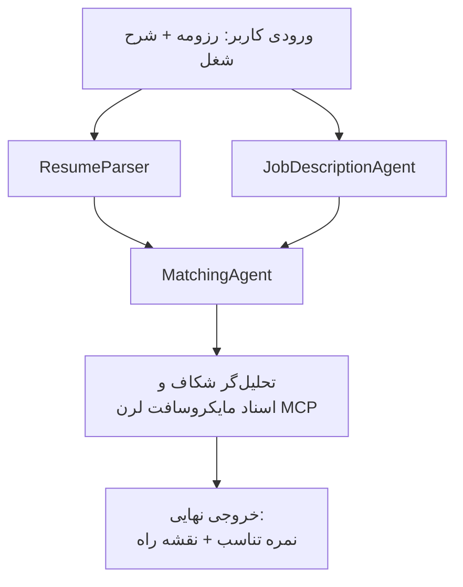

# PersonalCareerCopilot - ارزیاب انطباق رزومه با شغل

یک جریان کاری چندعاملی که ارزیابی می‌کند رزومه چقدر با شرح شغل مطابقت دارد، سپس یک نقشه راه یادگیری شخصی‌سازی‌شده برای پوشش نقاط ضعف ایجاد می‌کند.

---

## عوامل

| عامل | نقش | ابزارها |
|-------|------|-------|
| **ResumeParser** | استخراج مهارت‌ها، تجربه‌ها و گواهینامه‌های ساختاریافته از متن رزومه | - |
| **JobDescriptionAgent** | استخراج مهارت‌ها، تجربه‌ها و گواهینامه‌های مورد نیاز/ترجیحی از شرح شغل | - |
| **MatchingAgent** | مقایسه پروفایل با نیازمندی‌ها → نمره انطباق (۰-۱۰۰) + مهارت‌های مطابقت یافته/مفقود | - |
| **GapAnalyzer** | ایجاد نقشه راه یادگیری شخصی‌سازی شده با منابع Microsoft Learn | `search_microsoft_learn_for_plan` (MCP) |

## جریان کاری


---

## شروع سریع

### ۱. تنظیم محیط

```powershell
cd workshop\lab02-multi-agent\PersonalCareerCopilot
python -m venv .venv
.\.venv\Scripts\Activate.ps1          # ویندوز پاورشل
# source .venv/bin/activate            # مک‌اواس / لینوکس
pip install -r requirements.txt
```

### ۲. تنظیم مدارک دسترسی

فایل env نمونه را کپی کنید و جزئیات پروژه Foundry خود را وارد کنید:

```powershell
cp .env.example .env
```

ویرایش `.env`:

```env
PROJECT_ENDPOINT=https://<your-account>.services.ai.azure.com/api/projects/<your-project>
MODEL_DEPLOYMENT_NAME=gpt-4.1-mini
```

| مقدار | محل یافتن |
|-------|-----------|
| `PROJECT_ENDPOINT` | نوار کناری Microsoft Foundry در VS Code → کلیک راست روی پروژه خود → **Copy Project Endpoint** |
| `MODEL_DEPLOYMENT_NAME` | نوار کناری Foundry → گسترش پروژه → **Models + endpoints** → نام استقرار |

### ۳. اجرای محلی

```powershell
python -m debugpy --listen 127.0.0.1:5679 -m agentdev run main.py --verbose --port 8088
```

یا از تسک VS Code استفاده کنید: `Ctrl+Shift+P` → **Tasks: Run Task** → **Run Lab02 HTTP Server**.

### ۴. آزمایش با Agent Inspector

Agent Inspector را باز کنید: `Ctrl+Shift+P` → **Foundry Toolkit: Open Agent Inspector**.

این درخواست آزمایشی را جای‌گذاری کنید:

```
Resume:
Jane Doe
Senior Software Engineer with 5 years of experience in Python, Django, and AWS.
Built microservices handling 10K+ requests/second. Led a team of 4 developers.
Certifications: AWS Solutions Architect Associate.
Education: B.S. Computer Science, State University.

Job Description:
Senior Cloud Engineer at Contoso Ltd.
Required: Python, Azure, Kubernetes, Terraform, CI/CD pipelines.
Preferred: Go, monitoring (Prometheus/Grafana), cost optimization.
Experience: 5+ years in cloud infrastructure.
Certifications: Azure Solutions Architect Expert preferred.
```

**انتظار می‌رود:** نمره انطباق (۰-۱۰۰)، مهارت‌های مطابقت یافته/مفقود و نقشه راه یادگیری شخصی با آدرس‌های Microsoft Learn.

### ۵. استقرار در Foundry

`Ctrl+Shift+P` → **Microsoft Foundry: Deploy Hosted Agent** → پروژه خود را انتخاب کنید → تایید.

---

## ساختار پروژه

```
PersonalCareerCopilot/
├── .env.example        ← Template for environment variables
├── .env                ← Your credentials (git-ignored)
├── agent.yaml          ← Hosted agent definition (name, resources, env vars)
├── Dockerfile          ← Container image for Foundry deployment
├── main.py             ← 4-agent workflow (instructions, MCP tool, WorkflowBuilder)
└── requirements.txt    ← Python dependencies
```

## فایل‌های کلیدی

### `agent.yaml`

عامل میزبانی‌شده را برای سرویس عامل Foundry تعریف می‌کند:
- `kind: hosted` - به صورت کانتینر مدیریت‌شده اجرا می‌شود
- `protocols: [responses v1]` - نقطه پایانی HTTP `/responses` را ارائه می‌دهد
- `environment_variables` - `PROJECT_ENDPOINT` و `MODEL_DEPLOYMENT_NAME` هنگام استقرار تزریق می‌شوند

### `main.py`

شامل:
- **دستورات عامل‌ها** - چهار ثابت `*_INSTRUCTIONS`، یکی برای هر عامل
- **ابزار MCP** - `search_microsoft_learn_for_plan()` فراخوانی `https://learn.microsoft.com/api/mcp` به‌صورت HTTP قابل استریم
- **ایجاد عامل** - `create_agents()` به عنوان context manager با استفاده از `AzureAIAgentClient.as_agent()`
- **نمودار جریان کاری** - `create_workflow()` با استفاده از `WorkflowBuilder` عوامل را با الگوهای انشعاب/ادغام/زنجیره‌ای متصل می‌کند
- **راه‌اندازی سرور** - `from_agent_framework(agent).run_async()` روی پورت ۸۰۸۸

### `requirements.txt`

| بسته | نسخه | کاربرد |
|---------|---------|---------|
| `agent-framework-azure-ai` | `1.0.0rc3` | ادغام Azure AI برای Microsoft Agent Framework |
| `agent-framework-core` | `1.0.0rc3` | محیط اجرای اصلی (شامل WorkflowBuilder) |
| `azure-ai-agentserver-agentframework` | `1.0.0b16` | محیط اجرای سرور عامل میزبانی‌شده |
| `azure-ai-agentserver-core` | `1.0.0b16` | انتزاعات اصلی سرور عامل |
| `debugpy` | آخرین نسخه | عیب‌یابی پایتون (F5 در VS Code) |
| `agent-dev-cli` | `--pre` | CLI توسعه محلی + بک‌اند Agent Inspector |

---

## عیب‌یابی

| مشکل | رفع مشکل |
|-------|----------|
| `RuntimeError: Missing required environment variable(s)` | ایجاد `.env` با `PROJECT_ENDPOINT` و `MODEL_DEPLOYMENT_NAME` |
| `ModuleNotFoundError: No module named 'agent_framework'` | فعال‌سازی venv و اجرای `pip install -r requirements.txt` |
| عدم وجود آدرس‌های Microsoft Learn در خروجی | اتصال اینترنت به `https://learn.microsoft.com/api/mcp` را بررسی کنید |
| فقط ۱ کارت نقص (قطع‌شده) | اطمینان حاصل کنید `GAP_ANALYZER_INSTRUCTIONS` بخش `CRITICAL:` را شامل شود |
| پورت ۸۰۸۸ اشغال شده | سرورهای دیگر را متوقف کنید: `netstat -ano \| findstr :8088` |

برای عیب‌یابی دقیق‌تر، به [فصل ۸ - عیب‌یابی](../docs/08-troubleshooting.md) مراجعه کنید.

---

**راهنمای کامل:** [مستندات Lab 02](../docs/README.md) · **بازگشت به:** [Lab 02 README](../README.md) · [صفحه اصلی کارگاه](../../../README.md)

---

<!-- CO-OP TRANSLATOR DISCLAIMER START -->
**سلب مسئولیت**:  
این سند با استفاده از سرویس ترجمه هوش مصنوعی [Co-op Translator](https://github.com/Azure/co-op-translator) ترجمه شده است. در حالی که ما در تلاش برای دقت هستیم، لطفاً توجه داشته باشید که ترجمه‌های خودکار ممکن است حاوی اشتباهات یا نادرستی‌هایی باشند. سند اصلی به زبان بومی آن باید منبع مرجع و معتبر در نظر گرفته شود. برای اطلاعات حیاتی، توصیه می‌شود از ترجمه حرفه‌ای انسانی استفاده شود. ما در برابر هرگونه سوءتفاهم یا برداشت نادرست ناشی از استفاده از این ترجمه مسئولیتی نداریم.
<!-- CO-OP TRANSLATOR DISCLAIMER END -->