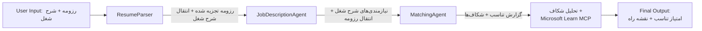

# PersonalCareerCopilot - ارزیاب تطابق رزومه با شغل

یک برنامه چندعاملی بر اساس جریان کاری که میزان تطابق رزومه با شرح شغل را ارزیابی می‌کند، سپس یک نقشه راه یادگیری شخصی‌سازی‌شده برای پر کردن شکاف‌ها تولید می‌کند.

---

## عوامل

| عامل | نقش | ابزارها |
|-------|------|-------|
| **ResumeParser** | استخراج مهارت‌ها، تجربه‌ها و گواهینامه‌های ساختاریافته از متن رزومه | - |
| **JobDescriptionAgent** | استخراج مهارت‌ها، تجربه‌ها و گواهینامه‌های مورد نیاز/ترجیحی از شرح شغل | - |
| **MatchingAgent** | مقایسه پروفایل با نیازمندی‌ها → امتیاز تطابق (0-100) + مهارت‌های تطابق‌یافته/مفقود | - |
| **GapAnalyzer** | ساخت نقشه راه یادگیری شخصی‌سازی‌شده با منابع Microsoft Learn | `search_microsoft_learn_for_plan` (MCP) |

## جریان کاری


```mermaid
flowchart LR
    UserInput["User Input: رزومه + شرح شغل"] --> ResumeParser
    ResumeParser -- "رزومه تجزیه شده + انتقال شرح شغل" --> JobDescriptionAgent
    JobDescriptionAgent -- "نیازمندی‌های شرح شغل + انتقال رزومه" --> MatchingAgent
    MatchingAgent -- "گزارش تناسب + شکاف‌ها" --> GapAnalyzerMCP["تحلیل شکاف +\nMicrosoft Learn MCP"]
    GapAnalyzerMCP --> FinalOutput["Final Output:\nامتیاز تناسب + نقشه راه"]
```

---

## شروع سریع

### 1. راه‌اندازی محیط

این پوشه، پیاده‌سازی مرجع برای چهارچوب آزمایشگاه ۰۲ مبتنی بر جریان کاری است. فایل `main.py` آن از بلاک‌های درخواست موجود به همراه `WorkflowBuilder` برای اتصال چهار عامل به هم استفاده می‌کند.

```powershell
cd workshop\lab02-multi-agent\PersonalCareerCopilot
python -m venv .venv
.\.venv\Scripts\Activate.ps1          # ویندوز پاورشل
# source .venv/bin/activate            # مک‌اواس / لینوکس
pip install -r requirements.txt
```

### 2. پیکربندی اعتبارنامه‌ها

یک فایل `.env` در این پوشه ایجاد کنید:

```powershell
copy .env .env.bak 2>$null; echo $null > .env
```

فایل `.env` را ویرایش کنید:

```env
FOUNDRY_PROJECT_ENDPOINT=https://<your-account>.services.ai.azure.com/api/projects/<your-project>
AZURE_AI_MODEL_DEPLOYMENT_NAME=gpt-4.1-mini
```

| مقدار | محل یافتن |
|-------|------------------|
| `FOUNDRY_PROJECT_ENDPOINT` | نوار کناری Foundry Toolkit → کلیک راست روی پروژه → **Copy Project Endpoint** |
| `AZURE_AI_MODEL_DEPLOYMENT_NAME` | نوار کناری Foundry → بازکردن پروژه → **Models + endpoints** → نام استقرار |

### 3. اجرای محلی

```powershell
python -m debugpy --listen 127.0.0.1:5679 main.py --port 8088
```

یا از تسک VS Code استفاده کنید: `Ctrl+Shift+P` → **Tasks: Run Task** → **Run Agent HTTP Server**.

برای دیباگ با F5، از **Debug Local Agent HTTP Server** استفاده کنید.

### 4. تست با Agent Inspector

Agent Inspector را باز کنید: `Ctrl+Shift+P` → **Foundry Toolkit: Open Agent Inspector**.

این درخواست آزمایشی را بچسبانید:

```
Resume:
Jane Doe
Senior Software Engineer with 5 years of experience in Python, Django, and AWS.
Built microservices handling 10K+ requests/second. Led a team of 4 developers.
Certifications: AWS Solutions Architect Associate.
Education: B.S. Computer Science, State University.

Job Description:
Senior Cloud Engineer at Contoso Ltd.
Required: Python, Azure, Kubernetes, Terraform, CI/CD pipelines.
Preferred: Go, monitoring (Prometheus/Grafana), cost optimization.
Experience: 5+ years in cloud infrastructure.
Certifications: Azure Solutions Architect Expert preferred.
```

**انتظار می‌رود:** امتیاز تطابق (۰-۱۰۰)، مهارت‌های تطابق‌یافته/مفقود، و نقشه راه یادگیری شخصی‌سازی شده با آدرس‌های Microsoft Learn.

### 5. استقرار در Foundry

`Ctrl+Shift+P` → **Foundry Toolkit: Deploy Hosted Agent** → پروژه خود را انتخاب کنید → تأیید کنید.

---

## ساختار پروژه

```
PersonalCareerCopilot/
├── .env                ← Your credentials (git-ignored)
├── agent.yaml          ← Hosted agent definition (name, resources, env vars)
├── Dockerfile          ← Container image for Foundry deployment
├── main.py             ← 4-agent workflow (instructions, MCP tool, WorkflowBuilder)
└── requirements.txt    ← Python dependencies
```

## فایل‌های کلیدی

### `agent.yaml`

تعریف عامل میزبانی شده برای سرویس Foundry Agent:
- `kind: hosted` - اجرا به صورت کانتینر مدیریت‌شده
- `protocols` - پروتکل `responses` با `version: 1.0.0`، ارائه نقطه انتهایی HTTP `/responses`
- `environment_variables` - متغیر `AZURE_AI_MODEL_DEPLOYMENT_NAME` در اینجا اعلام شده؛ `FOUNDRY_PROJECT_ENDPOINT` به‌صورت خودکار هنگام استقرار تزریق می‌شود

### `main.py`

شامل:
- **دستورالعمل‌های عامل** - چهار ثابت `*_INSTRUCTIONS`، هر کدام برای یک عامل
- **ابزار MCP** - تابع `search_microsoft_learn_for_plan()` که از طریق HTTP قابل پخش به `https://learn.microsoft.com/api/mcp` فراخوانی می‌کند
- **ایجاد عامل** - چهار نمونه `Agent()` + `AgentExecutor()` که از یک `FoundryChatClient` مشترک استفاده می‌کنند
- **گراف جریان کاری** - `WorkflowBuilder` عوامل را به صورت خطی به هم وصل می‌کند: ResumeParser → JD Agent → MatchingAgent → GapAnalyzer
- **راه‌اندازی سرور** - `ResponsesHostServer` بر روی پورت 8088 اجرا می‌شود

### `requirements.txt`

| بسته | هدف |
|---------|----------|
| `agent-framework-foundry` | چارچوب اصلی: `Agent`, `AgentExecutor`, `WorkflowBuilder`, `@tool`, `FoundryChatClient` |
| `agent-framework-foundry-hosting` | سرور `ResponsesHostServer` + یکپارچه‌سازی میزبانی Foundry |
| `mcp<2,>=1.24.0` | کلاینت MCP برای GapAnalyzer (`streamable_http_client`) |
| `debugpy` | دیباگر پایتون (F5 در VS Code) |

---

## عیب‌یابی

| مشکل | راه‌حل |
|-------|-----|
| `KeyError: 'FOUNDRY_PROJECT_ENDPOINT'` یا `KeyError: 'AZURE_AI_MODEL_DEPLOYMENT_NAME'` | ایجاد فایل `.env` با تنظیم هر دو مقدار `FOUNDRY_PROJECT_ENDPOINT` و `AZURE_AI_MODEL_DEPLOYMENT_NAME` |
| `ModuleNotFoundError: No module named 'agent_framework'` | فعال‌سازی venv و اجرای `pip install -r requirements.txt` |
| عدم مشاهده آدرس‌های Microsoft Learn در خروجی | بررسی اتصال اینترنت به `https://learn.microsoft.com/api/mcp` |
| فقط یک کارت شکاف (کوتاه‌شده) | اطمینان از وجود بلوک `CRITICAL:` در `GAP_ANALYZER_INSTRUCTIONS` |
| پورت 8088 در حال استفاده است | توقف سایر سرورها: `netstat -ano \| findstr :8088` |

برای عیب‌یابی‌های دقیق‌تر، به [Module 8 - Troubleshooting](../docs/08-troubleshooting.md) مراجعه کنید.

---

**راهنمای کامل:** [اینجا](../docs/README.md) · **بازگشت به:** [Lab 02 README](../README.md) · [صفحه اصلی ورکشاپ](../../../README.md)

---

<!-- CO-OP TRANSLATOR DISCLAIMER START -->
**سلب مسئولیت**:
این سند با استفاده از سرویس ترجمه هوش مصنوعی [Co-op Translator](https://github.com/Azure/co-op-translator) ترجمه شده است. در حالی که ما در تلاش برای دقت هستیم، لطفاً توجه داشته باشید که ترجمه‌های خودکار ممکن است شامل خطاها یا نادرستی‌هایی باشند. سند اصلی به زبان مادری خود باید به عنوان منبع معتبر در نظر گرفته شود. برای اطلاعات حیاتی، ترجمه حرفه‌ای انسانی توصیه می‌شود. ما در قبال هرگونه سوء تفاهم یا برداشت نادرست ناشی از استفاده از این ترجمه مسئولیتی نداریم.
<!-- CO-OP TRANSLATOR DISCLAIMER END -->