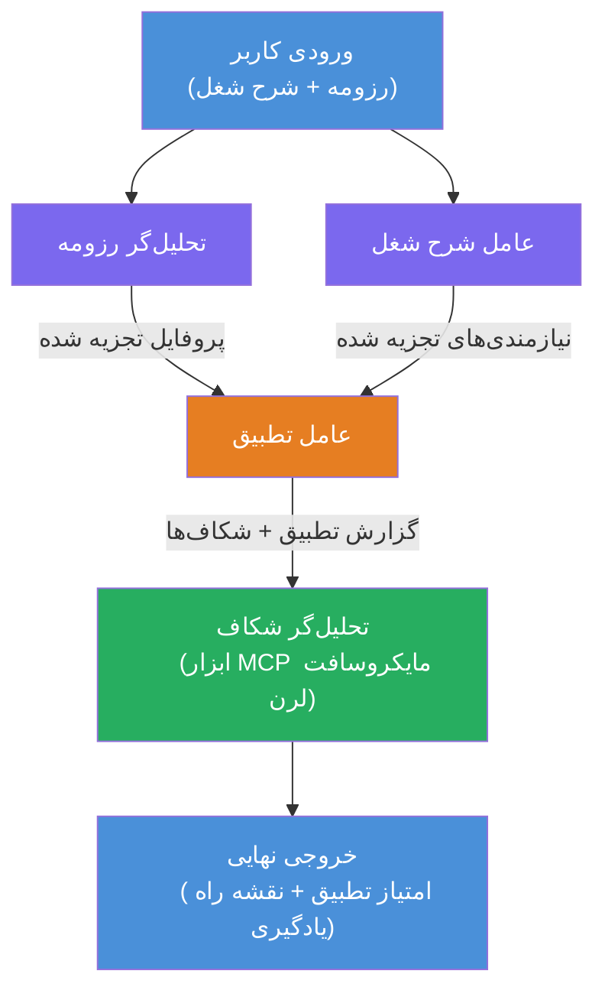

# آزمایشگاه ۰۲ - جریان کاری چند عاملی: رزومه → ارزیاب تطابق شغلی

---

## آنچه خواهید ساخت

یک **ارزیاب تطابق رزومه → شغل** - یک جریان کاری چند عاملی که در آن چهار عامل متخصص همکاری می‌کنند تا میزان تطابق رزومه یک کاندیدا با شرح شغل را ارزیابی کنند و سپس نقشه راه یادگیری شخصی‌سازی شده‌ای برای پر کردن شکاف‌ها تولید نمایند.

### عوامل

| عامل | نقش |
|-------|------|
| **تجزیه‌کننده رزومه** | استخراج مهارت‌ها، تجربه‌ها، گواهی‌نامه‌های ساختاریافته از متن رزومه |
| **عامل شرح شغل** | استخراج مهارت‌های مورد نیاز/ترجیحی، تجربه‌ها، گواهی‌نامه‌ها از شرح شغل |
| **عامل تطبیق** | مقایسه پروفایل با نیازها → امتیاز تطابق (۰-۱۰۰) + مهارت‌های تطبیق یافته/مفقود |
| **تحلیل‌گر شکاف** | ساخت نقشه راه یادگیری شخصی‌سازی شده با منابع، زمان‌بندی‌ها، و پروژه‌های رفتاری فوری |

### روند نمایشی

یک **رزومه + شرح شغل** بارگذاری کنید → یک **امتیاز تطابق + مهارت‌های مفقود** دریافت کنید → یک **نقشه راه یادگیری شخصی‌سازی شده** دریافت نمایید.

### معماری جریان کاری

> بنفش = عوامل موازی | نارنجی = نقطه تجمیع | سبز = عامل نهایی با ابزارها. برای دیدن نمودارها و جریان داده به [ماژول ۱ - درک معماری](docs/01-understand-multi-agent.md) و [ماژول ۴ - الگوهای ارکستراسیون](docs/04-orchestration-patterns.md) مراجعه کنید.

### مباحث پوشش داده شده

- ایجاد جریان کاری چند عاملی با استفاده از **WorkflowBuilder**
- تعریف نقش عوامل و جریان ارکستراسیون (موازی + ترتیبی)
- الگوهای ارتباط بین عوامل
- تست محلی با Agent Inspector
- استقرار جریان‌های کاری چند عاملی در Foundry Agent Service

---

## پیش‌نیازها

ابتدا آزمایشگاه ۰۱ را کامل کنید:

- [آزمایشگاه ۰۱ - عامل تک‌نفره](../lab01-single-agent/README.md)

---

## شروع کنید

دستورالعمل‌های کامل راه‌اندازی، مرور کد و دستورات تست را در:

- [مستندات آزمایشگاه ۲ - پیش‌نیازها](docs/00-prerequisites.md)
- [مستندات آزمایشگاه ۲ - مسیر کامل یادگیری](docs/README.md)
- [راهنمای اجرای PersonalCareerCopilot](PersonalCareerCopilot/README.md)

## الگوهای ارکستراسیون (جایگزین‌های عاملی)

آزمایشگاه ۲ شامل جریان پیش‌فرض **موازی → تجمیع‌کننده → برنامه‌ریز** است، و مستندات همچنین الگوهای جایگزینی را برای نمایش رفتار عاملی قوی‌تر توصیف می‌کنند:

- **Fan-out/Fan-in با اجماع وزنی**
- **عبور بازبین/منتقد پیش از نقشه راه نهایی**
- **روتر شرطی** (انتخاب مسیر بر اساس امتیاز تطابق و مهارت‌های مفقود)

به [docs/04-orchestration-patterns.md](docs/04-orchestration-patterns.md) مراجعه کنید.

---

**قبلی:** [آزمایشگاه ۰۱ - عامل تک‌نفره](../lab01-single-agent/README.md) · **بازگشت به:** [خانه کارگاه](../../README.md)

---

<!-- CO-OP TRANSLATOR DISCLAIMER START -->
**سلب مسئولیت**:  
این سند با استفاده از خدمات ترجمه هوش مصنوعی [Co-op Translator](https://github.com/Azure/co-op-translator) ترجمه شده است. در حالی که ما در تلاش برای دقت هستیم، لطفاً توجه داشته باشید که ترجمه‌های خودکار ممکن است حاوی خطاها یا نادرستی‌هایی باشند. سند اصلی به زبان بومی خود باید به‌عنوان منبع معتبر در نظر گرفته شود. برای اطلاعات حساس، توصیه می‌شود از ترجمه حرفه‌ای انسانی استفاده شود. ما مسئولیتی در قبال سوءتفاهم‌ها یا تفسیرهای نادرست ناشی از استفاده از این ترجمه نداریم.
<!-- CO-OP TRANSLATOR DISCLAIMER END -->