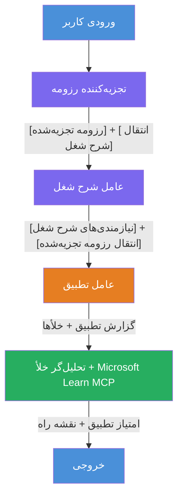

# آزمایشگاه ۰۲ - جریان کاری چندعامله: ارزیاب تناسب رزومه → شغل

## مرور کلی

در این آزمایشگاه عملی، شما یک **برنامه چندعامله مبتنی بر جریان کاری** با استفاده از Foundry Toolkit در VS Code می‌سازید و آن را در سرویس Microsoft Foundry Agent مستقر می‌کنید.

**آنچه می‌سازید:** ارزیاب تناسب رزومه → شغل که رزومه و شرح شغل را تجزیه و تحلیل می‌کند، درجة تطابق را امتیاز می‌دهد و یک نقشه راه آموزشی شخصی‌شده با استفاده از منابع Microsoft Learn تولید می‌کند.

---

## معماری

```mermaid
flowchart TD
    A["ورودی کاربر"] --> B["تجزیه‌کننده رزومه"]
    B -->|"[رزومه تجزیه‌شده] + [انتقال شرح شغل]"| C["عامل شرح شغل"]
    C -->|"[نیازمندی‌های شرح شغل] + [انتقال رزومه تجزیه‌شده]"| D["عامل تطبیق"]
    D -->|گزارش تطبیق + خلأ‌ها| E["تحلیل‌گر خلأ + Microsoft Learn MCP"]
    E -->|امتیاز تطبیق + نقشه راه| F["خروجی"]

    style A fill:#4A90D9,color:#fff
    style B fill:#7B68EE,color:#fff
    style C fill:#7B68EE,color:#fff
    style D fill:#E67E22,color:#fff
    style E fill:#27AE60,color:#fff
    style F fill:#4A90D9,color:#fff
```

**نحوه عملکرد:**
۱. کاربر رزومه و شرح شغل را جای‌گذاری می‌کند.
۲. **ResumeParser** رزومه را تجزیه کرده و شرح شغل را دقیقاً در بخش `[JOB DESCRIPTION PASS-THROUGH]` کپی می‌کند.
۳. **JD Agent** الزامات ساختاریافته را از قسمت عبوری استخراج می‌کند، سپس `[PARSED RESUME]` را جلو می‌فرستد به عنوان `[PARSED RESUME PASS-THROUGH]`.
۴. **MatchingAgent** `[PARSED RESUME PASS-THROUGH]` را در مقابل `[JD REQUIREMENTS]` مقایسه کرده و نمره تناسب تولید می‌کند.
۵. **GapAnalyzer** شکاف‌ها را به یک نقشه راه عملی تبدیل کرده و لینک‌های واقعی Microsoft Learn را از طریق MCP دریافت می‌کند.

---

## پیش‌نیازها

ابتدا آزمایشگاه ۰۱ را کامل کنید:

- [آزمایشگاه ۰۱ - عامل تنها](../lab01-single-agent/README.md)

---

## بخش ۱: مطالعه ماژول‌ها به ترتیب

مسیر کامل یادگیری را در اینجا ببینید:

- [اسناد آزمایشگاه ۲ - پیش‌نیازها](docs/00-prerequisites.md)
- [اسناد آزمایشگاه ۲ - مسیر کامل یادگیری](docs/README.md)
- [راهنمای اجرای PersonalCareerCopilot](PersonalCareerCopilot/README.md)

---

## بخش ۲: ساخت و آزمایش جریان کاری

۱. از جادوگر Foundry Toolkit برای ساخت چارچوب مبتنی بر جریان کاری پروژه استفاده کنید.
۲. بلوک‌های پرامپت و نمودار جریان کاری را از `PersonalCareerCopilot/main.py` در فضای کاری خود کپی کنید.
۳. به‌صورت محلی با Agent Inspector اجرا کنید و تأیید کنید که هر چهار عامل به‌اضافه ابزار MCP کار می‌کنند.
۴. پس از موفقیت آزمایش محلی، عامل میزبانی شده را به Foundry مستقر کنید.

---

## الگوهای ارکستراسیون

آزمایشگاه ۰۲ شامل جریان پیش‌فرض **گسترش-جمع‌بندی → به‌هم‌پیوسته → ترتیب‌دار** است، و اسناد همچنین الگوهای ارکستراسیون جایگزین برای آزمایش را شرح می‌دهند.

- **گسترش/جمع‌بندی با اجماع وزن‌دار**
- **بازبینی‌کننده/نقد قبل از نقشه راه نهایی**
- **روتر شرطی** بر اساس نمره تناسب و مهارت‌های مفقود

اسناد را در [docs/04-orchestration-patterns.md](docs/04-orchestration-patterns.md) ببینید.

---

**قبلی:** [آزمایشگاه ۰۱ - عامل تنها](../lab01-single-agent/README.md) · **بازگشت به:** [صفحه اصلی کارگاه](../../README.md)

---

<!-- CO-OP TRANSLATOR DISCLAIMER START -->
**سلب مسئولیت**:
این سند با استفاده از سرویس ترجمه هوش مصنوعی [Co-op Translator](https://github.com/Azure/co-op-translator) ترجمه شده است. در حالی که ما در تلاش برای دقت هستیم، لطفاً توجه داشته باشید که ترجمه‌های خودکار ممکن است شامل خطاها یا نادرستی‌هایی باشند. سند اصلی به زبان مادری خود باید به عنوان منبع معتبر در نظر گرفته شود. برای اطلاعات حیاتی، ترجمه حرفه‌ای انسانی توصیه می‌شود. ما در قبال هرگونه سوء تفاهم یا برداشت نادرست ناشی از استفاده از این ترجمه مسئولیتی نداریم.
<!-- CO-OP TRANSLATOR DISCLAIMER END -->