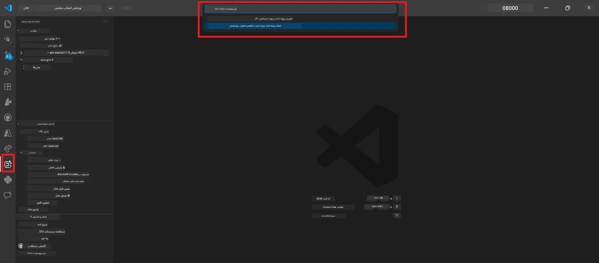

# ماژول ۰ - پیش‌نیازها

قبل از شروع آزمایشگاه ۰۲، تأیید کنید که موارد زیر را تکمیل کرده‌اید. این آزمایشگاه مستقیماً بر اساس آزمایشگاه ۰۱ ساخته شده است - آن را رد نکنید.

---

## ۱. تکمیل آزمایشگاه ۰۱

آزمایشگاه ۰۲ فرض می‌کند که شما قبلاً:

- [x] تمام ۸ ماژولِ [آزمایشگاه ۰۱ - عامل تک‌نفره](../../lab01-single-agent/README.md) را تکمیل کرده‌اید
- [x] با موفقیت یک عامل تکی را در Foundry Agent Service مستقر کرده‌اید
- [x] تأیید کرده‌اید که عامل در هر دو محیط Agent Inspector محلی و Foundry Playground کار می‌کند

اگر آزمایشگاه ۰۱ را تکمیل نکرده‌اید، اکنون بازگردید و آن را به پایان برسانید: [مستندات آزمایشگاه ۰۱](../../lab01-single-agent/docs/00-prerequisites.md)

---

## ۲. تأیید تنظیمات موجود

تمام ابزارهای آزمایشگاه ۰۱ باید هنوز نصب و فعال باشند. این بررسی‌های سریع را انجام دهید:

### ۲.۱ Azure CLI

```powershell
az account show --query "{name:name, id:id}" --output table
```

انتظار می‌رود: نام و شناسه اشتراک شما نمایش داده شود. اگر این فعال نشد، دستور [`az login`](https://learn.microsoft.com/cli/azure/authenticate-azure-cli-interactively) را اجرا کنید.

### ۲.۲ افزونه‌های VS Code

1. کلیدهای `Ctrl+Shift+P` را فشار دهید → تایپ کنید **"Microsoft Foundry"** → تأیید کنید که دستورات نمایش داده می‌شود (مثلاً `Microsoft Foundry: Create a New Hosted Agent`).
۲. کلیدهای `Ctrl+Shift+P` را فشار دهید → تایپ کنید **"Foundry Toolkit"** → تأیید کنید که دستورات نمایش داده می‌شود (مثلاً `Foundry Toolkit: Open Agent Inspector`).

### ۲.۳ پروژه و مدل Foundry

۱. روی آیکون **Microsoft Foundry** در نوار فعالیت VS Code کلیک کنید.
۲. تأیید کنید پروژه شما در لیست هست (مثلاً `workshop-agents`).
۳. پروژه را گسترش دهید → تأیید کنید مدلی مستقر شده است (مثلاً `gpt-4.1-mini`) و وضعیت آن **Succeeded** است.

> **اگر استقرار مدل شما منقضی شده است:** برخی از استقرارهای رایگان به طور خودکار منقضی می‌شوند. دوباره از [کتابخانه مدل](https://learn.microsoft.com/azure/foundry/foundry-models/concepts/models-sold-directly-by-azure) مستقر کنید (`Ctrl+Shift+P` → **Microsoft Foundry: Open Model Catalog**).



### ۲.۴ نقش‌های RBAC

تأیید کنید که نقش **Azure AI User** در پروژه Foundry خود دارید:

۱. [پرتال Azure](https://portal.azure.com) → منبع پروژه Foundry شما → **کنترل دسترسی (IAM)** → تب **[تخصیص نقش‌ها](https://learn.microsoft.com/azure/foundry/concepts/rbac-foundry)**
۲. نام خود را جستجو کنید → تأیید کنید که **[Azure AI User](https://aka.ms/foundry-ext-project-role)** در لیست است.

---

## ۳. درک مفاهیم چندعامله (جدید برای آزمایشگاه ۰۲)

آزمایشگاه ۰۲ مفاهیمی را معرفی می‌کند که در آزمایشگاه ۰۱ پوشش داده نشده‌اند. قبل از ادامه این موارد را بخوانید:

### ۳.۱ گردش‌کار چندعامله چیست؟

به جای اینکه یک عامل همه چیز را مدیریت کند، یک **گردش‌کار چندعامله** کارها را بین چندین عامل تخصصی تقسیم می‌کند. هر عامل شامل:

- دستورالعمل‌های خاص خودش (پرامپت سیستم)
- نقش خودش (مسئولیت آن)
- ابزارهای اختیاری (توابعی که می‌تواند فراخوانی کند)

عامل‌ها از طریق یک **گراف ارکستراسیون** با هم ارتباط برقرار می‌کنند که تعریف می‌کند داده چگونه بین آن‌ها جریان می‌یابد.

### ۳.۲ WorkflowBuilder

کلاس [`WorkflowBuilder`](https://learn.microsoft.com/agent-framework/workflows/agents-in-workflows) از `agent_framework`، کامپوننت SDK است که عوامل را به هم متصل می‌کند:

```python
from agent_framework import WorkflowBuilder

workflow = (
    WorkflowBuilder(
        name="MyWorkflow",
        start_executor=agent_a,
        output_executors=[agent_d],
    )
    .add_edge(agent_a, agent_b)
    .add_edge(agent_a, agent_c)
    .add_edge(agent_b, agent_d)
    .add_edge(agent_c, agent_d)
    .build()
)
```

- **`start_executor`** - اولین عاملی که ورودی کاربر را دریافت می‌کند
- **`output_executors`** - عاملی یا عامل‌هایی که خروجی آن‌ها پاسخ نهایی می‌شود
- **`add_edge(source, target)`** - تعریف می‌کند که `target` خروجی `source` را دریافت می‌کند

### ۳.۳ ابزارهای MCP (پروتکل زمینه مدل)

آزمایشگاه ۰۲ از یک **ابزار MCP** استفاده می‌کند که از API مایکروسافت لرن برای دریافت منابع آموزشی بهره می‌برد. [MCP (Model Context Protocol)](https://modelcontextprotocol.io/introduction) یک پروتکل استاندارد برای اتصال مدل‌های هوش مصنوعی به منابع داده و ابزارهای خارجی است.

| اصطلاح | تعریف |
|------|-----------|
| **سرور MCP** | سرویسی که ابزارها/منابع را از طریق [پروتکل MCP](https://learn.microsoft.com/azure/foundry/agents/how-to/tools/model-context-protocol) ارائه می‌دهد |
| **کلاینت MCP** | کد ایجنت شما که به سرور MCP متصل می‌شود و ابزارهای آن را فراخوانی می‌کند |
| **[Streamable HTTP](https://learn.microsoft.com/agent-framework/agents/tools/hosted-mcp-tools)** | روشی برای انتقال داده که برای ارتباط با سرور MCP استفاده می‌شود |

### ۳.۴ تفاوت آزمایشگاه ۰۲ با آزمایشگاه ۰۱

| جنبه | آزمایشگاه ۰۱ (عامل تکی) | آزمایشگاه ۰۲ (چندعامل) |
|--------|----------------------|---------------------|
| عوامل | ۱ | ۴ (نقش‌های تخصصی) |
| ارکستراسیون | ندارد | WorkflowBuilder (موازی + متوالی) |
| ابزارها | تابع اختیاری `@tool` | ابزار MCP (فراخوانی API خارجی) |
| پیچیدگی | پرامپت ساده → پاسخ | رزومه + شرح شغل → امتیاز تطابق → برنامه راه |
| جریان زمینه | مستقیم | تحویل عامل به عامل |

---

## ۴. ساختار مخزن کارگاه برای آزمایشگاه ۰۲

اطمینان حاصل کنید که محل فایل‌های آزمایشگاه ۰۲ را می‌دانید:

```
workshop/
└── lab02-multi-agent/
    ├── README.md                       ← Lab overview
    ├── docs/                           ← You are here
    │   ├── README.md                   ← Learning path index
    │   ├── 00-prerequisites.md         ← This file
    │   ├── 01-understand-multi-agent.md
    │   ├── ...
    │   └── 08-troubleshooting.md
    └── PersonalCareerCopilot/          ← The agent project
        ├── agent.yaml                  ← Agent definition
        ├── main.py                     ← 4-agent workflow code
        ├── Dockerfile                  ← Container configuration
        └── requirements.txt            ← Python dependencies
```

---

### نقطه بازرسی

- [ ] آزمایشگاه ۰۱ به طور کامل تکمیل شده است (تمام ۸ ماژول، عامل مستقر و تأیید شده)
- [ ] دستور `az account show` اشتراک شما را نمایش می‌دهد
- [ ] افزونه‌های Microsoft Foundry و Foundry Toolkit نصب و پاسخگو هستند
- [ ] پروژه Foundry مدل مستقر شده دارد (مثلاً `gpt-4.1-mini`)
- [ ] نقش **Azure AI User** روی پروژه دارید
- [ ] بخش مفاهیم چندعامله را در بالا خوانده و WorkflowBuilder، MCP، و ارکستراسیون عامل را درک کرده‌اید

---

**بعدی:** [۰۱ - درک معماری چندعامله →](01-understand-multi-agent.md)

---

<!-- CO-OP TRANSLATOR DISCLAIMER START -->
**سلب مسئولیت**:  
این سند توسط سرویس ترجمه هوش مصنوعی [Co-op Translator](https://github.com/Azure/co-op-translator) ترجمه شده است. در حالی که ما در تلاش برای دقت هستیم، لطفاً توجه داشته باشید که ترجمه‌های خودکار ممکن است حاوی اشتباهات یا نادرستی‌هایی باشند. سند اصلی به زبان مادری آن باید به عنوان منبع معتبر در نظر گرفته شود. برای اطلاعات حیاتی، ترجمه حرفه‌ای انسانی توصیه می‌شود. ما مسئول هیچ گونه سوءتفاهم یا تفسیر نادرست ناشی از استفاده از این ترجمه نیستیم.
<!-- CO-OP TRANSLATOR DISCLAIMER END -->