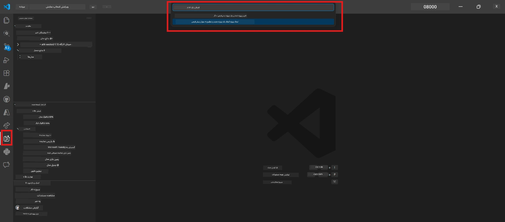

# ماژول ۰ - معرفی

⏱️ حدود ۱۰ دقیقه

> [!WARNING]
> **پیش‌نمایش و محدودیت‌ها:** [نمایندگان میزبانی شده](https://learn.microsoft.com/azure/foundry/agents/concepts/hosted-agents) در حال حاضر در **پیش‌نمایش عمومی** هستند - توصیه نمی‌شود برای بارهای کاری تولید. ممکن است برخی ویژگی‌های نمایش داده شده در این کارگاه با پیشرفت سرویس تا انتشار رسمی تغییر کنند.

## آنچه می‌سازید

در این آزمایشگاه، مهارت‌های نماینده تک‌نفره از آزمایشگاه ۰۱ را گسترش می‌دهید تا یک **گردش کار چند نماینده‌ای** بسازید - ارزیاب تناسب رزومه با شغل.

شما یک **رزومه** و یک **شرح شغل** را وارد می‌کنید. چهار نماینده تخصصی به ترتیب ورودی را پردازش می‌کنند و سپس باز می‌گردانند:
- یک امتیاز تناسب (۰–۱۰۰ به همراه شکستن امتیاز)
- فهرست شکاف مهارت و گواهی‌نامه
- یک نقشه راه یادگیری شخصی‌سازی شده با لینک‌های واقعی Microsoft Learn برای هر شکاف

**گردش کار از این موارد استفاده می‌کند:**
- **چارچوب نماینده مایکروسافت** - `WorkflowBuilder` برای هماهنگی خط لوله به صورت ترتیبی
- **ابزار Foundry برای VS Code** - ایجاد چارچوب، تست محلی، استقرار
- **یک مدل هوش مصنوعی** (مثلاً `gpt-4.1-mini`) - استفاده شده توسط هر چهار نماینده
- **سرور Microsoft Learn MCP** - ارائه لینک منابع واقعی یادگیری برای هر شکاف مهارتی

---

## مسیر خود را انتخاب کنید

> ⚠️ **با همان مسیری که در آزمایشگاه ۰۱ استفاده کردید ادامه دهید.**

<details open>
<summary><strong>🅰️ مسیر A - ابر آژور (نیاز به اشتراک آژور دارد)</strong></summary>

| | جزئیات |
|---|---|
| **برای چه کسانی است؟** | شما آزمایشگاه ۰۱ را با استفاده از اشتراک آژور کامل کرده‌اید |
| **مدل** | Azure OpenAI از طریق Foundry (مثلاً `gpt-4.1-mini`) |
| **ماژول‌های پوشش داده شده** | همه ماژول‌ها (۰۰–۰۹) |
| **استقرار در ابر؟** | ✅ بله - استقرار کامل از ابتدا تا انتها |

</details>

<details open>
<summary><strong>🅱️ مسیر B - Foundry محلی (نیاز به اشتراک آژور ندارد)</strong></summary>

| | جزئیات |
|---|---|
| **برای چه کسانی است؟** | شما آزمایشگاه ۰۱ را با استفاده از Foundry محلی کامل کرده‌اید |
| **مدل** | Foundry محلی (رایگان، روی دستگاه شما اجرا می‌شود) |
| **ماژول‌های پوشش داده شده** | ماژول‌های ۰۰–۰۵ (۰۶–۰۷ را نادیده بگیرید - استقرار و بررسی ابر) |
| **استقرار در ابر؟** | ❌ خیر - فقط تست محلی از طریق Agent Inspector |

</details>

---

## بررسی آزمایشگاه ۰۱

آزمایشگاه ۰۲ مستقیماً بر اساس آزمایشگاه ۰۱ ساخته شده است. ابتدا آزمایشگاه ۰۱ را کامل کنید.

هنوز آزمایشگاه ۰۱ را انجام نداده‌اید؟ از اینجا شروع کنید: [آزمایشگاه ۰۱ - معرفی](../../lab01-single-agent/docs/00-prerequisites.md)

<details open>
<summary><strong>🅰️ مسیر A - ابر آژور</strong></summary>

```powershell
az account show --query "{name:name, id:id}" --output table
```

اگر این کار موفق نبود، دستور `az login` را اجرا کنید. سپس در VS Code بررسی کنید:

۱. `Ctrl+Shift+P` → تایپ **Foundry Toolkit** → تأیید نمایش فرمان‌ها.
۲. روی آیکون **Foundry Toolkit** کلیک کنید → پروژه و مدل مستقر شده شما **موفقیت‌آمیز** نشان داده شود.



> **RBAC:** شما در آزمایشگاه ۰۱ نقش **Foundry User** را اختصاص داده‌اید. اگر نیاز به اختصاص مجدد دارید، به [آزمایشگاه ۰۱، ماژول ۱](../../lab01-single-agent/docs/01-setup.md#deploy-a-model--assign-rbac) مراجعه کنید. نقش قبلاً با نام **Azure AI User** بود - با همان مجوزها.

</details>

<details open>
<summary><strong>🅱️ مسیر B - Foundry محلی</strong></summary>

```powershell
Invoke-WebRequest -Uri "http://localhost:5273/v1/health" -UseBasicParsing | Select-Object StatusCode
```

انتظار می‌رود: `StatusCode: 200`. در غیر این صورت، Foundry Local را از نوار کناری Foundry Toolkit مجدداً راه‌اندازی کنید.

> تمام استنتاج روی دستگاه شما انجام می‌شود. تنها تماس خروجی ابزار MCP به `https://learn.microsoft.com/api/mcp` است.

</details>

---

## چه چیز جدیدی در آزمایشگاه ۰۲ است

| | آزمایشگاه ۰۱ | آزمایشگاه ۰۲ |
|--|--------|--------|
| نمایندگان | ۱ | ۴ (زنجیره شده با WorkflowBuilder) |
| قالب ایجاد چارچوب | پایه‌ای - چارچوب نماینده | گردش‌های کاری - چارچوب نماینده |
| بسته جدید | - | `mcp` |
| هماهنگی | نماینده مکالمه تک‌نفره | خط لوله ترتیبی (WorkflowBuilder) |
| ابزار جدید | - | `search_microsoft_learn_for_plan` (MCP) |

---

**بعدی:** [۰۱ - درک معماری →](01-understand-multi-agent.md)

---

<!-- CO-OP TRANSLATOR DISCLAIMER START -->
**سلب مسئولیت**:
این سند با استفاده از سرویس ترجمه هوش مصنوعی [Co-op Translator](https://github.com/Azure/co-op-translator) ترجمه شده است. در حالی که ما در تلاش برای دقت هستیم، لطفاً توجه داشته باشید که ترجمه‌های خودکار ممکن است شامل خطاها یا نادرستی‌هایی باشند. سند اصلی به زبان مادری خود باید به عنوان منبع معتبر در نظر گرفته شود. برای اطلاعات حیاتی، ترجمه حرفه‌ای انسانی توصیه می‌شود. ما در قبال هرگونه سوء تفاهم یا برداشت نادرست ناشی از استفاده از این ترجمه مسئولیتی نداریم.
<!-- CO-OP TRANSLATOR DISCLAIMER END -->