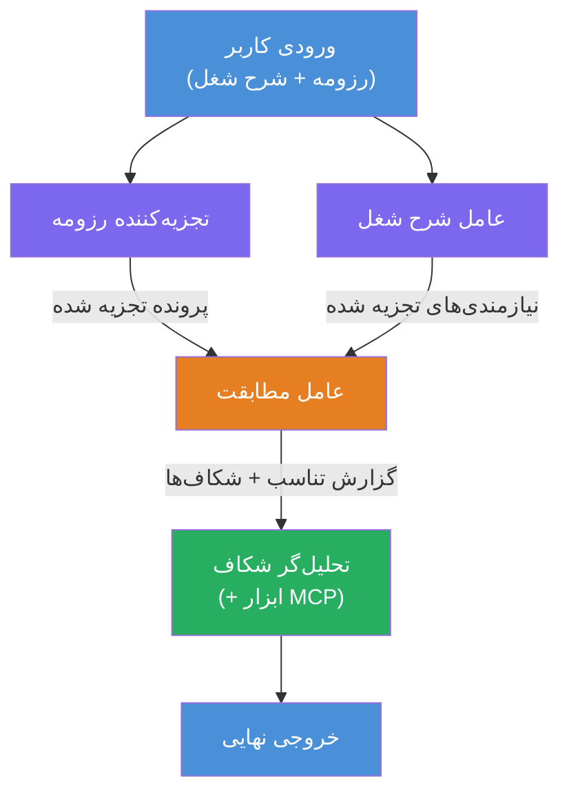
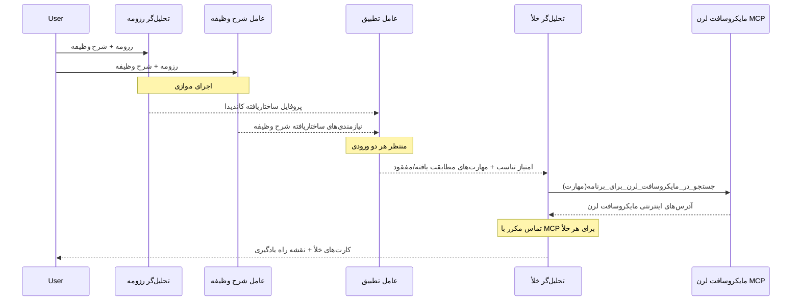
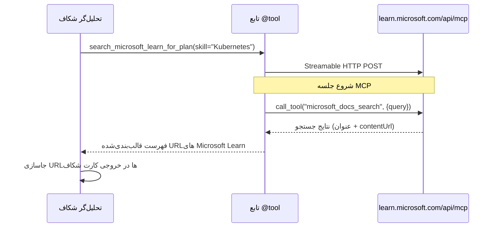

# ماژول ۱ - درک معماری چند عامل

در این ماژول، معماری ارزیاب تطبیق رزومه با شغل را قبل از نوشتن هر کدی یاد می‌گیرید. درک نمودار هماهنگی، نقش‌های عامل‌ها و جریان داده برای اشکال‌زدایی و توسعه [روندهای کاری چند عاملی](https://learn.microsoft.com/azure/architecture/ai-ml/idea/multiple-agent-workflow-automation) بسیار مهم است.

---

## مسئله‌ای که این حل می‌کند

تطبیق رزومه با توصیف شغل شامل مهارت‌های متمایز متعددی است:

۱. **تجزیه** - استخراج داده‌های ساخت‌یافته از متن غیرساخت‌یافته (رزومه)  
۲. **تحلیل** - استخراج الزامات از توصیف شغل  
۳. **مقایسه** - تعیین نمره تطبیق بین این دو  
۴. **برنامه‌ریزی** - ساخت نقشه راه یادگیری برای پر کردن شکاف‌ها

یک عامل واحد که این چهار وظیفه را در یک درخواست انجام دهد اغلب نتایج زیر را تولید می‌کند:  
- استخراج ناقص (با عجله از تجزیه برای رسیدن به نمره)  
- امتیازدهی سطحی (بدون تفکیک مبتنی بر شواهد)  
- نقشه راه‌های عمومی (غیرمخصوص به شکاف‌های خاص)

با تفکیک به **چهار عامل تخصصی** هر کدام بر وظیفه خود با دستورالعمل‌های اختصاصی تمرکز می‌کنند و خروجی با کیفیت بالاتری در هر مرحله ایجاد می‌شود.

---

## چهار عامل

هر عامل یک عامل کامل [Microsoft Foundry](https://learn.microsoft.com/azure/foundry/agents/concepts/hosted-agents) است که از طریق `AzureAIAgentClient.as_agent()` ایجاد شده است. آنها هم از یک مدل استفاده می‌کنند اما دستورالعمل‌ها و (اختیاری) ابزارهای متفاوتی دارند.

| # | نام عامل | نقش | ورودی | خروجی |
|---|---------|------|--------|--------|
| ۱ | **ResumeParser** | استخراج پروفایل ساخت‌یافته از متن رزومه | متن خام رزومه (از کاربر) | پروفایل کاندیدا، مهارت‌های فنی، مهارت‌های نرم، گواهینامه‌ها، تجربه دامنه، دستاوردها |
| ۲ | **JobDescriptionAgent** | استخراج الزامات ساخت‌یافته از توصیف شغل | متن خام JD (از کاربر، از طریق ResumeParser ارسال شده) | نمای کلی نقش، مهارت‌های موردنیاز، مهارت‌های ترجیحی، تجربه، گواهینامه‌ها، تحصیلات، مسئولیت‌ها |
| ۳ | **MatchingAgent** | محاسبه نمره تطبیق مبتنی بر شواهد | خروجی‌های ResumeParser + JobDescriptionAgent | نمره تطبیق (۰-۱۰۰ با تفکیک)، مهارت‌های مطابقت یافته، مهارت‌های گم‌شده، شکاف‌ها |
| ۴ | **GapAnalyzer** | ساخت نقشه راه یادگیری شخصی‌شده | خروجی MatchingAgent | کارت‌های شکاف (بر اساس مهارت)، ترتیب یادگیری، جدول زمانی، منابع از Microsoft Learn |

---

## نمودار هماهنگی

روند کاری از **توزیع موازی** پیروی می‌کند که به دنبال آن **تجمیع سریالی** است:


> **راهنما:** بنفش = عوامل موازی، نارنجی = نقطه تجمیع، سبز = عامل نهایی با ابزارها

### چگونگی جریان داده


۱. **کاربر پیام** حاوی رزومه و توصیف شغل ارسال می‌کند.  
۲. **ResumeParser** ورودی کامل کاربر را دریافت کرده و پروفایل ساخت‌یافته کاندیدا را استخراج می‌کند.  
۳. **JobDescriptionAgent** ورودی کاربر را به صورت موازی دریافت کرده و الزامات ساخت‌یافته استخراج می‌کند.  
۴. **MatchingAgent** خروجی‌های هر دو ResumeParser و JobDescriptionAgent را دریافت می‌کند (چهارچوب منتظر هر دو است تا تکمیل شوند قبل از اجرای MatchingAgent).  
۵. **GapAnalyzer** خروجی MatchingAgent را دریافت کرده و از **ابزار MCP مایکروسافت لرن** برای دریافت منابع واقعی یادگیری برای هر شکاف استفاده می‌کند.  
۶. **خروجی نهایی** پاسخ GapAnalyzer است که نمره تطبیق، کارت‌های شکاف و یک نقشه راه یادگیری کامل را شامل می‌شود.

### چرا توزیع موازی اهمیت دارد

ResumeParser و JobDescriptionAgent **همزمان اجرا می‌شوند** چون هیچکدام به دیگری وابسته نیستند. این:

- کل تاخیر را کاهش می‌دهد (هر دو همزمان اجرا می‌شوند به جای ترتیب زمانی)  
- تفکیک طبیعی است (تجزیه رزومه در مقابل تجزیه JD کارهای مستقلی هستند)  
- یک الگوی رایج چند عاملی را نشان می‌دهد: **توزیع → تجمیع → عمل**

---

## WorkflowBuilder در کد

در اینجا نحوه نگاشت نمودار بالا به فراخوانی‌های API [`WorkflowBuilder`](https://learn.microsoft.com/agent-framework/workflows/agents-in-workflows) در `main.py` آورده شده است:

```python
from agent_framework import WorkflowBuilder

workflow = (
    WorkflowBuilder(
        name="ResumeJobFitEvaluator",
        start_executor=resume_parser,       # اولین عامل برای دریافت ورودی کاربر
        output_executors=[gap_analyzer],     # عامل نهایی که خروجی آن بازگردانده می‌شود
    )
    .add_edge(resume_parser, jd_agent)      # تجزیه‌کننده رزومه → عامل شرح شغل
    .add_edge(resume_parser, matching_agent) # تجزیه‌کننده رزومه → عامل تطبیق
    .add_edge(jd_agent, matching_agent)      # عامل شرح شغل → عامل تطبیق
    .add_edge(matching_agent, gap_analyzer)  # عامل تطبیق → تحلیل‌گر شکاف
    .build()
)
```
  
**درک لبه‌ها:**

| لبه | معنای آن چیست |
|------|--------------|
| `resume_parser → jd_agent` | عامل JD خروجی ResumeParser را دریافت می‌کند |
| `resume_parser → matching_agent` | MatchingAgent خروجی ResumeParser را می‌گیرد |
| `jd_agent → matching_agent` | MatchingAgent همچنین خروجی عامل JD را می‌گیرد (منتظر هر دو می‌ماند) |
| `matching_agent → gap_analyzer` | GapAnalyzer خروجی MatchingAgent را می‌گیرد |

از آنجا که `matching_agent` دارای **دو لبه ورودی** (`resume_parser` و `jd_agent`) است، فریمورک به طور خودکار منتظر می‌ماند هر دو کامل شوند قبل از اجرای MatchingAgent.

---

## ابزار MCP

عامل GapAnalyzer یک ابزار دارد: `search_microsoft_learn_for_plan`. این یک **[ابزار MCP](https://learn.microsoft.com/agent-framework/agents/tools/hosted-mcp-tools)** است که به API مایکروسافت لرن متصل می‌شود تا منابع یادگیری منتخب را دریافت کند.

### چگونگی عملکرد

```python
@tool
async def search_microsoft_learn_for_plan(
    skill: str, role: str = "", max_results: int = 5
) -> str:
    """Search Microsoft Learn MCP and return curated official links."""
    # اتصال به https://learn.microsoft.com/api/mcp از طریق HTTP قابل پخش
    # فراخوانی ابزار 'microsoft_docs_search' در سرور MCP
    # بازگرداندن فهرست قالب‌بندی شده‌ای از آدرس‌های Microsoft Learn
```
  
### جریان تماس MCP


۱. GapAnalyzer تصمیم می‌گیرد که برای یک مهارت (مثلاً "Kubernetes") منابع یادگیری لازم دارد  
۲. فریمورک `search_microsoft_learn_for_plan(skill="Kubernetes")` را فرا می‌خواند  
۳. تابع یک اتصال [HTTP قابل پخش](https://learn.microsoft.com/agent-framework/agents/tools/hosted-mcp-tools) به `https://learn.microsoft.com/api/mcp` باز می‌کند  
۴. ابزار `microsoft_docs_search` را در [سرور MCP](https://learn.microsoft.com/azure/foundry/agents/how-to/tools/model-context-protocol) فرا می‌خواند  
۵. سرور MCP نتایج جستجو را برمی‌گرداند (عنوان + URL)  
۶. تابع نتایج را قالب‌بندی کرده و به صورت رشته باز می‌گرداند  
۷. GapAnalyzer از URLهای برگشتی در خروجی کارت شکاف استفاده می‌کند

### لاگ‌های مورد انتظار MCP

زمانی که ابزار اجرا می‌شود، ورودی‌های لاگی مشابه مشاهده خواهید کرد:

```
GET https://learn.microsoft.com/api/mcp → 405 (Method Not Allowed)
POST https://learn.microsoft.com/api/mcp → 200
DELETE https://learn.microsoft.com/api/mcp → 405 (Method Not Allowed)
```
  
**این موارد طبیعی هستند.** کلاینت MCP با درخواست‌های GET و DELETE در هنگام شروع آزمایش می‌کند - بازگشت ۴۰۵ در این موارد طبیعی است. تماس واقعی ابزار از نوع POST است و ۲۰۰ باز می‌گرداند. فقط در صورت شکست تماس‌های POST نگران باشید.

---

## الگوی ایجاد عامل

هر عامل با استفاده از **مدیر زمینه async [`AzureAIAgentClient.as_agent()`](https://learn.microsoft.com/python/api/overview/azure/ai-agents-readme) ایجاد می‌شود. این الگوی Foundry SDK برای ایجاد عواملی است که به‌صورت خودکار پاک‌سازی می‌شوند:

```python
async with (
    get_credential() as credential,
    AzureAIAgentClient(
        project_endpoint=PROJECT_ENDPOINT,
        model_deployment_name=MODEL_DEPLOYMENT_NAME,
        credential=credential,
    ).as_agent(
        name="ResumeParser",
        instructions=RESUME_PARSER_INSTRUCTIONS,
    ) as resume_parser,
    # ... تکرار برای هر عامل ...
):
    # همه ۴ عامل اینجا وجود دارند
    workflow = create_workflow(resume_parser, jd_agent, matching_agent, gap_analyzer)
```
  
**نکات کلیدی:**  
- هر عامل یک نمونه جداگانه `AzureAIAgentClient` دریافت می‌کند (SDK نیاز دارد نام عامل در محدوده کلاینت باشد)  
- همه عوامل اعتبارنامه (`credential`)، `PROJECT_ENDPOINT` و `MODEL_DEPLOYMENT_NAME` مشترک دارند  
- بلوک `async with` تضمین می‌کند که همه عوامل هنگام خاموش شدن سرور پاک‌سازی شوند  
- علاوه بر این GapAnalyzer ابزار `tools=[search_microsoft_learn_for_plan]` را می‌گیرد

---

## راه‌اندازی سرور

پس از ایجاد عوامل و ساخت روند کار، سرور شروع به کار می‌کند:

```python
from azure.ai.agentserver.agentframework import from_agent_framework

agent = create_workflow(resume_parser, jd_agent, matching_agent, gap_analyzer)
await from_agent_framework(agent).run_async()
```
  
`from_agent_framework()` روند کاری را به عنوان یک سرور HTTP بسته‌بندی می‌کند که نقطه پایانی `/responses` را روی پورت ۸۰۸۸ در دسترس قرار می‌دهد. این همان الگوی Lab 01 است، اما اکنون "عامل" کل [نمودار روند کاری](https://learn.microsoft.com/agent-framework/workflows/as-agents) است.

---

### نقطه بررسی

- [ ] معماری ۴ عاملی و نقش هر عامل را درک کرده‌اید  
- [ ] می‌توانید جریان داده را دنبال کنید: کاربر → ResumeParser → (موازی) عامل JD + MatchingAgent → GapAnalyzer → خروجی  
- [ ] می‌دانید چرا MatchingAgent منتظر هر دو ResumeParser و JD Agent می‌ماند (دو لبه ورودی)  
- [ ] ابزار MCP را می‌شناسید: عملکرد، چگونگی فراخوانی و اینکه لاگ‌های GET 405 طبیعی است  
- [ ] الگوی `AzureAIAgentClient.as_agent()` را می‌دانید و چرا هر عامل نمونه کلاینت خود را دارد  
- [ ] می‌توانید کد `WorkflowBuilder` را بخوانید و آن را با نمودار بصری مرتبط کنید

---

**قبلی:** [۰۰ - پیش‌نیازها](00-prerequisites.md) · **بعدی:** [۰۲ - ایجاد پروژه چند عاملی →](02-scaffold-multi-agent.md)

---

<!-- CO-OP TRANSLATOR DISCLAIMER START -->
**سلب مسئولیت**:  
این سند به وسیله سرویس ترجمه هوش مصنوعی [Co-op Translator](https://github.com/Azure/co-op-translator) ترجمه شده است. در حالی که ما تلاش می‌کنیم دقت را حفظ کنیم، لطفاً توجه داشته باشید که ترجمه‌های خودکار ممکن است حاوی خطاها یا نواقصی باشند. سند اصلی به زبان مادری آن باید به عنوان منبع معتبر در نظر گرفته شود. برای اطلاعات حیاتی، ترجمه حرفه‌ای انسانی توصیه می‌شود. ما مسئول هیچ گونه سوءتفاهم یا برداشت نادرستی که ناشی از استفاده از این ترجمه باشد، نیستیم.
<!-- CO-OP TRANSLATOR DISCLAIMER END -->