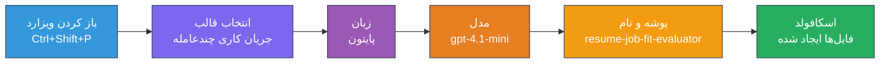
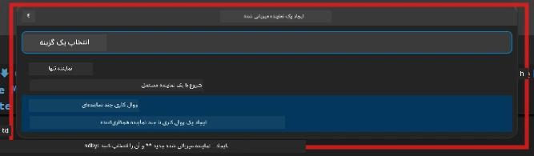

# ماژول 2 - ساختاردهی پروژه چند-عامل

در این ماژول، شما از [افزونه Microsoft Foundry](https://marketplace.visualstudio.com/items?itemName=TeamsDevApp.vscode-ai-foundry) برای **ساختاردهی پروژه با چند عامل** استفاده می‌کنید. این افزونه ساختار کامل پروژه را تولید می‌کند - `agent.yaml`، `main.py`، `Dockerfile`، `requirements.txt`، `.env` و پیکربندی دیباگ. سپس در ماژول‌های 3 و 4 این فایل‌ها را سفارشی می‌کنید.

> **نکته:** پوشه `PersonalCareerCopilot/` در این آزمایش یک نمونه کاملاً عملی از پروژه چند-عاملی سفارشی‌شده است. شما می‌توانید یا یک پروژه جدید بسازید (برای یادگیری توصیه می‌شود) یا مستقیماً کد موجود را بررسی کنید.

---

## گام 1: باز کردن جادوگر ایجاد عامل میزبانی شده


1. کلیدهای `Ctrl+Shift+P` را فشار دهید تا **پالت فرمان** باز شود.
2. تایپ کنید: **Microsoft Foundry: Create a New Hosted Agent** و آن را انتخاب کنید.
3. جادوگر ایجاد عامل میزبانی شده باز می‌شود.

> **روش جایگزین:** روی آیکون **Microsoft Foundry** در نوار فعالیت کلیک کنید → روی آیکون **+** کنار **Agents** کلیک کنید → **Create New Hosted Agent** را انتخاب کنید.

---

## گام 2: انتخاب قالب پروژه چند-عاملی

جادوگر از شما می‌خواهد یک قالب انتخاب کنید:

| قالب | توضیح | زمان استفاده |
|----------|-------------|-------------|
| عامل تنها | یک عامل با دستورالعمل‌ها و ابزارهای اختیاری | آزمایشگاه 01 |
| **گردش کار چند-عاملی** | چندین عامل که از طریق WorkflowBuilder همکاری می‌کنند | **این آزمایشگاه (آزمایشگاه 02)** |

1. گزینه **گردش کار چند-عاملی** را انتخاب کنید.
2. روی **Next** کلیک کنید.



---

## گام 3: انتخاب زبان برنامه‌نویسی

1. گزینه **Python** را انتخاب کنید.
2. روی **Next** کلیک کنید.

---

## گام 4: انتخاب مدل خود

1. جادوگر مدل‌های مستقر در پروژه Foundry شما را نشان می‌دهد.
2. مدلی که در آزمایشگاه 01 استفاده کردید را انتخاب کنید (مثلاً **gpt-4.1-mini**).
3. روی **Next** کلیک کنید.

> **نکته:** [`gpt-4.1-mini`](https://learn.microsoft.com/azure/foundry/foundry-models/concepts/models-sold-directly-by-azure#gpt-41-series) برای توسعه توصیه می‌شود - سریع، ارزان و مناسب جریان‌های کاری چند-عاملی است. برای استقرار نهایی در تولید می‌توانید به `gpt-4.1` تغییر دهید اگر خروجی با کیفیت بالاتری می‌خواهید.

---

## گام 5: انتخاب محل پوشه و نام عامل

1. دیالوگ انتخاب فایل باز می‌شود. یک پوشه هدف را انتخاب کنید:
   - اگر با مخزن کارگاه همراه هستید: به `workshop/lab02-multi-agent/` بروید و یک زیرپوشه جدید بسازید
   - اگر تازه شروع می‌کنید: هر پوشه‌ای را انتخاب کنید
2. یک **نام** برای عامل میزبانی شده وارد کنید (مثلاً `resume-job-fit-evaluator`).
3. روی **Create** کلیک کنید.

---

## گام 6: صبر کنید تا ساختار پروژه کامل شود

1. VS Code یک پنجره جدید باز می‌کند (یا پنجره فعلی را به‌روزرسانی می‌کند) و پروژه ساختاردهی شده را نشان می‌دهد.
2. باید ساختار این فایل‌ها را ببینید:

```
resume-job-fit-evaluator/
├── .env                ← Environment variables (placeholders)
├── .vscode/
│   └── launch.json     ← Debug configuration
├── agent.yaml          ← Agent definition (kind: hosted)
├── Dockerfile          ← Container configuration
├── main.py             ← Multi-agent workflow code (scaffold)
└── requirements.txt    ← Python dependencies
```

> **یادداشت کارگاه:** در مخزن کارگاه، پوشه `.vscode/` در **ریشه فضای کاری** است و فایل‌های مشترک `launch.json` و `tasks.json` وجود دارد. پیکربندی‌های دیباگ برای آزمایشگاه 01 و 02 هر دو شامل شده‌اند. وقتی F5 را می‌زنید، از منوی کشویی **"Lab02 - Multi-Agent"** را انتخاب کنید.

---

## گام 7: درک فایل‌های ساختاردهی شده (جزئیات چند-عاملی)

ساختار پروژه چند-عاملی با ساختار پروژه تک عامل در موارد مهمی تفاوت دارد:

### 7.1 `agent.yaml` - تعریف عامل

```yaml
kind: hosted
name: resume-job-fit-evaluator
description: >
  A multi-agent workflow that evaluates resume-to-job fit.
metadata:
  authors:
    - Microsoft
  tags:
    - Multi-Agent Workflow
    - Resume Evaluator
protocols:
  - protocol: responses
    version: v1
environment_variables:
  - name: PROJECT_ENDPOINT
    value: ${PROJECT_ENDPOINT}
  - name: MODEL_DEPLOYMENT_NAME
    value: ${MODEL_DEPLOYMENT_NAME}
```

**تفاوت کلیدی با آزمایشگاه 01:** بخش `environment_variables` ممکن است شامل متغیرهای اضافی برای نقاط پایانی MCP یا پیکربندی دیگر ابزارها باشد. `name` و `description` بازتاب دهنده کاربری چند-عاملی است.

### 7.2 `main.py` - کد گردش کار چند-عاملی

ساختار شامل:
- **رشته‌های دستورالعمل برای چندین عامل** (یک ثابت برای هر عامل)
- **چندین [مدیریت‌کننده زمینه AzureAIAgentClient.as_agent()](https://learn.microsoft.com/python/api/overview/azure/ai-agents-readme)** (یکی به ازای هر عامل)
- **[`WorkflowBuilder`](https://learn.microsoft.com/agent-framework/workflows/agents-in-workflows)** برای اتصال عوامل به هم
- **`from_agent_framework()`** برای ارائه گردش کار به عنوان یک نقطه پایانی HTTP

```python
from agent_framework import WorkflowBuilder, tool
from agent_framework.azure import AzureAIAgentClient
from azure.ai.agentserver.agentframework import from_agent_framework
```

وارد کردن اضافی [`WorkflowBuilder`](https://learn.microsoft.com/agent-framework/workflows/agents-in-workflows) در مقایسه با آزمایشگاه 01 جدید است.

### 7.3 `requirements.txt` - وابستگی‌های اضافی

پروژه چند-عاملی از همان بسته‌های پایه آزمایشگاه 01 به علاوه بسته‌های مرتبط با MCP استفاده می‌کند:

```
agent-framework-azure-ai==1.0.0rc3
agent-framework-core==1.0.0rc3
azure-ai-agentserver-agentframework==1.0.0b16
azure-ai-agentserver-core==1.0.0b16
debugpy
agent-dev-cli --pre
```

> **نکته مهم نسخه:** بسته `agent-dev-cli` برای نصب آخرین نسخه پیش‌نمایش باید در `requirements.txt` با گزینه `--pre` نصب شود. این برای سازگاری Agent Inspector با `agent-framework-core==1.0.0rc3` لازم است. برای جزئیات نسخه به [ماژول 8 - عیب‌یابی](08-troubleshooting.md) مراجعه کنید.

| بسته | نسخه | هدف |
|---------|---------|---------|
| [`agent-framework-azure-ai`](https://learn.microsoft.com/agent-framework/overview/) | `1.0.0rc3` | ادغام Azure AI برای [چارچوب Agent مایکروسافت](https://github.com/microsoft/agent-framework) |
| [`agent-framework-core`](https://learn.microsoft.com/agent-framework/overview/) | `1.0.0rc3` | زمان اجرای اصلی (شامل WorkflowBuilder) |
| `azure-ai-agentserver-agentframework` | `1.0.0b16` | زمان اجرای سرور عامل میزبانی شده |
| `azure-ai-agentserver-core` | `1.0.0b16` | انتزاع‌های اصلی سرور عامل |
| `debugpy` | آخرین نسخه | دیباگینگ پایتون (F5 در VS Code) |
| `agent-dev-cli` | `--pre` | رابط خط فرمان توسعه محلی + بک‌اند Agent Inspector |

### 7.4 `Dockerfile` - مشابه آزمایشگاه 01

Dockerfile مشابه آزمایشگاه 01 است - فایل‌ها را کپی می‌کند، وابستگی‌ها را از `requirements.txt` نصب می‌کند، پورت 8088 را باز می‌کند و `python main.py` را اجرا می‌کند.

```dockerfile
FROM python:3.14-slim
WORKDIR /app
COPY ./ .
RUN pip install --upgrade pip && \
    if [ -f requirements.txt ]; then \
        pip install -r requirements.txt; \
    else \
      echo "No requirements.txt found" >&2; exit 1; \
    fi
EXPOSE 8088
CMD ["python", "main.py"]
```

---

### نقطه بررسی

- [ ] جادوگر ساختاردهی کامل شده → ساختار پروژه جدید قابل مشاهده است
- [ ] همه فایل‌ها قابل مشاهده‌اند: `agent.yaml`، `main.py`، `Dockerfile`، `requirements.txt`، `.env`
- [ ] در `main.py` وارد کردن `WorkflowBuilder` دیده می‌شود (تأیید انتخاب قالب چند-عاملی)
- [ ] در `requirements.txt` هر دو بسته `agent-framework-core` و `agent-framework-azure-ai` موجود است
- [ ] تفاوت‌های ساختار چند-عاملی با ساختار تک-عاملی را می‌دانید (چندین عامل، WorkflowBuilder، ابزارهای MCP)

---

**قبلی:** [01 - درک معماری چند-عاملی](01-understand-multi-agent.md) · **بعدی:** [03 - پیکربندی عوامل و محیط →](03-configure-agents.md)

---

<!-- CO-OP TRANSLATOR DISCLAIMER START -->
**سلب مسئولیت**:  
این سند با استفاده از سرویس ترجمه هوش مصنوعی [Co-op Translator](https://github.com/Azure/co-op-translator) ترجمه شده است. در حالی که ما برای دقت تلاش می‌کنیم، لطفاً توجه داشته باشید که ترجمه‌های خودکار ممکن است شامل خطاها یا نادرستی‌هایی باشند. سند اصلی به زبان بومی خود باید به عنوان منبع معتبر در نظر گرفته شود. برای اطلاعات حیاتی، ترجمه حرفه‌ای انسانی توصیه می‌شود. ما مسئول هیچ گونه سوءتفاهم یا تفسیر نادرستی ناشی از استفاده از این ترجمه نیستیم.
<!-- CO-OP TRANSLATOR DISCLAIMER END -->