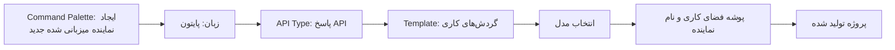
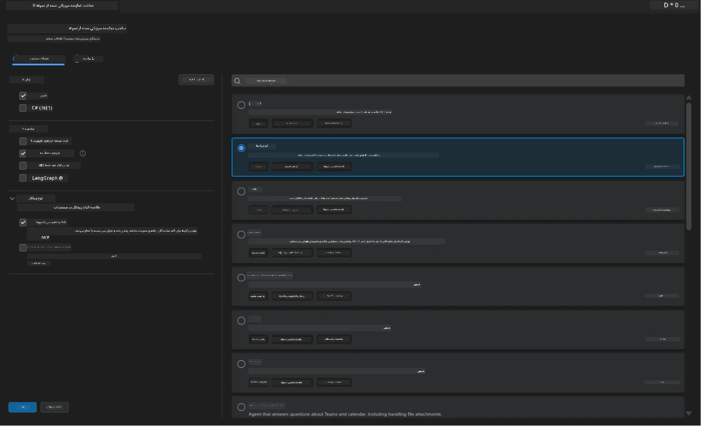
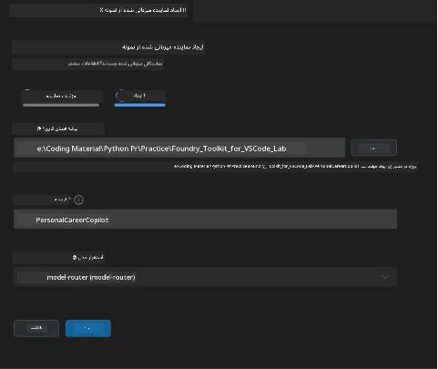

# ماژول ۲ - پایه‌ریزی پروژه چندعامل

⏱️ ~۵ دقیقه

در این ماژول، شما از [Foundry Toolkit برای VS Code](https://aka.ms/foundrytk) استفاده می‌کنید تا **پروژه چندعامل را پایه‌ریزی کنید**. جادوگر فایل‌های `agent.yaml`، `main.py`، `Dockerfile`، `requirements.txt`، `.env` و پیکربندی دیباگ VS Code را تولید می‌کند - بنابراین می‌توانید روی اتصال جریان کار چهار عامل در ماژول ۳ تمرکز کنید.

> **مفهوم کلیدی:** پایه‌ریزی یک نمونه کاری با یک عامل است. شما منطق جایگزین را با گراف `WorkflowBuilder` در ماژول ۳ جایگزین می‌کنید. شما کد پایه را از ابتدا نمی‌نویسید.

> **پیاده‌سازی مرجع:** [`PersonalCareerCopilot/`](../../../../../workshop/lab02-multi-agent/PersonalCareerCopilot) یک نمونه کاری کامل است. از آن برای مقایسه کار خود در حین پیشرفت استفاده کنید.

### جریان جادوگر پایه‌ریزی


```mermaid
flowchart LR
    A[Command Palette: ایجاد نماینده میزبانی شده جدید] --> B[زبان: پایتون]
    B --> C[API Type: پاسخ API]
    C --> D[Template: گردش‌های کاری]
    D --> E[انتخاب مدل]
    E --> F[پوشه فضای کاری و نام نماینده]
    F --> G[پروژه تولید شده]
```

---

## مرحله ۱: باز کردن جادوگر ایجاد عامل میزبانی شده

۱. کلیدهای `Ctrl+Shift+P` را فشار دهید تا **پالت فرمان** باز شود.
۲. تایپ کنید: **Foundry Toolkit: Create a New Hosted Agent** و آن را انتخاب کنید.
۳. جادوگر در تب **جزئیات عامل** باز می‌شود.

> **گزینه جایگزین:** روی آیکون **Foundry Toolkit** در نوار فعالیت کلیک کنید → روی آیکون **+** کنار **Hosted Agents** کلیک کنید → **Create New Hosted Agent**.

---

## مرحله ۲: انتخاب تنظیمات



۱. در بخش ناوبری/تنظیمات سمت چپ، گزینه‌های زیر را انتخاب کنید:

| منو | انتخاب | توضیحات |
|--------|-----------|-------|
| **زبان** | Python | C# (.NET) نیز پشتیبانی می‌شود |
| **چارچوب کاری** | Agent Framework | `Agent`، `AgentExecutor`، `WorkflowBuilder` را فراهم می‌کند |
| **نوع API** | Response API | `POST /responses` - تاریخچه مدیریت شده توسط پلتفرم، پشتیبانی از استریمینگ |
| **قالب** | **Workflows** | درخواست‌ها را از طریق چند عامل به ترتیب پردازش می‌کند |

۲. پس از انتخاب، روی **Next** کلیک کنید



۳. در پنجره بعد، گزینه‌های زیر را انتخاب کنید:

| منو | انتخاب | توضیحات |
|--------|-----------|-------|
| **پوشه فضای کاری** | مسیر پوشه هدف را مرور کنید | مثلاً `workshop/lab02-multi-agent/` در این مخزن |
| **نام عامل** | `PersonalCareerCopilot` | این به نام پوشه پروژه تبدیل می‌شود |
| **استقرار مدل** | مدل مستقر خود را انتخاب کنید | مثلاً `gpt-4.1-mini` از آزمایشگاه ۰۱ |

۴. روی **Create** کلیک کنید تا پروژه پایه‌ریزی شود. VS Code فایل‌ها را تولید کرده و پوشه را باز می‌کند.

> **نکته:** [`gpt-4.1-mini`](https://learn.microsoft.com/azure/foundry/foundry-models/concepts/models-sold-directly-by-azure#gpt-41-series) تعادلی خوب بین سرعت و کیفیت برای توسعه چندعامل برقرار می‌کند.

---

## مرحله ۳: بررسی پروژه تولید شده

پس از اتمام پایه‌ریزی، بررسی کنید که این فایل‌ها را در اکسپلورر (`Ctrl+Shift+E`) می‌بینید:

```
📂 <your-agent-name>/
├── .azdignore          ← Files excluded from Azure Developer CLI deployments
├── .dockerignore       ← Files excluded from Docker builds
├── .env                ← Environment variables (placeholders - fill in Module 3)
├── .vscode/
│   ├── launch.json     ← Debug config (F5 → run + Agent Inspector)
│   └── tasks.json      ← VS Code task definitions
├── agent.yaml          ← Agent definition (kind: hosted, protocol: responses)
├── Dockerfile          ← Container config for deployment
├── main.py             ← Stub agent entry point (replace with WorkflowBuilder in Module 3)
└── requirements.txt    ← Python dependencies
```

> **مهم:** این پوشه پایه‌ریزی شده را مستقیماً در VS Code باز کنید تا `.vscode/launch.json` و `tasks.json` به درستی برای دیباگ F5 اعمال شوند.

### فایل‌های کلیدی توضیح داده شده

| فایل | هدف |
|------|---------|
| `agent.yaml` | نوع `kind: hosted` را اعلام می‌کند، متغیرهای محیطی را نقشه‌برداری می‌کند، پروتکل `/responses` را تعریف می‌کند |
| `main.py` | نمونه: یک `FoundryChatClient` → `Agent` → `ResponsesHostServer`. این را در ماژول ۳ با ۴ عامل + `WorkflowBuilder` جایگزین می‌کنید |
| `Dockerfile` | `python:3.12-slim`، نصب `requirements.txt`، باز کردن پورت ۸۰۸۸، اجرای `python main.py` |
| `requirements.txt` | بسته‌های `agent-framework-foundry`، `agent-framework-foundry-hosting`، `mcp<2,>=1.24.0`، `debugpy` |

> **مرجع:** محتوای کامل تولید شده را در [`PersonalCareerCopilot/agent.yaml`](../../../../../workshop/lab02-multi-agent/PersonalCareerCopilot/agent.yaml) و [`PersonalCareerCopilot/requirements.txt`](../../../../../workshop/lab02-multi-agent/PersonalCareerCopilot/requirements.txt) ببینید.

---

### ✅ نقطه بررسی

- [ ] جادوگر پایه‌ریزی تکمیل شده - پوشه پروژه جدید در اکسپلورر قابل مشاهده است
- [ ] همه فایل‌های مورد انتظار حاضرند: `agent.yaml`، `main.py`، `Dockerfile`، `requirements.txt`، `.env`
- [ ] `agent.yaml` نشان می‌دهد که `kind: hosted` و `protocol: responses` است
- [ ] در `main.py` ایمپورت‌های `Agent`، `FoundryChatClient`، `ResponsesHostServer` وجود دارد
- [ ] پوشه پایه‌ریزی شده به عنوان ریشه فضای کاری VS Code باز است
- [ ] شما متوجه هستید که `main.py` یک نمونه است - `WorkflowBuilder` در ماژول ۳ اضافه می‌شود

---

**قبلی:** [۰۱ - درک معماری چندعامل](01-understand-multi-agent.md) · **بعدی:** [۰۳ - پیکربندی عوامل و محیط →](03-configure-agents.md)

---

<!-- CO-OP TRANSLATOR DISCLAIMER START -->
**سلب مسئولیت**:
این سند با استفاده از سرویس ترجمه هوش مصنوعی [Co-op Translator](https://github.com/Azure/co-op-translator) ترجمه شده است. در حالی که ما در تلاش برای دقت هستیم، لطفاً توجه داشته باشید که ترجمه‌های خودکار ممکن است شامل خطاها یا نادرستی‌هایی باشند. سند اصلی به زبان مادری خود باید به عنوان منبع معتبر در نظر گرفته شود. برای اطلاعات حیاتی، ترجمه حرفه‌ای انسانی توصیه می‌شود. ما در قبال هرگونه سوء تفاهم یا برداشت نادرست ناشی از استفاده از این ترجمه مسئولیتی نداریم.
<!-- CO-OP TRANSLATOR DISCLAIMER END -->