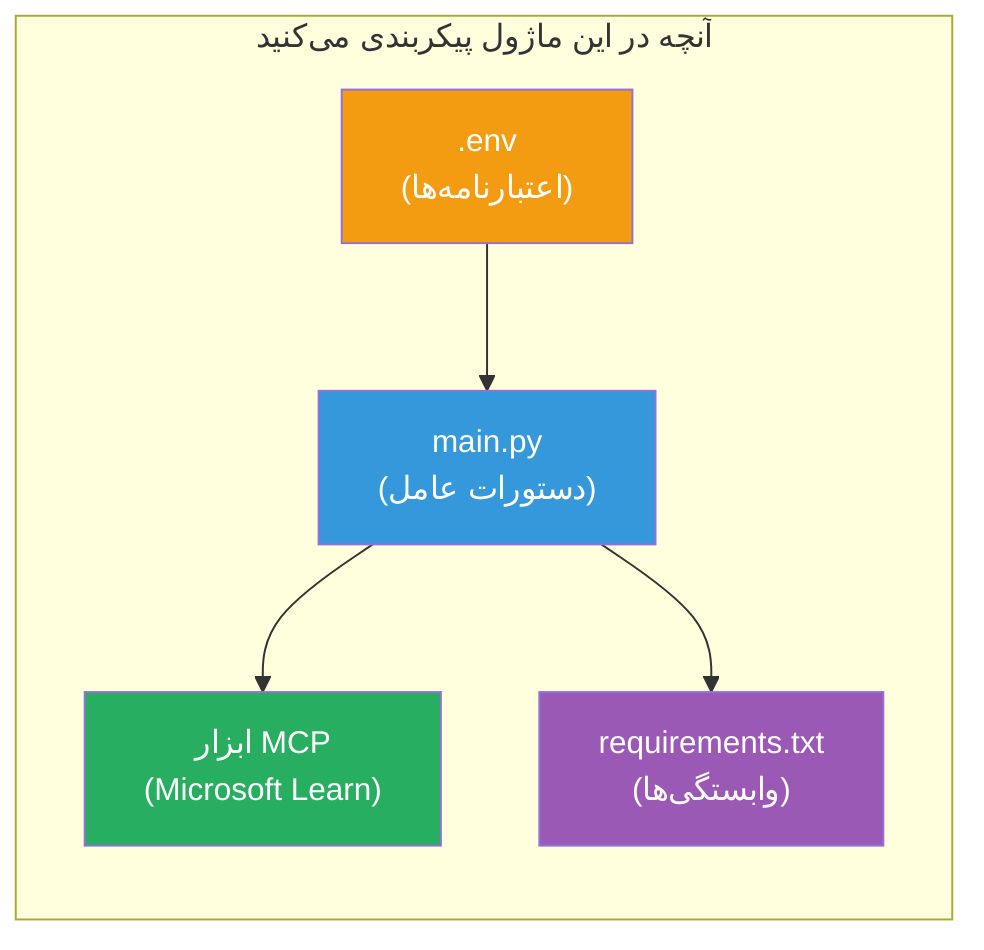

# ماژول ۳ - پیکربندی عوامل، ابزار MCP و محیط

در این ماژول، پروژه چندعامله اسکافولد شده را سفارشی می‌کنید. دستورالعمل‌هایی برای هر چهار عامل خواهید نوشت، ابزار MCP برای Microsoft Learn را راه‌اندازی می‌کنید، متغیرهای محیط را پیکربندی می‌کنید و وابستگی‌ها را نصب می‌کنید.


> **مرجع:** کد کامل کاری در [`PersonalCareerCopilot/main.py`](../../../../../workshop/lab02-multi-agent/PersonalCareerCopilot/main.py) قرار دارد. از آن به عنوان مرجع هنگام ساخت پروژه خود استفاده کنید.

---

## مرحله ۱: پیکربندی متغیرهای محیطی

۱. فایل **`.env`** را در ریشه پروژه خود باز کنید.  
۲. جزئیات پروژه Foundry خود را وارد کنید:

   ```env
   PROJECT_ENDPOINT=https://<your-account>.services.ai.azure.com/api/projects/<your-project>
   MODEL_DEPLOYMENT_NAME=gpt-4.1-mini
   ```

۳. فایل را ذخیره کنید.

### محل یافتن این مقادیر

| مقدار | نحوه‌ی یافتن |
|-------|---------------|
| **نقطه انتهایی پروژه** | نوار کناری Microsoft Foundry → روی پروژه خود کلیک کنید → آدرس نقطه انتهایی در نمای جزئیات |
| **نام استقرار مدل** | نوار کناری Foundry → پروژه را باز کنید → **مدل‌ها + نقاط انتهایی** → نام کنار مدل مستقر شده |

> **امنیت:** هرگز فایل `.env` را به کنترل نسخه ارسال نکنید. اگر هنوز در `.gitignore` نیست، آن را اضافه کنید.

### نگاشت متغیرهای محیطی

`main.py` چندعامل، هر دو نام متغیر محیطی استاندارد و ویژه کارگاه را می‌خواند:

```python
PROJECT_ENDPOINT = os.getenv("AZURE_AI_PROJECT_ENDPOINT") or os.getenv("PROJECT_ENDPOINT")
MODEL_DEPLOYMENT_NAME = os.getenv(
    "AZURE_AI_MODEL_DEPLOYMENT_NAME",
    os.getenv("MODEL_DEPLOYMENT_NAME", "gpt-4.1-mini"),
)
MICROSOFT_LEARN_MCP_ENDPOINT = os.getenv(
    "MICROSOFT_LEARN_MCP_ENDPOINT", "https://learn.microsoft.com/api/mcp"
)
```

نقطه انتهایی MCP یک مقدار پیش‌فرض معقول دارد - نیازی نیست که آن را در `.env` تنظیم کنید مگر اینکه بخواهید آن را بازنویسی کنید.

---

## مرحله ۲: نوشتن دستورالعمل‌های عامل

این مهم‌ترین مرحله است. هر عامل نیاز به دستورالعمل‌های دقیق دارد که نقش، قالب خروجی و قوانینش را تعریف می‌کند. فایل `main.py` را باز کنید و ثوابت دستورالعمل را ایجاد (یا اصلاح) کنید.

### ۲.۱ عامل تحلیل رزومه

```python
RESUME_PARSER_INSTRUCTIONS = """\
You are the Resume Parser.
Extract resume text into a compact, structured profile for downstream matching.

Output exactly these sections:
1) Candidate Profile
2) Technical Skills (grouped categories)
3) Soft Skills
4) Certifications & Awards
5) Domain Experience
6) Notable Achievements

Rules:
- Use only explicit or strongly implied evidence.
- Do not invent skills, titles, or experience.
- Keep concise bullets; no long paragraphs.
- If input is not a resume, return a short warning and request resume text.
"""
```

**چرا این بخش‌ها؟** عامل MatchingAgent به داده‌های ساختاریافته نیاز دارد تا بتواند امتیازدهی کند. بخش‌های یکسان باعث می‌شود انتقال داده میان عوامل قابل اطمینان باشد.

### ۲.۲ عامل توصیف شغل

```python
JOB_DESCRIPTION_INSTRUCTIONS = """\
You are the Job Description Analyst.
Extract a structured requirement profile from a JD.

Output exactly these sections:
1) Role Overview
2) Required Skills
3) Preferred Skills
4) Experience Required
5) Certifications Required
6) Education
7) Domain / Industry
8) Key Responsibilities

Rules:
- Keep required vs preferred clearly separated.
- Only use what the JD states; do not invent hidden requirements.
- Flag vague requirements briefly.
- If input is not a JD, return a short warning and request JD text.
"""
```

**چرا مهارت‌های مورد نیاز جدا از مهارت‌های ترجیحی؟** عامل MatchingAgent وزن‌های متفاوتی برای هر کدام استفاده می‌کند (مهارت‌های مورد نیاز = ۴۰ امتیاز، مهارت‌های ترجیحی = ۱۰ امتیاز).

### ۲.۳ عامل مطابقت‌دهنده

```python
MATCHING_AGENT_INSTRUCTIONS = """\
You are the Matching Agent.
Compare parsed resume output vs JD output and produce an evidence-based fit report.

Scoring (100 total):
- Required Skills 40
- Experience 25
- Certifications 15
- Preferred Skills 10
- Domain Alignment 10

Output exactly these sections:
1) Fit Score (with breakdown math)
2) Matched Skills
3) Missing Skills
4) Partially Matched
5) Experience Alignment
6) Certification Gaps
7) Overall Assessment

Rules:
- Be objective and evidence-only.
- Keep partial vs missing separate.
- Keep Missing Skills precise; it feeds roadmap planning.
"""
```

**چرا امتیازدهی صریح؟** امتیازدهی قابل تکرار امکان مقایسه اجرای برنامه و عیب‌یابی مسائل را فراهم می‌کند. مقیاس ۱۰۰ امتیازی برای کاربران نهایی ساده است.

### ۲.۴ عامل تحلیل شکاف

```python
GAP_ANALYZER_INSTRUCTIONS = """\
You are the Gap Analyzer and Roadmap Planner.
Create a practical upskilling plan from the matching report.

Microsoft Learn MCP usage (required):
- For EVERY High and Medium priority gap, call tool `search_microsoft_learn_for_plan`.
- Use returned Learn links in Suggested Resources.
- Prefer Microsoft Learn for free resources.

CRITICAL: You MUST produce a SEPARATE detailed gap card for EVERY skill listed in
the Missing Skills and Certification Gaps sections of the matching report. Do NOT
skip or combine gaps. Do NOT summarize multiple gaps into one card.

Output format:
1) Personalized Learning Roadmap for [Role Title]
2) One DETAILED card per gap (produce ALL cards, not just the first):
   - Skill
   - Priority (High/Medium/Low)
   - Current Level
   - Target Level
   - Suggested Resources (include Learn URL from tool results)
   - Estimated Time
   - Quick Win Project
3) Recommended Learning Order (numbered list)
4) Timeline Summary (week-by-week)
5) Motivational Note

Rules:
- Produce every gap card before writing the summary sections.
- Keep it specific, realistic, and actionable.
- Tailor to candidate's existing stack.
- If fit >= 80, focus on polish/interview readiness.
- If fit < 40, be honest and provide a staged path.
"""
```

**چرا تأکید روی "CRITICAL"؟** بدون وجود دستورالعمل صریح برای تولید تمام کارت‌های شکاف، مدل معمولاً تنها ۱-۲ کارت تولید می‌کند و بقیه را خلاصه می‌کند. بلوک "CRITICAL" از این کوتاه‌سازی جلوگیری می‌کند.

---

## مرحله ۳: تعریف ابزار MCP

عامل GapAnalyzer از ابزاری استفاده می‌کند که به [سرور MCP مایکروسافت](https://learn.microsoft.com/azure/foundry/agents/how-to/tools/model-context-protocol) متصل می‌شود. این را به `main.py` اضافه کنید:

```python
import json
from agent_framework import tool
from mcp.client.session import ClientSession
from mcp.client.streamable_http import streamable_http_client

@tool
async def search_microsoft_learn_for_plan(
    skill: str, role: str = "", max_results: int = 5
) -> str:
    """Search Microsoft Learn MCP and return curated official links for roadmap planning."""
    query = " ".join(part for part in [skill, role, "learning path module"] if part).strip()
    query = query or "job skills learning path"

    try:
        async with streamable_http_client(MICROSOFT_LEARN_MCP_ENDPOINT) as (
            read_stream, write_stream, _,
        ):
            async with ClientSession(read_stream, write_stream) as session:
                await session.initialize()
                result = await session.call_tool(
                    "microsoft_docs_search", {"query": query}
                )

        if not result.content:
            return (
                "No results returned from Microsoft Learn MCP. "
                "Fallback: https://learn.microsoft.com/training/support/catalog-api"
            )

        payload_text = getattr(result.content[0], "text", "")
        data = json.loads(payload_text) if payload_text else {}
        items = data.get("results", [])[:max(1, min(max_results, 10))]

        if not items:
            return f"No direct Microsoft Learn results found for '{skill}'."

        lines = [f"Microsoft Learn resources for '{skill}':"]
        for i, item in enumerate(items, start=1):
            title = item.get("title") or item.get("url") or "Microsoft Learn Resource"
            url = item.get("url") or item.get("link") or ""
            lines.append(f"{i}. {title} - {url}".rstrip(" -"))
        return "\n".join(lines)
    except Exception as ex:
        return (
            f"Microsoft Learn MCP lookup unavailable. Reason: {ex}. "
            "Fallbacks: https://learn.microsoft.com/api/mcp"
        )
```

### عملکرد ابزار چگونه است

| مرحله | چه اتفاقی می‌افتد |
|-------|-------------------|
| ۱ | GapAnalyzer تصمیم می‌گیرد که به منابع برای یک مهارت نیاز دارد (مثلاً "Kubernetes") |
| ۲ | فریمورک تابع `search_microsoft_learn_for_plan(skill="Kubernetes")` را فراخوانی می‌کند |
| ۳ | این تابع اتصال [Streamable HTTP](https://learn.microsoft.com/agent-framework/agents/tools/hosted-mcp-tools) را به `https://learn.microsoft.com/api/mcp` باز می‌کند |
| ۴ | روی سرور [MCP](https://learn.microsoft.com/azure/foundry/agents/how-to/tools/model-context-protocol) تابع `microsoft_docs_search` فراخوانی می‌شود |
| ۵ | سرور MCP نتایج جستجو (عنوان + آدرس) را برمی‌گرداند |
| ۶ | تابع نتایج را به صورت فهرست شماره‌گذاری شده قالب‌بندی می‌کند |
| ۷ | GapAnalyzer آدرس‌ها را در کارت شکاف وارد می‌کند |

### وابستگی‌های MCP

کتابخانه‌های کلاینت MCP به صورت واسطه‌ای از طریق [`agent-framework-core`](https://learn.microsoft.com/agent-framework/overview/) وارد شده‌اند. نیازی نیست آنها را جداگانه به `requirements.txt` اضافه کنید. اگر خطاهای وارد کردن مشاهده کردید، بررسی کنید:

```powershell
pip list | Select-String "mcp"
```

انتظار می‌رود بسته `mcp` نصب شده باشد (نسخه ۱.x یا بالاتر).

---

## مرحله ۴: اتصال عوامل و گردش کار

### ۴.۱ ایجاد عوامل با مدیران زمینه‌ای

```python
from contextlib import asynccontextmanager

@asynccontextmanager
async def create_agents():
    async with (
        get_credential() as credential,
        AzureAIAgentClient(
            project_endpoint=PROJECT_ENDPOINT,
            model_deployment_name=MODEL_DEPLOYMENT_NAME,
            credential=credential,
        ).as_agent(
            name="ResumeParser",
            instructions=RESUME_PARSER_INSTRUCTIONS,
        ) as resume_parser,
        AzureAIAgentClient(
            project_endpoint=PROJECT_ENDPOINT,
            model_deployment_name=MODEL_DEPLOYMENT_NAME,
            credential=credential,
        ).as_agent(
            name="JobDescriptionAgent",
            instructions=JOB_DESCRIPTION_INSTRUCTIONS,
        ) as jd_agent,
        AzureAIAgentClient(
            project_endpoint=PROJECT_ENDPOINT,
            model_deployment_name=MODEL_DEPLOYMENT_NAME,
            credential=credential,
        ).as_agent(
            name="MatchingAgent",
            instructions=MATCHING_AGENT_INSTRUCTIONS,
        ) as matching_agent,
        AzureAIAgentClient(
            project_endpoint=PROJECT_ENDPOINT,
            model_deployment_name=MODEL_DEPLOYMENT_NAME,
            credential=credential,
        ).as_agent(
            name="GapAnalyzer",
            instructions=GAP_ANALYZER_INSTRUCTIONS,
            tools=[search_microsoft_learn_for_plan],
        ) as gap_analyzer,
    ):
        yield resume_parser, jd_agent, matching_agent, gap_analyzer
```

**نکات کلیدی:**  
- هر عامل دارای نمونه‌ی **خودش** از `AzureAIAgentClient` است  
- تنها GapAnalyzer `tools=[search_microsoft_learn_for_plan]` را می‌گیرد  
- `get_credential()` در Azure، [`ManagedIdentityCredential`](https://learn.microsoft.com/python/api/overview/azure/identity-readme#managed-identity-support) و محلی [`DefaultAzureCredential`](https://learn.microsoft.com/azure/developer/python/sdk/authentication/credential-chains#defaultazurecredential-overview) برمی‌گرداند  

### ۴.۲ ساخت نمودار گردش کار

```python
def create_workflow(resume_parser, jd_agent, matching_agent, gap_analyzer):
    workflow = (
        WorkflowBuilder(
            name="ResumeJobFitEvaluator",
            start_executor=resume_parser,
            output_executors=[gap_analyzer],
        )
        .add_edge(resume_parser, jd_agent)
        .add_edge(resume_parser, matching_agent)
        .add_edge(jd_agent, matching_agent)
        .add_edge(matching_agent, gap_analyzer)
        .build()
    )
    return workflow.as_agent()
```

> برای درک الگوی `.as_agent()` به [گردش کارها به عنوان عوامل](https://learn.microsoft.com/agent-framework/workflows/as-agents) مراجعه کنید.

### ۴.۳ راه‌اندازی سرور

```python
async def main() -> None:
    validate_configuration()
    async with create_agents() as (resume_parser, jd_agent, matching_agent, gap_analyzer):
        agent = create_workflow(resume_parser, jd_agent, matching_agent, gap_analyzer)
        from azure.ai.agentserver.agentframework import from_agent_framework
        await from_agent_framework(agent).run_async()

if __name__ == "__main__":
    asyncio.run(main())
```

---

## مرحله ۵: ایجاد و فعال‌سازی محیط مجازی

### ۵.۱ ایجاد محیط

```powershell
cd workshop\lab02-multi-agent\PersonalCareerCopilot
python -m venv .venv
```

### ۵.۲ فعال‌سازی آن

**PowerShell (ویندوز):**  
```powershell
.\.venv\Scripts\Activate.ps1
```
  
**macOS/Linux:**  
```bash
source .venv/bin/activate
```
  
### ۵.۳ نصب وابستگی‌ها

```powershell
pip install -r requirements.txt
```

> **توجه:** خط `agent-dev-cli --pre` در `requirements.txt` تضمین می‌کند که آخرین نسخه پیش‌نمایش نصب شود. این برای سازگاری با `agent-framework-core==1.0.0rc3` لازم است.

### ۵.۴ بررسی نصب

```powershell
pip list | Select-String "agent-framework|agentserver|agent-dev"
```

خروجی انتظار رفته:  
```
agent-dev-cli                  0.0.1b260316
agent-framework-azure-ai       1.0.0rc3
agent-framework-core            1.0.0rc3
azure-ai-agentserver-agentframework 1.0.0b16
azure-ai-agentserver-core      1.0.0b16
```

> **اگر `agent-dev-cli` نسخه قدیمی نشان داد** (مثلاً `0.0.1b260119`)، Agent Inspector با خطاهای ۴۰۳/۴۰۴ مواجه خواهد شد. به‌روزرسانی: `pip install agent-dev-cli --pre --upgrade`

---

## مرحله ۶: تأیید احراز هویت

همان بررسی احراز هویت از آزمایشگاه ۰۱ را اجرا کنید:

```powershell
az account show --query "{name:name, id:id}" --output table
```

اگر این ناموفق بود، [`az login`](https://learn.microsoft.com/cli/azure/authenticate-azure-cli-interactively) را اجرا کنید.

برای گردش کارهای چندعامله، همه چهار عامل از یک اعتبارنامه مشترک استفاده می‌کنند. اگر احراز هویت برای یک عامل موفق باشد، برای همه موفق است.

---

### نقطه بررسی

- [ ] `.env` مقادیر معتبر `PROJECT_ENDPOINT` و `MODEL_DEPLOYMENT_NAME` را دارد  
- [ ] هر ۴ ثابت دستورالعمل عامل در `main.py` تعریف شده‌اند (ResumeParser، JD Agent، MatchingAgent، GapAnalyzer)  
- [ ] ابزار MCP `search_microsoft_learn_for_plan` تعریف و در GapAnalyzer ثبت شده است  
- [ ] `create_agents()` همه ۴ عامل را با نمونه‌های جداگانه `AzureAIAgentClient` ایجاد می‌کند  
- [ ] `create_workflow()` نمودار صحیح را با `WorkflowBuilder` می‌سازد  
- [ ] محیط مجازی ایجاد و فعال شده است (`(.venv)` نمایان است)  
- [ ] اجرای `pip install -r requirements.txt` بدون خطا انجام می‌شود  
- [ ] اجرای `pip list` همه بسته‌های مورد انتظار را با نسخه‌های صحیح (rc3 / b16) نشان می‌دهد  
- [ ] دستور `az account show` اشتراک شما را برمی‌گرداند  

---

**قبلی:** [۰۲ - پروژه چندعامله اسکافولد](02-scaffold-multi-agent.md) · **بعدی:** [۰۴ - الگوهای ارکستراسیون →](04-orchestration-patterns.md)

---

<!-- CO-OP TRANSLATOR DISCLAIMER START -->
**سلب مسئولیت**:  
این سند با استفاده از سرویس ترجمه هوش مصنوعی [Co-op Translator](https://github.com/Azure/co-op-translator) ترجمه شده است. در حالی که ما در تلاش برای دقت هستیم، لطفاً توجه داشته باشید که ترجمه‌های خودکار ممکن است حاوی خطاها یا نادرستی‌هایی باشند. سند اصلی به زبان مادر خود باید به عنوان منبع معتبر در نظر گرفته شود. برای اطلاعات حیاتی، توصیه می‌شود از ترجمه حرفه‌ای انسانی استفاده شود. ما مسئول هیچ گونه سوءتفاهم یا برداشت نادرستی که ناشی از استفاده از این ترجمه باشد، نیستیم.
<!-- CO-OP TRANSLATOR DISCLAIMER END -->