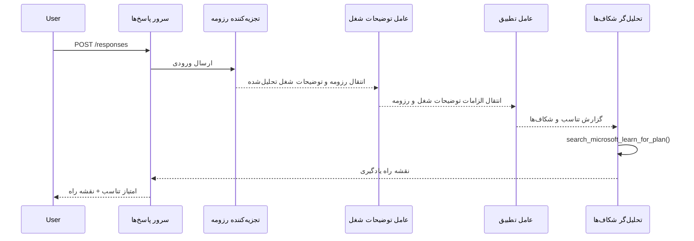

# ماژول ۳ - پیکربندی دستورات، محیط و نصب وابستگی‌ها

⏱️ ~۱۵ دقیقه

در این ماژول، چارچوب اولیه را به **جریان کاری چندعامله خودتان** تبدیل می‌کنید - با تنظیم متغیرهای محیطی، نوشتن دستورات عامل‌ها، افزودن ابزار MCP، اتصال نمودار جریان کاری و نصب وابستگی‌ها.

> **مرجع:** کد کامل در حال اجرا در [`PersonalCareerCopilot/main.py`](../../../../../workshop/lab02-multi-agent/PersonalCareerCopilot/main.py) موجود است. هنگام ساخت نمودار جریان کاری و بلوک‌های پرامپت خود از آن به عنوان مرجع استفاده کنید.

---

## چگونه چهار عامل کنار هم قرار می‌گیرند


```mermaid
sequenceDiagram
    participant User
    participant Server as سرور پاسخ‌ها
    participant RP as تجزیه‌کننده رزومه
    participant JD as عامل توضیحات شغل
    participant MA as عامل تطبیق
    participant GA as تحلیل‌گر شکاف‌ها

    User->>Server: POST /responses
    Server->>RP: ارسال ورودی
    RP-->>JD: انتقال رزومه و توضیحات شغل تحلیل‌شده
    JD-->>MA: انتقال الزامات توضیحات شغل و رزومه
    MA-->>GA: گزارش تناسب و شکاف‌ها
    GA->>GA: search_microsoft_learn_for_plan()
    GA-->>Server: نقشه راه یادگیری
    Server-->>User: امتیاز تناسب + نقشه راه
```

---

## گام ۱: پیکربندی متغیرهای محیطی

۱. فایل **`.env`** را در ریشه پروژه خود باز کنید (که توسط جادوگر چارچوب ایجاد شده است).
۲. جای‌گزین‌ها را با مقادیر واقعی خود از آزمایشگاه ۰۱ جایگزین کنید.

<details open>
<summary><strong>🅰️ مسیر A - اشتراک Foundry</strong></summary>

```env
FOUNDRY_PROJECT_ENDPOINT=https://<your-account>.services.ai.azure.com/api/projects/<your-project>
AZURE_AI_MODEL_DEPLOYMENT_NAME=gpt-4.1-mini
```

> **محل یافتن مقادیر:** به [آزمایشگاه ۰۱، ماژول ۱](../../lab01-single-agent/docs/01-setup.md#deploy-a-model--assign-rbac) مراجعه کنید.

</details>

<details open>
<summary><strong>🅱️ مسیر B - Foundry محلی</strong></summary>

```env
FOUNDRY_PROJECT_ENDPOINT=http://localhost:5273/v1
AZURE_AI_MODEL_DEPLOYMENT_NAME=phi-4-mini
```

> تمام استنتاج روی دستگاه شما انجام می‌شود - هیچ داده‌ای از دستگاه شما خارج نمی‌شود. دستور `foundry model list` را اجرا کنید تا نام مستعار دقیق مدل را تأیید کنید. تنها درخواست خروجی، فراخوانی ابزار MCP به `https://learn.microsoft.com/api/mcp` است.

> **محل یافتن مقادیر:** به [آزمایشگاه ۰۱، ماژول ۱ - مسیر محلی](../../lab01-single-agent/docs/01-setup.md#step-2-set-up-based-on-your-access) مراجعه کنید.

</details>

> **امنیت:** هرگز `.env` را در کنترل نسخه ارسال نکنید. این فایل باید قبلاً در `.gitignore` قرار داشته باشد.

---

## گام ۲: نوشتن دستورات عامل‌ها

دستورات نقش هر عامل، قالب خروجی و قوانین را تعریف می‌کنند. فایل `main.py` را باز کنید و چهار مقدار ثابت دستور را تعریف (یا جایگزین) کنید - رشته‌های کامل در [`PersonalCareerCopilot/main.py`](../../../../../workshop/lab02-multi-agent/PersonalCareerCopilot/main.py) موجود است.

### ۲.۱ `RESUME_PARSER_INSTRUCTIONS`
رزومه را به نمایه ساختاریافته کاندیدا تبدیل می‌کند **و** شرح شغل را به صورت عیناً در `[JOB DESCRIPTION PASS-THROUGH]` کپی می‌کند. هر دو بخش برچسب‌گذاری شده باید در خروجی ظاهر شوند.

> **چرا کپی می‌شود؟** با `context_mode="last_agent"`، ResumeParser تنها عاملی است که پیام اصلی کاربر را می‌بیند. اگر شرح شغل را به جلو کپی نکند، عامل‌های پایین‌دستی هرگز آن را نمی‌بینند.

### ۲.۲ `JOB_DESCRIPTION_INSTRUCTIONS`
خروجی‌های `[PARSED RESUME]` و `[JOB DESCRIPTION PASS-THROUGH]` را از ResumeParser می‌خواند. خروجی `[JD REQUIREMENTS]` (نیازمندی‌های ساختاریافته) و `[PARSED RESUME PASS-THROUGH]` (کپی عیناً رزومه برای MatchingAgent) را تولید می‌کند.

### ۲.۳ `MATCHING_AGENT_INSTRUCTIONS`
خروجی‌های `[JD REQUIREMENTS]` و `[PARSED RESUME PASS-THROUGH]` را می‌خواند. گزارش تطابق امتیازدهی شده (۰–۱۰۰) با ریاضیات تفکیک، مهارت‌های مطابقت داده شده، مهارت‌های از دست رفته، و هم‌ترازی تجربه تولید می‌کند.

### ۲.۴ `GAP_ANALYZER_INSTRUCTIONS`
گزارش تطابق را می‌خواند. برای **هر** مهارت از دست رفته، تابع `search_microsoft_learn_for_plan` را برای بازیابی منابع یادگیری مایکروسافت فراخوانی می‌کند. یک کارت شکاف تفصیلی برای هر مهارت و نقشه راه یادگیری هفته به هفته تولید می‌کند.

---

## گام ۳: افزودن ابزار MCP

GapAnalyzer با [سرور Microsoft Learn MCP](https://learn.microsoft.com/azure/foundry/agents/how-to/tools/model-context-protocol) تماس می‌گیرد تا منابع واقعی یادگیری برای هر شکاف مهارتی را دریافت کند. تابع کامل `search_microsoft_learn_for_plan` در [`PersonalCareerCopilot/main.py`](../../../../../workshop/lab02-multi-agent/PersonalCareerCopilot/main.py) است.

هنگام ایجاد عامل، ابزار را روی GapAnalyzer ثبت کنید:

```python
gap_analyzer = Agent(
    client=client,
    instructions=GAP_ANALYZER_INSTRUCTIONS,
    name="GapAnalyzer",
    tools=[search_microsoft_learn_for_plan],
)
```

> نمودار کامل `WorkflowBuilder` با `FoundryChatClient`، `AgentExecutor`، و همه فراخوانی‌های `add_edge()` را در [`PersonalCareerCopilot/main.py`](../../../../../workshop/lab02-multi-agent/PersonalCareerCopilot/main.py) ببینید.

---

## گام ۴: ایجاد محیط مجازی و نصب وابستگی‌ها

> ⚠️ **این مرحله را از دست ندهید.** بدون نصب وابستگی‌ها، دیباگ F5 به درستی کار نخواهد کرد.

### ۴.۱ ایجاد محیط مجازی

```powershell
python -m venv .venv
```

### ۴.۲ فعال‌سازی

| سیستم عامل | دستور |
|----|---------|
| **ویندوز (PowerShell)** | `.\.venv\Scripts\Activate.ps1` |
| **ویندوز (CMD)** | `.venv\Scripts\activate.bat` |
| **مک‌اواس / لینوکس** | `source .venv/bin/activate` |

باید `(.venv)` را در پرامپت ترمینال خود ببینید.

### ۴.۳ نصب وابستگی‌ها

```powershell
pip install -r requirements.txt
```

### ۴.۴ بررسی صحت نصب

```powershell
pip list | Select-String "agent-framework|mcp|debugpy"
```

انتظار می‌رود: `agent-framework-foundry`، `agent-framework-foundry-hosting`، `mcp` و `debugpy` فهرست شده باشند.

---

## گام ۵: بررسی احراز هویت

<details open>
<summary><strong>🅰️ مسیر A - اعتبار Azure</strong></summary>

```powershell
az account show --query "{name:name, id:id}" --output table
```

اگر این مرحله شکست خورد، دستور [`az login`](https://learn.microsoft.com/cli/azure/authenticate-azure-cli-interactively) را اجرا کنید.

هر چهار عامل یک `FoundryChatClient` و یک `DefaultAzureCredential` مشترک دارند. اگر احراز هویت برای یکی درست کار کند، برای همه کار می‌کند.

</details>

<details open>
<summary><strong>🅱️ مسیر B - Foundry محلی</strong></summary>

برای تست محلی نیازی به احراز هویت نیست.

</details>

---

### ✅ نقطه بررسی

> تا زمانی که: **(۱)** `(.venv)` در پرامپت دیده نشود و **(۲)** دستور `pip install -r requirements.txt` با موفقیت به پایان نرسیده است، به ماژول ۰۴ نروید.

- [ ] `.env` دارای نام نقطه پایان و استقرار مدل معتبر (نه جای‌گزین‌ها) باشد
- [ ] هر ۴ ثابت دستور عامل در `main.py` تعریف شده باشند (ResumeParser، JD Agent، MatchingAgent، GapAnalyzer)
- [ ] ابزار MCP `search_microsoft_learn_for_plan` تعریف و روی GapAnalyzer ثبت شده باشد
- [ ] اشیاء `FoundryChatClient` + ۴ `Agent` + ۴ `AgentExecutor` در `main()` ایجاد شده باشند
- [ ] `WorkflowBuilder` نمودار ترتیبی درست را با هر سه فراخوانی `add_edge()` می‌سازد
- [ ] محیط مجازی ایجاد و فعال شده باشد (نمایش `(.venv)` در پرامپت)
- [ ] دستور `pip install -r requirements.txt` بدون خطا کامل شده باشد
- [ ] **مسیر A:** دستور `az account show` موفق باشد یا آیکون حساب VS Code حساب وارد شده را نمایش دهد

---

**قبلی:** [۰۲ - چارچوب پروژه چندعامله](02-scaffold-multi-agent.md) · **بعدی:** [۰۴ - الگوهای هماهنگی →](04-orchestration-patterns.md)

---

<!-- CO-OP TRANSLATOR DISCLAIMER START -->
**سلب مسئولیت**:
این سند با استفاده از سرویس ترجمه هوش مصنوعی [Co-op Translator](https://github.com/Azure/co-op-translator) ترجمه شده است. در حالی که ما در تلاش برای دقت هستیم، لطفاً توجه داشته باشید که ترجمه‌های خودکار ممکن است شامل خطاها یا نادرستی‌هایی باشند. سند اصلی به زبان مادری خود باید به عنوان منبع معتبر در نظر گرفته شود. برای اطلاعات حیاتی، ترجمه حرفه‌ای انسانی توصیه می‌شود. ما در قبال هرگونه سوء تفاهم یا برداشت نادرست ناشی از استفاده از این ترجمه مسئولیتی نداریم.
<!-- CO-OP TRANSLATOR DISCLAIMER END -->