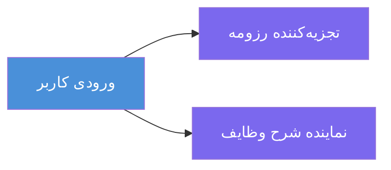
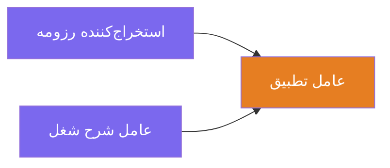
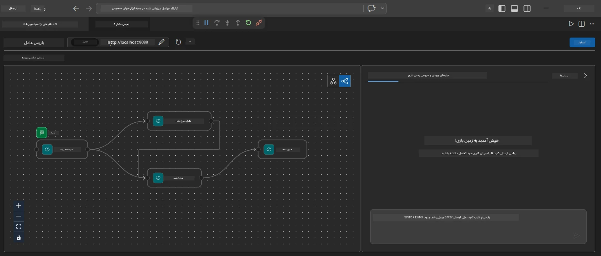
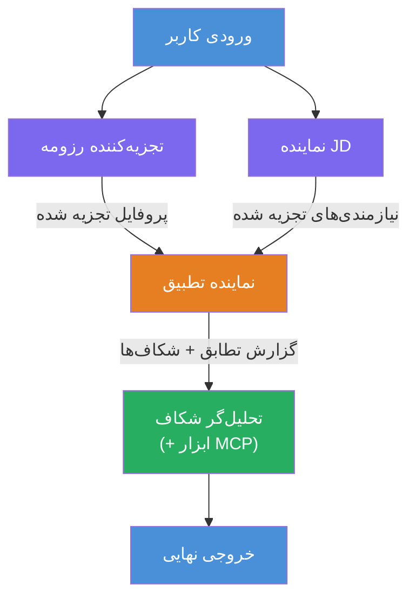
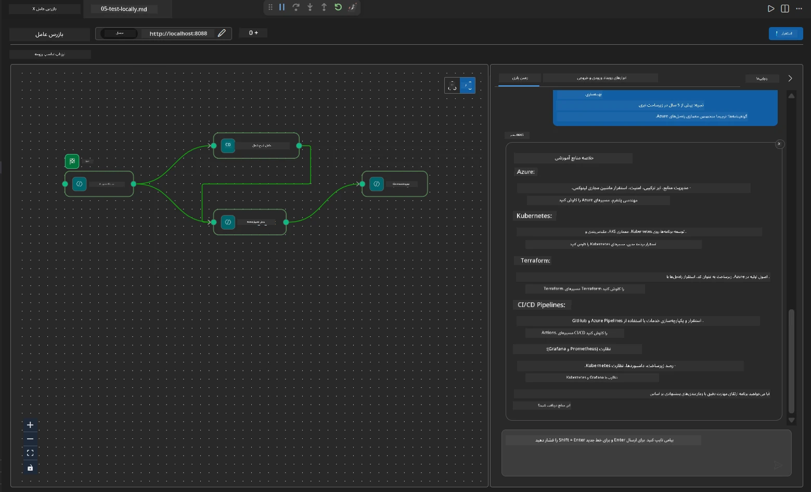

# ماژول ۴ - الگوهای ارکستراسیون

در این ماژول، الگوهای ارکستراسیونی که در ارزیاب تناسب شغل رزومه استفاده شده‌اند را بررسی می‌کنید و یاد می‌گیرید چگونه نمودار جریان کاری را بخوانید، اصلاح کنید و گسترش دهید. درک این الگوها برای رفع اشکال مشکلات جریان داده و ساخت جریان‌های کاری چندعواملی خودتان ضروری است.

---

## الگو ۱: انشعاب (تقسیم موازی)

اولین الگو در جریان کاری **انشعاب** است - یک ورودی واحد به چند عامل به طور همزمان ارسال می‌شود.


در کد، این اتفاق رخ می‌دهد چون `resume_parser` اجراکننده شروع (`start_executor`) است - اولین دریافت کننده پیام کاربر است. سپس، چون هر دو عامل `jd_agent` و `matching_agent` لبه‌هایی از `resume_parser` دارند، چارچوب خروجی `resume_parser` را به هر دو عامل مسیریابی می‌کند:

```python
.add_edge(resume_parser, jd_agent)         # خروجی ResumeParser → عامل JD
.add_edge(resume_parser, matching_agent)   # خروجی ResumeParser → MatchingAgent
```

**چرا این کار می‌کند:** ResumeParser و JD Agent جنبه‌های متفاوتی از همان ورودی را پردازش می‌کنند. اجرای آنها به صورت موازی باعث کاهش تأخیر کلی نسبت به اجرای پی‌درپی آنها می‌شود.

### کی از انشعاب استفاده کنیم

| مورد استفاده | مثال |
|----------|---------|
| زیرکارهای مستقل | تجزیه رزومه در مقابل تجزیه JD |
| افزونگی / رأی‌گیری | دو عامل همان داده را تحلیل می‌کنند، عامل سوم بهترین پاسخ را انتخاب می‌کند |
| خروجی چندفرمت | یک عامل متن تولید می‌کند، عامل دیگر JSON ساختاری تولید می‌کند |

---

## الگو ۲: تجمیع (همگرایی)

الگوی دوم **تجمیع** است - خروجی‌های چند عامل جمع‌آوری شده و به یک عامل پایین‌دست ارسال می‌شود.


در کد:

```python
.add_edge(resume_parser, matching_agent)   # خروجی ResumeParser → MatchingAgent
.add_edge(jd_agent, matching_agent)        # خروجی JD Agent → MatchingAgent
```

**رفتار کلیدی:** وقتی یک عامل **دو یا چند لبه ورودی** دارد، چارچوب به طور خودکار منتظر **تمام** عوامل بالادستی می‌ماند تا تکمیل شوند قبل از اجرای عامل پایین‌دست. MatchingAgent تا زمانی که ResumeParser و JD Agent هردو تمام نکرده‌اند، شروع نمی‌شود.

### آنچه MatchingAgent دریافت می‌کند

چارچوب خروجی‌های همه عوامل بالادستی را به هم پیوسته می‌کند. ورودی MatchingAgent شبیه است به:

```
[ResumeParser output]
---
Candidate Profile:
  Name: Jane Doe
  Technical Skills: Python, Azure, Kubernetes, ...
  ...

[JobDescriptionAgent output]
---
Role Overview: Senior Cloud Engineer
Required Skills: Python, Azure, Terraform, ...
...
```

> **توجه:** فرمت دقیق الحاق به نسخه چارچوب بستگی دارد. دستورالعمل‌های عامل باید به گونه‌ای نوشته شوند که هم خروجی ساختاریافته و هم خروجی بدون ساختار را مدیریت کنند.



---

## الگو ۳: زنجیره پی‌درپی

الگوی سوم **زنجیره پی‌درپی** است - خروجی یک عامل مستقیماً به عامل بعدی وارد می‌شود.


در کد:

```python
.add_edge(matching_agent, gap_analyzer)    # خروجی MatchingAgent → GapAnalyzer
```

این ساده‌ترین الگو است. GapAnalyzer نمره تناسب، مهارت‌های منطبق/مفقود و شکاف‌ها را از MatchingAgent دریافت می‌کند. سپس برای هر شکاف از ابزار [MCP](https://learn.microsoft.com/azure/foundry/agents/how-to/tools/model-context-protocol) استفاده می‌کند تا منابع یادگیری مایکروسافت را بازیابی کند.

---

## نمودار کامل

ترکیب هر سه الگو نمودار کامل جریان کاری را ایجاد می‌کند:


### جدول زمانی اجرا

```mermaid
gantt
    title جدول زمانی اجرای نماینده
    dateFormat X
    axisFormat %s

    section موازی
    Resume Parser       :rp, 0, 3
    JD Agent            :jd, 0, 2

    section متوالی
    Matching Agent      :ma, 3, 5
    Gap Analyzer        :ga, 5, 9
```


> زمان کلی اجرا تقریباً برابر است با `max(ResumeParser, JD Agent) + MatchingAgent + GapAnalyzer`. GapAnalyzer معمولاً کندترین است چون چندین فراخوانی ابزار MCP انجام می‌دهد (یکی برای هر شکاف).

---

## خواندن کد WorkflowBuilder

در اینجا تابع کامل `create_workflow()` از `main.py` با حاشیه‌نویسی آمده است:

```python
def create_workflow(resume_parser, jd_agent, matching_agent, gap_analyzer):
    workflow = (
        WorkflowBuilder(
            name="ResumeJobFitEvaluator",

            # اولین عامل برای دریافت ورودی کاربر
            start_executor=resume_parser,

            # عامل(های) که خروجی آن‌ها تبدیل به پاسخ نهایی می‌شود
            output_executors=[gap_analyzer],
        )
        # توزیع خروجی: خروجی ResumeParser به هر دو JD Agent و MatchingAgent می‌رود
        .add_edge(resume_parser, jd_agent)
        .add_edge(resume_parser, matching_agent)

        # تجمع ورودی: MatchingAgent منتظر هر دو ResumeParser و JD Agent می‌ماند
        .add_edge(jd_agent, matching_agent)

        # ترتیبی: خروجی MatchingAgent به GapAnalyzer داده می‌شود
        .add_edge(matching_agent, gap_analyzer)

        .build()
    )
    return workflow.as_agent()
```

### جدول خلاصه لبه‌ها

| شماره | لبه | الگو | تأثیر |
|---|------|---------|--------|
| ۱ | `resume_parser → jd_agent` | انشعاب | JD Agent خروجی ResumeParser (و ورودی اصلی کاربر) را دریافت می‌کند |
| ۲ | `resume_parser → matching_agent` | انشعاب | MatchingAgent خروجی ResumeParser را دریافت می‌کند |
| ۳ | `jd_agent → matching_agent` | تجمیع | MatchingAgent خروجی JD Agent را نیز دریافت می‌کند (منتظر هر دو می‌ماند) |
| ۴ | `matching_agent → gap_analyzer` | پی‌درپی | GapAnalyzer گزارش تناسب + فهرست شکاف‌ها را دریافت می‌کند |

---

## اصلاح نمودار

### افزودن عامل جدید

برای افزودن عامل پنجم (مثلاً **InterviewPrepAgent** که سوالات مصاحبه بر اساس تحلیل شکاف‌ها تولید می‌کند):

```python
# 1. تعریف دستورات
INTERVIEW_PREP_INSTRUCTIONS = """\
You are the Interview Prep Agent.
Given a gap analysis and fit report, generate 10 targeted interview questions
the candidate should prepare for.
"""

# 2. ایجاد عامل (در داخل بلوک async with)
AzureAIAgentClient(
    project_endpoint=PROJECT_ENDPOINT,
    model_deployment_name=MODEL_DEPLOYMENT_NAME,
    credential=credential,
).as_agent(
    name="InterviewPrepAgent",
    instructions=INTERVIEW_PREP_INSTRUCTIONS,
) as interview_prep,

# 3. افزودن لبه‌ها در create_workflow()
.add_edge(matching_agent, interview_prep)   # گزارش تناسب را دریافت می‌کند
.add_edge(gap_analyzer, interview_prep)     # همچنین کارت‌های شکاف را دریافت می‌کند

# 4. به‌روزرسانی output_executors
output_executors=[interview_prep],  # اکنون عامل نهایی
```

### تغییر ترتیب اجرا

برای اینکه JD Agent **بعد از** ResumeParser اجرا شود (پی‌درپی به جای موازی):

```python
# حذف کنید: .add_edge(resume_parser, jd_agent)  ← قبلاً وجود دارد، نگه دارید
# حذف موازی ضمنی با این که jd_agent به طور مستقیم ورودی کاربر را دریافت نکند
# start_executor ابتدا به resume_parser می‌فرستد و jd_agent فقط دریافت می‌کند
# خروجی resume_parser از طریق لبه. این آنها را دنباله‌دار می‌کند.
```

> **مهم:** `start_executor` تنها عاملی است که ورودی خام کاربر را دریافت می‌کند. همه عوامل دیگر خروجی از لبه‌های بالادستی خود را دریافت می‌کنند. اگر می‌خواهید عاملی نیز ورودی خام کاربر را دریافت کند، باید لبه‌ای از `start_executor` داشته باشد.

---

## اشتباهات رایج نمودار

| اشتباه | نشانه | رفع |
|---------|---------|-----|
| لبه مفقود به `output_executors` | عامل اجرا می‌شود اما خروجی خالی است | اطمینان حاصل کنید مسیر از `start_executor` به هر عاملی در `output_executors` وجود دارد |
| وابستگی چرخشی | حلقه بی‌پایان یا تایم‌اوت | بررسی کنید هیچ عاملی به عامل بالادستی خود داده بازنمی‌گرداند |
| عاملی در `output_executors` بدون لبه ورودی | خروجی خالی | حداقل یک `add_edge(source, that_agent)` اضافه کنید |
| چند `output_executors` بدون تجمیع | خروجی فقط پاسخ یکی از عوامل است | از یک عامل خروجی واحد که جمع‌آوری می‌کند استفاده کنید، یا چند خروجی را قبول کنید |
| عدم وجود `start_executor` | خطای `ValueError` هنگام ساخت | همیشه `start_executor` را در `WorkflowBuilder()` مشخص کنید |

---

## اشکال‌زدایی نمودار

### استفاده از Agent Inspector

۱. عامل را به صورت محلی اجرا کنید (F5 یا ترمینال - نگاه کنید به [ماژول ۵](05-test-locally.md)).
۲. Agent Inspector را باز کنید (`Ctrl+Shift+P` → **Foundry Toolkit: Open Agent Inspector**).
۳. یک پیام تست ارسال کنید.
۴. در پنل پاسخ Inspector، دنبال **خروجی استریم‌شونده** بگردید - این خروجی سهم هر عامل را به ترتیب نشان می‌دهد.



### استفاده از لاگ‌ها

لوگ‌ها را به `main.py` اضافه کنید تا جریان داده را ردیابی کنید:

```python
import logging
logger = logging.getLogger("resume-job-fit")

# در create_workflow()، پس از ساخت:
logger.info("Workflow graph built with edges: RP→JD, RP→MA, JD→MA, MA→GA")
```

سرور اجرای عوامل و فراخوانی‌های ابزار MCP را نمایش می‌دهد:

```
INFO:resume-job-fit:Starting Resume -> Job Fit Evaluator HTTP server...
INFO:resume-job-fit:Server running on http://localhost:8088
INFO:agent_framework:Executing agent: ResumeParser
INFO:agent_framework:Executing agent: JobDescriptionAgent
INFO:agent_framework:Waiting for upstream agents: ResumeParser, JobDescriptionAgent
INFO:agent_framework:Executing agent: MatchingAgent
INFO:agent_framework:Executing agent: GapAnalyzer
INFO:agent_framework:Tool call: search_microsoft_learn_for_plan(skill="Kubernetes")
POST https://learn.microsoft.com/api/mcp → 200
INFO:agent_framework:Tool call: search_microsoft_learn_for_plan(skill="Terraform")
POST https://learn.microsoft.com/api/mcp → 200
```

---

### بررسی نهایی

- [ ] می‌توانید سه الگوی ارکستراسیون در جریان کاری را شناسایی کنید: انشعاب، تجمیع، و زنجیره پی‌درپی
- [ ] می‌دانید که عوامل با چند لبه ورودی منتظر تمام عوامل بالادستی می‌مانند
- [ ] می‌توانید کد `WorkflowBuilder` را خوانده و هر فراخوانی `add_edge()` را به نمودار بصری نگاشت کنید
- [ ] جدول زمانی اجرا را می‌فهمید: عوامل موازی ابتدا اجرا می‌شوند، سپس تجمیع، سپس پی‌درپی
- [ ] می‌دانید چگونه عامل جدیدی به نمودار اضافه کنید (تعریف دستورالعمل‌ها، ایجاد عامل، افزودن لبه‌ها، به‌روزرسانی خروجی)
- [ ] اشتباهات رایج نمودار و نشانه‌های آنها را تشخیص می‌دهید

---

**قبلی:** [03 - تنظیم عوامل و محیط](03-configure-agents.md) · **بعدی:** [05 - تست به صورت محلی →](05-test-locally.md)

---

<!-- CO-OP TRANSLATOR DISCLAIMER START -->
**سلب مسئولیت**:  
این سند با استفاده از سرویس ترجمه هوش مصنوعی [Co-op Translator](https://github.com/Azure/co-op-translator) ترجمه شده است. در حالی که ما برای دقت تلاش می‌کنیم، لطفاً توجه داشته باشید که ترجمه‌های خودکار ممکن است شامل خطاها یا نادرستی‌هایی باشند. سند اصلی به زبان بومی خود باید به عنوان منبع معتبر در نظر گرفته شود. برای اطلاعات حیاتی، استفاده از ترجمه حرفه‌ای انسانی توصیه می‌شود. ما مسئول هیچ‌گونه سوءتفاهم یا تفسیر نادرستی ناشی از استفاده از این ترجمه نیستیم.
<!-- CO-OP TRANSLATOR DISCLAIMER END -->