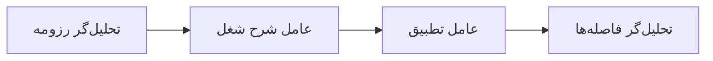
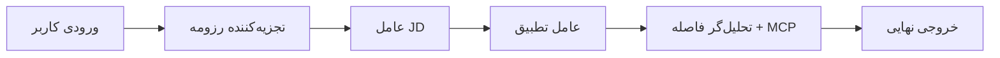

# ماژول ۴ - الگوهای هماهنگی

⏱️ حدود ۱۰ دقیقه

در این ماژول، الگوهای هماهنگی استفاده‌شده در Resume Job Fit Evaluator را بررسی می‌کنید و یاد می‌گیرید چگونه نمودار جریان کاری را بخوانید، اصلاح کنید و توسعه دهید. درک این الگوها برای اشکال‌زدایی مشکلات جریان داده و ساختن [جریان‌های کاری چندعاملی](https://learn.microsoft.com/agent-framework/workflows/) خودتان ضروری است.

---

## الگو ۱: زنجیره متوالی

الگوی اساسی در جریان کاری یک **زنجیره متوالی** است - خروجی هر عامل مستقیماً به ورودی عامل بعدی می‌رود.


```mermaid
flowchart LR
    RP[تحلیل‌گر رزومه] --> JD[عامل شرح شغل]
    JD --> MA[عامل تطبیق]
    MA --> GA[تحلیل‌گر فاصله‌ها]
```

در کد، هر فراخوانی `add_edge()` یک مرحله در زنجیره ایجاد می‌کند:

```python
.add_edge(resume_executor, jd_executor)       # خروجی ResumeParser → JD Agent
.add_edge(jd_executor, matching_executor)     # خروجی JD Agent → MatchingAgent
.add_edge(matching_executor, gap_executor)    # خروجی MatchingAgent → GapAnalyzer
```

> **چرا متوالی، نه fan-out/fan-in؟** `WorkflowBuilder` از **معنای OR** برای لبه‌های ورودی استفاده می‌کند: یک اجراکننده پایین‌دستی به محض اتمام هر یک از پیش‌نیازهایش فعال می‌شود. اگر `matching_executor` دو لبه ورودی داشت (از سمت `resume_executor` و `jd_executor`)، دوبار فعال می‌شد - یک‌بار پس از پایان ResumeParser و بار دیگر پس از پایان JD Agent - که باعث می‌شد GapAnalyzer هم دوبار اجرا شود و خروجی دو بار ظاهر شود. این خط لوله متوالی به‌طور کامل از این مشکل جلوگیری می‌کند.

## الگو ۲: انتقال محتوا

چون `context_mode="last_agent"` به این معنی است که هر اجراکننده فقط خروجی **مستقیم پیش‌نیاز خود** را می‌بیند، عوامل داخل یک زنجیره متوالی باید به‌صراحت هر داده‌ای را که عوامل پایین‌دستی نیاز دارند به جلو منتقل کنند.

در این جریان کاری:
- **ResumeParser** متن کامل JD را بدون تغییر در `[PASS-THROUGH DESCRIPTION JOB]` کپی می‌کند (تا JD Agent بتواند آن را پیدا کند).
- **JD Agent** پرونده رزومه تجزیه‌شده را به‌صورت دقیق در `[PARSED RESUME PASS-THROUGH]` کپی می‌کند (تا MatchingAgent بتواند هر دو پروفایل را مقایسه کند).

```
ResumeParser output
└─ [PARSED RESUME]               ← extracted by JD Agent
└─ [JOB DESCRIPTION PASS-THROUGH] ← extracted by JD Agent

JD Agent output
└─ [JD REQUIREMENTS]             ← extracted by MatchingAgent
└─ [PARSED RESUME PASS-THROUGH]  ← extracted by MatchingAgent
```

هر بخش انتقال باید **دقیقا** کپی شود - خلاصه کردن یا بازگویی آن موجب خراب شدن عامل پایین‌دستی که به آن نیاز دارد، می‌شود.

---

## نمودار کامل

ترکیب الگوهای زنجیره متوالی و انتقال محتوا، جریان کاری کامل را ایجاد می‌کند:


```mermaid
flowchart LR
    U[ورودی کاربر] --> RP[تجزیه‌کننده رزومه]
    RP --> JD[عامل JD]
    JD --> MA[عامل تطبیق]
    MA --> GA[تحلیل‌گر فاصله + MCP]
    GA --> O[خروجی نهایی]
```

بازرس عامل همین ساختار گراف را هنگام اجرای محلی عامل نمایش می‌دهد. برای تصاویر به [ماژول ۵ - تست محلی](05-test-locally.md) مراجعه کنید.

---

## خواندن کد WorkflowBuilder

تابع کامل `create_workflow()` در [`PersonalCareerCopilot/main.py`](../../../../../workshop/lab02-multi-agent/PersonalCareerCopilot/main.py) قرار دارد. سه فراخوانی `add_edge()` خط لوله متوالی را می‌سازند:

| # | لبه | تأثیر |
|---|------|--------|
| ۱ | `resume_executor → jd_executor` | JD Agent `[PARSED RESUME]` + `[JOB DESCRIPTION PASS-THROUGH]` را دریافت می‌کند |
| ۲ | `jd_executor → matching_executor` | MatchingAgent `[JD REQUIREMENTS]` + `[PARSED RESUME PASS-THROUGH]` را دریافت می‌کند |
| ۳ | `matching_executor → gap_executor` | GapAnalyzer گزارش تناسب + فهرست فاصله‌ها را دریافت می‌کند |

---

## اصلاح نمودار

### افزودن عامل جدید

برای افزودن عامل پنجم (مثلاً یک **InterviewPrepAgent** پس از GapAnalyzer):

۱. یک مقدار ثابت `INTERVIEW_PREP_INSTRUCTIONS` تعریف کنید.
۲. اشیاء `Agent` و `AgentExecutor` را بسازید (با همان الگوی چهار عامل موجود).
۳. در `WorkflowBuilder` از `.add_edge(gap_executor, interview_exec)` استفاده کنید.
۴. `output_executors=[interview_exec]` را بروزرسانی کنید.

> **مهم:** `start_executor` تنها عاملی است که ورودی خام کاربر را دریافت می‌کند. سایر عوامل خروجی از لبه بالادستی خود را دریافت می‌کنند.

---

## اشتباهات رایج گراف

| اشتباه | نشانه | رفع |
|---------|---------|-----|
| فقدان لبه به `output_executors` | عامل اجرا می‌شود اما خروجی خالی است | اطمینان حاصل کنید مسیری از `start_executor` به هر عاملی در `output_executors` وجود دارد |
| وابستگی دایره‌ای | حلقه بی‌نهایت یا تایم‌اوت | بررسی کنید که هیچ عاملی به عامل بالادست خود داده بازنویسی نکند |
| عاملی در `output_executors` بدون لبه ورودی | خروجی خالی | حداقل یک `add_edge(source, that_agent)` اضافه کنید |
| چندین `output_executors` بدون fan-in | خروجی فقط پاسخ یک عامل را دارد | از یک عامل خروجی استفاده کنید که جمع‌بندی کند، یا چند خروجی را بپذیرید |
| فقدان `start_executor` | خطای `ValueError` در زمان ساخت | همیشه `start_executor` را در `WorkflowBuilder()` مشخص کنید |

---

## اشکال‌زدایی نمودار

### استفاده از Agent Inspector

۱. عامل را به صورت محلی با F5 اجرا کنید.
۲. Agent Inspector را باز کنید (`Ctrl+Shift+P` → **Foundry Toolkit: Open Agent Inspector**).
۳. یک پیام آزمایشی ارسال کنید.
۴. در پنل پاسخ Inspector، برای **خروجی جریانی** نگاه کنید - که مشارکت هر عامل را به ترتیب نشان می‌دهد.


### استفاده از ثبت لاگ

برای ردیابی جریان داده به `main.py` ثبت لاگ اضافه کنید:

```python
import logging
logger = logging.getLogger("resume-job-fit")

# در main()، پس از ساختن جریان کاری:
logger.info("Workflow graph built with edges: RP→JD, JD→MA, MA→GA")
```

لاگ‌های سرور ترتیب اجرای عامل و فراخوانی‌های ابزار MCP را نشان می‌دهد:

```
INFO:agent_framework:Executing agent: ResumeParser
INFO:agent_framework:Executing agent: JobDescriptionAgent
INFO:agent_framework:Executing agent: MatchingAgent
INFO:agent_framework:Executing agent: GapAnalyzer
INFO:agent_framework:Tool call: search_microsoft_learn_for_plan(skill="Kubernetes")
POST https://learn.microsoft.com/api/mcp → 200
INFO:agent_framework:Tool call: search_microsoft_learn_for_plan(skill="Terraform")
POST https://learn.microsoft.com/api/mcp → 200
```

---

### نقطه بررسی

- [ ] شما می‌توانید دو الگوی هماهنگی در جریان کاری را شناسایی کنید: زنجیره متوالی و انتقال محتوا
- [ ] شما درک می‌کنید چرا `context_mode="last_agent"` نیازمند انتقال صریح داده بین عوامل است
- [ ] شما می‌توانید کد `WorkflowBuilder` را بخوانید و هر فراخوانی `add_edge()` را به نمودار تصویری نگاشت کنید
- [ ] شما می‌دانید چگونه یک عامل جدید را به انتهای خط لوله اضافه کنید
- [ ] شما می‌توانید اشتباهات رایج گراف و نشانه‌های آن را شناسایی کنید

---

**قبلی:** [03 - پیکربندی عوامل و محیط](03-configure-agents.md) · **بعدی:** [05 - تست محلی →](05-test-locally.md)

---

<!-- CO-OP TRANSLATOR DISCLAIMER START -->
**سلب مسئولیت**:
این سند با استفاده از سرویس ترجمه هوش مصنوعی [Co-op Translator](https://github.com/Azure/co-op-translator) ترجمه شده است. در حالی که ما در تلاش برای دقت هستیم، لطفاً توجه داشته باشید که ترجمه‌های خودکار ممکن است شامل خطاها یا نادرستی‌هایی باشند. سند اصلی به زبان مادری خود باید به عنوان منبع معتبر در نظر گرفته شود. برای اطلاعات حیاتی، ترجمه حرفه‌ای انسانی توصیه می‌شود. ما در قبال هرگونه سوء تفاهم یا برداشت نادرست ناشی از استفاده از این ترجمه مسئولیتی نداریم.
<!-- CO-OP TRANSLATOR DISCLAIMER END -->