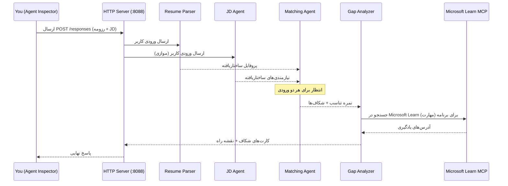
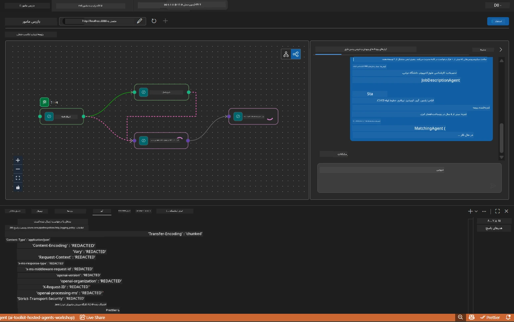

# ماژول ۵ - تست محلی (چندعاملی)

در این ماژول، گردش کار چندعاملی را به صورت محلی اجرا می‌کنید، آن را با Agent Inspector آزمایش می‌کنید و اطمینان حاصل می‌کنید که هر چهار عامل و ابزار MCP به درستی کار می‌کنند قبل از اینکه آن را در Foundry مستقر کنید.

### در هنگام اجرای تست محلی چه اتفاقی می‌افتد


---

## مرحله ۱: راه‌اندازی سرور عامل

### گزینه الف: استفاده از تسک VS Code (توصیه شده)

۱. کلیدهای `Ctrl+Shift+P` را فشار دهید → تایپ کنید **Tasks: Run Task** → گزینه **Run Lab02 HTTP Server** را انتخاب کنید.
۲. تسک سرور را با debugpy متصل شده روی پورت `5679` و عامل روی پورت `8088` راه‌اندازی می‌کند.
۳. منتظر بمانید تا خروجی نشان دهد:

```
INFO:resume-job-fit:Starting Resume -> Job Fit Evaluator HTTP server...
INFO:resume-job-fit:Server running on http://localhost:8088
```

### گزینه ب: استفاده دستی از ترمینال

```powershell
cd workshop\lab02-multi-agent\PersonalCareerCopilot
```

فعال‌سازی محیط مجازی:

**PowerShell (ویندوز):**
```powershell
.\.venv\Scripts\Activate.ps1
```

**macOS/Linux:**
```bash
source .venv/bin/activate
```

سرور را راه‌اندازی کنید:

```powershell
python -m debugpy --listen 127.0.0.1:5679 -m agentdev run main.py --verbose --port 8088
```

### گزینه ج: استفاده از F5 (حالت اشکال‌زدایی)

۱. کلید `F5` را فشار دهید یا به **Run and Debug** (`Ctrl+Shift+D`) بروید.
۲. پیکربندی راه‌اندازی **Lab02 - Multi-Agent** را از منوی کشویی انتخاب کنید.
۳. سرور با پشتیبانی کامل از نقاط شکست شروع به کار می‌کند.

> **نکته:** حالت اشکال‌زدایی به شما اجازه می‌دهد نقاط شکست را داخل `search_microsoft_learn_for_plan()` تنظیم کنید تا پاسخ‌های MCP را بررسی کنید، یا داخل رشته‌های دستور عامل را ببینید تا بدانید هر عامل چه چیزی دریافت می‌کند.

---

## مرحله ۲: باز کردن Agent Inspector

۱. کلیدهای `Ctrl+Shift+P` را فشار دهید → تایپ کنید **Foundry Toolkit: Open Agent Inspector**.
۲. Agent Inspector در یک تب مرورگر در نشانی `http://localhost:5679` باز می‌شود.
۳. باید رابط عامل را آماده دریافت پیام‌ها ببینید.

> **اگر Agent Inspector باز نشد:** مطمئن شوید سرور کاملا راه‌اندازی شده است (پیغام "Server running" را ببینید). اگر پورت ۵۶۷۹ مشغول بود، به [ماژول ۸ - عیب‌یابی](08-troubleshooting.md) مراجعه کنید.

---

## مرحله ۳: اجرای تست‌های مقدماتی

این سه تست را به ترتیب اجرا کنید. هر کدام به تدریج بخش‌های بیشتری از گردش کار را آزمایش می‌کنند.

### تست ۱: رزومه ساده + شرح شغل

متن زیر را در Agent Inspector جای‌گذاری کنید:

```
Resume:
Jane Doe
Senior Software Engineer with 5 years of experience in Python, Django, and AWS.
Built microservices handling 10K+ requests/second. Led a team of 4 developers.
Certifications: AWS Solutions Architect Associate.
Education: B.S. Computer Science, State University.

Job Description:
Senior Cloud Engineer at Contoso Ltd.
Required: Python, Azure, Kubernetes, Terraform, CI/CD pipelines.
Preferred: Go, monitoring (Prometheus/Grafana), cost optimization.
Experience: 5+ years in cloud infrastructure.
Certifications: Azure Solutions Architect Expert preferred.
```

**ساختار خروجی مورد انتظار:**

پاسخ باید شامل خروجی هر چهار عامل به ترتیب زیر باشد:

۱. **خروجی Resume Parser** - نمایه نامزد ساختاریافته با مهارت‌ها گروه‌بندی شده بر اساس دسته‌بندی  
۲. **خروجی JD Agent** - نیازمندی‌های ساختاریافته با تفکیک مهارت‌های اجباری و ترجیحی  
۳. **خروجی Matching Agent** - نمره تناسب (۰-۱۰۰) با تفکیک، مهارت‌های تطبیق یافته، مهارت‌های گمشده، و شکاف‌ها  
۴. **خروجی Gap Analyzer** - کارت‌های شکاف جداگانه برای هر مهارت گمشده، هرکدام با نشانی‌های Microsoft Learn



### مواردی که در تست ۱ باید بررسی کنید

| بررسی | مورد انتظار | موفق؟ |
|-------|-------------|--------|
| پاسخ شامل نمره تناسب است | عددی بین ۰ تا ۱۰۰ با تفکیک | |
| مهارت‌های تطبیق یافته فهرست شده‌اند | Python، CI/CD (جزئی)، و غیره | |
| مهارت‌های گمشده فهرست شده‌اند | Azure، Kubernetes، Terraform، و غیره | |
| کارت‌های شکاف برای هر مهارت گمشده وجود دارد | یک کارت برای هر مهارت | |
| نشانی‌های Microsoft Learn در دسترس هستند | پیوندهای واقعی `learn.microsoft.com` | |
| هیچ پیغام خطایی در پاسخ نیست | خروجی تمیز و ساختاریافته | |

### تست ۲: بررسی اجرای ابزار MCP

در حین اجرای تست ۱، در **ترمینال سرور** به دنبال ورودی‌های لاگ MCP باشید:

```
GET https://learn.microsoft.com/api/mcp → 405 (Method Not Allowed)
POST https://learn.microsoft.com/api/mcp → 200
DELETE https://learn.microsoft.com/api/mcp → 405 (Method Not Allowed)
```

| ورودی لاگ | معنا | مورد انتظار؟ |
|-----------|-------|--------------|
| `GET ... → 405` | درخواست‌های آزمایشی GET توسط کلاینت MCP در زمان راه‌اندازی | بله - عادی |
| `POST ... → 200` | فراخوانی واقعی ابزار به سرور MCP مایکروسافت | بله - این فراخوانی واقعی است |
| `DELETE ... → 405` | درخواست‌های آزمایشی DELETE توسط کلاینت MCP در زمان پاکسازی | بله - عادی |
| `POST ... → 4xx/5xx` | فراخوانی ابزار ناموفق بود | خیر - به [عیب‌یابی](08-troubleshooting.md) مراجعه کنید |

> **نکته کلیدی:** خطوط `GET 405` و `DELETE 405` رفتار **انتظار شده** هستند. فقط اگر کدهای وضعیت `POST` غیر ۲۰۰ بودند، نگران باشید.

### تست ۳: حالت لبه - نامزد با تناسب بالا

رزومه‌ای جای‌گذاری کنید که به طور نزدیکی با شرح شغل مطابقت دارد تا بررسی کنید GapAnalyzer چگونه سناریوهای تناسب بالا را مدیریت می‌کند:

```
Resume:
Alex Chen
Senior Cloud Engineer with 7 years of experience.
Skills: Python, Azure (AKS, Functions, DevOps), Kubernetes, Terraform, CI/CD (GitHub Actions, Azure Pipelines), Go, Prometheus, Grafana, cost optimization.
Certifications: Azure Solutions Architect Expert, Azure DevOps Engineer Expert.
Led infrastructure migration to Azure for 3 enterprise clients.
Education: M.S. Computer Science, Tech University.

Job Description:
Senior Cloud Engineer at Contoso Ltd.
Required: Python, Azure, Kubernetes, Terraform, CI/CD pipelines.
Preferred: Go, monitoring (Prometheus/Grafana), cost optimization.
Experience: 5+ years in cloud infrastructure.
Certifications: Azure Solutions Architect Expert preferred.
```

**رفتار مورد انتظار:**  
- نمره تناسب باید **۸۰+** باشد (اکثر مهارت‌ها مطابقت دارند)  
- کارت‌های شکاف باید روی آماده‌سازی مصاحبه/اصلاح تمرکز کنند نه یادگیری بنیادی  
- دستورالعمل‌های GapAnalyzer می‌گویند: "اگر تناسب ≥ ۸۰، روی آماده‌سازی مصاحبه/اصلاح تمرکز کن"

---

## مرحله ۴: بررسی کامل بودن خروجی

پس از اجرای تست‌ها، مطمئن شوید خروجی معیارهای زیر را دارد:

### فهرست بررسی ساختار خروجی

| بخش | عامل | حاضر است؟ |
|-------|-------|-----------|
| نمایه نامزد | Resume Parser | |
| مهارت‌های فنی (گروه‌بندی شده) | Resume Parser | |
| مرور کلی نقش | JD Agent | |
| مهارت‌های اجباری در مقابل ترجیحی | JD Agent | |
| نمره تناسب با تفکیک | Matching Agent | |
| مهارت‌های تطبیق یافته / گمشده / جزئی | Matching Agent | |
| کارت شکاف برای هر مهارت گمشده | Gap Analyzer | |
| نشانی‌های Microsoft Learn در کارت‌های شکاف | Gap Analyzer (MCP) | |
| ترتیب یادگیری (شماره‌گذاری شده) | Gap Analyzer | |
| خلاصه جدول زمانی | Gap Analyzer | |

### مشکلات رایج در این مرحله

| مشکل | علت | راه حل |
|-------|--------|---------|
| فقط ۱ کارت شکاف (بقیه بریده شده) | دستورالعمل‌های GapAnalyzer فاقد بخش CRITICAL است | پاراگراف `CRITICAL:` را به `GAP_ANALYZER_INSTRUCTIONS` اضافه کنید - به [ماژول ۳](03-configure-agents.md) مراجعه کنید |
| نشانی‌های Microsoft Learn وجود ندارد | نقطه پایانی MCP در دسترس نیست | اتصال اینترنت را بررسی کنید. مطمئن شوید `MICROSOFT_LEARN_MCP_ENDPOINT` در `.env` برابر `https://learn.microsoft.com/api/mcp` است |
| پاسخ خالی | `PROJECT_ENDPOINT` یا `MODEL_DEPLOYMENT_NAME` تنظیم نشده‌اند | مقادیر فایل `.env` را بررسی کنید. دستور `echo $env:PROJECT_ENDPOINT` را در ترمینال اجرا کنید |
| نمره تناسب صفر یا مفقود است | MatchingAgent داده‌های ورودی دریافت نکرده است | بررسی کنید که `add_edge(resume_parser, matching_agent)` و `add_edge(jd_agent, matching_agent)` در `create_workflow()` وجود دارند |
| عامل شروع می‌شود اما بلافاصله خارج می‌شود | خطای واردکردن یا وابستگی گمشده | دوباره `pip install -r requirements.txt` را اجرا کنید. ترمینال را برای خطاها بررسی کنید |
| خطای `validate_configuration` | متغیرهای محیطی مفقودند | فایل `.env` را با مقادیر `PROJECT_ENDPOINT=<your-endpoint>` و `MODEL_DEPLOYMENT_NAME=<your-model>` بسازید |

---

## مرحله ۵: تست با داده‌های خودتان (اختیاری)

سعی کنید رزومه و شرح شغل واقعی خود را جای‌گذاری کنید. این به شما کمک می‌کند تا:

- عوامل انواع مختلف فرم‌های رزومه (زمانی، عملکردی، ترکیبی) را مدیریت کنند  
- JD Agent انواع مختلف سبک‌های شرح شغل (نکات گلوله‌ای، پاراگراف‌ها، ساختاریافته) را مدیریت کند  
- ابزار MCP منابع مرتبط با مهارت‌های واقعی را بازگرداند  
- کارت‌های شکاف برای سابقه خاص شما شخصی‌سازی شوند

> **نکته حفظ حریم خصوصی:** هنگام تست محلی، داده‌های شما فقط روی دستگاه خودتان باقی می‌مانند و فقط به استقرار Azure OpenAI شما ارسال می‌شوند. این داده‌ها توسط زیرساخت کارگاه لاگ یا ذخیره نمی‌شوند. در صورت تمایل از نام‌های جایگزین استفاده کنید (مثلاً "جین دو" به جای نام واقعی).

---

### چک‌پوینت

- [ ] سرور با موفقیت روی پورت `8088` راه‌اندازی شده است (لاگ "Server running" دیده می‌شود)  
- [ ] Agent Inspector باز و به عامل متصل شده است  
- [ ] تست ۱: پاسخ کامل با نمره تناسب، مهارت‌های تطبیق یافته/گمشده، کارت‌های شکاف و نشانی‌های Microsoft Learn  
- [ ] تست ۲: لاگ‌های MCP نشان می‌دهند `POST ... → 200` (فراخوانی ابزارها موفق بوده)  
- [ ] تست ۳: نامزد با تناسب بالا نمره ۸۰+ با توصیه‌های متمرکز روی اصلاح دریافت می‌کند  
- [ ] همه کارت‌های شکاف حاضر هستند (یکی برای هر مهارت گمشده، بدون بریده شدن)  
- [ ] هیچ خطا یا استک تریسی در ترمینال سرور وجود ندارد

---

**قبلی:** [04 - الگوهای هماهنگی](04-orchestration-patterns.md) · **بعدی:** [06 - استقرار در Foundry →](06-deploy-to-foundry.md)

---

<!-- CO-OP TRANSLATOR DISCLAIMER START -->
**سلب مسئولیت**:  
این سند با استفاده از سرویس ترجمه ماشینی [Co-op Translator](https://github.com/Azure/co-op-translator) ترجمه شده است. در حالی که ما در تلاش برای دقت هستیم، لطفاً توجه داشته باشید که ترجمه‌های خودکار ممکن است حاوی خطاها یا نادرستی‌هایی باشند. سند اصلی به زبان مادری خود باید منبع معتبر تلقی گردد. برای اطلاعات حیاتی، ترجمه حرفه‌ای انسانی توصیه می‌شود. ما در برابر هر گونه سوءتفاهم یا تفسیر نادرست ناشی از استفاده از این ترجمه مسئولیتی نداریم.
<!-- CO-OP TRANSLATOR DISCLAIMER END -->