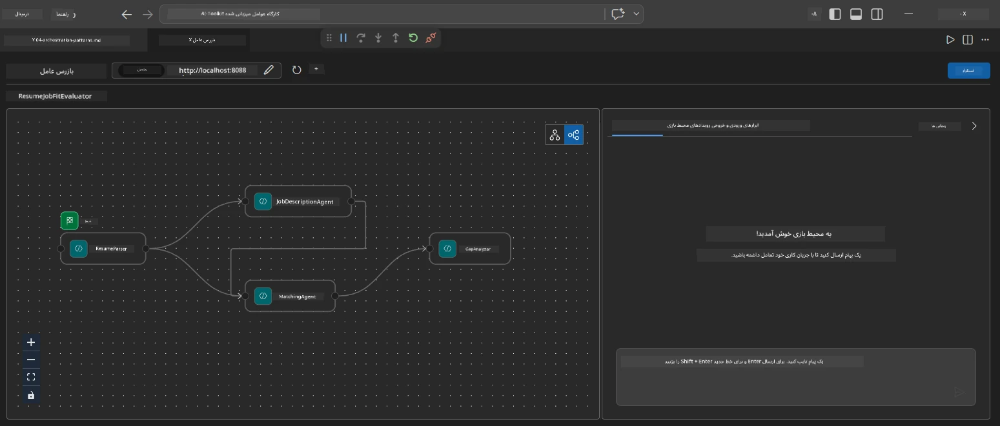
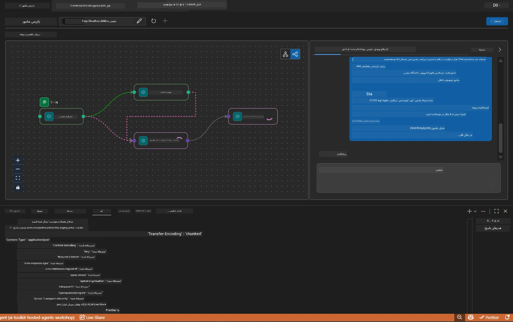
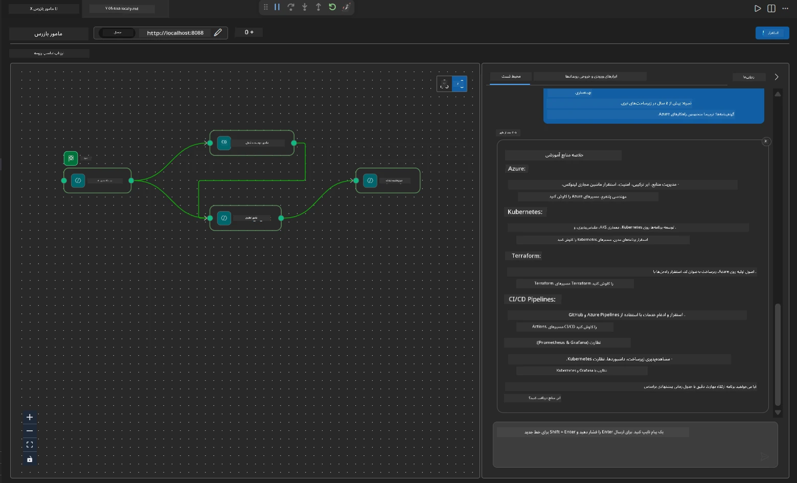

# ماژول ۵ - تست محلی

⏱️ ~۱۵ دقیقه

در این ماژول، جریان کاری چندعاملی را به صورت محلی اجرا کرده، با Agent Inspector آن را تست می‌کنید و اطمینان حاصل می‌کنید که هر چهار عامل و ابزار MCP به درستی کار می‌کنند قبل از اینکه آن را مستقر کنید.

---

## مرحله ۱: راه‌اندازی سرور عامل

### گزینه A: استفاده از تسک VS Code (توصیه شده)

۱. پوشه `workshop/lab02-multi-agent/PersonalCareerCopilot/` را به عنوان پوشه VS Code خود باز کنید.
۲. کلیدهای `Ctrl+Shift+P` را فشار دهید → تایپ کنید **Tasks: Run Task** → انتخاب کنید **Run Agent HTTP Server**.
۳. این تسک سرور را با debugpy متصل بر روی پورت `5679` و عامل روی پورت `8088` راه‌اندازی می‌کند.
۴. منتظر بمانید تا خروجی نشان دهد:

```
INFO:resume-job-fit:Starting Resume -> Job Fit Evaluator HTTP server...
INFO:resume-job-fit:Server running on http://localhost:8088
```

### گزینه B: استفاده از F5 (حالت دیباگ)

۱. کلید `F5` را فشار دهید → انتخاب کنید **Debug Local Agent HTTP Server**.
۲. سرور با پشتیبانی کامل نقطه توقف شروع می‌شود - مفید برای بررسی پاسخ‌های MCP یا خروجی‌های عامل.

---

## مرحله ۲: باز کردن Agent Inspector

۱. کلیدهای `Ctrl+Shift+P` را فشار دهید → تایپ کنید **Foundry Toolkit: Open Agent Inspector**.
۲. Agent Inspector به عنوان یک پنل VS Code باز می‌شود که به `http://localhost:8088` متصل است.
۳. باید رابط عامل را ببینید که آماده دریافت پیام‌هاست.



> **اگر Agent Inspector باز نشد:** اطمینان حاصل کنید سرور کاملاً راه‌اندازی شده است (لاگ "Server running" را ببینید). اگر پورت ۵۶۷۹ مشغول است، به [Module 8 - Troubleshooting](08-troubleshooting.md) مراجعه کنید.

---

## مرحله ۲ب: (اختیاری) باز کردن Workflow Visualizer

Foundry Toolkit شامل یک **Workflow Visualizer** به‌صورت زمان واقعی است که نشان می‌دهد عوامل چگونه هنگام اجرای نمودار با هم تعامل دارند. این برای دیباگ چندعاملی بسیار مفید است.

۱. کلیدهای `Ctrl+Shift+P` را فشار دهید → تایپ کنید **Foundry Toolkit: Open Visualizer for Hosted Agents**.
۲. یک تب جدید VS Code باز می‌شود که نمودار اجرای زنده را نمایش می‌دهد.
۳. هنگام ارسال پیام در Agent Inspector، ویژوالایزر به طور خودکار به‌روزرسانی می‌شود - گره‌های سبز نمایانگر عوامل تکمیل شده و لبه‌های متحرک جریان داده بین آنها را نشان می‌دهند.

> **تداخل پورت:** اگر پورت ویژوالایزر قبلاً استفاده شده است، در تنظیمات VS Code → **Extensions** → **Microsoft Foundry Configuration** → **Hosted Agents: Visualizer Port** آن را تغییر دهید.

---

## مرحله ۳: اجرای تست های اولیه

این سه تست را به ترتیب اجرا کنید. هر کدام بخش بیشتری از جریان کاری را تست می‌کنند.

### تست ۱: رزومه پایه + توصیف شغل

متن زیر را در Agent Inspector جایگذاری کنید:

```
Resume:
Jane Doe
Senior Software Engineer with 5 years of experience in Python, Django, and AWS.
Built microservices handling 10K+ requests/second. Led a team of 4 developers.
Certifications: AWS Solutions Architect Associate.
Education: B.S. Computer Science, State University.

Job Description:
Senior Cloud Engineer at Contoso Ltd.
Required: Python, Azure, Kubernetes, Terraform, CI/CD pipelines.
Preferred: Go, monitoring (Prometheus/Grafana), cost optimization.
Experience: 5+ years in cloud infrastructure.
Certifications: Azure Solutions Architect Expert preferred.
```

**ساختار خروجی مورد انتظار:**

پاسخ باید خروجی هر چهار عامل را به ترتیب شامل شود:

۱. **خروجی Resume Parser** - دو بخش برچسب خورده: `[PARSED RESUME]` (پروفایل کاندیدا با مهارت‌های گروه‌بندی شده) و `[JOB DESCRIPTION PASS-THROUGH]` (متن عیناً منتقل شده JD که به JD Agent می‌رود)
۲. **خروجی JD Agent** - نیازمندی‌های ساختار یافته با تفکیک مهارت‌های لازم و ترجیحی
۳. **خروجی Matching Agent** - امتیاز تطابق (۰-۱۰۰) با جزئیات، مهارت‌های مطابقت یافته، مهارت‌های مفقود، شکاف‌ها
۴. **خروجی Gap Analyzer** - کارت‌های جداگانه شکاف برای هر مهارت مفقود، هرکدام با لینک‌های Microsoft Learn





### مواردی که باید در تست ۱ تأیید کنید

| بررسی | انتظار | موفق شد؟ |
|-------|----------|-------|
| پاسخ شامل امتیاز تطابق است | عددی بین ۰ تا ۱۰۰ با جزئیات | |
| مهارت‌های مطابقت یافته ذکر شده‌اند | Python، CI/CD (جزئی)، و غیره | |
| مهارت‌های مفقود فهرست شده‌اند | Azure، Kubernetes، Terraform، و غیره | |
| کارت‌های شکاف برای هر مهارت مفقود وجود دارد | یک کارت برای هر مهارت | |
| لینک‌های Microsoft Learn حاضرند | لینک‌های واقعی از `learn.microsoft.com` | |
| هیچ خطایی در پاسخ نیست | خروجی ساختاریافته و پاک | |

### تست ۲: حالت لبه - کاندیدای با تطابق بالا

رزومه‌ای که به JD بسیار نزدیک است را جایگذاری کنید تا مطمئن شوید GapAnalyzer شرایط با تطابق بالا را به درستی مدیریت می‌کند:

```
Resume:
Alex Chen
Senior Cloud Engineer with 7 years of experience.
Skills: Python, Azure (AKS, Functions, DevOps), Kubernetes, Terraform, CI/CD (GitHub Actions, Azure Pipelines), Go, Prometheus, Grafana, cost optimization.
Certifications: Azure Solutions Architect Expert, Azure DevOps Engineer Expert.
Led infrastructure migration to Azure for 3 enterprise clients.
Education: M.S. Computer Science, Tech University.

Job Description:
Senior Cloud Engineer at Contoso Ltd.
Required: Python, Azure, Kubernetes, Terraform, CI/CD pipelines.
Preferred: Go, monitoring (Prometheus/Grafana), cost optimization.
Experience: 5+ years in cloud infrastructure.
Certifications: Azure Solutions Architect Expert preferred.
```

**رفتار مورد انتظار:**
- امتیاز تطابق باید **۸۰+** باشد (بیشتر مهارت‌ها تطابق دارند)
- کارت‌های شکاف بیشتر بر اصلاح و آمادگی مصاحبه تمرکز دارند تا یادگیری پایه‌ای
- دستورالعمل‌های GapAnalyzer می‌گویند: "اگر تطابق >= ۸۰، بر اصلاح و آمادگی مصاحبه تمرکز کن"

---

## مرحله ۴: تست با داده‌های خودتان (اختیاری)

سعی کنید رزومه و توضیح شغل واقعی خود را جایگذاری کنید. این به بررسی کمک می‌کند:

- عوامل فرمت‌های مختلف رزومه (زمانی، عملکردی، ترکیبی) را مدیریت کنند
- JD Agent سبک‌های مختلف JD را (نقاط گلوله‌ای، پاراگراف، ساختار یافته) پردازش کند
- ابزار MCP منابع مرتبط برای مهارت‌های واقعی برگرداند
- کارت‌های شکاف به زمینه خاص شما شخصی سازی شده باشند

> **حریم خصوصی - مسیر A (Foundry ابری):** متن رزومه و JD برای استنباط به استقرار Azure OpenAI شما ارسال می‌شود. این داده‌ها توسط زیرساخت کارگاه ذخیره یا لاگ نمی‌شوند. در صورت تمایل از نام‌های مستعار (مثل "Jane Doe") استفاده کنید.
>
> **حریم خصوصی - مسیر B (Foundry محلی):** تمام استنتاج‌های چهار عامل کاملاً روی دستگاه شما اجرا می‌شوند. متن رزومه و توضیح شغل شما **هرگز از دستگاه شما خارج نمی‌شود**. تنها تماس خروجی، ابزار MCP است که منابع را از `https://learn.microsoft.com/api/mcp` دریافت می‌کند؛ آن درخواست تنها شامل نام مهارت است، بدون داده‌های شخصی شما.

---

### چک‌پوینت

- [ ] سرور با موفقیت روی پورت `8088` راه‌اندازی شد (لاگ "Server running" نمایش داده شود)
- [ ] Agent Inspector باز و به عامل متصل شد
- [ ] تست ۱: پاسخ کامل با امتیاز تطابق، مهارت‌های مطابقت یافته/مفقود، کارت‌های شکاف و لینک‌های Microsoft Learn
- [ ] تست ۲: کاندیدای با تطابق بالا امتیاز ۸۰+ با توصیه‌های اصلاح محور می‌گیرد
- [ ] همه کارت‌های شکاف حاضرند (یک کارت برای هر مهارت مفقود، بدون کوتاه شدن)
- [ ] هیچ خطا یا ردپای استک در ترمینال سرور نیست

---

**قبلی:** [04 - Orchestration Patterns](04-orchestration-patterns.md) · **بعدی:** [06 - Deploy to Foundry →](06-deploy-to-foundry.md)

---

<!-- CO-OP TRANSLATOR DISCLAIMER START -->
**سلب مسئولیت**:
این سند با استفاده از سرویس ترجمه هوش مصنوعی [Co-op Translator](https://github.com/Azure/co-op-translator) ترجمه شده است. در حالی که ما در تلاش برای دقت هستیم، لطفاً توجه داشته باشید که ترجمه‌های خودکار ممکن است شامل خطاها یا نادرستی‌هایی باشند. سند اصلی به زبان مادری خود باید به عنوان منبع معتبر در نظر گرفته شود. برای اطلاعات حیاتی، ترجمه حرفه‌ای انسانی توصیه می‌شود. ما در قبال هرگونه سوء تفاهم یا برداشت نادرست ناشی از استفاده از این ترجمه مسئولیتی نداریم.
<!-- CO-OP TRANSLATOR DISCLAIMER END -->