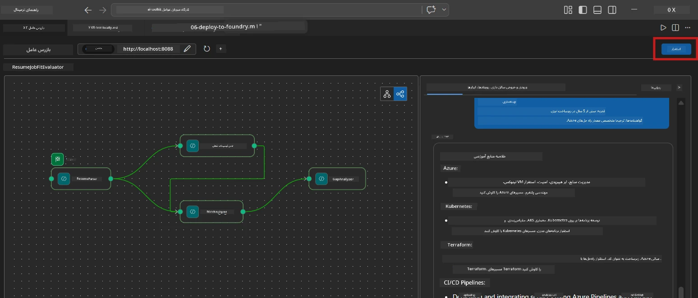
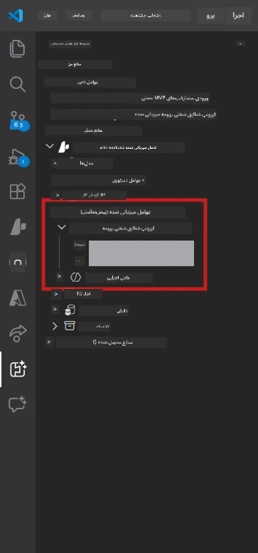

# ماژول ۶ - استقرار در سرویس Foundry Agent

در این ماژول، جریان کاری چندعاملی که به صورت محلی آزمایش شده است را به عنوان یک **عامل میزبان** در [Microsoft Foundry](https://learn.microsoft.com/azure/foundry/agents/concepts/hosted-agents) مستقر می‌کنید. فرایند استقرار یک تصویر کانتینر داکر می‌سازد، آن را به [Azure Container Registry (ACR)](https://learn.microsoft.com/azure/container-registry/container-registry-intro) ارسال می‌کند و نسخه‌ای از عامل میزبان را در [Foundry Agent Service](https://learn.microsoft.com/azure/foundry/agents/how-to/publish-agent) ایجاد می‌کند.

> **تفاوت کلیدی با آزمایشگاه ۰۱:** فرایند استقرار یکسان است. Foundry جریان کاری چندعاملی شما را به عنوان یک عامل میزبان واحد می‌بیند - پیچیدگی داخل کانتینر است، اما سطح استقرار همان نقطه انتهایی `/responses` است.

---

## بررسی پیش‌نیازها

قبل از استقرار، هر مورد زیر را بررسی کنید:

۱. **عامل تست‌های محلی را پاس کرده است:**
   - شما هر سه تست در [ماژول ۵](05-test-locally.md) را انجام داده‌اید و جریان کاری خروجی کامل با کارت‌های گپ و آدرس‌های Microsoft Learn تولید کرده است.

۲. **شما نقش [Azure AI User](https://learn.microsoft.com/azure/foundry/concepts/rbac-foundry) دارید:**
   - در [آزمایشگاه ۰۱، ماژول ۲](../../lab01-single-agent/docs/02-create-foundry-project.md) اختصاص داده شده است. تأیید کنید:
   - [Azure Portal](https://portal.azure.com) → منبع **پروژه** Foundry شما → **کنترل دسترسی (IAM)** → **تخصیص نقش‌ها** → مطمئن شوید **[Azure AI User](https://aka.ms/foundry-ext-project-role)** برای حساب شما لیست شده است.

۳. **شما در VS Code به Azure ورود کرده‌اید:**
   - نماد حساب‌ها در پایین-چپ VS Code را بررسی کنید. نام حساب شما باید قابل مشاهده باشد.

۴. **مقدارهای `agent.yaml` صحیح است:**
   - فایل `PersonalCareerCopilot/agent.yaml` را باز کنید و تأیید کنید:
     ```yaml
     environment_variables:
       - name: PROJECT_ENDPOINT
         value: ${PROJECT_ENDPOINT}
       - name: MODEL_DEPLOYMENT_NAME
         value: ${MODEL_DEPLOYMENT_NAME}
     ```
   - این مقدارها باید با متغیرهای محیطی که `main.py` شما می‌خواند مطابقت داشته باشند.

۵. **نسخه‌های `requirements.txt` درست است:**
   ```
   agent-framework-azure-ai==1.0.0rc3
   agent-framework-core==1.0.0rc3
   azure-ai-agentserver-agentframework==1.0.0b16
   azure-ai-agentserver-core==1.0.0b16
   debugpy
   agent-dev-cli --pre
   ```

---

## گام ۱: شروع استقرار

### گزینه الف: استقرار از طریق Agent Inspector (توصیه‌شده)

اگر عامل با F5 اجرا می‌شود و Agent Inspector باز است:

۱. به **گوشه بالا-راست** پنل Agent Inspector نگاه کنید.
۲. دکمه **Deploy** (آیکون ابر با فلش بالا ↑) را کلیک کنید.
۳. ویزارد استقرار باز می‌شود.



### گزینه ب: استقرار از طریق Command Palette

۱. کلیدهای `Ctrl+Shift+P` را فشار دهید تا **Command Palette** باز شود.
۲. تایپ کنید: **Microsoft Foundry: Deploy Hosted Agent** و آن را انتخاب کنید.
۳. ویزارد استقرار باز می‌شود.

---

## گام ۲: پیکربندی استقرار

### ۲.۱ انتخاب پروژه هدف

۱. یک منوی کشویی پروژه‌های Foundry شما را نمایش می‌دهد.
۲. پروژه‌ای که در سراسر کارگاه استفاده کردید را انتخاب کنید (مثلاً `workshop-agents`).

### ۲.۲ انتخاب فایل عامل کانتینر

۱. از شما خواسته می‌شود نقطه ورود عامل را انتخاب کنید.
۲. به مسیر `workshop/lab02-multi-agent/PersonalCareerCopilot/` بروید و **`main.py`** را انتخاب کنید.

### ۲.۳ پیکربندی منابع

| تنظیمات | مقدار پیشنهادی | یادداشت‌ها |
|---------|----------------|------------|
| **CPU** | `0.25` | پیش‌فرض. جریان‌های کاری چندعاملی نیاز به CPU بیشتر ندارند چون فراخوانی‌های مدل وابسته به I/O هستند |
| **حافظه** | `0.5Gi` | پیش‌فرض. اگر ابزارهای پردازش داده بزرگ اضافه می‌کنید به `1Gi` افزایش دهید |

---

## گام ۳: تأیید و استقرار

۱. ویزارد خلاصه‌ای از استقرار را نمایش می‌دهد.
۲. مرور کنید و روی **Confirm and Deploy** کلیک کنید.
۳. پیشرفت را در VS Code مشاهده کنید.

### چه اتفاقی در طول استقرار می‌افتد

پنل **Output** در VS Code را تماشا کنید (کادر کشویی "Microsoft Foundry" را انتخاب کنید):


۱. **ساخت داکر** - از `Dockerfile` شما کانتینر ساخته می‌شود:
   ```
   Step 1/6 : FROM python:3.14-slim
   Step 2/6 : WORKDIR /app
   ...
   Successfully built abc123def456
   ```

۲. **ارسال داکر** - تصویر به ACR ارسال می‌شود (۱-۳ دقیقه در اولین استقرار).

۳. **ثبت عامل** - Foundry یک عامل میزبان با استفاده از متادیتای `agent.yaml` ایجاد می‌کند. نام عامل `resume-job-fit-evaluator` است.

۴. **شروع کانتینر** - کانتینر در زیرساخت مدیریت‌شده Foundry با شناسه مدیریت شده سیستم آغاز می‌شود.

> **اولین استقرار کندتر است** (داکر تمام لایه‌ها را ارسال می‌کند). استقرارهای بعدی از لایه‌های کش شده استفاده می‌کنند و سریع‌تر هستند.

### نکات ویژه چندعاملی

- **هر چهار عامل در یک کانتینر هستند.** Foundry یک عامل میزبان واحد را می‌بیند. گراف WorkflowBuilder به صورت داخلی اجرا می‌شود.
- **فراخوانی‌های MCP رو به بیرون است.** کانتینر نیاز به دسترسی اینترنتی برای رسیدن به `https://learn.microsoft.com/api/mcp` دارد. زیرساخت مدیریت‌شده Foundry این دسترسی را به صورت پیش‌فرض فراهم می‌کند.
- **[Managed Identity](https://learn.microsoft.com/python/api/overview/azure/identity-readme#managed-identity-support).** در محیط میزبان، `get_credential()` در `main.py` مقدار `ManagedIdentityCredential()` را برمی‌گرداند (چون `MSI_ENDPOINT` تنظیم شده). این کار به صورت خودکار انجام می‌شود.

---

## گام ۴: بررسی وضعیت استقرار

۱. پنل کناری **Microsoft Foundry** را باز کنید (نماد Foundry در Activity Bar را کلیک کنید).
۲. زیر پروژه خود **Hosted Agents (Preview)** را باز کنید.
۳. عامل **resume-job-fit-evaluator** (یا نام عامل خود) را پیدا کنید.
۴. روی نام عامل کلیک کنید → نسخه‌ها را باز کنید (مثلاً `v1`).
۵. روی نسخه کلیک کنید → بخش **Container Details** → **Status** را بررسی کنید:



| وضعیت | معنا |
|--------|---------|
| **Started** / **Running** | کانتینر در حال اجرا است، عامل آماده است |
| **Pending** | کانتینر در حال شروع است (۳۰-۶۰ ثانیه صبر کنید) |
| **Failed** | کانتینر نتوانست شروع شود (لاگ‌ها را بررسی کنید - در ادامه ببینید) |

> **راه‌اندازی چندعاملی بیشتر طول می‌کشد** نسبت به عامل تک‌عاملی چون کانتینر ۴ نمونه عامل هنگام شروع ایجاد می‌کند. "Pending" تا ۲ دقیقه طبیعی است.

---

## خطاهای رایج استقرار و رفع آنها

### خطا ۱: Permission denied - `agents/write`

```
Error: lacks the required data action 
Microsoft.CognitiveServices/accounts/AIServices/agents/write
```

**رفع:** نقش **[Azure AI User](https://learn.microsoft.com/azure/foundry/concepts/rbac-foundry)** را در سطح **پروژه** اختصاص دهید. راهنمای گام به گام را در [ماژول ۸ - عیب‌یابی](08-troubleshooting.md) ببینید.

### خطا ۲: داکر در حال اجرا نیست

```
Error: Docker build failed / Cannot connect to Docker daemon
```

**رفع:**
۱. Docker Desktop را اجرا کنید.
۲. منتظر شوید پیام "Docker Desktop is running" نمایش داده شود.
۳. با دستور `docker info` بررسی کنید.
۴. **ویندوز:** مطمئن شوید در تنظیمات Docker Desktop، بک‌اند WSL 2 فعال است.
۵. دوباره تلاش کنید.

### خطا ۳: pip install در حین ساخت داکر شکست می‌خورد

```
Error: Could not find a version that satisfies the requirement agent-dev-cli
```

**رفع:** پرچم `--pre` در `requirements.txt` در داکر به شکل متفاوتی پردازش می‌شود. اطمینان حاصل کنید `requirements.txt` شما شامل موارد زیر است:
```
agent-dev-cli --pre
```

اگر باز هم داکر شکست خورد، یک فایل `pip.conf` بسازید یا `--pre` را از طریق آرگومان ساخت انتقال دهید. راهنمای بیشتر در [ماژول ۸](08-troubleshooting.md).

### خطا ۴: ابزار MCP در عامل میزبان خراب می‌شود

اگر Gap Analyzer پس از استقرار آدرس‌های Microsoft Learn تولید نمی‌کند:

**علت اصلی:** سیاست شبکه ممکن است دسترسی خروجی HTTPS از کانتینر را مسدود کرده باشد.

**رفع:**
۱. این معمولاً در پیکربندی پیش‌فرض Foundry مشکل ایجاد نمی‌کند.
۲. اگر رخ داد، بررسی کنید آیا شبکه مجازی پروژه Foundry دارای NSG است که خروجی HTTPS را مسدود می‌کند یا خیر.
۳. ابزار MCP URL‌های جایگزین داخلی دارد، بنابراین عامل هنوز خروجی تولید می‌کند (بدون آدرس‌های زنده).

---

### چک‌پوینت

- [ ] فرمان استقرار بدون خطا در VS Code انجام شده است
- [ ] عامل در بخش **Hosted Agents (Preview)** پنل کناری Foundry ظاهر شده است
- [ ] نام عامل `resume-job-fit-evaluator` (یا نام دلخواه شما) است
- [ ] وضعیت کانتینر **Started** یا **Running** را نشان می‌دهد
- [ ] (اگر خطا بود) خطا شناسایی، رفع و با موفقیت مجدداً استقرار داده شده است

---

**قبلی:** [05 - تست محلی](05-test-locally.md) · **بعدی:** [07 - تأیید در Playground →](07-verify-in-playground.md)

---

<!-- CO-OP TRANSLATOR DISCLAIMER START -->
**سلب مسئولیت**:  
این سند با استفاده از سرویس ترجمه هوش مصنوعی [Co-op Translator](https://github.com/Azure/co-op-translator) ترجمه شده است. در حالی که ما به دقت تلاش می‌کنیم، لطفاً توجه داشته باشید که ترجمه‌های خودکار ممکن است حاوی خطا یا عدم دقت باشند. سند اصلی به زبان بومی آن باید به عنوان منبع معتبر در نظر گرفته شود. برای اطلاعات حیاتی، ترجمه حرفه‌ای انسانی توصیه می‌شود. ما مسئولیتی در قبال هرگونه سو تفاهم یا تفسیر نادرست ناشی از استفاده از این ترجمه نداریم.
<!-- CO-OP TRANSLATOR DISCLAIMER END -->