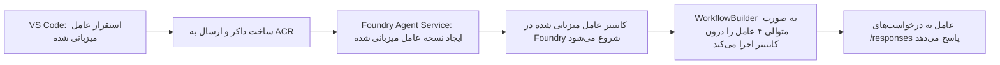
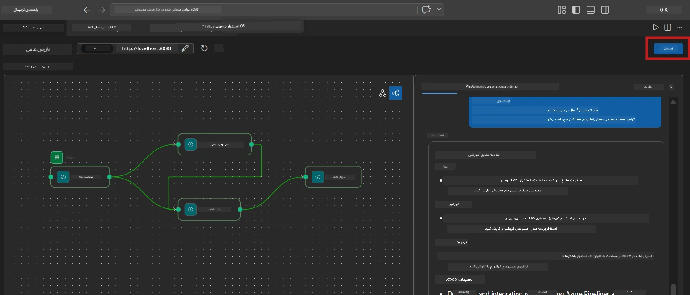

# ماژول ۶ - استقرار در سرویس Foundry Agent

⏱️ ~۱۰ دقیقه

در این ماژول، گردش کار چندعامله آزمایش‌شده محلی خود را به عنوان یک **عامل میزبانی شده** به [Microsoft Foundry](https://learn.microsoft.com/azure/foundry/agents/concepts/hosted-agents) مستقر می‌کنید. فرایند استقرار یک ایمیج کانتینر داکر می‌سازد، آن را به [Azure Container Registry (ACR)](https://learn.microsoft.com/azure/container-registry/container-registry-intro) ارسال می‌کند و نسخه‌ای از عامل میزبانی شده را در [Foundry Agent Service](https://learn.microsoft.com/azure/foundry/agents/how-to/publish-agent) ایجاد می‌کند.

> **تفاوت کلیدی با آزمایشگاه ۰۱:** فرایند استقرار یکسان است. Foundry گردش کار چندعامله شما را به عنوان یک عامل میزبانی شده واحد در نظر می‌گیرد - پیچیدگی داخل کانتینر است ولی نقطه استقرار همان نقطه‌ی پایانی `/responses` است.

### خط لوله استقرار


```mermaid
flowchart LR
    A[VS Code: استقرار عامل میزبانی شده] --> B[ساخت داکر و ارسال به ACR]
    B --> C[Foundry Agent Service: ایجاد نسخه عامل میزبانی شده]
    C --> D[کانتینر عامل میزبانی شده در Foundry شروع می‌شود]
    D --> E[WorkflowBuilder به صورت متوالی ۴ عامل را درون کانتینر اجرا می‌کند]
    E --> F[عامل به درخواست‌های /responses پاسخ می‌دهد]
```

---

## بررسی پیش‌نیازها

پیش از استقرار، هر مورد زیر را بررسی کنید:

۱. **عامل آزمایش‌های دود محلی را گذرانده است:**  
   - شما هر ۳ آزمایش در [ماژول ۵](05-test-locally.md) را کامل کردید و گردش کار خروجی کامل با کارت‌های فاصله و URLهای Microsoft Learn تولید کرد.

۲. **شما نقش [Foundry User](https://learn.microsoft.com/azure/foundry/concepts/rbac-foundry) را دارید** (برای استقرار حداقل نقش **Foundry Project Manager** در دامنه پروژه لازم است):

   > **توجه:** نقش‌های RBAC Foundry اخیراً تغییر نام داده‌اند - نقش‌های **Foundry User**، **Foundry Owner** و **Foundry Project Manager** پیش‌تر به ترتیب به نام‌های Azure AI User، Azure AI Owner و Azure AI Project Manager شناخته می‌شدند. شناسه‌ها و مجوزهای نقش تغییری نکرده‌اند.

   - در [پورتال Azure](https://portal.azure.com) → منبع **پروژه** Foundry خود → **کنترل دسترسی (IAM)** → **تخصیص نقش‌ها** → تایید کنید که نقش **Foundry User** (یا بالاتر) برای حساب شما فهرست شده است.

۳. **وارد Azure در VS Code شده‌اید:**  
   - آیکون حساب‌ها در پایین سمت چپ VS Code را بررسی کنید. نام حساب شما باید قابل مشاهده باشد.

۴. **فایل `agent.yaml` مقادیر درستی دارد:**  
   - فایل `PersonalCareerCopilot/agent.yaml` را باز کنید و بررسی کنید:  
     ```yaml
     environment_variables:
       - name: AZURE_AI_MODEL_DEPLOYMENT_NAME
         value: ${AZURE_AI_MODEL_DEPLOYMENT_NAME}
     ```
   - متغیر `FOUNDRY_PROJECT_ENDPOINT` در اینجا فهرست نشده است - Foundry این را در زمان اجرا تزریق می‌کند. فقط `AZURE_AI_MODEL_DEPLOYMENT_NAME` باید اعلام شود.

۵. **فایل `requirements.txt` نسخه‌های درستی دارد:**  
   ```
   agent-framework-foundry
   agent-framework-foundry-hosting
   mcp<2,>=1.24.0
   debugpy
   ```

---

## گام ۱: شروع استقرار

### گزینه A: استقرار از طریق Agent Inspector (توصیه‌شده)

اگر عامل با کلید F5 اجرا می‌شود و Agent Inspector باز است:

۱. به **گوشه بالا-راست** پنل Agent Inspector نگاه کنید.
۲. روی دکمه **Deploy** (آیکون ابر با فلش به بالا ↑) کلیک کنید.
۳. جادوگر استقرار باز می‌شود.



### گزینه B: استقرار از طریق فرمان Palette

۱. `Ctrl+Shift+P` را فشار دهید تا **Command Palette** باز شود.
۲. تایپ کنید: **Foundry Toolkit: Deploy Hosted Agent** و آن را انتخاب کنید.
۳. جادوگر استقرار باز می‌شود.

---

## گام ۲: پیکربندی استقرار

### ۲.۱ انتخاب پروژه هدف

۱. یک منوی کشویی پروژه‌های Foundry شما را نشان می‌دهد.
۲. پروژه‌ای که کل کارگاه از آن استفاده کرده‌اید را انتخاب کنید (مثلاً `workshop-agents`).

### ۲.۲ انتخاب فایل عامل کانتینر

۱. از شما خواسته می‌شود نقطه ورود عامل را انتخاب کنید.
۲. به `workshop/lab02-multi-agent/PersonalCareerCopilot/` بروید و **`main.py`** را انتخاب کنید.

### ۲.۳ پیکربندی منابع

| تنظیم | مقدار توصیه شده | یادداشت‌ها |
|---------|------------------|-------|
| **روش استقرار** | **کانتینر** (توصیه شده) یا **کد** | کانتینر یک ایمیج داکر می‌سازد؛ کد منبع را به صورت ZIP آپلود می‌کند (نسخه آزمایشی) |
| **ثبت‌نام کانتینر** | **ACR پیش‌فرض** | Foundry یکی برای شما ایجاد و مدیریت می‌کند |
| **CPU** | `0.25` | پیش‌فرض. گردش کارهای چندعامله به CPU بیشتری نیاز ندارند چون تماس‌های مدل ورودی/خروجی هستند |
| **حافظه** | `0.5Gi` | پیش‌فرض. اگر ابزارهای پردازش داده بزرگ اضافه کردید به `1Gi` افزایش دهید |

---

## گام ۳: تأیید و استقرار

۱. جادوگر خلاصه‌ای از استقرار نشان می‌دهد.
۲. مرور کنید و روی **Confirm and Deploy** کلیک کنید.
۳. پیشرفت در VS Code را دنبال کنید.

### در حین استقرار چه اتفاقی می‌افتد

پنل **Output** در VS Code را نگاه کنید (از منوی کشویی "Microsoft Foundry" را انتخاب کنید):

۱. **ساخت داکر** - کانتینر را از `Dockerfile` شما می‌سازد
   ```
   Step 1/6 : FROM python:3.12-slim
   Step 2/6 : WORKDIR /app
   ...
   Successfully built abc123def456
   ```

۲. **ارسال داکر** - ایمیج را به ACR ارسال می‌کند (۱-۳ دقیقه در اولین استقرار).

۳. **ثبت عامل** - Foundry با متادیتای `agent.yaml` یک عامل میزبانی شده ایجاد می‌کند. نام عامل `resume-job-fit-evaluator` است.

۴. **شروع کانتینر** - کانتینر در زیرساخت مدیریت شده Foundry با هویت مدیریت‌شده سیستم شروع می‌شود.

> **اولین استقرار کندتر است** (داکر تمام لایه‌ها را ارسال می‌کند). استقرارهای بعدی از لایه‌های کش شده استفاده می‌کنند و سریع‌تر هستند.

### نکات مختص چندعامل

- **هر چهار عامل داخل یک کانتینر هستند.** Foundry این را به عنوان یک عامل میزبانی شده واحد می‌بیند. گراف WorkflowBuilder داخلی اجرا می‌شود.
- **تماس‌های MCP به بیرون می‌روند.** کانتینر به اینترنت برای دسترسی به `https://learn.microsoft.com/api/mcp` نیاز دارد. زیرساخت مدیریت شده Foundry این را به صورت پیش‌فرض فراهم می‌کند.
- **[هویت مدیریت‌شده](https://learn.microsoft.com/azure/foundry/agents/concepts/agent-identity).** Foundry در زمان استقرار به صورت خودکار برای هر عامل میزبانی شده یک هویت اختصاصی Entra ایجاد می‌کند. در محیط میزبانی شده، `DefaultAzureCredential` به طور خودکار این هویت عامل را حل می‌کند - نیازی به پیکربندی دستی هویت مدیریت‌شده نیست.

---

## گام ۴: بررسی وضعیت استقرار

۱. نوار کناری **Microsoft Foundry** را باز کنید (روی آیکون Foundry در نوار فعالیت کلیک کنید).
۲. در زیر پروژه خود **Hosted Agents (Preview)** را باز کنید.
۳. **resume-job-fit-evaluator** (یا نام عامل خود) را پیدا کنید.
۴. روی نام عامل کلیک کنید → نسخه‌ها را گسترش دهید (مثلاً `v1`).
۵. روی نسخه کلیک کنید → **جزئیات کانتینر** → **وضعیت** را بررسی کنید:


| وضعیت | معنی |
|--------|---------|
| **active** | عامل در حال اجرا و آماده پذیرش درخواست‌ها است |
| **creating** | کانتینر در حال شروع است (۳۰–۶۰ ثانیه صبر کنید) |
| **failed** | کانتینر قادر به شروع نبود (لاگ‌ها را بررسی کنید - پایین را ببینید) |

> **توجه:** نوار کناری VS Code ممکن است برچسب‌هایی مانند «در حال اجرا» یا «شروع شده» نمایش دهد در حالی که وضعیت API زیرین `active`/`creating` است. هر کدام نمایانگر همان وضعیت هستند.

> **راه‌اندازی چندعامل زمان بیشتری می‌برد** نسبت به تک‌عامل چون کانتینر هنگام شروع ۴ نمونه عامل ایجاد می‌کند. `creating` تا ۲ دقیقه طبیعی است.

---

## خطاهای رایج استقرار و رفع آنها

### خطا ۱: دسترسی رد شد - `agents/write`

```
Error: lacks the required data action 
Microsoft.CognitiveServices/accounts/AIServices/agents/write
```

**رفع:** نقش **[Foundry User](https://learn.microsoft.com/azure/foundry/concepts/rbac-foundry)** (قبلا **Azure AI User**) را در سطح **پروژه** تخصیص دهید. برای دستورالعمل مرحله به مرحله به [ماژول ۸ - عیب‌یابی](08-troubleshooting.md) مراجعه کنید.

### خطا ۲: داکر اجرا نمی‌شود

```
Error: Docker build failed / Cannot connect to Docker daemon
```

**رفع:**
۱. Docker Desktop را راه‌اندازی کنید.
۲. منتظر پیام "Docker Desktop is running" بمانید.
۳. بررسی کنید: `docker info`
۴. **ویندوز:** اطمینان حاصل کنید WSL 2 در تنظیمات Docker Desktop فعال باشد.
۵. مجدداً تلاش کنید.

### خطا ۳: نصب pip هنگام ساخت داکر با شکست مواجه شد

```
Error: Could not find a version that satisfies the requirement agent-framework-foundry
```

**رفع:** اطمینان حاصل کنید `requirements.txt` مطابق است با:
```
agent-framework-foundry
agent-framework-foundry-hosting
mcp<2,>=1.24.0
debugpy
```

اگر ساخت همچنان شکست می‌خورد، ممکن است شبکه داکر دسترسی به PyPI را مسدود کرده باشد. تنظیمات پراکسی در `docker info` را بررسی کنید.

### خطا ۴: ابزار MCP در عامل میزبانی شده خطا می‌دهد

اگر Gap Analyzer پس از استقرار URLهای Microsoft Learn تولید نمی‌کند:

**علت اصلی:** سیاست شبکه ممکن است HTTPS خروجی از کانتینر را مسدود کند.

**رفع:**
۱. معمولا این مشکل در پیکربندی پیش‌فرض Foundry وجود ندارد.
۲. اگر پیش آمد، بررسی کنید شبکه مجازی پروژه Foundry دارای NSG است که HTTPS خروجی را مسدود می‌کند یا نه.
۳. ابزار MCP URLهای پشتیبان دارد، پس عامل همچنان خروجی تولید می‌کند (بدون URLهای زنده).

---

### نقطه بررسی

- [ ] دستور استقرار بدون خطا در VS Code انجام شد
- [ ] عامل در زیر **Hosted Agents (Preview)** در نوار کناری Foundry ظاهر شد
- [ ] نام عامل `resume-job-fit-evaluator` (یا نام انتخابی شما) است
- [ ] وضعیت کانتینر نشان‌دهنده **شروع شده** یا **در حال اجرا** است
- [ ] (اگر خطا بود) خطا را شناسایی، رفع کرده و با موفقیت مجدداً استقرار دادید

---

**قبلی:** [۰۵ - آزمایش محلی](05-test-locally.md) · **بعدی:** [۰۷ - تأیید در Playground →](07-verify-in-playground.md)

---

<!-- CO-OP TRANSLATOR DISCLAIMER START -->
**سلب مسئولیت**:
این سند با استفاده از سرویس ترجمه هوش مصنوعی [Co-op Translator](https://github.com/Azure/co-op-translator) ترجمه شده است. در حالی که ما در تلاش برای دقت هستیم، لطفاً توجه داشته باشید که ترجمه‌های خودکار ممکن است شامل خطاها یا نادرستی‌هایی باشند. سند اصلی به زبان مادری خود باید به عنوان منبع معتبر در نظر گرفته شود. برای اطلاعات حیاتی، ترجمه حرفه‌ای انسانی توصیه می‌شود. ما در قبال هرگونه سوء تفاهم یا برداشت نادرست ناشی از استفاده از این ترجمه مسئولیتی نداریم.
<!-- CO-OP TRANSLATOR DISCLAIMER END -->