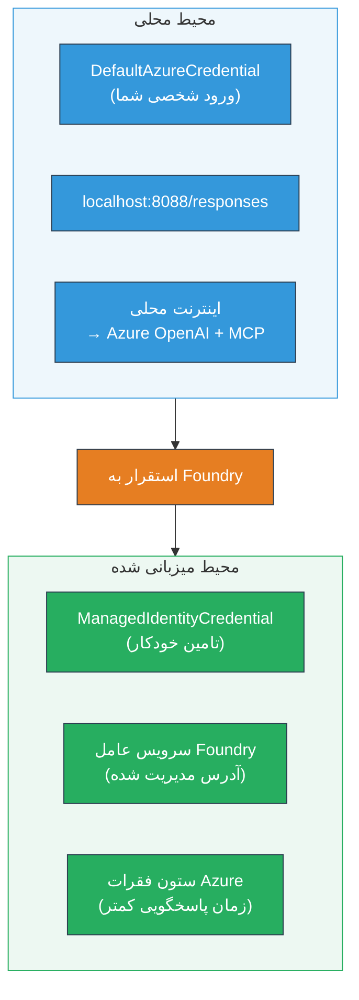

# بخش ۷ - اعتبارسنجی در Playground

در این بخش، گردش کار چندعاملی مستقر شده خود را هم در **VS Code** و هم در **[Foundry Portal](https://ai.azure.com)** آزمایش می‌کنید و تأیید می‌کنید که عامل دقیقاً مانند آزمایش محلی عمل می‌کند.

---

## چرا پس از استقرار اعتبارسنجی انجام دهیم؟

گردش کار چندعاملی شما به‌صورت محلی به‌خوبی کار کرده است، پس چرا دوباره آن را آزمایش کنیم؟ محیط میزبانی تفاوت‌هایی دارد:


| تفاوت | محلی | میزبانی شده |
|-----------|-------|--------|
| **هویت** | [`DefaultAzureCredential`](https://learn.microsoft.com/azure/developer/python/sdk/authentication/credential-chains#defaultazurecredential-overview) (ورود شخصی شما) | [`ManagedIdentityCredential`](https://learn.microsoft.com/python/api/overview/azure/identity-readme#managed-identity-support) (خودکار تامین شده) |
| **نقطه پایانی** | `http://localhost:8088/responses` | نقطه پایانی [Foundry Agent Service](https://learn.microsoft.com/azure/foundry/agents/concepts/hosted-agents) (آدرس مدیریت شده) |
| **شبکه** | دستگاه محلی → Azure OpenAI + MCP خروجی | شبکه پشتیبان Azure (تاخیر کمتر بین سرویس‌ها) |
| **اتصال MCP** | اینترنت محلی → `learn.microsoft.com/api/mcp` | خروجی کانتینر → `learn.microsoft.com/api/mcp` |

اگر هر متغیر محیطی اشتباه پیکربندی شده باشد، RBAC متفاوت باشد یا خروجی MCP مسدود شده باشد، در اینجا آن را خواهید گرفت.

---

## گزینه A: آزمایش در Playground وی‌اس‌کد (اولویت توصیه شده)

[افزونه Foundry](https://marketplace.visualstudio.com/items?itemName=TeamsDevApp.vscode-ai-foundry) شامل یک Playground یکپارچه است که به شما امکان می‌دهد بدون ترک VS Code با عامل مستقر شده خود گفتگو کنید.

### گام ۱: به عامل میزبانی شده خود بروید

1. روی نماد **Microsoft Foundry** در **نوار فعالیت** VS Code (نوار کناری سمت چپ) کلیک کنید تا پنل Foundry باز شود.
2. پروژه متصل خود را گسترش دهید (مثلاً `workshop-agents`).
3. **Hosted Agents (Preview)** را گسترش دهید.
4. باید نام عاملی که مستقر کرده‌اید را ببینید (مثلاً `resume-job-fit-evaluator`).

### گام ۲: یک نسخه را انتخاب کنید

1. روی نام عامل کلیک کنید تا نسخه‌های آن باز شود.
2. روی نسخه‌ای که مستقر کرده‌اید کلیک کنید (مثلاً `v1`).
3. پنل جزئیات باز می‌شود و جزییات کانتینر نشان داده می‌شود.
4. وضعیت را تأیید کنید که **Started** یا **Running** باشد.

### گام ۳: Playground را باز کنید

1. در پنل جزئیات، روی دکمه **Playground** کلیک کنید (یا روی نسخه راست کلیک کرده → **Open in Playground**).
2. رابط گفتگو در تب VS Code باز می‌شود.

### گام ۴: تست‌های سریع خود را اجرا کنید

از همان ۳ تست در [بخش ۵](05-test-locally.md) استفاده کنید. هر پیام را در کادر ورودی Playground تایپ کرده و روی **Send** (یا **Enter**) بزنید.

#### تست ۱ - رزومه کامل + شرح شغل (روند استاندارد)

پرومت رزومه کامل + شرح شغل از بخش ۵، تست ۱ را جای‌گذاری کنید (Jane Doe + Senior Cloud Engineer در Contoso Ltd).

**انتظار می‌رود:**
- امتیاز تطابق با تجزیه و تحلیل ریاضی (مقیاس ۱۰۰ امتیازی)
- بخش مهارت‌های منطبق
- بخش مهارت‌های گمشده
- **یک کارت گپ برای هر مهارت گمشده** با آدرس‌های Microsoft Learn
- نقشه راه یادگیری با جدول زمانی

#### تست ۲ - تست کوتاه سریع (ورودی حداقلی)

```
RESUME: 3 years Python developer, knows Django and PostgreSQL, no cloud experience.

JOB: Cloud DevOps Engineer requiring AWS, Kubernetes, Terraform, CI/CD. 5 years needed.
```

**انتظار می‌رود:**
- امتیاز تطابق پایین‌تر (< 40)
- ارزیابی صادقانه با مسیر یادگیری مرحله‌بندی شده
- چند کارت گپ (AWS، Kubernetes، Terraform، CI/CD، شکاف تجربه)

#### تست ۳ - نامزد با تطابق بالا

```
RESUME:
10 years Azure Cloud Architect. AZ-305 certified. Expert in AKS, Terraform, Azure DevOps, 
Azure Functions, Helm, Prometheus, Grafana, Python, Go. Led platform team of 8.

JOB:
Senior Cloud Engineer. Required: AKS, Terraform, Azure DevOps, Python. Preferred: Helm, Go.
5+ years experience. AZ-305 preferred.
```

**انتظار می‌رود:**
- امتیاز تطابق بالا (≥ 80)
- تمرکز روی آمادگی مصاحبه و صیقل دادن
- تعداد کم یا بدون کارت گپ
- جدول زمان‌بندی کوتاه متمرکز بر آماده‌سازی

### گام ۵: مقایسه با نتایج محلی

یادداشت‌ها یا تب مرورگر خود را از بخش ۵ که پاسخ‌های محلی را ذخیره کرده‌اید باز کنید. برای هر تست:

- آیا پاسخ ساختار **یکسانی** دارد (امتیاز تطابق، کارت‌های گپ، نقشه راه)؟
- آیا از **همان معیار امتیازدهی** (تجزیه و تحلیل ۱۰۰ امتیازی) پیروی می‌کند؟
- آیا **آدرس‌های Microsoft Learn** هنوز در کارت‌های گپ وجود دارند؟
- آیا **یک کارت گپ برای هر مهارت گمشده** وجود دارد (قطع نشده)؟

> **تفاوت‌های کوچک در کلمات طبیعی است** - مدل غیرقطعی است. تمرکز روی ساختار، سازگاری امتیازدهی و استفاده از ابزار MCP باشد.

---

## گزینه B: آزمایش در پرتال Foundry

[Foundry Portal](https://ai.azure.com) یک playground مبتنی بر وب ارائه می‌دهد که برای به اشتراک گذاشتن با هم تیمی‌ها یا ذینفعان مفید است.

### گام ۱: پرتال Foundry را باز کنید

1. مرورگر خود را باز کرده و به [https://ai.azure.com](https://ai.azure.com) بروید.
2. با همان حساب Azure که در کارگاه استفاده کرده‌اید وارد شوید.

### گام ۲: به پروژه خود بروید

1. در صفحه اصلی، به دنبال **Recent projects** در نوار کناری سمت چپ بگردید.
2. روی نام پروژه خود کلیک کنید (مثلاً `workshop-agents`).
3. اگر نمی‌بینید، روی **All projects** کلیک کنید و جستجو کنید.

### گام ۳: عاملی که مستقر کرده‌اید را پیدا کنید

1. در ناوبری سمت چپ پروژه، روی **Build** → **Agents** کلیک کنید (یا بخش **Agents** را پیدا کنید).
2. باید لیستی از عوامل را ببینید. عامل مستقر شده خود را پیدا کنید (مثلاً `resume-job-fit-evaluator`).
3. روی نام عامل کلیک کنید تا صفحه جزئیات آن باز شود.

### گام ۴: Playground را باز کنید

1. در صفحه جزئیات عامل، به نوار ابزار بالا نگاه کنید.
2. روی **Open in playground** (یا **Try in playground**) کلیک کنید.
3. رابط گفت‌وگو باز می‌شود.

### گام ۵: همان تست‌های سریع را اجرا کنید

همه ۳ تست بخش Playground وی‌اس‌کد را تکرار کنید. هر پاسخ را هم با نتایج محلی (بخش ۵) و هم با نتایج Playground وی‌اس‌کد (گزینه A بالا) مقایسه کنید.

---

## اعتبارسنجی ویژه چندعامل‌

فراتر از صحت پایه، این رفتارهای خاص چندعاملی را تأیید کنید:

### اجرای ابزار MCP

| بررسی | چطور اعتبارسنجی کنیم | شرط قبولی |
|-------|-----------------------|------------|
| صدا زدن‌های MCP موفق‌آمیز است | کارت‌های گپ شامل آدرس‌های `learn.microsoft.com` هستند | آدرس‌های واقعی، نه پیام‌های جایگزین |
| چندبار صدا زدن MCP | هر شکاف با اولویت بالا/متوسط منابع دارد | نه فقط اولین کارت گپ |
| مکانیزم جایگزینی MCP کار می‌کند | اگر آدرس‌ها نیستند، متن جایگزین را بررسی کنید | عامل همچنان کارت گپ تولید می‌کند (با یا بدون آدرس) |

### هماهنگی عوامل

| بررسی | چطور اعتبارسنجی کنیم | شرط قبولی |
|-------|-----------------------|------------|
| همه ۴ عامل اجرا شدند | خروجی شامل امتیاز تطابق و کارت‌های گپ است | امتیاز از MatchingAgent، کارت‌ها از GapAnalyzer هستند |
| اجرای موازی | زمان پاسخ معقول است (< ۲ دقیقه) | اگر > ۳ دقیقه، ممکن است اجرای موازی کار نکند |
| صحت جریان داده‌ها | کارت‌های گپ به مهارت‌های گزارش تطابق اشاره دارند | مهارت‌های توهمی که در شرح شغل نیستند وجود ندارد |

---

## معیار اعتبارسنجی

از این معیار برای ارزیابی رفتار استقرار گردش کار چندعاملی استفاده کنید:

| شماره | معیار | شرط قبولی | قبولی؟ |
|-------|--------|------------|--------|
| ۱ | **درستی عملکردی** | عامل به رزومه + شرح شغل با امتیاز تطابق و تحلیل شکاف پاسخ می‌دهد | |
| ۲ | **ثبات امتیازدهی** | امتیاز تطابق از مقیاس ۱۰۰ امتیازی با تجزیه و تحلیل ریاضی استفاده می‌کند | |
| ۳ | **کامل بودن کارت‌های گپ** | یک کارت برای هر مهارت گمشده (قطع یا ترکیب نشده) | |
| ۴ | **یکپارچگی با ابزار MCP** | کارت‌های گپ شامل آدرس‌های واقعی Microsoft Learn است | |
| ۵ | **ثبات ساختاری** | ساختار خروجی بین اجرای محلی و میزبانی شده یکسان است | |
| ۶ | **زمان پاسخگویی** | عامل میزبانی شده در کمتر از ۲ دقیقه برای ارزیابی کامل پاسخ می‌دهد | |
| ۷ | **عدم وجود خطا** | خطای HTTP 500، تایم‌اوت یا پاسخ خالی نیست | |

> “قبولی” یعنی همه ۷ معیار برای هر ۳ تست سریع حداقل در یک playground (VS Code یا Portal) برقرار باشد.

---

## عیب‌یابی مشکلات Playground

| علامت | علت احتمالی | رفع مشکل |
|---------|-------------|-----|
| Playground بارگذاری نمی‌شود | وضعیت کانتینر "Started" نیست | به [بخش ۶](06-deploy-to-foundry.md) برگردید، وضعیت استقرار را بررسی کنید. اگر "Pending" است صبر کنید |
| عامل پاسخ خالی می‌دهد | نام استقرار مدل اشتباه است | `agent.yaml` → `environment_variables` → `MODEL_DEPLOYMENT_NAME` را با مدل مستقر شده چک کنید |
| عامل پیغام خطا می‌دهد | دسترسی‌های [RBAC](https://learn.microsoft.com/azure/foundry/concepts/rbac-foundry) وجود ندارد | نقش **[Azure AI User](https://aka.ms/foundry-ext-project-role)** را در پروژه اختصاص دهید |
| آدرس Microsoft Learn در کارت‌های گپ نیست | خروجی MCP مسدود شده یا سرور MCP در دسترس نیست | بررسی کنید کانتینر بتواند به `learn.microsoft.com` دسترسی داشته باشد. بخش [۸](08-troubleshooting.md) را ببینید |
| فقط ۱ کارت گپ است (قطع شده) | دستورالعمل‌های GapAnalyzer بلوک "CRITICAL" ندارد | [بخش ۳، گام ۲.۴](03-configure-agents.md) را مرور کنید |
| امتیاز تطابق بسیار متفاوت از محلی است | مدل یا دستورالعمل‌های متفاوت مستقر شده | `agent.yaml` متغیرهای محیطی را با `.env` محلی مقایسه کنید. در صورت نیاز دوباره مستقر کنید |
| "Agent not found" در پرتال | استقرار هنوز در حال پخش است یا ناموفق بوده | ۲ دقیقه صبر کنید، رفرش کنید. اگر هنوز نیست، دوباره از [بخش ۶](06-deploy-to-foundry.md) مستقر کنید |

---

### نقاط بررسی

- [ ] عامل را در Playground وی‌اس‌کد آزمایش کردم - همه ۳ تست سریع قبول شدند
- [ ] عامل را در Playground [Foundry Portal](https://ai.azure.com) آزمایش کردم - همه ۳ تست سریع قبول شدند
- [ ] پاسخ‌ها ساختاری با آزمایش محلی سازگار هستند (امتیاز، کارت گپ، نقشه راه)
- [ ] آدرس‌های Microsoft Learn در کارت‌های گپ وجود دارند (ابزار MCP در محیط میزبانی کار می‌کند)
- [ ] یک کارت گپ برای هر مهارت گمشده (قطع نشده)
- [ ] هیچ خطا یا تایم‌اوت در طول آزمایش نبوده است
- [ ] معیار اعتبارسنجی را پر کردم (هر ۷ معیار قبول شده)

---

**قبلی:** [۰۶ - استقرار در Foundry](06-deploy-to-foundry.md) · **بعدی:** [۰۸ - عیب‌یابی →](08-troubleshooting.md)

---

<!-- CO-OP TRANSLATOR DISCLAIMER START -->
**توضیح مسئولیت**:
این سند با استفاده از سرویس ترجمه هوش مصنوعی [Co-op Translator](https://github.com/Azure/co-op-translator) ترجمه شده است. در حالی که ما برای دقت تلاش می‌کنیم، لطفاً آگاه باشید که ترجمه‌های خودکار ممکن است حاوی اشتباهات یا نواقصی باشند. سند اصلی به زبان مادری آن باید به عنوان منبع معتبر در نظر گرفته شود. برای اطلاعات حیاتی، ترجمه حرفه‌ای انسانی توصیه می‌شود. ما مسئول هیچ‌گونه سوءتفاهم یا تفسیر نادرست ناشی از استفاده از این ترجمه نیستیم.
<!-- CO-OP TRANSLATOR DISCLAIMER END -->