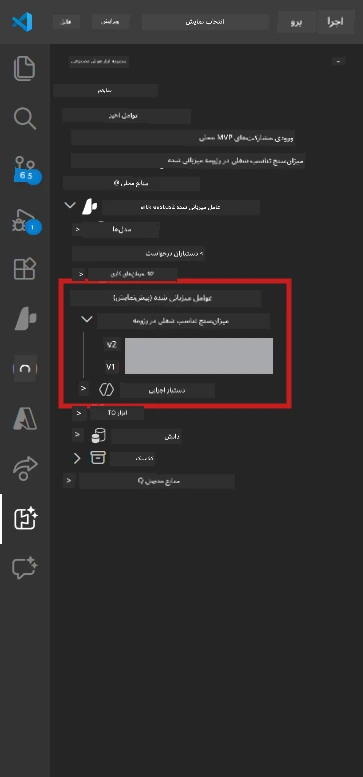

# ماژول ۷ - تأیید در زمین بازی

⏱️ ~۱۰ دقیقه

در این ماژول، جریان کاری چندعامله مستقر شده خود را در VS Code و پرتال Foundry آزمایش می‌کنید تا تأیید کنید که عامل همانند آزمایش محلی رفتار می‌کند.

---

## چرا پس از استقرار دوباره آزمایش کنیم؟

محیط میزبانی شده از نظر چند نکته مهم با محیط محلی تفاوت دارد:

| | محلی | میزبانی شده |
|--|-------|--------|
| **هویت** | ورود شخصی شما (`DefaultAzureCredential`) | هویت Entra اختصاصی برای هر عامل (به‌طور خودکار هنگام استقرار فراهم می‌شود) |
| **نقطه پایان** | `http://localhost:8088/responses` | URL مدیریت‌شده توسط سرویس Foundry Agent |
| **شبکه** | دستگاه شما → Azure OpenAI + MCP | ستون فقرات Azure (تاخیر کمتر) |

یک متغیر محیطی پیکربندی نادرست، مشکل RBAC، یا مسدود شدن تماس خروجی MCP ابتدا اینجا نمایان می‌شود.

---

## گزینه الف: آزمایش در زمین بازی VS Code (پیشنهاد شده به عنوان اولین گزینه)

### گام ۱: به عامل میزبانی‌شده خود بروید

۱. روی نماد **Foundry Toolkit** در نوار فعالیت کلیک کنید.
۲. پروژه خود را گسترش دهید → **Hosted Agents (Preview)** → عامل خود را پیدا کنید.



### گام ۲: یک نسخه انتخاب کنید

۱. روی نام عامل کلیک کنید تا نسخه‌های آن باز شود.
۲. روی `v1` کلیک کنید → وضعیت **فعال** بودن را بررسی کنید (نوار کناری ممکن است "Running" یا "Started" را نمایش دهد- هر دو وضعیت آماده را نشان می‌دهند).

### گام ۳: زمین بازی را باز کنید

۱. روی **Playground** کلیک کنید (یا روی نسخه راست‌کلیک کنید → **Open in Playground**).
۲. یک پنجره چت در زبانه VS Code باز می‌شود.

### گام ۴: تست‌های دود را اجرا کنید

همان ۳ تست ماژول [۵](05-test-locally.md) را استفاده کنید. هر پیام را در جعبه ورودی زمین بازی تایپ کرده و روی **Send** (یا **Enter**) بزنید.

#### تست ۱ - رزومه کامل + شرح شغل (جریان استاندارد)

متن درخواست رزومه کامل + شرح شغل را از ماژول ۵، تست ۱ (Jane Doe + Senior Cloud Engineer در Contoso Ltd) جایگذاری کنید.

**انتظار می‌رود:**
- امتیاز تناسب با ریاضیات تفکیک‌شده (مقیاس ۱۰۰ نمره‌ای)
- بخش مهارت‌های تطابق یافته
- بخش مهارت‌های از دست رفته
- **یک کارت شکاف برای هر مهارت از دست رفته** با آدرس‌های Microsoft Learn
- نقشه راه یادگیری با جدول زمانی

#### تست ۲ - تست کوتاه سریع (ورودی حداقلی)

```
RESUME: 3 years Python developer, knows Django and PostgreSQL, no cloud experience.

JOB: Cloud DevOps Engineer requiring AWS, Kubernetes, Terraform, CI/CD. 5 years needed.
```

**انتظار می‌رود:**
- امتیاز تناسب کمتر (< ۴۰)
- ارزیابی صادقانه با مسیر یادگیری مرحله‌ای
- چند کارت شکاف (AWS، Kubernetes، Terraform، CI/CD، شکاف تجربه)

#### تست ۳ - نامزد با تناسب بالا

```
RESUME:
10 years Azure Cloud Architect. AZ-305 certified. Expert in AKS, Terraform, Azure DevOps, 
Azure Functions, Helm, Prometheus, Grafana, Python, Go. Led platform team of 8.

JOB:
Senior Cloud Engineer. Required: AKS, Terraform, Azure DevOps, Python. Preferred: Helm, Go.
5+ years experience. AZ-305 preferred.
```

**انتظار می‌رود:**
- امتیاز تناسب بالا (≥ ۸۰)
- تمرکز روی آماده‌سازی مصاحبه و پرداختن نهایی
- کارت‌های شکاف کم یا بدون آنها
- جدول زمانی کوتاه متمرکز بر آماده‌سازی

### گام ۵: مقایسه با نتایج محلی

یادداشت‌ها یا زبانه مرورگر خود را از ماژول ۵ باز کنید که پاسخ‌های محلی را ذخیره کرده‌اید. برای هر تست:

- آیا پاسخ دارای **ساختار یکسان** است (امتیاز تناسب، کارت‌های شکاف، نقشه راه)؟
- آیا از **قانون امتیازدهی مشابه** استفاده می‌کند (تفکیک ۱۰۰ نمره‌ای)؟
- آیا آدرس‌های **Microsoft Learn** هنوز در کارت‌های شکاف حضور دارند؟
- آیا **یک کارت شکاف برای هر مهارت از دست رفته** وجود دارد (قطع نشده)؟

> **تفاوت‌های جزئی در واژگان طبیعی هستند** — مدل غیرقطعی است. روی ساختار، ثبات امتیازدهی، و استفاده از ابزار MCP تمرکز کنید.

---

## گزینه ب: آزمایش در پرتال Foundry

پرتال [Foundry Portal](https://ai.azure.com) زمین بازی مبتنی بر وب را فراهم می‌کند که برای به اشتراک‌گذاری با همکاران یا ذی‌نفعان مفید است.

### گام ۱: پرتال Foundry را باز کنید

۱. مرورگر خود را باز کرده و به [https://ai.azure.com](https://ai.azure.com) بروید.
۲. با همان حساب Azure که در طول کارگاه استفاده کرده‌اید وارد شوید.

### گام ۲: به پروژه خود بروید

۱. در صفحه اصلی به دنبال **Recent projects** در نوار کناری سمت چپ باشید.
۲. روی نام پروژه خود کلیک کنید (مثلاً `workshop-agents`).
۳. اگر نمی‌بینید، روی **All projects** کلیک کرده و جستجو کنید.

### گام ۳: عامل مستقر شده خود را پیدا کنید

۱. در ناوبری سمت چپ پروژه، روی **Build** → **Agents** کلیک کنید (یا بخش **Agents** را پیدا کنید).
۲. باید فهرستی از عوامل را ببینید. عامل مستقر شده خود را پیدا کنید (مثلاً `resume-job-fit-evaluator`).
۳. روی نام عامل برای باز کردن صفحه جزئیات آن کلیک کنید.

### گام ۴: زمین بازی را باز کنید

۱. در صفحه جزئیات عامل، به نوار ابزار بالا نگاه کنید.
۲. روی **Open in playground** (یا **Try in playground**) کلیک کنید.
۳. یک رابط چت باز می‌شود.

### گام ۵: همان تست‌های دود را اجرا کنید

هر ۳ تست از بخش زمین بازی VS Code را تکرار کنید. هر پاسخ را هم با نتایج محلی (ماژول ۵) و هم با نتایج زمین بازی VS Code (گزینه الف بالا) مقایسه کنید.

---

## تأیید مخصوص چندعامل

فراتر از درستی پایه، این رفتارهای مخصوص چندعامل را بررسی کنید:

### اجرای ابزار MCP

| بررسی | چگونه تأیید کنیم | شرایط موفقیت |
|-------|---------------|----------------|
| تماس‌های MCP موفق | کارت‌های شکاف حاوی آدرس‌های `learn.microsoft.com` هستند | آدرس‌های واقعی، نه پیام‌های جایگزین |
| تماس‌های متعدد MCP | هر شکاف با اولویت بالا/متوسط منابع دارد | فقط اولین کارت شکاف نیست |
| جایگزینی MCP کار می‌کند | اگر آدرس‌ها fehlen، متن جایگزین را بررسی کنید | عامل هنوز کارت‌های شکاف تولید می‌کند (با یا بدون آدرس‌ها) |

### هماهنگی عامل

| بررسی | چگونه تأیید کنیم | شرایط موفقیت |
|-------|---------------|----------------|
| هر ۴ عامل اجرا شدند | خروجی حاوی امتیاز تناسب و کارت‌های شکاف است | امتیاز از MatchingAgent، کارت‌ها از GapAnalyzer |
| اجرای متوالی | زمان پاسخ معقول است (< ۲ دقیقه) | اگر > ۳ دقیقه، خطا در لاگ ترمینال بررسی شود |
| سلامت جریان داده | کارت‌های شکاف به مهارت‌های گزارش تطابق اشاره دارند | مهارت‌های ساخته شده که در شرح شغل نیستند وجود ندارد |

---

## معیار اعتبارسنجی

از این معیار برای ارزیابی رفتار میزبانی شده جریان کاری چندعامل خود استفاده کنید:

| # | معیار | شرایط موفقیت | موفق؟ |
|---|----------|---------------|-------|
| ۱ | **درستی عملکرد** | عامل به رزومه + شرح شغل با امتیاز تناسب و تحلیل شکاف پاسخ می‌دهد | |
| ۲ | **ثبات امتیازدهی** | امتیاز تناسب از مقیاس ۱۰۰ نمره‌ای با تفکیک ریاضی استفاده می‌کند | |
| ۳ | **کامل بودن کارت شکاف** | یک کارت برای هر مهارت از دست رفته (قطع نشده یا ترکیب نشده) | |
| ۴ | **ادغام ابزار MCP** | کارت‌های شکاف شامل آدرس‌های واقعی Microsoft Learn هستند | |
| ۵ | **ثبات ساختار** | ساختار خروجی بین اجرای محلی و میزبان مانند هم است | |
| ۶ | **زمان پاسخ** | عامل میزبان در کمتر از ۲ دقیقه برای ارزیابی کامل پاسخ می‌دهد | |
| ۷ | **بدون خطا** | خطای HTTP 500، تایم‌اوت یا پاسخ‌های خالی وجود ندارد | |

> "قبولی" یعنی همه ۷ معیار برای هر ۳ تست دود در حداقل یکی از زمین‌های بازی (VS Code یا پرتال) برآورده شده‌اند.

---

## رفع اشکال مشکلات زمین بازی

| علامت | علت محتمل | راه حل |
|---------|-------------|-----|
| زمین بازی بارگذاری نمی‌شود | کانتینر در حالت `active` نیست | به [ماژول ۶](06-deploy-to-foundry.md) برگردید، وضعیت استقرار را بررسی کنید. اگر `creating` است صبر کنید |
| عامل پاسخ خالی می‌دهد | نام استقرار مدل تطابق ندارد | در `agent.yaml` → `environment_variables` → `AZURE_AI_MODEL_DEPLOYMENT_NAME` بررسی کنید که با مدل مستقرشده یکی باشد |
| عامل پیام خطا می‌دهد | مجوز [RBAC](https://learn.microsoft.com/azure/foundry/concepts/rbac-foundry) غایب است | نقش **[Foundry User](https://aka.ms/foundry-ext-project-role)** (قبلاً Azure AI User) را در محدوده پروژه اختصاص دهید |
| آدرس‌های Microsoft Learn در کارت‌های شکاف نیست | خروجی MCP مسدود شده یا سرور MCP در دسترس نیست | بررسی کنید کانتینر می‌تواند به `learn.microsoft.com` دسترسی داشته باشد. به [ماژول ۸](08-troubleshooting.md) مراجعه کنید |
| فقط ۱ کارت شکاف (قطع شده) | دستورالعمل‌های GapAnalyzer بلاک "CRITICAL" را ندارد | مرور [ماژول ۳، گام ۲.۴](03-configure-agents.md) |
| امتیاز تناسب بسیار متفاوت از محلی | مدل یا دستورالعمل متفاوت مستقر شده | متغیرهای env در `agent.yaml` را با `.env` محلی مقایسه کنید. در صورت نیاز مجدداً استقرار دهید |
| "Agent not found" در پرتال | استقرار هنوز در حال انتشار است یا ناموفق بوده | ۲ دقیقه صبر کنید، صفحه را تازه کنید. اگر هنوز نیست، مجدداً از [ماژول ۶](06-deploy-to-foundry.md) استقرار دهید |

---

### نقطه بررسی

- [ ] عامل را در زمین بازی VS Code تست کرده‌ام - هر ۳ تست دود موفق بودند
- [ ] عامل را در زمین بازی [Foundry Portal](https://ai.azure.com) تست کرده‌ام - هر ۳ تست دود موفق بودند
- [ ] پاسخ‌ها از نظر ساختار با تست محلی همخوانی دارند (امتیاز تناسب، کارت‌های شکاف، نقشه راه)
- [ ] آدرس‌های Microsoft Learn در کارت‌های شکاف موجود هستند (ابزار MCP در محیط میزبانی شده کار می‌کند)
- [ ] یک کارت شکاف برای هر مهارت از دست رفته (بدون قطع شدن)
- [ ] در طول آزمایش خطا یا تایم‌اوت وجود نداشت
- [ ] معیار اعتبارسنجی را تکمیل کرده‌ام (هر ۷ معیار پذیرفته شده)

---

**قبلی:** [۰۶ - استقرار در Foundry](06-deploy-to-foundry.md) · **بعدی:** [۰۸ - رفع اشکال →](08-troubleshooting.md)

---

<!-- CO-OP TRANSLATOR DISCLAIMER START -->
**سلب مسئولیت**:
این سند با استفاده از سرویس ترجمه هوش مصنوعی [Co-op Translator](https://github.com/Azure/co-op-translator) ترجمه شده است. در حالی که ما در تلاش برای دقت هستیم، لطفاً توجه داشته باشید که ترجمه‌های خودکار ممکن است شامل خطاها یا نادرستی‌هایی باشند. سند اصلی به زبان مادری خود باید به عنوان منبع معتبر در نظر گرفته شود. برای اطلاعات حیاتی، ترجمه حرفه‌ای انسانی توصیه می‌شود. ما در قبال هرگونه سوء تفاهم یا برداشت نادرست ناشی از استفاده از این ترجمه مسئولیتی نداریم.
<!-- CO-OP TRANSLATOR DISCLAIMER END -->