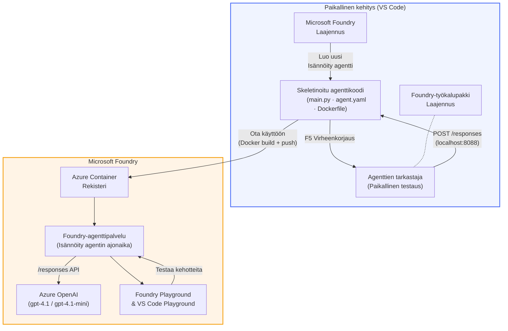

# Foundry Toolkit + Foundry Hosted Agents -työpaja

[](https://www.python.org/)
[](https://github.com/microsoft/agents)
[](https://learn.microsoft.com/azure/ai-foundry/agents/concepts/hosted-agents/)
[](https://ai.azure.com/)
[](https://learn.microsoft.com/azure/ai-services/openai/)
[](https://learn.microsoft.com/cli/azure/install-azure-cli)
[](https://learn.microsoft.com/azure/developer/azure-developer-cli/install-azd)
[](https://www.docker.com/)
[](https://marketplace.visualstudio.com/items?itemName=ms-windows-ai-studio.windows-ai-studio)
[](LICENSE)

Rakenna, testaa ja ota käyttöön tekoälyagentteja **Microsoft Foundry Agent Servicen** kautta **Hosted Agents** -muodossa — kokonaan VS Codesta käyttäen **Microsoft Foundry -laajennusta** ja **Foundry Toolkitia**.

> **Hosted Agents ovat tällä hetkellä esikatseluvaiheessa.** Tuetut alueet ovat rajoitettuja — katso [alueiden saatavuus](https://learn.microsoft.com/azure/foundry/agents/concepts/hosted-agents#region-availability).

> Jokaisen labran `agent/`-kansio luodaan **automaattisesti** Foundry-laajennuksen toimesta — sen jälkeen koodia räätälöidään, testataan paikallisesti ja otetaan käyttöön.

### 🌐 Monikielinen tuki

#### Tuettu GitHub Actionin kautta (automaattinen & aina ajan tasalla)

<!-- CO-OP TRANSLATOR LANGUAGES TABLE START -->
[Arabic](../ar/README.md) | [Bengali](../bn/README.md) | [Bulgarian](../bg/README.md) | [Burmese (Myanmar)](../my/README.md) | [Chinese (Simplified)](../zh-CN/README.md) | [Chinese (Traditional, Hong Kong)](../zh-HK/README.md) | [Chinese (Traditional, Macau)](../zh-MO/README.md) | [Chinese (Traditional, Taiwan)](../zh-TW/README.md) | [Croatian](../hr/README.md) | [Czech](../cs/README.md) | [Danish](../da/README.md) | [Dutch](../nl/README.md) | [Estonian](../et/README.md) | [Finnish](./README.md) | [French](../fr/README.md) | [German](../de/README.md) | [Greek](../el/README.md) | [Hebrew](../he/README.md) | [Hindi](../hi/README.md) | [Hungarian](../hu/README.md) | [Indonesian](../id/README.md) | [Italian](../it/README.md) | [Japanese](../ja/README.md) | [Kannada](../kn/README.md) | [Khmer](../km/README.md) | [Korean](../ko/README.md) | [Lithuanian](../lt/README.md) | [Malay](../ms/README.md) | [Malayalam](../ml/README.md) | [Marathi](../mr/README.md) | [Nepali](../ne/README.md) | [Nigerian Pidgin](../pcm/README.md) | [Norwegian](../no/README.md) | [Persian (Farsi)](../fa/README.md) | [Polish](../pl/README.md) | [Portuguese (Brazil)](../pt-BR/README.md) | [Portuguese (Portugal)](../pt-PT/README.md) | [Punjabi (Gurmukhi)](../pa/README.md) | [Romanian](../ro/README.md) | [Russian](../ru/README.md) | [Serbian (Cyrillic)](../sr/README.md) | [Slovak](../sk/README.md) | [Slovenian](../sl/README.md) | [Spanish](../es/README.md) | [Swahili](../sw/README.md) | [Swedish](../sv/README.md) | [Tagalog (Filipino)](../tl/README.md) | [Tamil](../ta/README.md) | [Telugu](../te/README.md) | [Thai](../th/README.md) | [Turkish](../tr/README.md) | [Ukrainian](../uk/README.md) | [Urdu](../ur/README.md) | [Vietnamese](../vi/README.md)

> **Haluatko mieluummin kloonata paikallisesti?**
>
> Tässä repositoriossa on yli 50 kielen käännökset, mikä lisää merkittävästi latauskokoa. Kloonaaaksesi ilman käännöksiä, käytä sparse checkoutia:
>
> **Bash / macOS / Linux:**
> ```bash
> git clone --filter=blob:none --sparse https://github.com/microsoft-foundry/Foundry_Toolkit_for_VSCode_Lab.git
> cd Foundry_Toolkit_for_VSCode_Lab
> git sparse-checkout set --no-cone '/*' '!translations' '!translated_images'
> ```
>
> **CMD (Windows):**
> ```cmd
> git clone --filter=blob:none --sparse https://github.com/microsoft-foundry/Foundry_Toolkit_for_VSCode_Lab.git
> cd Foundry_Toolkit_for_VSCode_Lab
> git sparse-checkout set --no-cone "/*" "!translations" "!translated_images"
> ```
>
> Saat kaiken mitä tarvitset kurssin suorittamiseen paljon nopeammalla latauksella.
<!-- CO-OP TRANSLATOR LANGUAGES TABLE END -->

---

## Arkkitehtuuri


**Virta:** Foundry-laajennus luo agentin → räätälöit koodin & ohjeet → testaat paikallisesti Agent Inspectorilla → otat käyttöön Foundryssa (Docker-kuva työnnetään ACR:ään) → validoit Playgroundissa.

---

## Mitä rakennat

| Labra | Kuvaus | Tila |
|-------|--------|-------|
| **Lab 01 - Yksittäinen agentti** | Rakenna **"Selitä kuin olisin johtaja" -agentti**, testaa paikallisesti ja ota käyttöön Foundryssa | ✅ Saatavilla |
| **Lab 02 - Moni-agenttinen työnkulku** | Rakenna **"Ansioluettelo → Työhön sopivuuden arvioija"** - 4 agenttia tekee yhteistyötä pisteyttääkseen ansioluettelon ja luodakseen oppimissuunnitelman | ✅ Saatavilla |

---

## Tapaa Johtaja-agentti

Tässä työpajassa rakennat **"Selitä kuin olisin johtaja" -agentin** — tekoälyagentin, joka ottaa vaikeat tekniset termit ja kääntää ne rauhallisiksi, johtajille sopiviksi tiivistyksiksi. Koska ollaan rehellisiä, kukaan johtoryhmässä ei halua kuulla "säikeiden uupumisesta, jonka aiheutti v3.2:ssa käyttöön otetut synkroniset kutsut."

Rakensin tämän agentin liian monen kerran jälkeen, kun täydellisesti laadittu analyysi sai vastaukseksi: *"Eli... Onko verkkosivusto alas vai ei?"*

### Miten se toimii

Syötät sille teknisen päivityksen. Se palauttaa johtajayhteenvetona kolme kohokohtaa, ilman ammattisanastoa, ilman pinon jälkiä, ilman eksistentiaalista ahdistusta. Vain **mitä tapahtui**, **liiketoiminnan vaikutus** ja **seuraava askel**.

### Näe se toiminnassa

**Sinä sanot:**
> "API-viive kasvoi säikeiden uupumisen vuoksi, jonka aiheuttivat v3.2:ssa käyttöön otetut synkroniset kutsut."

**Agentti vastaa:**

> **Johtajayhteenveto:**
> - **Mitä tapahtui:** Viimeisimmän julkaisun jälkeen järjestelmä hidastui.
> - **Liiketoiminnan vaikutus:** Jotkut käyttäjät kokivat viiveitä palvelun käytössä.
> - **Seuraava askel:** Muutos on peruutettu ja korjausta valmistellaan ennen uudelleenkäyttöönottoa.

### Miksi tämä agentti?

Se on kuoleman yksinkertainen, yhden käyttötarkoituksen agentti — täydellinen oppimaan hosted-agentti työnkulku päästä päähän ilman monimutkaisia työkaluketjuja. Ja rehellisesti? Jokainen insinööriryhmä voisi käyttää tällaista.

---

## Työpajan rakenne

```
📂 Foundry_Toolkit_for_VSCode_Lab/
├── 📄 README.md                      ← You are here
├── 📂 ExecutiveAgent/                ← Standalone hosted agent project
│   ├── agent.yaml
│   ├── Dockerfile
│   ├── main.py
│   └── requirements.txt
└── 📂 workshop/
    ├── 📂 lab01-single-agent/        ← Full lab: docs + agent code
    │   ├── README.md                 ← Hands-on lab instructions
    │   ├── 📂 docs/                  ← Step-by-step tutorial modules
    │   │   ├── 00-prerequisites.md
    │   │   ├── 01-install-foundry-toolkit.md
    │   │   ├── 02-create-foundry-project.md
    │   │   ├── 03-create-hosted-agent.md
    │   │   ├── 04-configure-and-code.md
    │   │   ├── 05-test-locally.md
    │   │   ├── 06-deploy-to-foundry.md
    │   │   ├── 07-verify-in-playground.md
    │   │   └── 08-troubleshooting.md
    │   └── 📂 agent/                 ← Reference solution (auto-scaffolded by Foundry extension)
    │       ├── agent.yaml
    │       ├── Dockerfile
    │       ├── main.py
    │       └── requirements.txt
    └── 📂 lab02-multi-agent/         ← Resume → Job Fit Evaluator
        ├── README.md                 ← Hands-on lab instructions (end-to-end)
        ├── 📂 docs/                  ← Step-by-step tutorial modules
        │   ├── 00-prerequisites.md
        │   ├── 01-understand-multi-agent.md
        │   ├── 02-scaffold-multi-agent.md
        │   ├── 03-configure-agents.md
        │   ├── 04-orchestration-patterns.md
        │   ├── 05-test-locally.md
        │   ├── 06-deploy-to-foundry.md
        │   ├── 07-verify-in-playground.md
        │   └── 08-troubleshooting.md
        └── 📂 PersonalCareerCopilot/ ← Reference solution (multi-agent workflow)
            ├── agent.yaml
            ├── Dockerfile
            ├── main.py
            └── requirements.txt
```

> **Huom:** Jokaisen labran sisällä oleva `agent/`-kansio on se, jonka **Microsoft Foundry -laajennus** luo, kun suoritat komentopalettista `Microsoft Foundry: Create a New Hosted Agent` -komennon. Tiedostot räätälöidään sitten agentin ohjeilla, työkaluilla ja asetuksilla. Lab 01 ohjaa sinut tämän luomiseen alusta asti.

---

## Aloittaminen

### 1. Kloonaa repositorio

```bash
git clone https://github.com/microsoft-foundry/Foundry_Toolkit_for_VSCode_Lab.git
cd Foundry_Toolkit_for_VSCode_Lab
```

### 2. Luo Python-virtuaaliympäristö

```bash
python -m venv venv
```

Aktivoi se:

- **Windows (PowerShell):**
  ```powershell
  .\venv\Scripts\Activate.ps1
  ```

- **macOS / Linux:**
  ```bash
  source venv/bin/activate
  ```

### 3. Asenna riippuvuudet

```bash
pip install -r workshop/lab01-single-agent/agent/requirements.txt
```

### 4. Määritä ympäristömuuttujat

Kopioi esimerkkitiedosto `.env` agentin kansiosta ja täytä arvosi:

```bash
cp workshop/lab01-single-agent/agent/.env.example workshop/lab01-single-agent/agent/.env
```

Muokkaa tiedostoa `workshop/lab01-single-agent/agent/.env`:

```env
AZURE_AI_PROJECT_ENDPOINT=https://<your-account>.services.ai.azure.com/api/projects/<your-project>
MODEL_DEPLOYMENT_NAME=<your-model-deployment-name>
```

### 5. Seuraa työpajan labroja

Jokainen labra on itsenäinen omine moduuleineen. Aloita **Lab 01** opitaksesi perusteet ja siirry sitten **Lab 02**:een moniacjenttisiin työnkulkuihin.

#### Lab 01 - Yksittäinen agentti ([täydelliset ohjeet](workshop/lab01-single-agent/README.md))

| # | Moduuli | Linkki |
|---|---------|---------|
| 1 | Lue esivaatimukset | [00-prerequisites.md](workshop/lab01-single-agent/docs/00-prerequisites.md) |
| 2 | Asenna Foundry Toolkit & Foundry -laajennus | [01-install-foundry-toolkit.md](workshop/lab01-single-agent/docs/01-install-foundry-toolkit.md) |
| 3 | Luo Foundry-projekti | [02-create-foundry-project.md](workshop/lab01-single-agent/docs/02-create-foundry-project.md) |
| 4 | Luo hosted agentti | [03-create-hosted-agent.md](workshop/lab01-single-agent/docs/03-create-hosted-agent.md) |
| 5 | Määritä ohjeet & ympäristö | [04-configure-and-code.md](workshop/lab01-single-agent/docs/04-configure-and-code.md) |
| 6 | Testaa paikallisesti | [05-test-locally.md](workshop/lab01-single-agent/docs/05-test-locally.md) |
| 7 | Ota käyttöön Foundryssa | [06-deploy-to-foundry.md](workshop/lab01-single-agent/docs/06-deploy-to-foundry.md) |
| 8 | Tarkista Playgroundissa | [07-verify-in-playground.md](workshop/lab01-single-agent/docs/07-verify-in-playground.md) |
| 9 | Vianmääritys | [08-troubleshooting.md](workshop/lab01-single-agent/docs/08-troubleshooting.md) |

#### Lab 02 - Moni-agenttinen työnkulku ([täydelliset ohjeet](workshop/lab02-multi-agent/README.md))

| # | Moduuli | Linkki |
|---|---------|---------|
| 1 | Esivaatimukset (Lab 02) | [00-prerequisites.md](workshop/lab02-multi-agent/docs/00-prerequisites.md) |
| 2 | Ymmärrä moni-agentti arkkitehtuuri | [01-understand-multi-agent.md](workshop/lab02-multi-agent/docs/01-understand-multi-agent.md) |
| 3 | Luo moni-agenttiprojekti | [02-scaffold-multi-agent.md](workshop/lab02-multi-agent/docs/02-scaffold-multi-agent.md) |
| 4 | Määritä agentit & ympäristö | [03-configure-agents.md](workshop/lab02-multi-agent/docs/03-configure-agents.md) |
| 5 | Orkestrointimallit | [04-orchestration-patterns.md](workshop/lab02-multi-agent/docs/04-orchestration-patterns.md) |
| 6 | Testaa paikallisesti (moni-agentti) | [05-test-locally.md](workshop/lab02-multi-agent/docs/05-test-locally.md) |
| 7 | Julkaise Foundryyn | [06-deploy-to-foundry.md](workshop/lab02-multi-agent/docs/06-deploy-to-foundry.md) |
| 8 | Vahvista leikkikentällä | [07-verify-in-playground.md](workshop/lab02-multi-agent/docs/07-verify-in-playground.md) |
| 9 | Vianmääritys (moni-agentti) | [08-troubleshooting.md](workshop/lab02-multi-agent/docs/08-troubleshooting.md) |

---

## Ylläpitäjä

<table>
<tr>
    <td align="center"><a href="https://github.com/ShivamGoyal03">
        <br />
        <sub><b>Shivam Goyal</b></sub>
    </a><br />
    </td>
</tr>
</table>

---

## Vaaditut käyttöoikeudet (pikaviite)

| Tilanne | Vaaditut roolit |
|----------|---------------|
| Luo uusi Foundry-projekti | **Azure AI Owner** Foundry-resurssissa |
| Julkaise olemassa olevaan projektiin (uudet resurssit) | **Azure AI Owner** + **Contributor** tilauksessa |
| Julkaise täysin konfiguroituun projektiin | **Reader** tilillä + **Azure AI User** projektissa |

> **Tärkeää:** Azure `Owner` ja `Contributor` -roolit sisältävät vain *hallinnolliset* oikeudet, eivät *kehitysoikeuksia* (data-toiminnot). Tarvitset **Azure AI User** tai **Azure AI Owner** rakentaaksesi ja julkaistaksesi agenteja.

---

## Viitteet

- [Pikaopas: Julkaise ensimmäinen isännöity agenttisi (VS Code)](https://learn.microsoft.com/azure/foundry/agents/quickstarts/quickstart-hosted-agent)
- [Mitä ovat isännöidyt agentit?](https://learn.microsoft.com/azure/foundry/agents/concepts/hosted-agents)
- [Luo isännöityjen agenttien työnkulkuja VS Codessa](https://learn.microsoft.com/azure/foundry/agents/how-to/vs-code-agents-workflow-pro-code)
- [Julkaise isännöity agentti](https://learn.microsoft.com/azure/foundry/agents/how-to/deploy-hosted-agent)
- [RBAC Microsoft Foundrylle](https://learn.microsoft.com/azure/foundry/concepts/rbac-foundry)
- [Arkkitehtuurin tarkistus -agenttimalli](https://github.com/Azure-Samples/agent-architecture-review-sample) - Todellisen maailman isännöity agentti MCP-työkaluilla, Excalidraw-kaavioilla ja kaksoisjulkaisulla

---


## Lisenssi

[MIT](../../LICENSE)

---

<!-- CO-OP TRANSLATOR DISCLAIMER START -->
**Vastuuvapauslauseke**:  
Tämä asiakirja on käännetty käyttämällä tekoälypohjaista käännöspalvelua [Co-op Translator](https://github.com/Azure/co-op-translator). Vaikka pyrimme tarkkuuteen, ota huomioon, että automaattiset käännökset voivat sisältää virheitä tai epätarkkuuksia. Alkuperäistä asiakirjaa sen alkuperäiskielellä tulee pitää virallisena lähteenä. Tärkeiden tietojen osalta suositellaan ammattimaista ihmiskäännöstä. Emme ole vastuussa tästä käännöksestä johtuvista väärinkäsityksistä tai väärinymmärryksistä.
<!-- CO-OP TRANSLATOR DISCLAIMER END -->