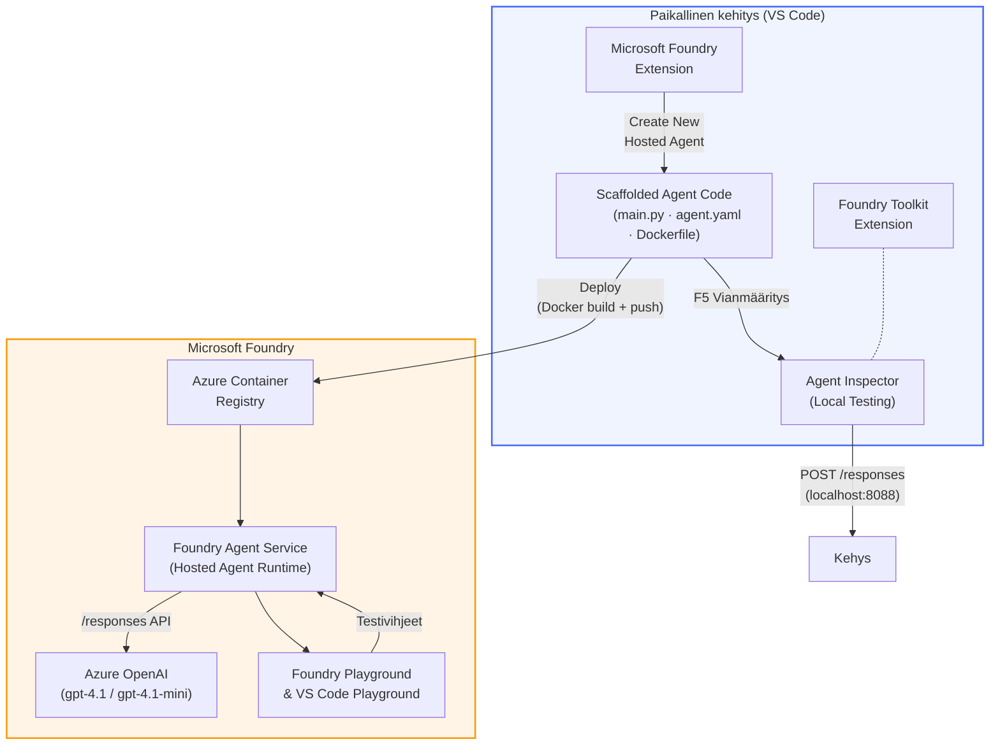

# Foundry Toolkit + Foundry Hosting Agenttien Työpaja

[](https://www.python.org/)
[](https://github.com/microsoft/agents)
[](https://learn.microsoft.com/azure/foundry/agents/concepts/hosted-agents)
[](https://ai.azure.com/)
[](https://learn.microsoft.com/azure/ai-services/openai/)
[](https://learn.microsoft.com/cli/azure/install-azure-cli)
[](https://learn.microsoft.com/azure/developer/azure-developer-cli/install-azd)
[](https://www.docker.com/)
[](https://marketplace.visualstudio.com/items?itemName=ms-windows-ai-studio.windows-ai-studio)
[](LICENSE)

Rakenna, testaa ja ota käyttöön tekoälyagentteja **Microsoft Foundry Agent Service** -palvelussa **Hosted Agents** -muodossa – kokonaan VS Coden kautta käyttämällä **Microsoft Foundry -laajennusta** ja **Foundry Toolkitia**.

> **Hosted Agents ovat tällä hetkellä esikatseluvaiheessa.** Tuetut alueet ovat rajoitettuja – katso [alueiden saatavuus](https://learn.microsoft.com/azure/foundry/agents/concepts/hosted-agents#region-availability).

> Kunkin harjoituksen `agent/`-kansio luodaan **automaattisesti** Foundry-laajennuksen toimesta – sen jälkeen koodia muokataan, testataan paikallisesti ja otetaan käyttöön.

### 🌐 Monikielinen tuki

#### Tuettu GitHub Action -työkalulla (automaattinen ja aina ajan tasalla)

<!-- CO-OP TRANSLATOR LANGUAGES TABLE START -->
[Arabic](../ar/README.md) | [Bengali](../bn/README.md) | [Bulgarian](../bg/README.md) | [Burmese (Myanmar)](../my/README.md) | [Chinese (Simplified)](../zh-CN/README.md) | [Chinese (Traditional, Hong Kong)](../zh-HK/README.md) | [Chinese (Traditional, Macau)](../zh-MO/README.md) | [Chinese (Traditional, Taiwan)](../zh-TW/README.md) | [Croatian](../hr/README.md) | [Czech](../cs/README.md) | [Danish](../da/README.md) | [Dutch](../nl/README.md) | [Estonian](../et/README.md) | [Finnish](./README.md) | [French](../fr/README.md) | [German](../de/README.md) | [Greek](../el/README.md) | [Hebrew](../he/README.md) | [Hindi](../hi/README.md) | [Hungarian](../hu/README.md) | [Indonesian](../id/README.md) | [Italian](../it/README.md) | [Japanese](../ja/README.md) | [Kannada](../kn/README.md) | [Khmer](../km/README.md) | [Korean](../ko/README.md) | [Lithuanian](../lt/README.md) | [Malay](../ms/README.md) | [Malayalam](../ml/README.md) | [Marathi](../mr/README.md) | [Nepali](../ne/README.md) | [Nigerian Pidgin](../pcm/README.md) | [Norwegian](../no/README.md) | [Persian (Farsi)](../fa/README.md) | [Polish](../pl/README.md) | [Portuguese (Brazil)](../pt-BR/README.md) | [Portuguese (Portugal)](../pt-PT/README.md) | [Punjabi (Gurmukhi)](../pa/README.md) | [Romanian](../ro/README.md) | [Russian](../ru/README.md) | [Serbian (Cyrillic)](../sr/README.md) | [Slovak](../sk/README.md) | [Slovenian](../sl/README.md) | [Spanish](../es/README.md) | [Swahili](../sw/README.md) | [Swedish](../sv/README.md) | [Tagalog (Filipino)](../tl/README.md) | [Tamil](../ta/README.md) | [Telugu](../te/README.md) | [Thai](../th/README.md) | [Turkish](../tr/README.md) | [Ukrainian](../uk/README.md) | [Urdu](../ur/README.md) | [Vietnamese](../vi/README.md)

> **Haluatko mieluummin kloonata paikallisesti?**
>
> Tämä arkisto sisältää yli 50 kielen käännökset, mikä kasvattaa merkittävästi latausmäärää. Jos haluat kloonata ilman käännöksiä, käytä sparse checkout -toimintoa:
>
> **Bash / macOS / Linux:**
> ```bash
> git clone --filter=blob:none --sparse https://github.com/microsoft-foundry/Foundry_Toolkit_for_VSCode_Lab.git
> cd Foundry_Toolkit_for_VSCode_Lab
> git sparse-checkout set --no-cone '/*' '!translations' '!translated_images'
> ```
>
> **CMD (Windows):**
> ```cmd
> git clone --filter=blob:none --sparse https://github.com/microsoft-foundry/Foundry_Toolkit_for_VSCode_Lab.git
> cd Foundry_Toolkit_for_VSCode_Lab
> git sparse-checkout set --no-cone "/*" "!translations" "!translated_images"
> ```
>
> Saat kaiken tarvitsemasi kurssin suorittamiseen huomattavasti nopeammalla latauksella.
<!-- CO-OP TRANSLATOR LANGUAGES TABLE END -->

---

## Arkkitehtuuri


```mermaid
flowchart TB
    subgraph Local["Paikallinen kehitys (VS Code)"]
        direction TB
        FE["Microsoft Foundry
        Extension"]
        FoundryToolkit["Foundry Toolkit
        Extension"]
        Scaffold["Scaffolded Agent Code
        (main.py · agent.yaml · Dockerfile)"]
        Inspector["Agent Inspector
        (Local Testing)"]
        FE -- "Create New
        Hosted Agent" --> Scaffold
        Scaffold -- "F5 Vianmääritys" --> Inspector
        FoundryToolkit -.- Inspector
    end

    subgraph Cloud["Microsoft Foundry"]
        direction TB
        ACR["Azure Container
        Registry"]
        AgentService["Foundry Agent Service
        (Hosted Agent Runtime)"]
        Model["Azure OpenAI
        (gpt-4.1 / gpt-4.1-mini)"]
        Playground["Foundry Playground
        & VS Code Playground"]
        ACR --> AgentService
        AgentService -- "/responses API" --> Model
        AgentService --> Playground
    end

    Scaffold -- "Deploy
    (Docker build + push)" --> ACR
    Inspector -- "POST /responses
    (localhost:8088)" --> Kehys
    Playground -- "Testivihjeet" --> AgentService

    style Local fill:#f0f4ff,stroke:#4a6cf7,stroke-width:2px
    style Cloud fill:#fff4e6,stroke:#f59e0b,stroke-width:2px
```

**Käytön kulku:** Foundry-laajennus luo agentin rungon → muokkaat koodia ja ohjeita → testaat paikallisesti Agent Inspectorilla → otat käyttöön Foundryssä (Docker-kuva työnnetään ACR:ään) → varmistat Playgroundissa.

---

## Mitä rakennat

| Harjoitus | Kuvaus | Tila |
|-----|-------------|--------|
| **Harjoitus 01 - Yksittäinen agentti** | Rakenna **"Explain Like I'm an Executive" -agentti**, testaa paikallisesti ja ota käyttöön Foundryssä | ✅ Saatavilla |
| **Harjoitus 02 - Moniagenttityönkulku** | Rakenna **"Ansioluettelo → Työpaikan soveltuvuuden arvioija"** – 4 agenttia tekee yhteistyötä arvioidakseen ansioluettelon sopivuutta ja laatii oppimissuunnitelman | ✅ Saatavilla |

---

## Tapaa Executive Agent

Tässä työpajassa rakennat **"Explain Like I'm an Executive" -agentin** – tekoälyagentin, joka ottaa monimutkaista teknistä jargonia ja muuttaa sen rauhallisiksi, hallituksen kokoukseen sopiviksi tiivistelmiksi. Rehellisesti sanottuna, kukaan johtoryhmässä ei halua kuulla "säikeiden uupumisesta aiheutuneesta viivästymisestä, joka johtuu synkronisista kutsuista versiossa 3.2."

Rakensin tämän agentin monien niiden tapausten jälkeen, kun täydellisesti laadittu jälkiselvitykseni sai vastaukseksi: *"Eli... onko verkkosivusto poissa vai ei?"*

### Näin se toimii

Syötät sille teknisen päivityksen. Se palauttaa johtoryhmätiivistelmän – kolme päätelauseketta, ei jargon-sanoja, ei pinojäljityksiä, ei eksistentiaalista ahdistusta. Vain **mikä tapahtui**, **liiketoiminnan vaikutus** ja **seuraava vaihe**.

### Katso se toiminnassa

**Sinä sanot:**
> "API-viive kasvoi säikeiden uupumisen vuoksi, jotka johtuivat versiossa 3.2 käyttöön otetuista synkronisista kutsuista."

**Agentti vastaa:**

> **Johtoryhmätiivistelmä:**
> - **Mitä tapahtui:** Järjestelmä hidastui viimeisimmän julkaisun jälkeen.
> - **Liiketoiminnan vaikutus:** Joillakin käyttäjillä oli viiveitä palvelun käytössä.
> - **Seuraava vaihe:** Muutos on peruttu ja korjausta valmistellaan ennen uudelleenkäyttöönottoa.

### Miksi juuri tämä agentti?

Se on yksinkertainen, yhden käyttötarkoituksen agentti – täydellinen tapa oppia hosting-agenttien työnkulku alusta loppuun menemättä monimutkaisiin työkaluketjuihin. Ja rehellisesti sanottuna? Jokainen insinööriryhmä voisi tarvita yhden tällaisen.

---

## Työpajan rakenne

```
📂 Foundry_Toolkit_for_VSCode_Lab/
├── 📄 README.md                      ← You are here
└── 📂 workshop/
    ├── 📂 lab01-single-agent/        ← Full lab: docs + agent code
    │   ├── README.md                 ← Hands-on lab instructions
    │   ├── 📂 docs/                  ← Step-by-step tutorial modules
    │   │   ├── 00-prerequisites.md
    │   │   ├── 01-setup.md
    │   │   ├── 02-create-hosted-agent.md
    │   │   ├── 03-configure-and-code.md
    │   │   ├── 04-test-locally.md
    │   │   ├── 05-deploy-to-foundry.md
    │   │   ├── 06-verify-in-playground.md
    │   │   ├── 07-summary.md
    │   │   └── 08-troubleshooting.md
    │   └── 📂 agent/                 ← Reference solution (auto-scaffolded by Foundry extension)
    │       ├── agent.yaml
    │       ├── Dockerfile
    │       ├── main.py
    │       └── requirements.txt
    └── 📂 lab02-multi-agent/         ← Resume → Job Fit Evaluator
        ├── README.md                 ← Hands-on lab instructions (end-to-end)
        ├── 📂 docs/                  ← Step-by-step tutorial modules
        │   ├── 00-prerequisites.md
        │   ├── 01-understand-multi-agent.md
        │   ├── 02-scaffold-multi-agent.md
        │   ├── 03-configure-agents.md
        │   ├── 04-orchestration-patterns.md
        │   ├── 05-test-locally.md
        │   ├── 06-deploy-to-foundry.md
        │   ├── 07-verify-in-playground.md
        │   └── 08-troubleshooting.md
        └── 📂 PersonalCareerCopilot/ ← Reference solution (multi-agent workflow)
            ├── agent.yaml
            ├── Dockerfile
            ├── main.py
            └── requirements.txt
```

> **Huom:** Kunkin harjoituksen sisällä oleva `agent/`-kansio on se, mitä **Microsoft Foundry -laajennus** luo, kun ajat `Microsoft Foundry: Create a New Hosted Agent` Komentopalettia käyttäen. Tiedostoja sitten muokataan agentin ohjeiden, työkalujen ja asetusten mukaisesti. Harjoitus 01 ohjaa sinut tämän luomisessa alusta asti.

---

## Aloittaminen

### 1. Kloonaa arkisto

```bash
git clone https://github.com/microsoft-foundry/Foundry_Toolkit_for_VSCode_Lab.git
cd Foundry_Toolkit_for_VSCode_Lab
```

### 2. Luo Pythonin virtuaaliympäristö

```bash
python -m venv venv
```

Aktivoi se:

- **Windows (PowerShell):**
  ```powershell
  .\venv\Scripts\Activate.ps1
  ```
- **macOS / Linux:**
  ```bash
  source venv/bin/activate
  ```

### 3. Asenna riippuvuudet

```bash
pip install -r workshop/lab01-single-agent/agent/requirements.txt
```

### 4. Määritä ympäristömuuttujat

Kopioi esimerkkitiedosto `.env` agenttikansiosta ja täytä arvot:

```bash
cp workshop/lab01-single-agent/agent/.env.example workshop/lab01-single-agent/agent/.env
```

Muokkaa tiedostoa `workshop/lab01-single-agent/agent/.env`:

```env
AZURE_AI_PROJECT_ENDPOINT=https://<your-account>.services.ai.azure.com/api/projects/<your-project>
AZURE_AI_MODEL_DEPLOYMENT_NAME=<your-model-deployment-name>
```

### 5. Seuraa työpajan harjoituksia

Jokainen harjoitus sisältää omat moduulinsa. Aloita **Harjoitus 01** oppiaksesi perusteet, sitten siirry **Harjoitus 02**:een moniagenttityönkulkuja varten.

#### Harjoitus 01 - Yksittäinen agentti ([täydelliset ohjeet](workshop/lab01-single-agent/README.md))

| # | Moduuli | Linkki |
|---|--------|------|
| 1 | Lue ennakkoehdot | [00-prerequisites.md](workshop/lab01-single-agent/docs/00-prerequisites.md) |
| 2 | Asenna Foundry Toolkit & Foundry -laajennus | [01-setup.md](workshop/lab01-single-agent/docs/01-setup.md) |
| 3 | Luo Foundry-projekti | [01-setup.md](workshop/lab01-single-agent/docs/01-setup.md) |
| 4 | Luo hosting-agentti | [02-create-hosted-agent.md](workshop/lab01-single-agent/docs/02-create-hosted-agent.md) |
| 5 | Määritä ohjeet & ympäristö | [03-configure-and-code.md](workshop/lab01-single-agent/docs/03-configure-and-code.md) |
| 6 | Testaa paikallisesti | [04-test-locally.md](workshop/lab01-single-agent/docs/04-test-locally.md) |
| 7 | Ota käyttöön Foundryssä | [05-deploy-to-foundry.md](workshop/lab01-single-agent/docs/05-deploy-to-foundry.md) |
| 8 | Varmista playgroundissa | [06-verify-in-playground.md](workshop/lab01-single-agent/docs/06-verify-in-playground.md) |
| 9 | Vianmääritys | [08-troubleshooting.md](workshop/lab01-single-agent/docs/08-troubleshooting.md) |

#### Harjoitus 02 - Moniagenttityönkulku ([täydelliset ohjeet](workshop/lab02-multi-agent/README.md))

| # | Moduuli | Linkki |
|---|--------|------|
| 1 | Ennakkovaatimukset (Harjoitus 02) | [00-prerequisites.md](workshop/lab02-multi-agent/docs/00-prerequisites.md) |
| 2 | Ymmärrä moniagenttiarkkitehtuuri | [01-understand-multi-agent.md](workshop/lab02-multi-agent/docs/01-understand-multi-agent.md) |
| 3 | Rakenna moniagenttiprojekti | [02-scaffold-multi-agent.md](workshop/lab02-multi-agent/docs/02-scaffold-multi-agent.md) |
| 4 | Määritä agentit & ympäristö | [03-configure-agents.md](workshop/lab02-multi-agent/docs/03-configure-agents.md) |
| 5 | Orkestrointimallit | [04-orchestration-patterns.md](workshop/lab02-multi-agent/docs/04-orchestration-patterns.md) |
| 6 | Testaa paikallisesti (moniagentti) | [05-test-locally.md](workshop/lab02-multi-agent/docs/05-test-locally.md) |

| 7 | Ota käyttöön Foundryssa | [06-deploy-to-foundry.md](workshop/lab02-multi-agent/docs/06-deploy-to-foundry.md) |
| 8 | Vahvista leikkikentällä | [07-verify-in-playground.md](workshop/lab02-multi-agent/docs/07-verify-in-playground.md) |
| 9 | Vianmääritys (moniagenttinen) | [08-troubleshooting.md](workshop/lab02-multi-agent/docs/08-troubleshooting.md) |

---

## Ylläpitäjä

<table>
<tr>
    <td align="center"><a href="https://github.com/ShivamGoyal03">
        <br />
        <sub><b>Shivam Goyal</b></sub>
    </a><br />
    </td>
</tr>
</table>

---

## Vaaditut käyttöoikeudet (pikaopas)

| Tilanne | Vaaditut roolit |
|----------|---------------|
| Luo uusi Foundry-projekti | **Azure AI Owner** Foundry-resurssissa |
| Ota käyttöön olemassa olevaan projektiin (uusia resursseja) | **Azure AI Owner** + **Contributor** tilauksessa |
| Ota käyttöön täysin konfiguroitu projekti | **Reader** tilillä + **Azure AI User** projektissa |

> **Tärkeää:** Azure `Owner` ja `Contributor` -roolit sisältävät vain *hallinta*-oikeudet, eivät *kehitys* (data action) -oikeuksia. Tarvitset **Azure AI User** tai **Azure AI Owner** -roolin agenttien rakentamiseen ja käyttöönottoon.

---

## Viitteet

- [Pikaopas: Ota ensimmäinen isännöity agentti käyttöön (VS Code)](https://learn.microsoft.com/azure/foundry/agents/quickstarts/quickstart-hosted-agent)
- [Mitkä ovat isännöidyt agentit?](https://learn.microsoft.com/azure/foundry/agents/concepts/hosted-agents)
- [Luo isännöityjen agenttien työnkulku VS Codessa](https://learn.microsoft.com/azure/foundry/agents/how-to/vs-code-agents-workflow-pro-code)
- [Ota isännöity agentti käyttöön](https://learn.microsoft.com/azure/foundry/agents/how-to/deploy-hosted-agent)
- [RBAC Microsoft Foundrylle](https://learn.microsoft.com/azure/foundry/concepts/rbac-foundry)
- [Architecture Review Agent Sample](https://github.com/Azure-Samples/agent-architecture-review-sample) - Todellisen maailman isännöity agentti MCP-työkaluilla, Excalidraw-kaavioilla ja kaksinkertaisella käyttöönotolla

---


## Lisenssi

[MIT](../../LICENSE)

---

<!-- CO-OP TRANSLATOR DISCLAIMER START -->
**Vastuuvapauslauseke**:
Tämä asiakirja on käännetty käyttämällä tekoälypohjaista käännöspalvelua [Co-op Translator](https://github.com/Azure/co-op-translator). Vaikka pyrimme tarkkuuteen, otathan huomioon, että automaattiset käännökset saattavat sisältää virheitä tai epätarkkuuksia. Alkuperäinen asiakirja sen alkuperäiskielellä on virallinen lähde. Tärkeissä asioissa suositellaan ammattimaista ihmiskäännöstä. Emme ole vastuussa tämän käännöksen käytöstä aiheutuvista väärinymmärryksistä tai tulkinnoista.
<!-- CO-OP TRANSLATOR DISCLAIMER END -->