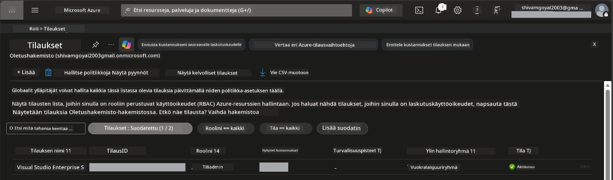

# Module 0 - Edellytykset

Ennen työpajan aloittamista varmistu, että sinulla on seuraavat työkalut, käyttöoikeudet ja ympäristö valmiina. Seuraa jokaista alla olevaa vaihetta - älä hyppää eteenpäin.

---

## 1. Azure-tili & tilaus

### 1.1 Luo tai varmista Azure-tilauksesi

1. Avaa selain ja siirry osoitteeseen [https://azure.microsoft.com/free/](https://azure.microsoft.com/free/).
2. Jos sinulla ei ole Azure-tiliä, klikkaa **Start free** ja seuraa rekisteröitymisohjetta. Tarvitset Microsoft-tilin (tai voit luoda sellaisen) ja luottokortin henkilöllisyyden varmistukseen.
3. Jos sinulla on jo tili, kirjaudu sisään osoitteessa [https://portal.azure.com](https://portal.azure.com).
4. Portaalissa klikkaa vasemman reunan navigaatiossa **Subscriptions** (Tilaustiedot) -osiota (tai etsi "Subscriptions" yläreunan hakupalkista).
5. Varmista, että näet vähintään yhden **Active** (aktiivisen) tilauksen. Kirjaa ylös **Subscription ID** - tämä tarvitaan myöhemmin.



### 1.2 Ymmärrä vaaditut RBAC-roolit

[Hosted Agent](https://learn.microsoft.com/azure/foundry/agents/concepts/hosted-agents) -käyttöönotto vaatii **data action** -käyttöoikeudet, joita tavalliset Azure’n `Owner` ja `Contributor` -roolit **eivät** sisällä. Tarvitset jonkin näistä [rooliyhdistelmistä](https://learn.microsoft.com/azure/foundry/concepts/rbac-foundry#built-in-roles):

| Tilanne | Vaaditut roolit | Missä roolit annetaan |
|----------|---------------|----------------------|
| Luo uusi Foundry-projekti | **Azure AI Owner** Foundry-resurssissa | Foundry-resurssi Azure-portaalissa |
| Ota käyttöön olemassa oleva projekti (uudet resurssit) | **Azure AI Owner** + **Contributor** tilauksessa | Tilaus + Foundry-resurssi |
| Ota käyttöön täysin konfiguroitu projekti | **Reader** tilillä + **Azure AI User** projektissa | Tili + Projekti Azure-portaalissa |

> **Tärkeä huomio:** Azure’n `Owner` ja `Contributor` -roolit kattavat vain *hallinta*-käyttöoikeudet (ARM-operaatiot). Tarvitset [**Azure AI User**](https://learn.microsoft.com/azure/foundry/concepts/rbac-foundry#built-in-roles) (tai korkeamman) saadaksesi *data action* -käyttöoikeudet kuten `agents/write`, jotka tarvitaan agenttien luontiin ja käyttöönottoon. Nämä roolit määritetään [Moduulissa 2](02-create-foundry-project.md).

---

## 2. Asenna paikalliset työkalut

Asenna jokainen alla oleva työkalu. Asennuksen jälkeen varmista toimivuus ajamalla tarkistuskomento.

### 2.1 Visual Studio Code

1. Siirry osoitteeseen [https://code.visualstudio.com/](https://code.visualstudio.com/).
2. Lataa asennusohjelma käyttöjärjestelmääsi varten (Windows/macOS/Linux).
3. Suorita asennus oletusasetuksilla.
4. Avaa VS Code varmistaaksesi, että se käynnistyy.

### 2.2 Python 3.10+

1. Siirry osoitteeseen [https://www.python.org/downloads/](https://www.python.org/downloads/).
2. Lataa Python 3.10 tai uudempi (3.12+ suositeltu).
3. **Windows:** Asennuksen aikana valitse ensimmäiseltä ruudulta **"Add Python to PATH"**.
4. Avaa terminaali ja varmista:

   ```powershell
   python --version
   ```

   Odotettu tulos: `Python 3.10.x` tai uudempi.

### 2.3 Azure CLI

1. Siirry osoitteeseen [https://learn.microsoft.com/cli/azure/install-azure-cli](https://learn.microsoft.com/cli/azure/install-azure-cli).
2. Seuraa asennusohjeita käyttöjärjestelmääsi varten.
3. Varmista:

   ```powershell
   az --version
   ```

   Odotettu: `azure-cli 2.80.0` tai uudempi.

4. Kirjaudu sisään:

   ```powershell
   az login
   ```

### 2.4 Azure Developer CLI (azd)

1. Siirry osoitteeseen [https://learn.microsoft.com/azure/developer/azure-developer-cli/install-azd](https://learn.microsoft.com/azure/developer/azure-developer-cli/install-azd).
2. Seuraa asennusohjeita käyttöjärjestelmääsi varten. Windowsilla:

   ```powershell
   winget install microsoft.azd
   ```

3. Varmista:

   ```powershell
   azd version
   ```

   Odotettu: `azd version 1.x.x` tai uudempi.

4. Kirjaudu sisään:

   ```powershell
   azd auth login
   ```

### 2.5 Docker Desktop (valinnainen)

Dockeria tarvitaan vain, jos haluat rakentaa ja testata säilökuvaa paikallisesti ennen käyttöönottoa. Foundry-laajennus hoitaa säilörakennukset automaattisesti käyttöönoton yhteydessä.

1. Siirry osoitteeseen [https://docs.docker.com/get-docker/](https://docs.docker.com/get-docker/).
2. Lataa ja asenna Docker Desktop käyttöjärjestelmääsi varten.
3. **Windows:** Varmista, että asennuksessa on valittu WSL 2 -taustajärjestelmä.
4. Käynnistä Docker Desktop ja odota, että järjestelmäpalkin kuvake näyttää **"Docker Desktop is running"**.
5. Avaa terminaali ja varmista:

   ```powershell
   docker info
   ```

   Tulostuksen pitäisi näyttää Dockerin järjestelmätiedot ilman virheitä. Jos näet `Cannot connect to the Docker daemon`, odota muutama sekunti lisää jotta Docker ehtii käynnistyä täysin.

---

## 3. Asenna VS Code -laajennukset

Tarvitset kolme laajennusta. Asenna ne **ennen** työpajan alkua.

### 3.1 Microsoft Foundry for VS Code

1. Avaa VS Code.
2. Paina `Ctrl+Shift+X` avataksesi Laajennukset-paneelin.
3. Kirjoita hakukenttään **"Microsoft Foundry"**.
4. Etsi **Microsoft Foundry for Visual Studio Code** (julkaisija: Microsoft, tunnus: `TeamsDevApp.vscode-ai-foundry`).
5. Klikkaa **Install**.
6. Asennuksen jälkeen näet **Microsoft Foundry** -kuvakkeen Toimintopalkissa (vasemman reunan sivupalkissa).

### 3.2 Foundry Toolkit

1. Laajennukset-paneelissa (`Ctrl+Shift+X`) hae **"Foundry Toolkit"**.
2. Löydä **Foundry Toolkit** (julkaisija: Microsoft, tunnus: `ms-windows-ai-studio.windows-ai-studio`).
3. Klikkaa **Install**.
4. **Foundry Toolkit** -kuvake tulee näkyviin Toimintopalkkiin.

### 3.3 Python

1. Laajennukset-paneelissa etsi **"Python"**.
2. Löydä **Python** (julkaisija: Microsoft, tunnus: `ms-python.python`).
3. Klikkaa **Install**.

---

## 4. Kirjaudu Azureen VS Codesta

[Microsoft Agent Framework](https://learn.microsoft.com/agent-framework/overview/) käyttää autentikointiin [`DefaultAzureCredential`](https://learn.microsoft.com/azure/developer/python/sdk/authentication/credential-chains#defaultazurecredential-overview) -menetelmää. Sinun tulee olla kirjautuneena Azureen VS Codesta.

### 4.1 Kirjaudu VS Codella

1. Katso VS Coden vasempaa alakulmaa ja klikkaa **Accounts** -ikonia (hahmon siluetti).
2. Klikkaa **Sign in to use Microsoft Foundry** (tai **Sign in with Azure**).
3. Selainikkuna aukeaa - kirjaudu sisään Azure-tilillä, jolla on pääsy tilaukseesi.
4. Palaa VS Codeen. Tilisi nimi näkyy vasemmassa alakulmassa.

### 4.2 (Valinnainen) Kirjaudu Azure CLI:n kautta

Jos asensit Azure CLI:n ja haluat käyttää komentorivipohjaista autentikointia:

```powershell
az login
```

Selain avautuu kirjautumista varten. Kirjautumisen jälkeen aseta oikea tilaus:

```powershell
az account set --subscription "<your-subscription-id>"
```

Varmista:

```powershell
az account show --query "{name:name, id:id, state:state}" --output table
```

Näet tilauksesi nimen, tunnuksen ja tilan = `Enabled`.

### 4.3 (Vaihtoehtoinen) Palveluperheen käyttöoikeudet

CI/CD- tai jaetuissa ympäristöissä aseta nämä ympäristömuuttujat sen sijaan:

```powershell
$env:AZURE_TENANT_ID = "<your-tenant-id>"
$env:AZURE_CLIENT_ID = "<your-client-id>"
$env:AZURE_CLIENT_SECRET = "<your-client-secret>"
```

---

## 5. Esikatselun rajoitukset

Ennen jatkamista tiedosta nykyiset rajoitteet:

- [**Hosted Agents**](https://learn.microsoft.com/azure/foundry/agents/concepts/hosted-agents) ovat tällä hetkellä **julkisessa esikatselussa** - ei suositella tuotantokäyttöön.
- **Tuetut alueet ovat rajattuja** - tarkista [alueen saatavuus](https://learn.microsoft.com/azure/foundry/agents/concepts/hosted-agents#region-availability) ennen resurssien luontia. Jos valitset alueen, joka ei ole tuettu, käyttöönotto epäonnistuu.
- Paketti `azure-ai-agentserver-agentframework` on esiversio (`1.0.0b16`) - rajapinnat saattavat muuttua.
- Skaalausrajoitukset: hosting-agentit tukevat 0-5 kopiota (sisältäen nollaskaalauksen).

---

## 6. Tarkistuslista ennen aloittamista

Suorita kaikki kohdat alla läpi. Jos jokin vaihe epäonnistuu, palaa takaisin ja korjaa ennen jatkamista.

- [ ] VS Code aukeaa ilman virheitä
- [ ] Python 3.10+ on PATH:ssa (`python --version` näyttää `3.10.x` tai uudempi)
- [ ] Azure CLI on asennettu (`az --version` näyttää `2.80.0` tai uudempi)
- [ ] Azure Developer CLI on asennettu (`azd version` näyttää version tiedot)
- [ ] Microsoft Foundry -laajennus on asennettu (kuvake näkyy Toimintopalkissa)
- [ ] Foundry Toolkit -laajennus on asennettu (kuvake näkyy Toimintopalkissa)
- [ ] Python-laajennus on asennettu
- [ ] Olet kirjautunut Azureen VS Codessa (tarkista Accounts-kuvake vasemmassa alakulmassa)
- [ ] `az account show` näyttää tilauksesi
- [ ] (Valinnainen) Docker Desktop on käynnissä (`docker info` näyttää järjestelmätiedot ilman virheitä)

### Välitarkastus

Avaa VS Coden Toimintopalkki ja varmista, että näet sekä **Foundry Toolkit** että **Microsoft Foundry** -sivupalkkinäkymät. Klikkaa kumpaakin varmistaaksesi, että ne latautuvat ilman virheitä.

---

**Seuraava:** [01 - Install Foundry Toolkit & Foundry Extension →](01-install-foundry-toolkit.md)

---

<!-- CO-OP TRANSLATOR DISCLAIMER START -->
**Vastuuvapauslauseke**:
Tämä asiakirja on käännetty käyttämällä tekoälypohjaista käännöspalvelua [Co-op Translator](https://github.com/Azure/co-op-translator). Pyrimme tarkkuuteen, mutta otathan huomioon, että automaattiset käännökset saattavat sisältää virheitä tai epätarkkuuksia. Alkuperäistä asiakirjaa sen alkuperäiskielellä tulee pitää auktoriteettisena lähteenä. Tärkeissä tiedoissa suositellaan ammattilaisen tekemää ihmiskäännöstä. Emme ole vastuussa tämän käännöksen käytöstä aiheutuvista väärinymmärryksistä tai virhetulkintojen seurauksista.
<!-- CO-OP TRANSLATOR DISCLAIMER END -->