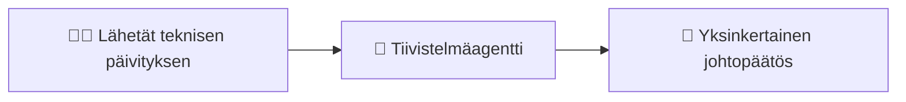

# Moduuli 0 - Johdanto

⏱️ ~10 min

> [!WARNING]
> **Esikatselu ja rajoitukset:** [Isännöidyt agentit](https://learn.microsoft.com/azure/foundry/agents/concepts/hosted-agents) ovat tällä hetkellä **julkisessa esikatselussa** – ei suositella tuotantokuormiin. Huomioi seuraavat asiat:
> - **Tuetut alueet ovat rajattuja** – tarkista [alueen saatavuus](https://learn.microsoft.com/azure/foundry/agents/concepts/hosted-agents#region-availability) ennen resurssien luomista. Jos valitset tuetun alueen ulkopuolelta, käyttöönotto epäonnistuu.
> - `azure-ai-agentserver-agentframework`-paketti on esijulkaisuvaiheessa – API:t voivat muuttua versioiden välillä.
> - Skaalarajoitukset: isännöidyt agentit tukevat 0–5 kopiota (sisältäen nollaskaalauksen).
> - Jotkut tässä työpajassa esitetyt ominaisuudet voivat muuttua palvelun siirtyessä GA-vaiheeseen.

## Mitä rakennat

Tässä työpajassa rakennat **"Selitä kuin olisin johtaja"** -agentin – isännöidyn tekoälyagentin, joka ottaa monimutkaiset tekniset päivitykset ja kirjoittaa ne uudelleen selkokielisiksi johdon tiivistelmiksi.

```mermaid
flowchart LR
    A["🧑‍💻 Lähetät teknisen päivityksen"] --> B["🤖 Tiivistelmäagentti"]
    B --> C["📝 Yksinkertainen johtopäätös"]
```

**Agentti käyttää:**
- **Microsoft Agent Frameworkia** – agentin logiikkaan ja rakenteeseen
- **Foundry Toolkit for VS Codea** – kehykseen, paikalliseen testaukseen ja käyttöönottoon
- **Tekoälymallia** (esim. `gpt-4.1-mini/gpt-5-mini`) – tiivistelmien generointiin

Tämän labran lopussa sinulla on toimiva agentti, jota voit testata paikallisesti Agent Inspectorin kautta ja halutessasi ottaa käyttöön pilveen.

---

## Mitä ovat isännöidyt agentit?

**Isännöity agentti** on tekoälyagentti, joka toimii hallinnoituna palveluna Microsoft Foundryssä. Sen sijaan, että hallinnoisit omaa infrastruktuuriasi, pakkaat agenttikoodisi konttiin ja Foundry hoitaa skaalauksen, isännöinnin ja paljastamisen standardin HTTP-päätepisteen kautta.

| Käsite | Mitä se tarkoittaa |
|---------|--------------|
| **Agentti** | Python-koodisi, joka vastaanottaa käyttäjän viestin, kutsuu tekoälymallia ja palauttaa rakenteellisen vastauksen |
| **Isännöity** | Foundry ajaa konttisi puolestasi – ei VM:iä, ei Kubernetesia, ei infrastruktuurin hallintaa |
| **Vastausprotokolla** | Standardoitu HTTP-API (`POST /responses`), jota mikä tahansa asiakas voi käyttää kommunikointiin agenttisi kanssa |
| **Agent Inspector** | Paikallinen testauskäyttöliittymä (sisältyy Foundry Toolboxiin), jonka avulla voit keskustella agenttisi kanssa ennen käyttöönottoa |

Tässä työpajassa etenet nollasta täysin isännöityyn agenttiin – tai voit pysähtyä paikalliseen testaukseen, jos haluat.

---

## Valitse polkusi

> ⚠️ **Valitse yksi polku ennen jatkamista.** Valintasi määrittää asennettavat työkalut ja käytettävät moduulit. Voit vaihtaa polkua B → polkuun A myöhemmin, jos saat tilauksen.

<strong>🅰️ Polku A - Azure-pilvi (vaatii Azure-tilauksen)</strong>

| | Yksityiskohdat |
|---|---|
| **Kenelle tämä sopii?** | Sinulla on aktiivinen Azure-tilaus ja voit luoda Foundry-resursseja |
| **Malli** | Azure OpenAI Foundryn kautta (esim. `gpt-4.1-mini/gpt-5-mini`) |
| **Käsitellyt moduulit** | Kaikki moduulit (00–07) |
| **Ota käyttöön pilveen?** | ✅ Kyllä – täydellinen koko käyttöönotto |

<strong>🅱️ Polku B - Paikallinen / ilmainen taso (ei vaadi Azure-tilausta)</strong>

| | Yksityiskohdat |
|---|---|
| **Kenelle tämä sopii?** | MVP:t, opiskelijat tai muut ilman Azure-pääsyä |
| **Malli** | **Foundry Local** (ilmainen, toimii koneellasi) |
| **Käsitellyt moduulit** | Moduulit 00–04 (ohita käyttöönotto ja pilvivarmistus) |
| **Ota käyttöön pilveen?** | ❌ Ei – vain paikallinen testaus Agent Inspectorilla |

---

## Kaikki polut: tarpeelliset työkalut

Asenna alla olevat työkalut. Asennuksen jälkeen varmista toimivuus suorittamalla tarkastuskomento.

| # | Työkalu | Versio | Asennus | Varmistus (odotettu tulos) |
|---|------|---------|---------|---------------------------|
| 1 | **Visual Studio Code** | Uusin | [code.visualstudio.com](https://code.visualstudio.com/) | Aukeaa ilman virheitä |
| 2 | **Python** | 3.12 tai uudempi| [python.org/downloads](https://www.python.org/downloads/) | `python --version` $\rightarrow$ `Python 3.12.x` |
| 3 | **Foundry Toolkit for VS Code** | Uusin | Laajennuksen tunnus: `ms-windows-ai-studio.windows-ai-studio` | Foundry-kuvake Aktiviteettipalkissa |
| 4 | **Python-laajennus VS Codeen** | Uusin | Laajennuksen tunnus: `ms-python.python` | Asennettuna Laajennukset-paneelissa |

> [!TIP]
> **Asennuksen pro-vinkit:**
> - **Python PATH (Windows):** Valitse aina **"Add Python to PATH"** Pythonin asennuksen ensimmäisellä ruudulla. Ilman tätä `python`-komentoa ei tunnisteta päätelaitteessasi.
> - **Useita Python-versioita:** Jos sinulla on sekä Python 3.10 että 3.12 asennettuna, käytä komentoa `python3.12 -m venv .venv` varmistaaksesi oikean version virtual environmenttiin.
> - **Docker WSL 2 (Windows):** Docker Desktopin asennuksen aikana varmistu, että **WSL 2 -taustajärjestelmä** on valittuna. Docker Hyper-V:llä toimii hitaammin ja voi aiheuttaa ongelmia Foundryn konttirakennuksessa.
> - **Docker ei käynnisty?** Odota 30–60 sekuntia Docker Desktopin käynnistämisen jälkeen. Suorita `docker info` – jos näet ilmoituksen "Cannot connect to the Docker daemon," Docker on vielä käynnistymässä.
> - **VS Code -laajennukset eivät lataudu?** Asennuksen jälkeen lataa ikkuna uudelleen: `Ctrl+Shift+P` → `Developer: Reload Window`.

> **Windows-käyttäjät:** Muistakaa valita **"Add Python to PATH"** Pythonin asennuksessa.

**Seuraava:** [01 - Käyttöönotto →](01-setup.md)

---

<!-- CO-OP TRANSLATOR DISCLAIMER START -->
**Vastuuvapauslauseke**:
Tämä asiakirja on käännetty käyttämällä tekoälypohjaista käännöspalvelua [Co-op Translator](https://github.com/Azure/co-op-translator). Vaikka pyrimme tarkkuuteen, otathan huomioon, että automaattiset käännökset saattavat sisältää virheitä tai epätarkkuuksia. Alkuperäinen asiakirja sen alkuperäiskielellä on virallinen lähde. Tärkeissä asioissa suositellaan ammattimaista ihmiskäännöstä. Emme ole vastuussa tämän käännöksen käytöstä aiheutuvista väärinymmärryksistä tai tulkinnoista.
<!-- CO-OP TRANSLATOR DISCLAIMER END -->