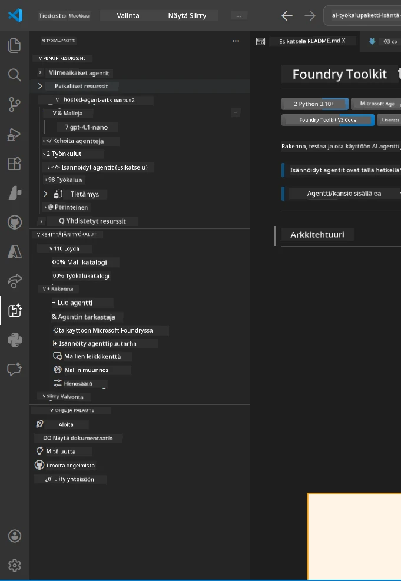
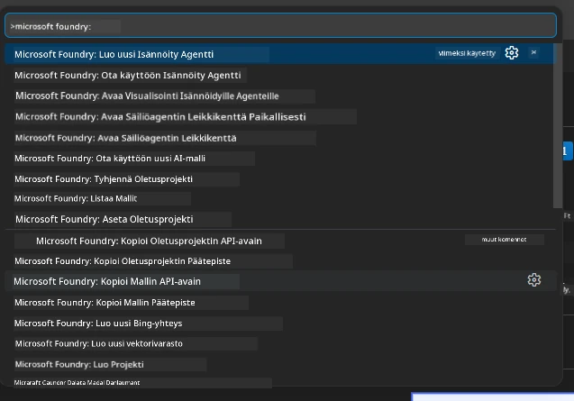

# Moduuli 1 - Asenna Foundry Toolkit & Foundry-laajennus

Tämä moduuli opastaa sinut kahden keskeisen VS Code -laajennuksen asentamisessa ja varmistamisessa tätä työpajaa varten. Jos asensit ne jo [Moduulissa 0](00-prerequisites.md), käytä tätä moduulia varmistaaksesi, että ne toimivat oikein.

---

## Vaihe 1: Asenna Microsoft Foundry -laajennus

**Microsoft Foundry for VS Code** -laajennus on päätyökalusi Foundry-projektien luomiseen, mallien käyttöönottoon, isännöityjen agenttien rungon luonnin ja suoran käyttöönoton hallintaan VS Codesta.

1. Avaa VS Code.
2. Paina `Ctrl+Shift+X` avataksesi **Laajennukset**-paneelin.
3. Kirjoita yläosan hakukenttään: **Microsoft Foundry**
4. Etsi tulos nimeltä **Microsoft Foundry for Visual Studio Code**.
   - Julkaisija: **Microsoft**
   - Laajennuksen tunniste: `TeamsDevApp.vscode-ai-foundry`
5. Klikkaa **Asenna**-painiketta.
6. Odota asennuksen valmistumista (näet pienen edistymispalkin).
7. Asennuksen jälkeen katso **Toimintopalkkia** (vasemman reunan pystysuora kuvakepalkki VS Codessa). Sinun pitäisi nähdä uusi **Microsoft Foundry** -kuvake (näyttää timantti-/AI-kuvakkeelta).
8. Klikkaa **Microsoft Foundry** -kuvaketta avataksesi sen sivupalkkinäkymän. Näet osiot:
   - **Resurssit** (tai Projektit)
   - **Agentit**
   - **Mallit**

> **Jos kuvake ei näy:** Yritä ladata VS Code uudelleen (`Ctrl+Shift+P` → `Developer: Reload Window`).

---

## Vaihe 2: Asenna Foundry Toolkit -laajennus

**Foundry Toolkit** -laajennus tarjoaa [**Agent Inspectorin**](https://learn.microsoft.com/azure/foundry/agents/how-to/vs-code-agents-workflow-pro-code) – visuaalisen käyttöliittymän agenttien paikalliseen testaamiseen ja virheenkorjaukseen – sekä leikkikenttä-, mallin hallinta- ja arviointityökaluja.

1. Laajennukset-paneelissa (`Ctrl+Shift+X`) tyhjennä hakukenttä ja kirjoita: **Foundry Toolkit**
2. Etsi tuloksista **Foundry Toolkit**.
   - Julkaisija: **Microsoft**
   - Laajennuksen tunniste: `ms-windows-ai-studio.windows-ai-studio`
3. Klikkaa **Asenna**.
4. Asennuksen jälkeen **Foundry Toolkit** -kuvake ilmestyy Toimintopalkkiin (näyttää robotti-/kipinäkakkakuvalta).
5. Klikkaa **Foundry Toolkit** -kuvaketta avataksesi sen sivupalkkinäkymän. Näet Foundry Toolkit -tervetulonäkymän, jossa on valinnat:
   - **Mallit**
   - **Leikkikenttä**
   - **Agentit**

---

## Vaihe 3: Varmista, että molemmat laajennukset toimivat

### 3.1 Varmista Microsoft Foundry -laajennus

1. Klikkaa **Microsoft Foundry** -kuvaketta Toimintopalkissa.
2. Jos olet kirjautunut Azureen (Moduulissa 0), sinun pitäisi nähdä projektisi listattuna **Resurssien** alla.
3. Jos sinua pyydetään kirjautumaan, klikkaa **Kirjaudu sisään** ja seuraa tunnistautumisprosessia.
4. Vahvista, että sivupalkki avautuu ilman virheitä.

### 3.2 Varmista Foundry Toolkit -laajennus

1. Klikkaa **Foundry Toolkit** -kuvaketta Toimintopalkissa.
2. Vahvista, että tervetulonäkymä tai pääpaneeli latautuu ilman virheitä.
3. Sinun ei tarvitse konfiguroida mitään vielä – käytämme Agent Inspector -työkalua [Moduulissa 5](05-test-locally.md).

### 3.3 Varmista Komentopalettiin kautta

1. Paina `Ctrl+Shift+P` avataksesi Komentopaletti.
2. Kirjoita **"Microsoft Foundry"** – sinun pitäisi nähdä komentoja kuten:
   - `Microsoft Foundry: Create a New Hosted Agent`
   - `Microsoft Foundry: Deploy Hosted Agent`
   - `Microsoft Foundry: Open Model Catalog`
3. Paina `Escape` sulkeaksesi Komentopaletin.
4. Avaa Komentopaletti uudelleen ja kirjoita **"Foundry Toolkit"** – sinun pitäisi nähdä komentoja kuten:
   - `Foundry Toolkit: Open Agent Inspector`

> Jos et näe näitä komentoja, laajennukset eivät ehkä ole asennettu oikein. Yritä poistaa ne ja asentaa uudelleen.

---

## Mitä nämä laajennukset tekevät tässä työpajassa

| Laajennus | Mitä se tekee | Milloin käytät sitä |
|-----------|---------------|---------------------|
| **Microsoft Foundry for VS Code** | Luo Foundry-projekteja, ota mallit käyttöön, **luo [isännöityjä agentteja](https://learn.microsoft.com/azure/foundry/agents/concepts/hosted-agents)** (automaattisesti generoi `agent.yaml`, `main.py`, `Dockerfile`, `requirements.txt`), ota käyttöön [Foundry Agent Serviceen](https://learn.microsoft.com/azure/foundry/agents/overview) | Moduulit 2, 3, 6, 7 |
| **Foundry Toolkit** | Agent Inspector paikalliseen testaamiseen/virheenkorjaukseen, leikkikenttäkäyttöliittymä, mallinhallinta | Moduulit 5, 7 |

> **Foundry-laajennus on tämän työpajan tärkein työkalu.** Se kattaa koko elinkaaren: rungon luominen → konfigurointi → käyttöönotto → varmennus. Foundry Toolkit täydentää sitä tarjoamalla visuaalisen Agent Inspectorin paikalliseen testaamiseen.

---

### Tarkistuslista

- [ ] Microsoft Foundry -kuvake näkyy Toimintopalkissa
- [ ] Kuvakkeen klikkaaminen avaa sivupalkin ilman virheitä
- [ ] Foundry Toolkit -kuvake näkyy Toimintopalkissa
- [ ] Kuvakkeen klikkaaminen avaa sivupalkin ilman virheitä
- [ ] `Ctrl+Shift+P` → "Microsoft Foundry" näyttää saatavilla olevat komennot
- [ ] `Ctrl+Shift+P` → "Foundry Toolkit" näyttää saatavilla olevat komennot

---

**Edellinen:** [00 - Esivaatimukset](00-prerequisites.md) · **Seuraava:** [02 - Luo Foundry-projekti →](02-create-foundry-project.md)

---

<!-- CO-OP TRANSLATOR DISCLAIMER START -->
**Vastuuvapauslauseke**:  
Tämä asiakirja on käännetty käyttämällä tekoälypohjaista käännöspalvelua [Co-op Translator](https://github.com/Azure/co-op-translator). Vaikka pyrimme tarkkuuteen, huomioithan, että automatisoiduissa käännöksissä saattaa olla virheitä tai epätarkkuuksia. Alkuperäistä asiakirjaa sen omalla kielellä pidetään auktoritatiivisena lähteenä. Tärkeissä tiedoissa suositellaan ammattimaista ihmiskäännöstä. Emme ole vastuussa tämän käännöksen käytöstä johtuvista väärinymmärryksistä tai tulkinnoista.
<!-- CO-OP TRANSLATOR DISCLAIMER END -->