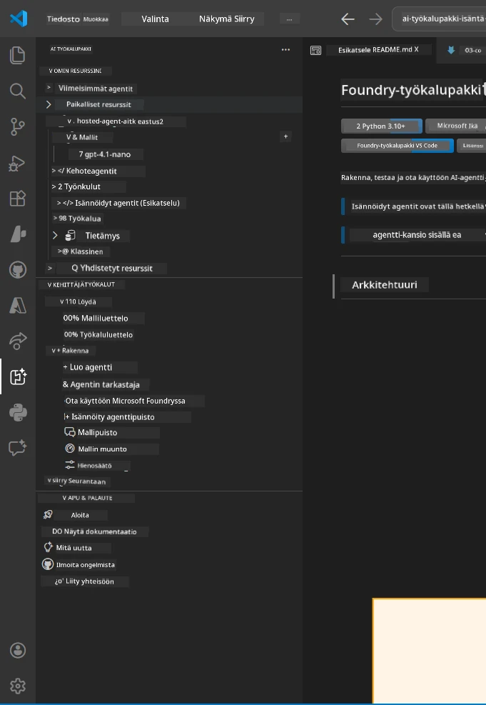
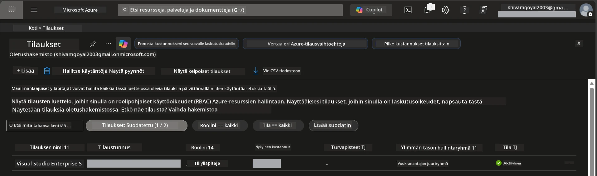
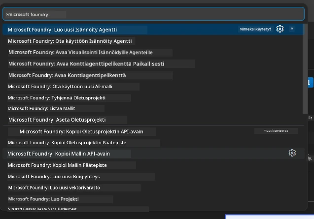
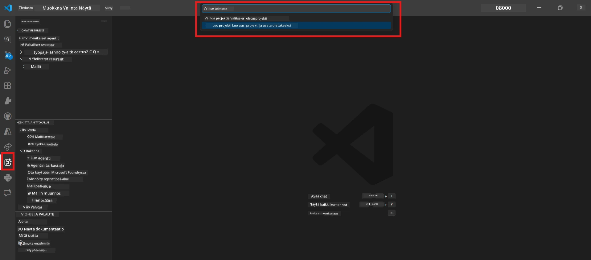
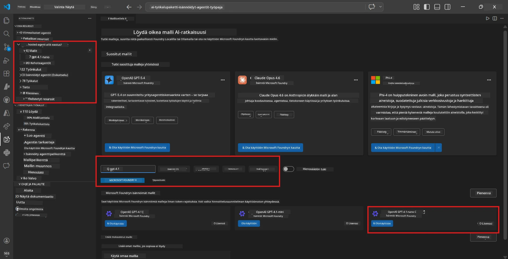
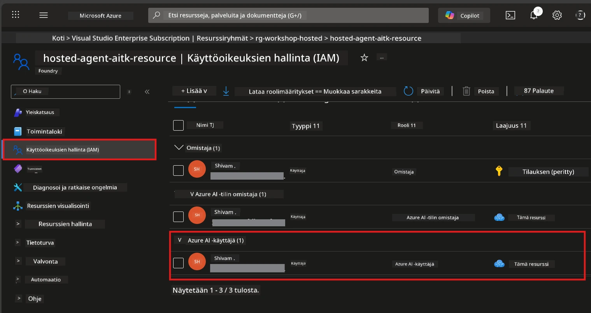

# Aloitus: Laajennus, Projekti & Malli

⏱️ ~15 min

Tässä moduulissa asennat ja varmistat Foundry Toolkit -laajennuksen, luot (tai yhdistät) Foundry-projektin ja otat käyttöön mallin, jota agenttisi käyttää.

## Vaihe 1: Asenna Foundry Toolkit

**Foundry Toolkit for VS Code** on tämän työpajan ensisijainen laajennus. Se tarjoaa projektin luomisen, mallin käyttöönoton, agenttien perustamisen, paikallisen testauksen (Agent Inspector) ja pilvikäyttöönoton - kaikki VS Codesta käsin.

1. Avaa VS Code ja paina `Ctrl+Shift+X` avataksesi **Laajennukset**-paneelin.
2. Etsi **Foundry Toolkit**.
3. Asenna **Foundry Toolkit for VS Code** (Julkaisija: Microsoft, ID: `ms-windows-ai-studio.windows-ai-studio`).
4. Asennuksen jälkeen **Foundry Toolkit** -kuvake näkyy Aktiviteettipalkissa (vasen sivupalkki).

> *Huom: Aktiviteettipalkissa saattaa näkyä vanhemmissa laajennusversioissa "AI TOOLKIT". Toiminnallisuus on sama.*



## Vaihe 2: Määritä oikean käyttötapasi mukaan

> **Valitse polkusi:** Laajenna alla oleva osio, joka vastaa sinun asetustasi. Sinun tarvitsee suorittaa vain **yksi** polku.

<details>
<summary><strong>🅰️ Polku A - Azure-pilvi (vaatii Azure-tilauksen)</strong></summary>

### Azure CLI

1. Asenna osoitteesta [learn.microsoft.com/cli/azure/install-azure-cli](https://learn.microsoft.com/cli/azure/install-azure-cli).
2. Tarkista: `az --version` (odotettu 2.80.0+).
3. Kirjaudu sisään: `az login`

### Todennusvaihtoehdot

[Microsoft Agent Framework](https://learn.microsoft.com/agent-framework/overview/) käyttää [`DefaultAzureCredential`](https://learn.microsoft.com/azure/developer/python/sdk/authentication/credential-chains#defaultazurecredential-overview) -luokkaa, joka yrittää useita tunnistustapoja järjestyksessä. Valitse ympäristöösi sopiva:

#### Vaihtoehto 1: VS Code Accounts (suositeltu työpajoihin)
1. Napsauta VS Codessa vasemmassa alakulmassa olevaa **Accounts** -kuvaketta (henkilön siluetti).
2. Valitse **Sign in to use Microsoft Foundry** (tai **Kirjaudu sisään Azurella**).
3. Selain avautuu – kirjaudu sisään Azure-tilillä, jolla on pääsy tilaukseesi.
4. Palaa VS Codeen. Tilisi nimi näkyy vasemmassa alakulmassa.

#### Vaihtoehto 2: Azure CLI
```bash
az login
az account set --subscription "<your-subscription-id>"
```

#### Vaihtoehto 3: Palvelutunnus (Enterprise/CI)
Lukituissa ympäristöissä tai CI/CD-putkissa aseta nämä ympäristömuuttujat `.env`-tiedostoon:
```env
AZURE_TENANT_ID=<your-tenant-id>
AZURE_CLIENT_ID=<your-client-id>
AZURE_CLIENT_SECRET=<your-client-secret>
```

> **Miten `DefaultAzureCredential` toimii:** Se yrittää ensin ympäristömuuttujat, sitten hallitun identiteetin, sitten VS Coden sisäänkirjautumisen, sitten Azure CLI:n - ja käyttää ensimmäistä onnistunutta. Katso [todennusketjun dokumentaatio](https://learn.microsoft.com/azure/developer/python/sdk/authentication/credential-chains#defaultazurecredential-overview).

### Azure Developer CLI (azd)

1. Asenna: `winget install microsoft.azd` (Windows) tai katso [asennusohjeet](https://learn.microsoft.com/azure/developer/azure-developer-cli/install-azd).
2. Tarkista: `azd version`
3. Kirjaudu sisään: `azd auth login`

### Docker Desktop (valinnainen)

Docker tarvitaan vain, jos haluat rakentaa kontteja paikallisesti. Foundry-laajennus hoitaa rakennukset automaattisesti käyttöönoton yhteydessä.

1. Asenna: [docs.docker.com/get-docker](https://docs.docker.com/get-docker/).
2. Tarkista: `docker info`

### Azure-tilaus & RBAC

1. Kirjaudu sisään osoitteessa [portal.azure.com](https://portal.azure.com).
2. Siirry kohtaan **Subscriptions** ja varmista, että vähintään yksi on **Aktivinen**.
3. Tallenna **Subscription ID** -tunnuksesi – tarvitset sen moduulissa 01.



#### RBAC-tapaustaulukko

[Isännöidyn agentin](https://learn.microsoft.com/azure/foundry/agents/concepts/hosted-agents) käyttöönotto vaatii **data action** -oikeudet, joita tavalliset Azure `Owner` ja `Contributor` -roolit **eivät** sisällä. Käytä alla olevaa taulukkoa määrittääksesi tarvitsemiesi roolien:

| Tapaus | Vaaditut roolit | Minne ne määritetään |
|----------|---------------|----------------------|
| Luo uusi Foundry-projekti | **Azure AI Owner** Foundry-resurssissa | Foundry-resurssi Azure-portaalissa |
| Käyttöönotto olemassa olevaan projektiin (uudet resurssit) | **Azure AI Owner** + **Contributor** tilauksessa | Tilaus + Foundry-resurssi |
| Käyttöönotto täysin konfiguroituun projektiin | **Reader** tilillä + **Azure AI User** projektissa | Tili + Projekti Azure-portaalissa |
| Vain paikallinen testi (ei käyttöönottamista) | **Azure AI User** projektissa | Projekti Azure-portaalissa |

> **Tärkeä huomio:** Azure `Owner` ja `Contributor` -roolit kattavat vain *hallinta*-oikeudet (ARM-operaatiot). Tarvitset [**Azure AI User**](https://learn.microsoft.com/azure/foundry/concepts/rbac-foundry#built-in-roles) (tai korkeamman) *data action* -toimiin kuten `agents/write`, joita tarvitaan agenttien luontiin ja käyttöönottoon.

## Yhdistä tai luo Foundry-projekti



1. Paina `Ctrl+Shift+P` → kirjoita **Foundry Toolkit: Create Project** → valitse se.
2. Valitse **Azure-tilauksesi** pudotusvalikosta.
3. Valitse tai luo **resurssiryhmä** (esim. `rg-hosted-agents-workshop`).
4. Valitse isännöityjä agenteja tukevat alueet: `East US`, `West US 2` tai `Sweden Central`. Katso [alueiden saatavuus](https://learn.microsoft.com/azure/foundry/agents/concepts/hosted-agents#region-availability).
5. Kirjoita projektin nimi (esim. `workshop-agents`).
6. Odota 2–5 minuuttia, kun resurssit luodaan. Etusijainen ilmoitus näkyy VS Codessa.
7. Kun valmista, projektisi näkyy **Foundry Toolkit** -sivupalkissa kohdan **OMA RESURSSIT** alla.



## Ota malli käyttöön ja määritä RBAC

Isännöity agenttisi tarvitsee tekoälymallin vastausten tuottamiseen.

#### Mallin valintamatriisi
Tarpeidesi mukaan voit valita eri tason malleista:

| Malli | Parhaiten | Kustannus | Huomautukset |
|-------|----------|------|-------|
| `gpt-4.1` | Laadukkaat, vivahteikkaat vastaukset | Korkeampi | Parhaat tulokset, suositeltava lopputestaukseen |
| `gpt-4.1-mini/gpt-5-mini` | Nopea iterointi, edullisempi | Alhaisempi | Hyvä työpajan kehitykseen ja nopeaan testaukseen |
| `gpt-4.1-nano` | Kevyempiin tehtäviin | Alin | Edullisin, mutta yksinkertaisemmat vastaukset |

1. Paina `Ctrl+Shift+P` → **Foundry Toolkit: Open Model Catalog** (tai napsauta **Model Catalog** sivupalkissa KEHITTÄJÄTYÖKALUT → Löydä).
2. Etsi katalogista **gpt-4.1**.
3. Etsi **OpenAI GPT-4.1-mini** (tai `gpt-5-mini` parempaan laatuun) ja napsauta **Käyttöönotto**.



4. Käyttöönottovaihtoehdoissa:
   - **Käyttöönoton nimi:** Jätä oletukseksi tai anna oma nimi. **Muista tämä nimi.**
   - **Kohde:** Valitse **Deploy to Foundry Toolkit** → valitse projektisi.
5. Napsauta **Deploy** ja odota 1–3 minuuttia.

> **Suositus:** Käytä työpajassa `gpt-4.1-mini/gpt-5-mini` -malleja — ne ovat nopeita, edullisia ja tuottavat hyviä tuloksia.

### Tallenna arvosi muistiin

Käyttöönoton jälkeen kirjaa muistiin nämä kaksi arvoa (tarvitset moduulissa 03):

| Arvo | Mistä se löytyy |
|-------|-----------------|
| **Projektin päätepiste** | Napsauta projektia sivupalkissa → yksityiskohdat näyttävät URL-osoitteen (esim. `https://<account>.services.ai.azure.com/api/projects/<project>`) |
| **Mallin käyttöönoton nimi** | Laajenna projekti → **Models** → valitse käyttöönotetun mallin nimi (esim. `gpt-4.1-mini/gpt-5-mini`) |

### Määritä RBAC-rooli

> ⚠️ **Tämä on yleisimmin unohtunut vaihe.** Ilman oikeaa roolia moduulin 05 käyttöönotto epäonnistuu.

#### Minkä roolin tarvitsen?
Tilanteestasi riippuen tarvitset seuraavan yhdistelmän rooleja:

| Tapaus | Vaaditut roolit | Minne ne määritetään |
|----------|---------------|----------------------|
| Luo uusi Foundry-projekti | **Azure AI Owner** Foundry-resurssissa | Foundry-resurssi Azure-portaalissa |
| Käyttöönotto olemassa olevaan projektiin (uudet resurssit) | **Azure AI Owner** + **Contributor** tilauksessa | Tilaus + Foundry-resurssi |
| Käyttöönotto täysin konfiguroituun projektiin | **Reader** tilillä + **Azure AI User** projektissa | Tili + Projekti Azure-portaalissa |

**Tärkeä huomio:** Azure `Owner` ja `Contributor` -roolit kattavat vain *hallinta*-oikeudet. Tarvitset **Azure AI User** -roolin (tai korkeamman) *data action* -toimiin, kuten `agents/write`, joita vaaditaan agenttien luontiin ja käyttöönottoon.

1. Avaa [portal.azure.com](https://portal.azure.com).
2. Etsi **Foundry-projektin** nimi → napsauta hakutulosta tyypiltään **"Foundry Toolkit project"** (EI ylätiliä).
3. Napsauta vasemmassa navigaatiossa **Access control (IAM)**.
4. Napsauta **+ Lisää** → **Lisää roolijako**.
5. **Roolivälilehti:** Etsi **Azure AI User**, valitse se, napsauta **Seuraava**.
6. **Jäsenet-välilehti:** Valitse **Käyttäjä, ryhmä tai palvelutunnus** → napsauta **+ Valitse jäsenet** → etsi ja valitse itsesi → napsauta **Valitse**.
7. Napsauta **Tarkista + määritä** → uudelleen **Tarkista + määritä**.
8. **Odota 1–2 minuuttia** muutoksen leviämistä.

> **Miksi tämä rooli?** Azure `Owner`/`Contributor` -roolit antavat vain hallintaoikeudet. **Azure AI User** -rooli antaa `agents/write` -data action -oikeuden, joka tarvitaan agenttien luomiseen ja käyttöönottoon. Katso [Foundryn RBAC-dokumentaatio](https://learn.microsoft.com/azure/foundry/concepts/rbac-foundry#built-in-roles).



</details>

<details>
<summary><strong>🅱️ Polku B - Paikallinen / ilmainen taso (ei Azure-tilausta tarvita)</strong></summary>

### Foundry Local

Foundry Local sallii tekoälymallien ajamisen omalla koneellasi - pilvitiliä ei tarvita. Saat käyttöösi Foundry Local -mallit Foundry Toolkitin kautta mallikatalogissa seuraavasti:

1. Mene Foundry Toolkit -laajennukseen.
2. Foundry Toolkit -navigaatiossa siirry kohtaan **Developer Tools** > ja valitse **Model Catalog**
3. Uudessa ikkunassa valitse navigaatiopalkista **local**.
4. Selaa alas kohtaan **Phi 4 Mini**, napsauta **lisäys-painiketta**. Ilmestyy popup-viesti, joka ilmoittaa mallin latautuvan.
5. Kun malli on ladattu, voit siirtyä seuraavaan vaiheeseen.

</details>

### ✅ Tarkistuskohta


- [ ] `Ctrl+Shift+P` → "Foundry Toolkit" näyttää käytettävissä olevat komennot
- [ ] Foundry Toolkit -laajennus asennettu ja sivupalkki latautuu ilman virheitä
- [ ] VS Code aukeaa ja toimii oikein
- [ ] `python --version` näyttää version 3.10 tai uudempi
- [ ] Foundry Toolkit -kuvake näkyy VS Code Aktiviteettipalkissa
- [ ] **Polku A:** `az login` onnistuu, tilaus on aktiivinen
- [ ] **Polku B:** Foundry Local on käynnissä (`foundry local status`)
- [ ] **Polku A:** Foundry-projekti näkyy sivupalkissa, malli on otettu käyttöön, Azure AI User -rooli määritetty
- [ ] **Polku B:** Foundry Local käynnissä mallin kanssa
- [ ] Olet kirjannut muistiin **päätepisteen** ja **mallin käyttöönoton nimen**


**Edellinen:** [00 - Esivaatimukset](00-prerequisites.md) · **Seuraava:** [02 - Luo isännöity agentti →](02-create-hosted-agent.md)

---

<!-- CO-OP TRANSLATOR DISCLAIMER START -->
**Vastuuvapauslauseke**:
Tämä asiakirja on käännetty käyttämällä tekoälypohjaista käännöspalvelua [Co-op Translator](https://github.com/Azure/co-op-translator). Vaikka pyrimme tarkkuuteen, otathan huomioon, että automaattiset käännökset saattavat sisältää virheitä tai epätarkkuuksia. Alkuperäinen asiakirja sen alkuperäiskielellä on virallinen lähde. Tärkeissä asioissa suositellaan ammattimaista ihmiskäännöstä. Emme ole vastuussa tämän käännöksen käytöstä aiheutuvista väärinymmärryksistä tai tulkinnoista.
<!-- CO-OP TRANSLATOR DISCLAIMER END -->