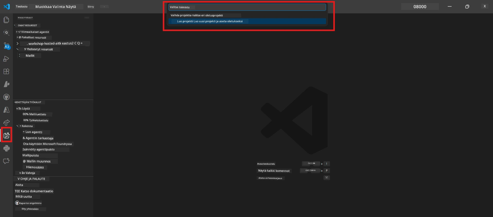
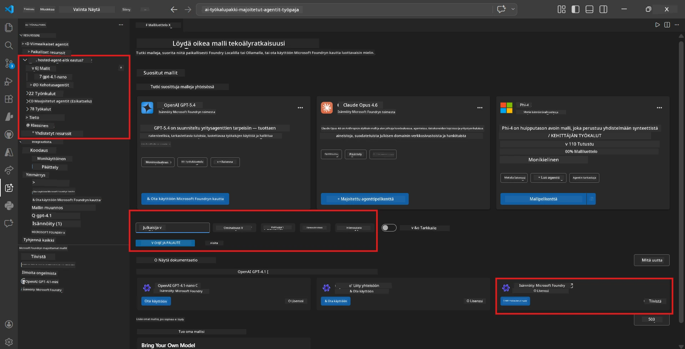
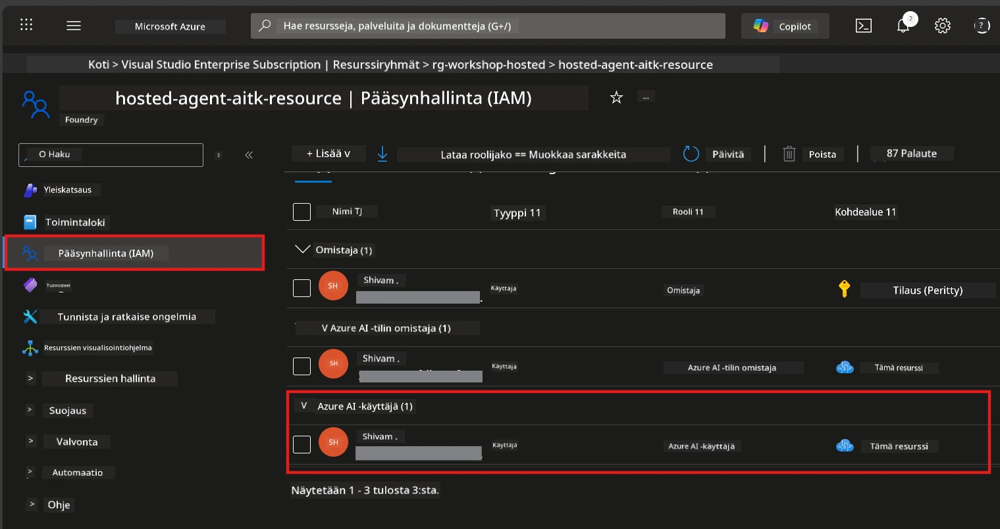

# Moduuli 2 - Luo Foundry-projekti ja ota malli käyttöön

Tässä moduulissa luot (tai valitset) Microsoft Foundry -projektin ja otat käyttöön mallin, jota agenttisi käyttää. Jokainen vaihe on kirjoitettu selkeästi - noudata niitä järjestyksessä.

> Jos sinulla on jo Foundry-projekti, jossa on käytössä oleva malli, ohita tämä ja siirry suoraan [Moduuliin 3](03-create-hosted-agent.md).

---

## Vaihe 1: Luo Foundry-projekti VS Codesta

Käytät Microsoft Foundry -laajennusta projektin luomiseen ilman, että poistut VS Codesta.

1. Paina `Ctrl+Shift+P` avataksesi **Komentopaletti**.
2. Kirjoita: **Microsoft Foundry: Create Project** ja valitse se.
3. Avautuu pudotusvalikko - valitse listalta **Azure-tilauksesi**.
4. Sinua pyydetään valitsemaan tai luomaan **resurssiryhmä**:
   - Uuden luomiseksi: kirjoita nimi (esim. `rg-hosted-agents-workshop`) ja paina Enter.
   - Käyttääksesi olemassa olevaa: valitse se pudotusvalikosta.
5. Valitse **alue**. **Tärkeää:** Valitse alue, joka tukee isännöityjä agenteja. Tarkista [alueen saatavuus](https://learn.microsoft.com/azure/foundry/agents/concepts/hosted-agents#region-availability) - yleisiä valintoja ovat `East US`, `West US 2` tai `Sweden Central`.
6. Anna Foundry-projektille **nimi** (esim. `workshop-agents`).
7. Paina Enter ja odota, että käyttöönotto valmistuu.

> **Käyttöönotto kestää 2–5 minuuttia.** Näet etenemisilmoituksen VS Coden oikeassa alakulmassa. Älä sulje VS Codea käyttöönoton aikana.

8. Kun valmis, **Microsoft Foundry** -sivupalkki näyttää uuden projektisi kohdassa **Resources**.
9. Napsauta projektin nimeä laajentaaksesi sen ja varmista, että se näyttää osiot kuten **Models + endpoints** ja **Agents**.



### Vaihtoehtoisesti: Luo Foundry-portaalin kautta

Jos haluat käyttää selainta:

1. Avaa [https://ai.azure.com](https://ai.azure.com) ja kirjaudu sisään.
2. Napsauta kotisivulla **Create project**.
3. Anna projektin nimi, valitse tilauksesi, resurssiryhmä ja alue.
4. Napsauta **Create** ja odota käyttöönottoa.
5. Kun projekti on luotu, palaa VS Codeen - projekti näkyy Foundry-sivupalkissa päivityksen jälkeen (klikkaa päivityskuvaketta).

---

## Vaihe 2: Ota malli käyttöön

[Isännöity agenttisi](https://learn.microsoft.com/azure/foundry/agents/concepts/hosted-agents) tarvitsee Azure OpenAI -mallin vastauksien tuottamiseen. Otat [sellaisen nyt käyttöön](https://learn.microsoft.com/azure/ai-foundry/openai/how-to/create-resource#deploy-a-model).

1. Paina `Ctrl+Shift+P` avataksesi **Komentopaletti**.
2. Kirjoita: **Microsoft Foundry: Open [Model Catalog](https://learn.microsoft.com/azure/ai-foundry/openai/concepts/models)** ja valitse se.
3. Malliluettelo aukeaa VS Codessa. Etsi tai käytä hakupalkkia löytääksesi **gpt-4.1**.
4. Napsauta **gpt-4.1** -mallikorttia (tai `gpt-4.1-mini` jos haluat edullisemman vaihtoehdon).
5. Napsauta **Deploy**.


6. Käyttöönottokokoonpanossa:
   - **Deployment name**: Jätä oletus nimelle (esim. `gpt-4.1`) tai kirjoita oma nimi. **Muista tämä nimi** - tarvitset sitä Moduulissa 4.
   - **Target**: Valitse **Deploy to Microsoft Foundry** ja valitse juuri luomasi projekti.
7. Napsauta **Deploy** ja odota käyttöönoton valmistumista (1–3 minuuttia).

### Mallin valinta

| Malli | Parhaiten soveltuvaan | Kustannus | Huomiot |
|-------|-----------------------|-----------|---------|
| `gpt-4.1` | Laadukkaat, hienovaraiset vastaukset | Korkeampi | Parhaat tulokset, suositeltu lopputestaamiseen |
| `gpt-4.1-mini` | Nopea kehitys, edullisempaa | Alempi | Hyvä työpajan kehitykseen ja nopeaan testaukseen |
| `gpt-4.1-nano` | Kevyemmät tehtävät | Alin | Taloudellisin, mutta yksinkertaisempia vastauksia |

> **Suositus tähän työpajaan:** Käytä `gpt-4.1-mini` kehitykseen ja testaukseen. Se on nopea, edullinen ja tuottaa hyviä tuloksia harjoituksiin.

### Vahvista mallin käyttöönotto

1. Laajenna **Microsoft Foundry** -sivupalkissa projektisi.
2. Katso kohtaa **Models + endpoints** (tai vastaava osio).
3. Sinun pitäisi nähdä käyttöönotettu malli (esim. `gpt-4.1-mini`) tilalla **Succeeded** tai **Active**.
4. Napsauta mallin käyttöönottoa nähdäksesi sen tiedot.
5. **Merkitse ylös** nämä kaksi arvoa - tarvitset niitä Moduulissa 4:

   | Asetus | Missä nähdä | Esimerkkiarvo |
   |--------|---------------|---------------|
   | **Project endpoint** | Napsauta projektin nimeä Foundry-sivupalkissa. Endpoint-URL näkyy tiedot-näkymässä. | `https://<account>.services.ai.azure.com/api/projects/<project>` |
   | **Model deployment name** | Nimi, joka näkyy käytössä olevan mallin vieressä. | `gpt-4.1-mini` |

---

## Vaihe 3: Määritä tarvittavat RBAC-roolit

Tämä on **useimmin unohtuva vaihe**. Ilman oikeita rooleja käyttöönotto Moduulissa 6 epäonnistuu käyttöoikeusvirheellä.

### 3.1 Määritä itsellesi Azure AI User -rooli

1. Avaa selain ja mene osoitteeseen [https://portal.azure.com](https://portal.azure.com).
2. Kirjoita yläreunan hakupalkkiin **Foundry-projektisi** nimi ja valitse se tuloksista.
   - **Tärkeää:** Mene **projektin** resurssiin (tyyppi: "Microsoft Foundry project"), älä vanhemman tilin/hubin resurssiin.
3. Projektin vasemmasta valikosta valitse **Access control (IAM)**.
4. Klikkaa yläreunassa olevaa **+ Add** -painiketta → valitse **Add role assignment**.
5. **Role**-välilehdellä etsi [**Azure AI User**](https://learn.microsoft.com/azure/foundry/concepts/rbac-foundry#built-in-roles) ja valitse se. Klikkaa **Next**.
6. **Members**-välilehdellä:
   - Valitse **User, group, or service principal**.
   - Klikkaa **+ Select members**.
   - Etsi nimesi tai sähköpostisi, valitse itsesi ja klikkaa **Select**.
7. Klikkaa **Review + assign** → ja vielä kerran **Review + assign** vahvistaaksesi.



### 3.2 (Valinnainen) Määritä Azure AI Developer -rooli

Jos sinun täytyy luoda lisää resursseja projektin sisällä tai hallita käyttöönottoja ohjelmallisesti:

1. Toista edelliset vaiheet, mutta valitse vaiheessa 5 **Azure AI Developer**.
2. Määritä tämä **Foundry-resurssin (tili)** tasolla, ei vain projekti-tasolla.

### 3.3 Tarkista roolimääritykset

1. Projektin **Access control (IAM)** -sivulla valitse **Role assignments** -välilehti.
2. Etsi nimesi.
3. Sinun pitäisi nähdä vähintään **Azure AI User** rooli projektin laajuudessa.

> **Miksi tämä on tärkeää:** [`Azure AI User`](https://learn.microsoft.com/azure/foundry/concepts/rbac-foundry#built-in-roles) -rooli antaa `Microsoft.CognitiveServices/accounts/AIServices/agents/write` -tietotoiminnon. Ilman sitä saat käyttöönotossa virheen:
>
> ```
> Error: lacks the required data action 
> Microsoft.CognitiveServices/accounts/AIServices/agents/write 
> to perform POST /api/projects/{projectName}/assistants operation.
> ```
>
> Lisätietoja on [Moduuli 8 - Vianetsintä](08-troubleshooting.md).

---

### Tarkistuspiste

- [ ] Foundry-projekti on olemassa ja näkyy Microsoft Foundry -sivupalkissa VS Codessa
- [ ] Vähintään yksi malli on otettu käyttöön (esim. `gpt-4.1-mini`) tilassa **Succeeded**
- [ ] Olet merkinnyt ylös **projektin endpoint-** URL-osoitteen ja **mallin käyttöönoton nimen**
- [ ] Sinulla on **Azure AI User** -rooli määritettynä **projektin** tasolla (tarkista Azure-portaalista → IAM → Role assignments)
- [ ] Projekti sijaitsee [tuetussa alueessa](https://learn.microsoft.com/azure/foundry/agents/concepts/hosted-agents#region-availability) isännöityjä agentteja varten

---

**Edellinen:** [01 - Asenna Foundry Toolkit](01-install-foundry-toolkit.md) · **Seuraava:** [03 - Luo isännöity agentti →](03-create-hosted-agent.md)

---

<!-- CO-OP TRANSLATOR DISCLAIMER START -->
**Vastuuvapauslauseke**:
Tämä asiakirja on käännetty käyttämällä tekoälypohjaista käännöspalvelua [Co-op Translator](https://github.com/Azure/co-op-translator). Vaikka pyrimme tarkkuuteen, ota huomioon, että automaattiset käännökset saattavat sisältää virheitä tai epätarkkuuksia. Alkuperäistä asiakirjaa sen alkuperäisellä kielellä on pidettävä auktoriteettina. Tärkeiden tietojen osalta suositellaan ammattimaista ihmiskäännöstä. Emme ole vastuussa tämän käännöksen käytöstä aiheutuvista väärinymmärryksistä tai virhetulkintojen seurauksista.
<!-- CO-OP TRANSLATOR DISCLAIMER END -->