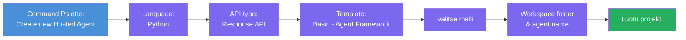
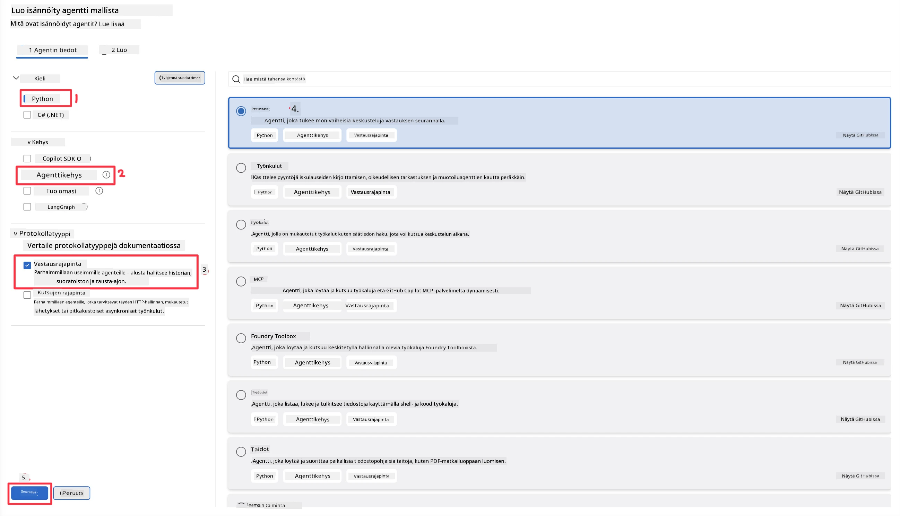
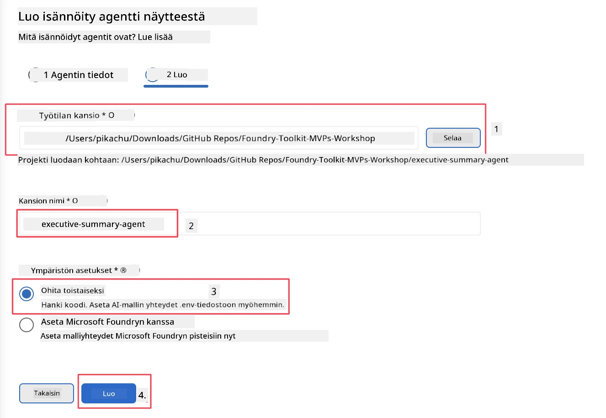

# Moduuli 2 - Luo uusi isännöity agentti

⏱️ ~5 min

Tässä moduulissa käytät Foundry Toolkit -työkalua **luodaksesi isännöidyn agenttiprojektin "scaffoldin"**. Scaffold luo koko projektirakenteen - `agent.yaml`, `main.py`, `Dockerfile`, `requirements.txt` ja VS Code -debuggauskonfiguraation - jotta voit keskittyä agentin käytöksen räätälöintiin.

> **Keskeinen käsite:** `agent/`-kansio tässä harjoituksessa on esimerkki siitä, mitä Foundry Toolkit luo. Et kirjoita näitä tiedostoja alusta alkaen itse.

### Scaffold-velhon kulku



---

## Vaihe 1: Avaa Create Hosted Agent -velho

1. Paina `Ctrl+Shift+P` avataksesi **Komentopaletti**.
2. Kirjoita: **Foundry Toolkit: Create new Hosted Agent** ja valitse se.

> **Vaihtoehto: Luo Foundry-portaalin kautta**
> Jos haluat käyttää selainta, voit luoda projektisi osoitteessa [https://ai.azure.com](https://ai.azure.com). Kun projekti on luotu, palaa VS Codeen ja käytä **Foundry Toolkit** -sivupalkkia yhdistääksesi projektiin.

> **Vaihtoehto:** Klikkaa **+**-kuvaketta **Hosted Agents (Preview)** -kohdan vieressä Foundry Toolkit -sivupalkissa.

## Vaihe 2: Valitse asetukset



1. Valitse vasemman sivun navigaatio/valintaosioista seuraavat:

| Valikko | Valinta | Huomautuksia |
|--------|-----------|------------|
| **Kieli** | Python | C# on myös tuettu |
| **Kehys** | Agent Framework | Yksinkertainen lähtökohta käyttäen Agent Framework SDK:ta |
| **API-tyyppi** | Response API | `POST /responses` - keskusteleva, alusta hallinnoi historian |
| **Malli** | Basic | Yksinkertainen lähtökohta käyttäen Agent Framework SDK:ta |

2. Kun valinnat on tehty, klikkaa **Seuraava**



3. Seuraavassa ikkunassa valitse seuraavat:

| Valikko | Valinta | Huomautuksia |
|--------|-----------|------------|
| **Työtilakansio** | Valitse kohdekansio | esim. `/workspace/Foundry_Toolkit_for_VSCode_Lab/` tai alikansio tässä repossa |
| **Agentin nimi** | Anna nimi | esim. `executive-summary-agent` |
| **Ympäristön asetukset** | ohita asetus toistaiseksi |  |

Klikkaa **create** luodaksesi agentin. Luodaan uusi kansio isännöidyn agentin nimellä.

## Vaihe 3: Tarkista luotu projekti

Scaffoldin valmistumisen jälkeen varmista, että näet seuraavat tiedostot Explorerissa (`Ctrl+Shift+E`):

```
📂 my-agent/
├── .env                ← Environment variables (placeholders)
├── .vscode/
│   ├── launch.json     ← Debug config (F5 → run + Agent Inspector)
│   └── tasks.json      ← VS Code task definitions
├── agent.yaml          ← Agent definition (kind: hosted)
├── Dockerfile          ← Container config for deployment
├── main.py             ← Agent entry point (your main code)
└── requirements.txt    ← Python dependencies
```

### Keskeiset tiedostot selitettyinä

| Tiedosto | Tarkoitus |
|---------|-----------|
| `agent.yaml` | Määrittelee agentin `kind: hosted`, kartoittaa ympäristömuuttujat, määrittelee `/responses` -protokollan |
| `main.py` | Luo `FoundryChatClient` → käärii sen `Agent`-objektiin ohjeilla → palvelee `ResponsesHostServer`illa portissa 8088 |
| `Dockerfile` | Käyttää `python:3.12-slim`, asentaa riippuvuudet, avaa portin 8088, suorittaa `main.py` |
| `requirements.txt` | `agent-framework-foundry`, `agent-framework-foundry-hosting`, `mcp`, `debugpy` |

> **Tärkeää:** Avaa scaffoldattu agenttikansio suoraan VS Codessa (eli itse `agent/`-kansio) jotta `.vscode/launch.json` ja `tasks.json` toimivat oikein F5-debuggausta varten.

---

### ✅ Tarkistuspiste

- [ ] Scaffold- projekti luotu kaikkine odotettuine tiedostoineen
- [ ] `agent.yaml` näyttää `kind: hosted` ja `protocol: responses`
- [ ] `main.py` tuo `Agent`, `FoundryChatClient`, `ResponsesHostServer`
- [ ] Agenttikansio on avoinna VS Codessa työtilan juurena

---

**Edellinen:** [01 - Setup](01-setup.md) · **Seuraava:** [03 - Configure & Code →](03-configure-and-code.md)

---

<!-- CO-OP TRANSLATOR DISCLAIMER START -->
**Vastuuvapauslauseke**:
Tämä asiakirja on käännetty käyttämällä tekoälypohjaista käännöspalvelua [Co-op Translator](https://github.com/Azure/co-op-translator). Vaikka pyrimme tarkkuuteen, otathan huomioon, että automaattiset käännökset saattavat sisältää virheitä tai epätarkkuuksia. Alkuperäinen asiakirja sen alkuperäiskielellä on virallinen lähde. Tärkeissä asioissa suositellaan ammattimaista ihmiskäännöstä. Emme ole vastuussa tämän käännöksen käytöstä aiheutuvista väärinymmärryksistä tai tulkinnoista.
<!-- CO-OP TRANSLATOR DISCLAIMER END -->