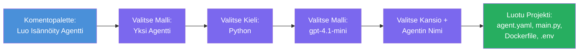

# Module 3 - Luo uusi isännöity agentti (Microsoft Foundry -laajennuksen automaattinen alustaminen)

Tässä moduulissa käytät Microsoft Foundry -laajennusta **luodaksesi uuden [isännöidyn agenttiprojektin](https://learn.microsoft.com/azure/foundry/agents/concepts/hosted-agents)**. Laajennus generoi koko projektirakenteen puolestasi - mukaan lukien `agent.yaml`, `main.py`, `Dockerfile`, `requirements.txt`, `.env`-tiedoston ja VS Coden debug-konfiguraation. Alustamisen jälkeen mukautat näitä tiedostoja agenttisi ohjeilla, työkaluilla ja asetuksilla.

> **Keskeinen käsite:** Tässä harjoituksessa `agent/`-kansio on esimerkki siitä, mitä Foundry-laajennus luo ajaessasi tätä alustuskäskyä. Sinun ei tarvitse kirjoittaa näitä tiedostoja alusta alkaen – laajennus luo ne, ja sitten muokkaat niitä.

### Alustuksen ohjattu kulku


---

## Vaihe 1: Avaa Create Hosted Agent -velho

1. Paina `Ctrl+Shift+P` avataksesi **Komentopaletti**.
2. Kirjoita: **Microsoft Foundry: Create a New Hosted Agent** ja valitse se.
3. Isännöidyn agentin luontiovheelma avautuu.

> **Vaihtoehtoinen tapa:** Voit myös päästä tähän velhopyyntöön Microsoft Foundryn sivupalkista → klikkaa **+** kuvaketta **Agents**-kohdan vieressä tai napsauta hiiren oikealla ja valitse **Create New Hosted Agent**.

---

## Vaihe 2: Valitse mallipohja

Velho pyytää valitsemaan mallin. Näet vaihtoehtoja kuten:

| Malli | Kuvaus | Käyttötilanne |
|----------|-------------|-------------|
| **Single Agent** | Yksi agentti omalla mallilla, ohjeilla ja valinnaisilla työkaluilla | Tämä työpaja (Lab 01) |
| **Multi-Agent Workflow** | Useita agentteja, jotka tekevät yhteistyötä peräkkäin | Lab 02 |

1. Valitse **Single Agent**.
2. Klikkaa **Next** (tai valinta etenee automaattisesti).

---

## Vaihe 3: Valitse ohjelmointikieli

1. Valitse **Python** (suositeltu tähän työpajaan).
2. Klikkaa **Next**.

> **Myös C# on tuettu**, jos haluat käyttää .NET:ä. Alustusrakenne on samanlainen (käyttää `Program.cs`-tiedostoa `main.py`:n sijaan).

---

## Vaihe 4: Valitse mallisi

1. Velho näyttää mallit, jotka olet ottanut käyttöön Foundry-projektissasi (Moduuli 2).
2. Valitse käyttöönotettu malli - esimerkiksi **gpt-4.1-mini**.
3. Klikkaa **Next**.

> Jos et näe malleja, palaa takaisin [Moduuliin 2](02-create-foundry-project.md) ja ota malli käyttöön ensin.

---

## Vaihe 5: Valitse kansiopaikka ja agentin nimi

1. Avautuu tiedostoselain - valitse **kohdekansio**, johon projekti luodaan. Tätä työpajaa varten:
   - Jos aloitat puhtaalta pöydältä: valitse mikä tahansa kansio (esim. `C:\Projects\my-agent`)
   - Jos työskentelet työpajan repossa: luo uusi alikansio `workshop/lab01-single-agent/agent/` alle
2. Kirjoita **nimi** isännöidylle agentille (esim. `executive-summary-agent` tai `my-first-agent`).
3. Klikkaa **Create** (tai paina Enter).

---

## Vaihe 6: Odota alustuksen valmistumista

1. VS Code avaa **uuden ikkunan** alustetun projektin kanssa.
2. Odota muutama sekunti, että projekti latautuu kokonaan.
3. Näet seuraavat tiedostot Explorer-paneelissa (`Ctrl+Shift+E`):

```
📂 my-first-agent/
├── .env                ← Environment variables (auto-generated with placeholders)
├── .vscode/
│   └── launch.json     ← Debug configuration (F5 to run + Agent Inspector)
├── agent.yaml          ← Agent definition (kind: hosted)
├── Dockerfile          ← Container configuration for deployment
├── main.py             ← Agent entry point (your main code file)
└── requirements.txt    ← Python dependencies
```

> **Tämä on sama rakenne kuin tämän harjoituksen `agent/`-kansiossa**. Foundry-laajennus generoi nämä tiedostot automaattisesti – sinun ei tarvitse luoda niitä manuaalisesti.

> **Työpajan huomio:** Tässä työpajan repossa `.vscode/`-kansio on **työtilan juuressa** (ei kunkin projektin sisällä). Se sisältää jaetun `launch.json`- ja `tasks.json`-tiedoston, joissa on kaksi debug-konfiguraatiota – **"Lab01 - Single Agent"** ja **"Lab02 - Multi-Agent"** – molemmat osoittavat oikean labran työhakemistoon. Kun painat F5, valitse alasvetovalikosta käynnistettävä konfiguraatio sen mukaan, millä laboratoriolla työskentelet.

---

## Vaihe 7: Tutustu jokaiseen luotuun tiedostoon

Ota hetki tutkiaksesi jokainen velho luoma tiedosto. Niiden ymmärtäminen on tärkeää Moduulia 4 (mukautus) varten.

### 7.1 `agent.yaml` - Agentin määritelmä

Avaa `agent.yaml`. Se näyttää tältä:

```yaml
# yaml-language-server: $schema=https://raw.githubusercontent.com/microsoft/AgentSchema/refs/heads/main/schemas/v1.0/ContainerAgent.yaml

kind: hosted
name: my-first-agent
description: >
  A hosted agent deployed to Microsoft Foundry Agent Service.
metadata:
  authors:
    - Microsoft
  tags:
    - Azure AI AgentServer
    - Microsoft Agent Framework
    - Hosted Agent
protocols:
  - protocol: responses
    version: v1
environment_variables:
  - name: AZURE_AI_PROJECT_ENDPOINT
    value: ${PROJECT_ENDPOINT}
  - name: AZURE_AI_MODEL_DEPLOYMENT_NAME
    value: ${MODEL_DEPLOYMENT_NAME}
dockerfile_path: Dockerfile
resources:
  cpu: '0.25'
  memory: 0.5Gi
```

**Keskeiset kentät:**

| Kenttä | Tarkoitus |
|-------|---------|
| `kind: hosted` | Määrittää, että kyseessä on isännöity agentti (konttipohjainen, julkaistu [Foundry Agent Serviceen](https://learn.microsoft.com/azure/foundry/agents/overview)) |
| `protocols: responses v1` | Agentti paljastaa OpenAI-yhteensopivan `/responses` HTTP-päätepisteen |
| `environment_variables` | Määrittää `.env`-arvot konttiympäristömuuttujiksi käyttöönoton aikana |
| `dockerfile_path` | Viittaa Dockerfileen, jolla konttikuvakuva rakennetaan |
| `resources` | CPU- ja muistiresurssien allokointi kontille (0.25 CPU, 0.5Gi muistia) |

### 7.2 `main.py` - Agentin käynnistyspiste

Avaa `main.py`. Tämä on pääasiallinen Python-tiedosto, jossa agenttisi logiikka sijaitsee. Alustuksessa on mukana:

```python
from agent_framework.azure import AzureAIAgentClient
from azure.ai.agentserver.agentframework import from_agent_framework
from azure.identity.aio import DefaultAzureCredential
```

**Keskeiset tuonnit:**

| Tuonti | Tarkoitus |
|--------|--------|
| `AzureAIAgentClient` | Yhdistää Foundry-projektiisi ja luo agentteja `.as_agent()`-kutsulla |
| [`DefaultAzureCredential`](https://learn.microsoft.com/azure/developer/python/sdk/authentication/credential-chains#defaultazurecredential-overview) | Hoitaa todennuksen (Azure CLI, VS Code -kirjautuminen, hallittu identiteetti tai palvelutunnus) |
| `from_agent_framework` | Käärii agentin HTTP-palvelimeksi, joka tarjoaa `/responses`-päätepisteen |

Päävirtaus on:
1. Luodaan tunniste → luodaan asiakas → kutsutaan `.as_agent()` saadaksesi agentti (asynkroninen kontekstinhallinta) → kääritään palvelimeksi → suoritetaan

### 7.3 `Dockerfile` - Konttikuvakuva

```dockerfile
FROM python:3.14-slim

WORKDIR /app

COPY ./ .

RUN pip install --upgrade pip && \
    if [ -f requirements.txt ]; then \
        pip install -r requirements.txt; \
    else \
        echo "No requirements.txt found" >&2; exit 1; \
    fi

EXPOSE 8088

CMD ["python", "main.py"]
```

**Keskeiset tiedot:**
- Peruskuvana käytetään `python:3.14-slim`.
- Kopioi kaikki projektitiedostot `/app`-kansioon.
- Päivittää `pip`:n, asentaa riippuvuudet `requirements.txt`:stä ja lopettaa nopeasti, jos tiedosto puuttuu.
- **Avautaa portin 8088** - tämä on vaadittu portti isännöidyille agenteille. Älä muuta sitä.
- Käynnistää agentin komennolla `python main.py`.

### 7.4 `requirements.txt` - Riippuvuudet

```
agent-framework-azure-ai==1.0.0rc3
agent-framework-core==1.0.0rc3
azure-ai-agentserver-agentframework==1.0.0b16
azure-ai-agentserver-core==1.0.0b16
debugpy
agent-dev-cli
```

| Paketti | Tarkoitus |
|---------|---------|
| `agent-framework-azure-ai` | Azure AI -integraatio Microsoft Agent Frameworkille |
| `agent-framework-core` | Ydinkirjasto agenttien rakentamiseen (sisältää `python-dotenv`) |
| `azure-ai-agentserver-agentframework` | Isännöity agenttipalvelin Foundry Agent Serviceen |
| `azure-ai-agentserver-core` | Ydinagenttipalvelimen abstraktiot |
| `debugpy` | Pythonin debuggaustuki (mahdollistaa F5-debuggauksen VS Codessa) |
| `agent-dev-cli` | Paikallinen kehitystyökalu agenttien testaamiseen (käytetään debug-/käyttökonfiguraatiossa) |

---

## Agenttiprotokollan ymmärtäminen

Isännöidyt agentit kommunikoivat **OpenAI Responses API** -protokollaa käyttäen. Kun agentti on käynnissä (paikallisesti tai pilvessä), se tarjoaa yhden HTTP-päätepisteen:

```
POST http://localhost:8088/responses
Content-Type: application/json

{
  "input": "Your prompt here",
  "stream": false
}
```

Foundry Agent Service kutsuu tätä päätepistettä lähettääkseen käyttäjän kehotteita ja saadakseen agentin vastauksia. Tämä on sama protokolla, jota OpenAI API käyttää, joten agenttisi on yhteensopiva minkä tahansa OpenAI Responses -muotoa käyttävän asiakkaan kanssa.

---

### Tarkistuspiste

- [ ] Alustusvelho suoritti prosessin onnistuneesti ja **uusi VS Code -ikkuna** avautui
- [ ] Näet kaikki 5 tiedostoa: `agent.yaml`, `main.py`, `Dockerfile`, `requirements.txt`, `.env`
- [ ] `.vscode/launch.json`-tiedosto on olemassa (mahdollistaa F5-debuggauksen – tässä työpajassa se on työtilan juuressa labrakohtaisilla konfiguraatioilla)
- [ ] Olet lukenut kaikki tiedostot ja ymmärrät niiden tarkoituksen
- [ ] Ymmärrät, että portti `8088` on pakollinen ja `/responses` on protokolla

---

**Edellinen:** [02 - Luo Foundry-projekti](02-create-foundry-project.md) · **Seuraava:** [04 - Määritä & Koodaa →](04-configure-and-code.md)

---

<!-- CO-OP TRANSLATOR DISCLAIMER START -->
**Vastuuvapauslauseke**:  
Tämä asiakirja on käännetty tekoälypohjaisella käännöspalvelulla [Co-op Translator](https://github.com/Azure/co-op-translator). Vaikka pyrimme tarkkuuteen, otathan huomioon, että automaattiset käännökset saattavat sisältää virheitä tai epätarkkuuksia. Alkuperäistä asiakirjaa sen alkuperäiskielellä tulee pitää virallisena lähteenä. Tärkeissä asioissa suositellaan ammattimaisen ihmiskääntäjän käyttöä. Emme ole vastuussa mahdollisista väärinymmärryksistä tai -tulkinnoista, jotka johtuvat tämän käännöksen käytöstä.
<!-- CO-OP TRANSLATOR DISCLAIMER END -->