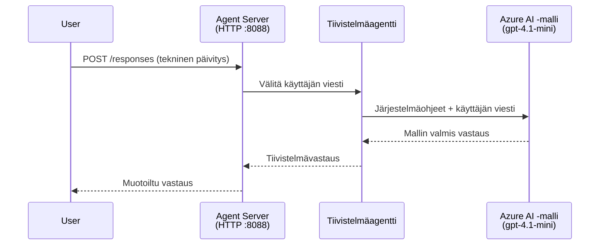
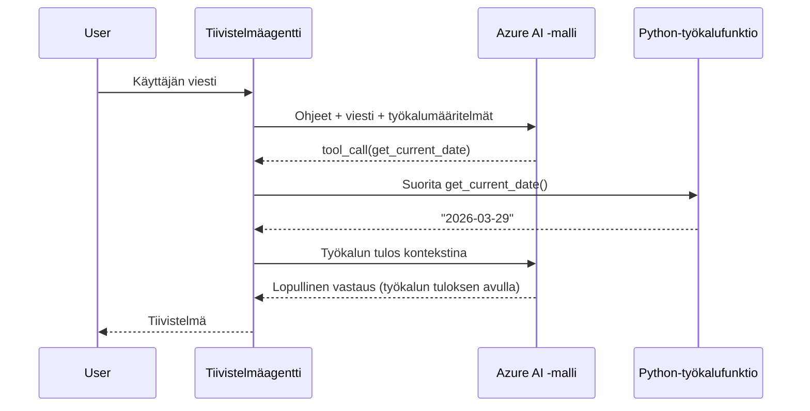

# Moduuli 4 - Konfiguroi ohjeet, ympäristö ja asenna riippuvuudet

Tässä moduulissa mukautat moduulissa 3 automaattisesti luotuja agenttitiedostoja. Tässä vaiheessa muunnat yleisen rungon **omaan** agenttiisi - kirjoittamalla ohjeet, asettamalla ympäristömuuttujat, valinnaisesti lisäämällä työkaluja ja asentamalla riippuvuuksia.

> **Muistutus:** Foundryn laajennus loi projektisi tiedostot automaattisesti. Nyt muokkaat niitä. Katso [`agent/`](../../../../../workshop/lab01-single-agent/agent) -kansiosta täydellinen esimerkki mukautetusta agentista.

---

## Miten komponentit toimivat yhdessä

### Pyynnön elinkaari (yksi agentti)


> **Työkalujen kanssa:** Jos agentilla on rekisteröityjä työkaluja, malli saattaa palauttaa työkalukutsun suoran vastauksen sijasta. Kehys suorittaa työkalun paikallisesti, syöttää tuloksen takaisin mallille, ja malli tuottaa lopullisen vastauksen.


---

## Vaihe 1: Konfiguroi ympäristömuuttujat

Runko loi `.env`-tiedoston paikkamerkkiarvoilla. Sinun täytyy täyttää todelliset arvot moduulista 2.

1. Avaa muodostamassasi projektissa **`.env`**-tiedosto (se löytyy projektin juuresta).
2. Korvaa paikkamerkkien arvot omilla Foundry-projektitiedoillasi:

   ```env
   PROJECT_ENDPOINT=https://<your-account>.services.ai.azure.com/api/projects/<your-project>
   MODEL_DEPLOYMENT_NAME=gpt-4.1-mini
   ```

3. Tallenna tiedosto.

### Mistä löytää nämä arvot

| Arvo | Miten löytää |
|-------|---------------|
| **Projektin päätepiste** | Avaa **Microsoft Foundry** -sivupalkki VS Codessa → klikkaa projektiasi → päätepisteen URL näkyy tarkastelunäkymässä. Se näyttää tältä: `https://<account-name>.services.ai.azure.com/api/projects/<project-name>` |
| **Mallin käyttöönoton nimi** | Foundryn sivupalkissa laajenna projektiasi → katso **Models + endpoints** -kohdan alta → nimi näkyy otetun mallin vieressä (esim. `gpt-4.1-mini`) |

> **Turvallisuus:** Älä koskaan tallenna `.env`-tiedostoa versionhallintaan. Se on oletuksena jo lisätty `.gitignore`-tiedostoon. Jos ei ole, lisää se:
> ```
> .env
> ```

### Miten ympäristömuuttujat kulkevat

Kartoitusketju on: `.env` → `main.py` (lukee `os.getenv`-kutsulla) → `agent.yaml` (kartoitus konttien ympäristömuuttujiin käyttöönottohetkellä).

`main.py`:ssä runko lukee nämä arvot näin:

```python
PROJECT_ENDPOINT = os.getenv("AZURE_AI_PROJECT_ENDPOINT") or os.getenv("PROJECT_ENDPOINT")
MODEL_DEPLOYMENT_NAME = os.getenv("AZURE_AI_MODEL_DEPLOYMENT_NAME", os.getenv("MODEL_DEPLOYMENT_NAME", "gpt-4.1-mini"))
```

Sekä `AZURE_AI_PROJECT_ENDPOINT` että `PROJECT_ENDPOINT` hyväksytään (agent.yaml käyttää `AZURE_AI_*`-etuliitettä).

---

## Vaihe 2: Kirjoita agentin ohjeet

Tämä on tärkein mukautusvaihe. Ohjeet määrittelevät agenttisi persoonallisuuden, käyttäytymisen, vastausten muodon ja turvallisuusrajoitteet.

1. Avaa `main.py` projektistasi.
2. Etsi ohjeeksi määritelty merkkijono (runko sisältää oletus-/yleisohjeen).
3. Vaihda se yksityiskohtaisiin, jäsenneltyihin ohjeisiin.

### Mitä hyvät ohjeet sisältävät

| Osa | Tarkoitus | Esimerkki |
|-----------|---------|---------|
| **Rooli** | Mikä agentti on ja tekee | "Olet tiivistelmäagentti" |
| **Kohdeyleisö** | Kenelle vastaukset on suunnattu | "Johtajat, joilla on rajallinen tekninen tausta" |
| **Syötteen määritelmä** | Millaisia kehotteita se käsittelee | "Tekniset häiriöraportit, operatiiviset päivitykset" |
| **Vastausmuoto** | Täsmällinen vastausrakenne | "Tiivistelmä: - Mitä tapahtui: ... - Liiketoiminnan vaikutus: ... - Seuraava vaihe: ..." |
| **Säännöt** | Rajoitukset ja kieltäytymisen ehdot | "ÄLÄ lisää tietoja, joita ei ole annettu" |
| **Turvallisuus** | Käytön väärinkäytön ja hallusinaation ehkäisy | "Jos syöte on epäselvä, pyydä tarkennusta" |
| **Esimerkit** | Syöte-/vastauspareja käyttäytymisen ohjaamiseen | Sisällytä 2-3 erilaista esimerkkiä |

### Esimerkki: Tiivistelmäagentin ohjeet

Tässä workshopin [`agent/main.py`](../../../../../workshop/lab01-single-agent/agent/main.py):ssä käytetyt ohjeet:

```python
AGENT_INSTRUCTIONS = """You are an "Explain Like I'm an Executive" agent.

Purpose:
Your job is to translate complex technical or operational information into
clear, concise, and outcome-focused summaries that can be easily understood
by non-technical executives.

Audience:
Senior leaders with limited technical background who care about impact,
risk, and what happens next.

What you must do:
- Rephrase the input so it is understandable to a non-technical audience
- Prioritize clarity, brevity, and outcomes over technical accuracy
- Remove technical jargon, logs, metrics, stack traces, and deep root-cause details
- Translate technical causes into simple cause-and-effect statements
- Explicitly call out business impact
- Always include a clear next step or action
- Maintain a neutral, factual, and calm executive tone
- Do NOT add new facts or speculate beyond the input

Standard Output Structure (always use this wording):

Executive Summary:
- What happened: <plain-language description>
- Business impact: <clear, non-technical impact>
- Next step: <clear action or mitigation>

Rules:
- Keep responses under 100 words
- Do NOT add facts beyond the input
- If input is unclear, ask for clarification
"""
```

4. Korvaa `main.py`:n olemassa oleva ohjemerkkijono omilla ohjeillasi.
5. Tallenna tiedosto.

---

## Vaihe 3: (Valinnainen) Lisää omat työkalut

Isännöidyt agentit voivat suorittaa **paikallisia Python-funktioita** työkaluina ([tools](https://learn.microsoft.com/azure/foundry/agents/concepts/tool-catalog)). Tämä on merkittävä etu koodipohjaisilla isännöidyillä agenteilla verrattuna pelkästään kehotteisiin perustuviin agenteihin - agenttisi voi suorittaa mielivaltaista palvelinpuolen logiikkaa.

### 3.1 Määritä työkalu-funktio

Lisää työkalufunktio `main.py`:

```python
from agent_framework import tool

@tool
def get_current_date() -> str:
    """Returns the current date in YYYY-MM-DD format."""
    from datetime import date
    return str(date.today())
```

`@tool`-koristaja muuttaa tavallisen Python-funktion agenttityökaluksi. Docstring toimii työkalun kuvauksena, jonka malli näkee.

### 3.2 Rekisteröi työkalu agentille

Kun luot agentin `.as_agent()`-kontekstinhallinnan avulla, välitä työkalu `tools`-parametrissa:

```python
async with AzureAIAgentClient(
    project_endpoint=PROJECT_ENDPOINT,
    model_deployment_name=MODEL_DEPLOYMENT_NAME,
    credential=credential,
).as_agent(
    name="my-agent",
    instructions=AGENT_INSTRUCTIONS,
    tools=[get_current_date],
) as agent:
    server = from_agent_framework(agent)
    await server.run_async()
```

### 3.3 Miten työkalukutsut toimivat

1. Käyttäjä lähettää kehotteen.
2. Malli päättää, tarvitaanko työkalua (kehotteen, ohjeiden ja työkalukuvausten perusteella).
3. Kun työkalu tarvitaan, kehys kutsuu Python-funktiosi paikallisesti (kontin sisällä).
4. Työkalun palauttama arvo lähetetään takaisin mallille kontekstina.
5. Malli tuottaa lopullisen vastauksen.

> **Työkalut suoritetaan palvelinpuolella** - ne ajetaan konttisi sisällä, eivät käyttäjän selaimessa tai mallissa. Tämä tarkoittaa, että saat käyttöön tietokannat, API:t, tiedostojärjestelmät tai mitä tahansa Python-kirjastoa.

---

## Vaihe 4: Luo ja aktivoi virtuaaliympäristö

Ennen riippuvuuksien asentamista luo eristetty Python-ympäristö.

### 4.1 Luo virtuaaliympäristö

Avaa terminaali VS Codessa (`` Ctrl+` ``) ja aja:

```powershell
python -m venv .venv
```

Tämä luo `.venv`-kansion projektikansioosi.

### 4.2 Aktivoi virtuaaliympäristö

**PowerShell (Windows):**

```powershell
.\.venv\Scripts\Activate.ps1
```

**Komentokehote (Windows):**

```cmd
.venv\Scripts\activate.bat
```

**macOS/Linux (Bash):**

```bash
source .venv/bin/activate
```

Pitäisi näkyä `(.venv)` terminaalin kehotteen alussa, mikä tarkoittaa että virtuaaliympäristö on aktivoitu.

### 4.3 Asenna riippuvuudet

Kun virtuaaliympäristö on aktiivinen, asenna tarvittavat paketit:

```powershell
pip install -r requirements.txt
```

Nämä asentuvat:

| Paketti | Tarkoitus |
|---------|---------|
| `agent-framework-azure-ai==1.0.0rc3` | Azure AI -integraatio [Microsoft Agent Frameworkille](https://learn.microsoft.com/agent-framework/overview/) |
| `agent-framework-core==1.0.0rc3` | Agenttien ydinajoympäristö (sisältää `python-dotenv`) |
| `azure-ai-agentserver-agentframework==1.0.0b16` | Isännöidyn agenttipalvelimen runtime [Foundry Agent Servicea varten](https://learn.microsoft.com/azure/foundry/agents/overview) |
| `azure-ai-agentserver-core==1.0.0b16` | Agenttipalvelimen ydinkomponentit |
| `debugpy` | Python-debuggaus (sallii F5-debuggauksen VS Codessa) |
| `agent-dev-cli` | Paikallinen kehitystyökaluagenttien testaamiseen |

### 4.4 Vahvista asennus

```powershell
pip list | Select-String "agent-framework|agentserver"
```

Odotettu tulos:
```
agent-framework-azure-ai   1.0.0rc3
agent-framework-core       1.0.0rc3
azure-ai-agentserver-agentframework 1.0.0b16
azure-ai-agentserver-core  1.0.0b16
```

---

## Vaihe 5: Vahvista todennus

Agentti käyttää [`DefaultAzureCredential`](https://learn.microsoft.com/azure/developer/python/sdk/authentication/credential-chains#defaultazurecredential-overview) -kirjastoa, joka kokeilee useita todennusmenetelmiä tässä järjestyksessä:

1. **Ympäristömuuttujat** - `AZURE_CLIENT_ID`, `AZURE_TENANT_ID`, `AZURE_CLIENT_SECRET` (palveluperiaate)
2. **Azure CLI** - käyttää `az login` -sessiotietoa
3. **VS Code** - käyttää tilin kirjautumisen tietoja
4. **Managed Identity** - käytössä ajon aikana Azure-ympäristössä

### 5.1 Tarkista paikallista kehitystä varten

Vähintään yhden näistä tulisi toimia:

**Vaihtoehto A: Azure CLI (suositeltu)**

```powershell
az account show --query "{name:name, id:id}" --output table
```

Odotettu: Näyttää tilauksesi nimen ja tunnuksen.

**Vaihtoehto B: VS Code -kirjautuminen**

1. Katso VS Coden vasemmasta alakulmasta **Accounts**-kuvake.
2. Jos näet tilisi nimen, olet tunnistautunut.
3. Jos ei, klikkaa kuvaketta → **Sign in to use Microsoft Foundry**.

**Vaihtoehto C: Palveluperiaate (CI/CD:lle)**

```powershell
$env:AZURE_TENANT_ID = "<your-tenant-id>"
$env:AZURE_CLIENT_ID = "<your-client-id>"
$env:AZURE_CLIENT_SECRET = "<your-client-secret>"
```

### 5.2 Yleinen todennusongelma

Jos olet kirjautunut useaan Azure-tiliin, varmista oikea tilaus on valittuna:

```powershell
az account set --subscription "<your-subscription-id>"
```

---

### Tarkistuslista

- [ ] `.env`-tiedostossa on kelvolliset `PROJECT_ENDPOINT` ja `MODEL_DEPLOYMENT_NAME` (ei paikkamerkkejä)
- [ ] Agentin ohjeet on mukautettu `main.py`:ssä – ne määrittelevät roolin, kohdeyleisön, vastausmuodon, säännöt ja turvallisuusrajoitteet
- [ ] (Valinnainen) Omat työkalut on määritelty ja rekisteröity
- [ ] Virtuaaliympäristö on luotu ja aktivoitu (`(.venv)` näkyy terminaalin kehotteessa)
- [ ] `pip install -r requirements.txt` suorittuu onnistuneesti ilman virheitä
- [ ] `pip list | Select-String "azure-ai-agentserver"` näyttää paketin asennettuna
- [ ] Todennus on kunnossa – `az account show` palauttaa tilauksen TAI olet kirjautuneena VS Codeen

---

**Edellinen:** [03 - Luo isännöity agentti](03-create-hosted-agent.md) · **Seuraava:** [05 - Testaa paikallisesti →](05-test-locally.md)

---

<!-- CO-OP TRANSLATOR DISCLAIMER START -->
**Vastuuvapauslauseke**:  
Tämä asiakirja on käännetty tekoälykäännöspalvelulla [Co-op Translator](https://github.com/Azure/co-op-translator). Vaikka pyrimme tarkkuuteen, otathan huomioon, että automaattikäännöksissä saattaa olla virheitä tai epätarkkuuksia. Alkuperäistä asiakirjaa sen alkuperäisellä kielellä pidetään virallisena lähteenä. Tärkeiden tietojen osalta suosittelemme ammattimaista ihmiskäännöstä. Emme ole vastuussa tämän käännöksen käytöstä mahdollisesti aiheutuvista väärinymmärryksistä tai tulkinnoista.
<!-- CO-OP TRANSLATOR DISCLAIMER END -->