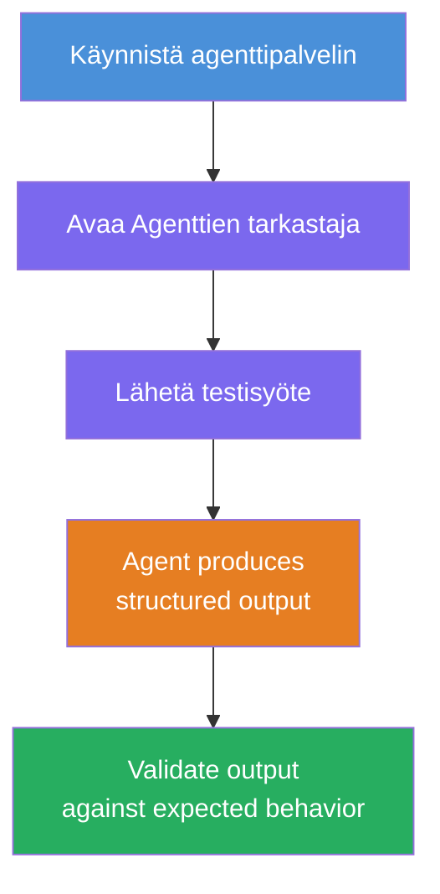
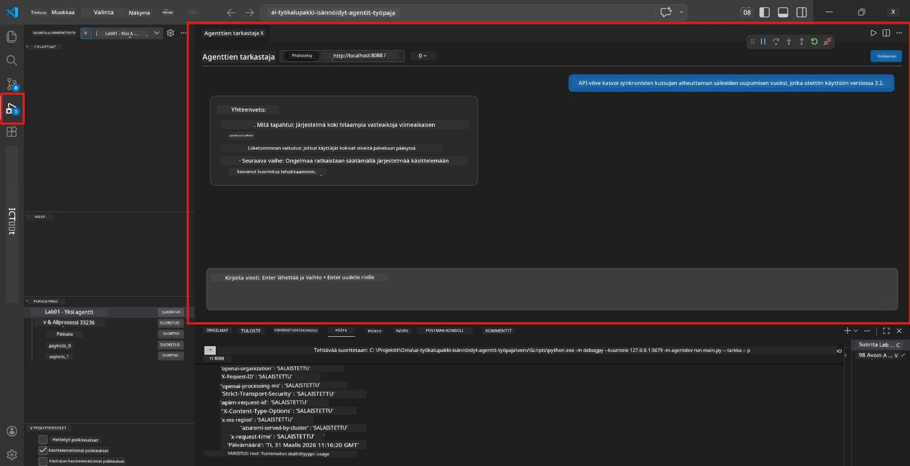
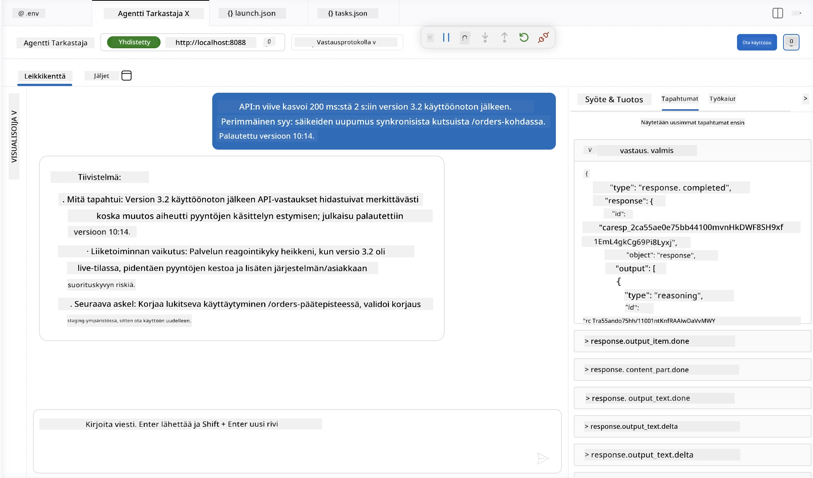

# Moduuli 4 - Testaa paikallisesti

⏱️ ~10 min

Tässä moduulissa ajat agenttisi paikallisesti ja varmistat, että se toimii oikein käyttämällä **onnistuneen reitin toiminnallisia testejä**. Käytät Agenttien tarkastajaa (visuaalinen käyttöliittymä) tai suoria HTTP-kutsuja varmistaaksesi, että agentti tuottaa jäsenneltyjä ja tarkkoja vastauksia.

### Paikallisen testauksen kulku



---

## Vaihtoehto 1: Paina F5 - Debuggaa Agenttien tarkastajalla (suositeltu)

### Käynnistä virheenkorjaus

1. Avaa **executive-summary-agent/** -kansio suoraan VS Codessa (`File → Open Folder`).
2. Avaa **Run and Debug** -paneeli (`Ctrl+Shift+D`).
3. Valitse alasvetovalikosta **Debug Local Agent Server**.
4. Paina **F5** (tai klikkaa ▶ Aloita virheenkorjaus).

> ⚠️ **Tärkeää: Valitse Python-tulkki**
> Jos saat "ModuleNotFoundError" -virheen tai virheenkorjaus ei käynnisty, sinun täytyy kertoa VS Codelle käyttää virtuaaliympäristöäsi:
  > 1. Paina `Ctrl+Shift+P` → kirjoita **Python: Select Interpreter**.
  > 2. Valitse tulkki, joka sijaitsee projektisi `.venv` -kansiossa (esim. `.\.venv\Scripts\python.exe` Windowsilla).
  > 3. Käynnistä virheenkorjaussessio uudelleen.
> Jos virheitä esiintyy edelleen, päivitä tiedostosi `tasks.json` manuaalisesti seuraavasti:
  > 1. Siirry tiedostoon `.vscode/tasks.json`
  > 2. Etsi komento nimeltä: `Run Agent/Workflow HTTP Server`
  > 3. Päivitä komennon arvo seuraavasti: `"value": "${workspaceFolder}/.venv/bin/python",`

### Mitä tapahtuu

1. HTTP-palvelin käynnistyy osoitteeseen `http://localhost:8088/responses`.
2. **Agenttien tarkastaja** avautuu automaattisesti - visuaalinen chat-käyttöliittymä testausta varten.
3. Keskeytyspisteet ovat käytössä tiedostossa `main.py`.

Tarkkaile Terminaalia seuraavaksi:
```
Starting executive summary hosted agent
Executive agent server running on http://localhost:8088
```

> **Jos Agenttien tarkastaja ei avaudu:** Paina `Ctrl+Shift+P` → **Foundry Toolkit: Open Agent Inspector**.



> *Kuvakaappaus saattaa näyttää vanhempaa 'AI TOOLKIT' -brändäystä aiemman laajennusversion ajalta.*

---

## Vaihtoehto 2: Testaa terminaalin kautta (vaihtoehtoinen)

Käynnistä agentti yhdessä terminaalissa, lähetä pyyntöjä toisessa:

```bash
# Terminaali 1: Käynnistä agentti
cd executive-summary-agent/
source .venv/bin/activate
python main.py
```

```bash
# Terminaali 2: Lähetä testi (curl)
curl -sS -X POST http://localhost:8088/responses \
  -H "Content-Type: application/json" \
  -d '{"input": "The API latency increased due to thread pool exhaustion caused by sync calls in v3.2.", "stream": false}'
```

---

## Tilannetestit: Onnistuneen reitin toiminnallinen validointi

Suorita **kaikki kolme** alla olevaa tilannetta. Ne varmistavat, että agenttisi tuottaa oikean, jäsennellyn vastauksen realistisille syötteille.



### Tilanne 1: IT-tapahtuma - API-viiveen piikki

**Syöte:**
```
The API latency increased from 200ms to 2s after deploying v3.2.
Root cause: thread pool starvation from synchronous calls in /orders.
Rolled back at 10:14.
```

**Odotettu toiminta:**
- ✅ Noudata "Executive Summary" -rakennetta (Mitä tapahtui / Liiketoiminnan vaikutus / Seuraava vaihe)
- ✅ Ei teknistä jargonia (ei "thread pool", ei "/orders", ei "v3.2")
- ✅ Selkeästi ilmoitetaan liiketoiminnan vaikutus (esim. käyttäjät kokivat viiveitä)
- ✅ Mukana on seuraava vaihe (esim. korjaus käyttöön otettu, valvonta paikallaan)

---

### Tilanne 2: Datan putki - ETL-virhe

**Syöte:**
```
The nightly ETL job failed because the upstream schema changed. APAC dashboards show missing data.
```

**Odotettu toiminta:**
- ✅ Yhteenvedossa kuvataan datan päivitysongelma selkokielellä
- ✅ Mainitaan APAC-hallintapaneelin vaikutus
- ✅ Mukana on korjaava seuraava vaihe
- ✅ EI mainita "ETL", "skeema" tai muita teknisiä termejä

---

### Tilanne 3: Tietoturva - Paljastettu tunnistautumistieto

**Syöte:**
```
Static analysis flagged a hardcoded secret in the repository.
The secret may have been exposed in commit history.
```

**Odotettu toiminta:**
- ✅ Kuvaa tunnistautumis-/turvaongelman johdonmukaisella kielellä
- ✅ Mainitsee potentiaalisen riskin (luvatonta pääsyä)
- ✅ Ilmoittaa korjaavan toimenpiteen (tunnistautumistietojen kierto, auditointi)
- ✅ EI sisällä termejä kuten "staattinen analyysi", "commit-historia" tai "kovakoodattu"

---

## Validointikriteerit

Tarkista jokaisesta tilanteesta:

| # | Kriteeri | Läpäisyvaatimus |
|---|----------|------------------|
| 1 | **Rakenne** | Vastaus käyttää "Executive Summary" -muotoa kaikkien kolmen kohdan kanssa |
| 2 | **Selkokieli** | Ei teknistä jargonia, jota johto ei ymmärtäisi |
| 3 | **Tarkkuus** | Tiivistelmä vastaa syötettä - ei keksittyjä yksityiskohtia |
| 4 | **Ytimekkyys** | Vastaus alle 100 sanan |
| 5 | **Seuraava vaihe** | Selkeä toimenpide tai lievennys mainittu |

---

## Virheenkorjausvinkit

| Ongelma | Korjaus |
|---------|---------|
| Agentti ei käynnisty | Tarkista `.env` arvojen oikeellisuus, varmista venv on aktivoitu, suorita `pip install -r requirements.txt` |
| Tyhjä tai geneerinen vastaus | Tarkista ohjeet `main.py` -tiedostosta - varmista, että lähtömuoto on määritelty |
| Vastaus sisältää jargonin | Tiukennetaan ohjeita "poista tekniset termit" |
| Agenttien tarkastaja ei avaudu | `Ctrl+Shift+P` → **Foundry Toolkit: Open Agent Inspector** |
| Mallivirheet terminaalissa | Varmista, että `AZURE_AI_MODEL_DEPLOYMENT_NAME` vastaa täsmälleen (koko merkkikoko huomioiden) |

---

### ✅ Tarkistuspiste

- [ ] Agentti käynnistyy paikallisesti ilman virheitä
- [ ] Agenttien tarkastaja avautuu ja näyttää chattikäyttöliittymän (jos käytät F5:tä)
- [ ] **Tilanne 1** (IT-tapahtuma) - jäsennelty Executive Summary, ilman jargonin käyttöä
- [ ] **Tilanne 2** (datan putki) - relevantti tiivistelmä liiketoiminnan vaikutuksineen
- [ ] **Tilanne 3** (tietoturvahälytys) - asianmukainen riskiviestintä
- [ ] Kaikki vastaukset noudattavat määriteltyä tulostruktuuria

> **Tallenna vastauksesi** (kopio tai kuvakaappaus) - vertaat niitä pilvivaiheen tuloksiin Moduulissa 06.

---

**Edellinen:** [03 - Configure & Code](03-configure-and-code.md) · **Seuraava:** [05 - Deploy to Foundry →](05-deploy-to-foundry.md)

---

<!-- CO-OP TRANSLATOR DISCLAIMER START -->
**Vastuuvapauslauseke**:
Tämä asiakirja on käännetty käyttämällä tekoälypohjaista käännöspalvelua [Co-op Translator](https://github.com/Azure/co-op-translator). Vaikka pyrimme tarkkuuteen, otathan huomioon, että automaattiset käännökset saattavat sisältää virheitä tai epätarkkuuksia. Alkuperäinen asiakirja sen alkuperäiskielellä on virallinen lähde. Tärkeissä asioissa suositellaan ammattimaista ihmiskäännöstä. Emme ole vastuussa tämän käännöksen käytöstä aiheutuvista väärinymmärryksistä tai tulkinnoista.
<!-- CO-OP TRANSLATOR DISCLAIMER END -->