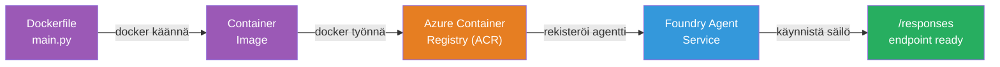
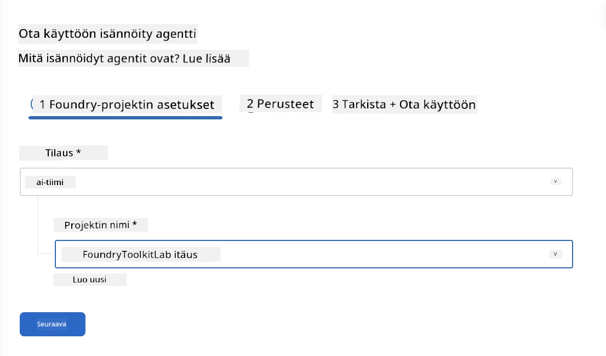
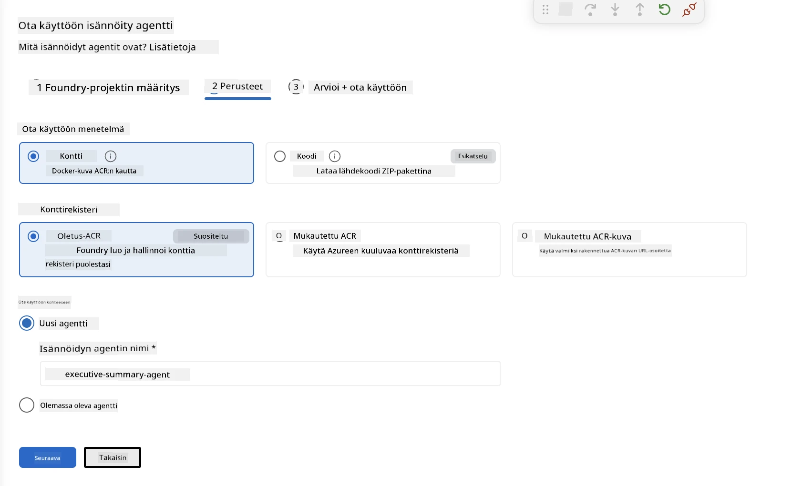
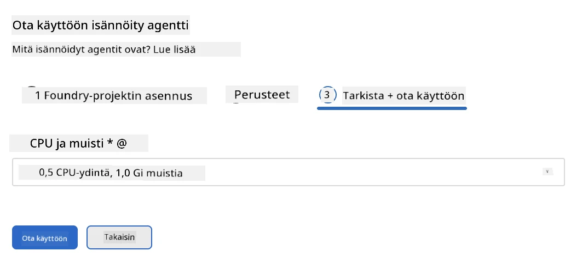
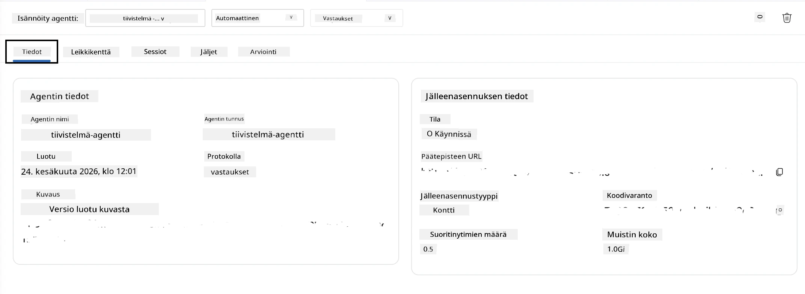

# Moduuli 5 - Julkaisu Foundry Agent Serviceen

⏱️ ~10 min

> ⚠️ **Path B -käyttäjät:** Tämä moduuli vaatii Foundry-tilauksen. Jos käytät Foundry Localia, siirry suoraan kohtaan [Moduuli 07 - Yhteenveto](07-summary.md). Olet onnistuneesti suorittanut paikallisen kehitystyönkulun!

Tässä moduulissa otat paikallisesti testatun agenttisi käyttöön Microsoft Foundryssa **Isännöitynä agenttina**. Julkaisu rakentaa konttikuvan, työntää sen Azure Container Registriin ja käynnistää agentin Foundryn hallinnoimassa infrastruktuurissa.

### Julkaisuputki

---

## Esivaatimusten tarkistus

Ennen julkaisua varmista:

- [ ] Agentti läpäisee kaikki 3 paikallista skenaariota moduulista [04](04-test-locally.md)
- [ ] Sinulla on **Azure AI User** -rooli projektitason käyttöoikeuksissa ([Moduuli 01, RBAC:n määrittäminen](01-setup.md#deploy-a-model--assign-rbac))
- [ ] Olet kirjautunut Azureen VS Codessa (Tilien kuvake näyttää nimesi)

---

## Vaihe 1: Käynnistä julkaisu

### Vaihtoehto A: Julkaisu Agent Inspectorista (suositeltu)

Jos Agent Inspector on auki (testauksesta):
1. Napsauta yläkulman oikealla olevaa **Deploy**-painiketta (pilvikuvake ↑).

### Vaihtoehto B: Julkaisu komentopalettista

1. Paina `Ctrl+Shift+P` → **Foundry Toolkit: Deploy Hosted Agent**.

---

## Vaihe 2: Määritä julkaisu

Velho pyytää sinua antamaan:

| Kehote | Valinta |
|--------|-----------|
| **Tilaus** | Oma Azure-tilauksesi |
| **Kohdeprojekti** | Oma Foundry-projektisi (esim. `workshop-agents`) |

Napsauta **seuraava** jatkaaksesi agentin määritystä.

| Kehote | Valinta |
|--------|-----------|
| **Julkaisumenetelmä** | Kontti |
| **Konttirekisteri** | **Oletus ACR** (Microsoft Foundry luo ja hallinnoi tilisi puolesta) |
| **Julkaise kohteeseen** | Uusi agentti (nimi, `executive-summary-agent`) |

Napsauta **seuraava** tarkistaaksesi ja julkaistaksesi agentin.

| Kehote | Valinta |
|--------|-----------|
| **CPU ja muisti** | **0.25 CPU-ydintä, 0.5 Gi muistia** (riittävä workshopiin) |

---

## Vaihe 3: Julkaise ja valvo

1. Napsauta **Deploy**.
2. Seuraa **Output**-paneelia (valitse pudotusvalikosta **Microsoft Foundry**).
3. Julkaisu etenee näiden vaiheiden kautta:
   - **Docker build** - rakentaa kontin Dockerfilestäsi
   - **Docker push** - työntää kuvan ACR:ään (1–3 min ensimmäisellä julkaisulla)
   - **Agentin rekisteröinti** - luo isännöidyn agentin Foundryyn
   - **Kontin käynnistys** - käynnistyy järjestelmän hallinnoimalla identiteetillä

4. Kun valmis, saat ilmoituksen:
   > **my-agent on julkaistu onnistuneesti.** `Näytä lokit` `Suorita agentti`

5. Napsauta **Run agent** avataksesi Agent Playgroundin.

### Julkaisun tilat

| Tila | Merkitys |
|--------|---------|
| **Running** | Kontti valmis, agentti vastaa |
| **Pending** | Konttia käynnistetään - odota 30–60 sekuntia |
| **Failed** | Tarkista lokit (katso vianmääritys alla) |

---

## Yleiset julkaisun virheet

| Virhe | Juuri | Korjaus |
|-------|-----------|-----|
| `agents/write` lupa evätty | Puuttuu **Azure AI User** -rooli projektin tasolla | [Moduuli 01, RBAC:n määrittäminen](01-setup.md#deploy-a-model--assign-rbac) |
| Docker ei ole käynnissä | Docker Desktop ei ole käynnistetty | Käynnistä Docker Desktop → tarkista `docker info` |
| ACR -valtuutusongelma | Hallinnoitu identiteetti ei pääse hakemaan kuvaa | Katso [Moduuli 08 - Vianmääritys](08-troubleshooting.md) |

---

### ✅ Tarkistuspiste

- [ ] Julkaisu valmistui ilman virheitä
- [ ] Agentti näkyy Foundryn sivupalkissa kohdassa **Hosted Agents (Preview)**
- [ ] Kontin tila näyttää **Running**
- [ ] Agent Playground -välilehti avattu, jossa näkyvät agentin tiedot ja päätepisteen URL

---

**Edellinen:** [04 - Testaa paikallisesti](04-test-locally.md) · **Seuraava:** [06 - Vahvista Playgroundissa →](06-verify-in-playground.md)

---

<!-- CO-OP TRANSLATOR DISCLAIMER START -->
**Vastuuvapauslauseke**:
Tämä asiakirja on käännetty käyttämällä tekoälypohjaista käännöspalvelua [Co-op Translator](https://github.com/Azure/co-op-translator). Vaikka pyrimme tarkkuuteen, otathan huomioon, että automaattiset käännökset saattavat sisältää virheitä tai epätarkkuuksia. Alkuperäinen asiakirja sen alkuperäiskielellä on virallinen lähde. Tärkeissä asioissa suositellaan ammattimaista ihmiskäännöstä. Emme ole vastuussa tämän käännöksen käytöstä aiheutuvista väärinymmärryksistä tai tulkinnoista.
<!-- CO-OP TRANSLATOR DISCLAIMER END -->