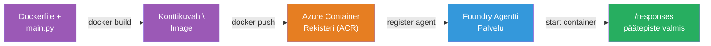
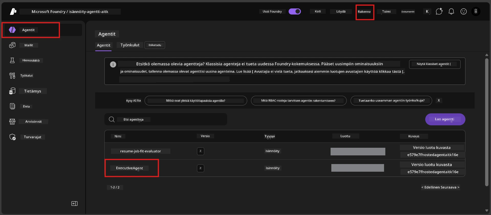

# Moduuli 6 - Julkaise Foundry Agent -palveluun

Tässä moduulissa julkaiset paikallisesti testatun agenttisi Microsoft Foundryyn [**Isännöitynä Agenttina**](https://learn.microsoft.com/azure/foundry/agents/concepts/hosted-agents). Julkaisu rakentaa Docker-konttikuvan projektistasi, työntää sen [Azure Container Registryyn (ACR)](https://learn.microsoft.com/azure/container-registry/container-registry-intro) ja luo isännöidyn agenttiversion [Foundry Agent Serviceen](https://learn.microsoft.com/azure/foundry/agents/overview).

### Julkaisuputki


---

## Vaatimusten tarkistus

Ennen julkaisua tarkista alla olevat asiat. Näiden ohittaminen on yleisin syy julkaisun epäonnistumiseen.

1. **Agentti läpäisee paikalliset savutestit:**
   - Suoritit kaikki 4 testiä [Moduulissa 5](05-test-locally.md) ja agentti vastasi oikein.

2. **Sinulla on [Azure AI User](https://learn.microsoft.com/azure/foundry/concepts/rbac-foundry#built-in-roles) -rooli:**
   - Tämä määritettiin [Moduulissa 2, vaihe 3](02-create-foundry-project.md). Jos et ole varma, tarkista nyt:
   - Azure Portal → Foundry-projektisi resurssi → **Access control (IAM)** → **Role assignments** -välilehti → etsi nimesi → varmista että **Azure AI User** on listalla.

3. **Olet kirjautuneena Azureen VS Codessa:**
   - Tarkista tilit-kuvake VS Coden vasemmasta alakulmasta. Tilinimesi pitäisi näkyä.

4. **(Valinnainen) Docker Desktop on käynnissä:**
   - Dockeria tarvitaan vain, jos Foundry-laajennus pyytää sinua paikalliseen rakentamiseen. Useimmissa tapauksissa laajennus rakentaa kontit automaattisesti julkaisun aikana.
   - Jos Docker on asennettu, varmista sen käynnissäolo: `docker info`

---

## Vaihe 1: Aloita julkaisu

Julkaisemiseen on kaksi tapaa - molemmat johtavat samaan tulokseen.

### Vaihtoehto A: Julkaise Agent Inspectorista (suositeltu)

Jos ajat agenttia debuggerilla (F5) ja Agent Inspector on auki:

1. Katso Agent Inspector -paneelin **oikeasta yläkulmasta**.
2. Klikkaa **Deploy** -painiketta (pilvikuva, jossa ylöspäin osoittava nuoli ↑).
3. Julkaisuvelho avautuu.

### Vaihtoehto B: Julkaise komentopalettien kautta

1. Paina `Ctrl+Shift+P` avataksesi **Komentopaletti**.
2. Kirjoita: **Microsoft Foundry: Deploy Hosted Agent** ja valitse se.
3. Julkaisuvelho avautuu.

---

## Vaihe 2: Määritä julkaisu

Julkaisuvelho opastaa sinut konfigurointivaiheiden läpi. Täytä jokainen kysely:

### 2.1 Valitse kohdeprojekti

1. Pudotusvalikko näyttää Foundry-projektisi.
2. Valitse projektisi, jonka loit Moduulissa 2 (esim. `workshop-agents`).

### 2.2 Valitse konttiagenttitiedosto

1. Sinua pyydetään valitsemaan agentin sisäänkäyntitiedosto.
2. Valitse **`main.py`** (Python) – tätä tiedostoa velho käyttää tunnistaakseen agenttiprojektisi.

### 2.3 Määritä resurssit

| Asetus    | Suositeltu arvo | Huomautukset                                  |
|-----------|-----------------|-----------------------------------------------|
| **CPU**   | `0.25`          | Oletus, riittää työpajaa varten. Suurentaa tuotantokuormille |
| **Muisti** | `0.5Gi`         | Oletus, riittää työpajaa varten                |

Nämä vastaavat arvoja tiedostossa `agent.yaml`. Voit hyväksyä oletukset.

---

## Vaihe 3: Vahvista ja julkaise

1. Velho näyttää julkaisuyhteenvedon, johon sisältyy:
   - Kohdeprojektin nimi
   - Agentin nimi (`agent.yaml`:sta)
   - Konttitiedosto ja resurssit
2. Tarkista yhteenveto ja napsauta **Confirm and Deploy** (tai **Deploy**).
3. Seuraa etenemistä VS Codessa.

### Mitä tapahtuu julkaisun aikana (vaihe vaiheelta)

Julkaisu on monivaiheinen prosessi. Seuraa VS Coden **Output** -paneelia (valitse pudotusvalikosta "Microsoft Foundry"):

1. **Docker build** - VS Code rakentaa Docker-konttikuvan `Dockerfile`-tiedostostasi. Näet Dockerin kerrosviestejä:
   ```
   Step 1/6 : FROM python:<version>-slim
   Step 2/6 : WORKDIR /app
   ...
   Successfully built abc123def456
   ```

2. **Docker push** - Kuva lähetetään Foundry-projektiisi liitettyyn **Azure Container Registryyn (ACR)**. Tämä voi kestää 1-3 minuuttia ensimmäisellä julkaisulla (peruskuva on >100MB).

3. **Agentin rekisteröinti** - Foundry Agent Service luo uuden isännöidyn agentin (tai uuden version, jos agentti on jo olemassa). Agentin metatiedot haetaan `agent.yaml`-tiedostosta.

4. **Kontin käynnistys** - Kontti käynnistyy Foundryn hallitussa infrastruktuurissa. Alusta määrittää [järjestelmän hallinnoiman identiteetin](https://learn.microsoft.com/azure/foundry/agents/concepts/agent-identity) ja tekee `/responses`-päätepisteen saataville.

> **Ensimmäinen julkaisu on hitaampi** (Dockerin täytyy työntää kaikki kerrokset). Seuraavat julkaisut ovat nopeampia, koska Docker välimuistaa muuttumattomat kerrokset.

---

## Vaihe 4: Tarkista julkaisun tila

Julkaisukomennon valmistuttua:

1. Avaa **Microsoft Foundry** sivupalkki klikkaamalla Foundry-kuvaketta Aktiviteettipalkissa.
2. Laajenna **Hosted Agents (Preview)** -osio projektisi alta.
3. Näet agenttisi nimen (esim. `ExecutiveAgent` tai nimen `agent.yaml`:sta).
4. **Klikkaa agentin nimeä** laajentaaksesi.
5. Näet yhden tai useamman **version** (esim. `v1`).
6. Klikkaa versiota nähdäksesi **Kontin tiedot**.
7. Tarkista **Status**-kenttä:

   | Tila        | Merkitys                                |
   |-------------|----------------------------------------|
   | **Started** tai **Running** | Kontti on käynnissä ja agentti valmis |
   | **Pending** | Kontti käynnistyy (odota 30–60 sekuntia) |
   | **Failed**  | Kontin käynnistys epäonnistui (tarkista lokit – katso vianmääritys alla) |



> **Jos näet "Pending" yli 2 minuuttia:** Kontti saattaa vetää peruskuvaa. Odota hetki lisää. Jos tila pysyy odottavana, tarkista kontin lokit.

---

## Yleisiä julkaisun virheitä ja korjauksia

### Virhe 1: Käyttöoikeus evätty - `agents/write`

```
Error: lacks the required data action 
Microsoft.CognitiveServices/accounts/AIServices/agents/write 
to perform POST /api/projects/{projectName}/assistants operation.
```

**Perussyynä:** Sinulla ei ole `Azure AI User` -roolia **projektin** tasolla.

**Korjaus vaihe vaiheelta:**

1. Avaa [https://portal.azure.com](https://portal.azure.com).
2. Hakupalkissa kirjoita Foundry-**projektisi** nimi ja klikkaa sitä.
   - **Tärkeää:** Varmista, että olet projektin resurssissa (tyyppi: "Microsoft Foundry project"), ETÄ vanhemman tilin/hubin resurssissa.
3. Vasemmasta valikosta valitse **Access control (IAM)**.
4. Klikkaa **+ Add** → **Add role assignment**.
5. **Role**-välilehdellä etsi [**Azure AI User**](https://learn.microsoft.com/azure/foundry/concepts/rbac-foundry#built-in-roles) ja valitse se. Klikkaa **Next**.
6. **Members**-välilehdellä valitse **User, group, or service principal**.
7. Klikkaa **+ Select members**, etsi nimesi/sähköpostisi, valitse itsesi ja klikkaa **Select**.
8. Klikkaa **Review + assign** → uudelleen **Review + assign**.
9. Odota 1-2 minuuttia, että rooli päivittyy.
10. **Yritä julkaista uudelleen** Vaiheesta 1.

> Roolin pitää olla **projektin** laajuudella, ei vain tilin tasolla. Tämä on yleisin syy onnistumattomiin julkaisuihin.

### Virhe 2: Docker ei käynnissä

```
Error: Docker build failed / Cannot connect to Docker daemon
```

**Korjaus:**
1. Käynnistä Docker Desktop (etsi Käynnistä-valikosta tai tehtäväpalkista).
2. Odota, että se näyttää "Docker Desktop is running" (30-60 sekuntia).
3. Varmista komennolla: `docker info` terminaalissa.
4. **Windows-käyttäjille:** Varmista, että WSL 2 taustapalvelin on käytössä Docker Desktopin asetuksissa → **General** → **Use the WSL 2 based engine**.
5. Yritä julkaista uudelleen.

### Virhe 3: ACR-autorisaatio - `AcrPullUnauthorized`

```
Error: AcrPullUnauthorized
```

**Perussyynä:** Foundry-projektin hallinnoidulla identiteetillä ei ole oikeuksia hakea säilörekisteristä.

**Korjaus:**
1. Azure Portalissa siirry **[Container Registryyn](https://learn.microsoft.com/azure/container-registry/container-registry-intro)** (sama resurssiryhmä kuin Foundry-projektillasi).
2. Mene kohtaan **Access control (IAM)** → **Add** → **Add role assignment**.
3. Valitse **[AcrPull](https://learn.microsoft.com/azure/container-registry/container-registry-roles)** -rooli.
4. Jäsenissä valitse **Managed identity** → hae Foundry-projektin hallinnoitu identiteetti.
5. Klikkaa **Review + assign**.

> Tämä määritellään yleensä automaattisesti Foundry-laajennuksen toimesta. Jos näet tämän virheen, automaattiasennus on saattanut epäonnistua.

### Virhe 4: Konttialustan yhteensopimattomuus (Apple Silicon)

Jos julkaiset Apple Silicon Macilta (M1/M2/M3), kontin täytyy rakentua `linux/amd64` -arkkitehtuurille:

```bash
docker build --platform linux/amd64 -t myagent:v1 .
```

> Foundry-laajennus hoitaa tämän automaattisesti useimmille käyttäjille.

---

### Tarkistuspiste

- [ ] Julkaisukomento suoritettu onnistuneesti VS Codessa
- [ ] Agentti näkyy **Hosted Agents (Preview)** -kohdassa Foundryn sivupalkissa
- [ ] Klikkasit agenttia → valitsit version → näit **Container Details** -tiedot
- [ ] Kontin tila näyttää **Started** tai **Running**
- [ ] (Jos virheitä tapahtui) Löysit virheen, korjasit sen ja julkaisitte uudelleen onnistuneesti

---

**Edellinen:** [05 - Testaa paikallisesti](05-test-locally.md) · **Seuraava:** [07 - Vahvista Playgroundissa →](07-verify-in-playground.md)

---

<!-- CO-OP TRANSLATOR DISCLAIMER START -->
**Vastuuvapauslauseke**:  
Tämä asiakirja on käännetty käyttämällä AI-käännöspalvelua [Co-op Translator](https://github.com/Azure/co-op-translator). Vaikka pyrimme tarkkuuteen, ole hyvä ja huomioi, että automaattiset käännökset saattavat sisältää virheitä tai epätarkkuuksia. Alkuperäistä asiakirjaa sen omalla kielellä tulee pitää auktoriteettina. Tärkeissä tiedoissa suositellaan ammattilaisen tekemää ihmiskäännöstä. Emme ole vastuussa tästä käännöksestä johtuvista väärinymmärryksistä tai virhetulkinnoista.
<!-- CO-OP TRANSLATOR DISCLAIMER END -->