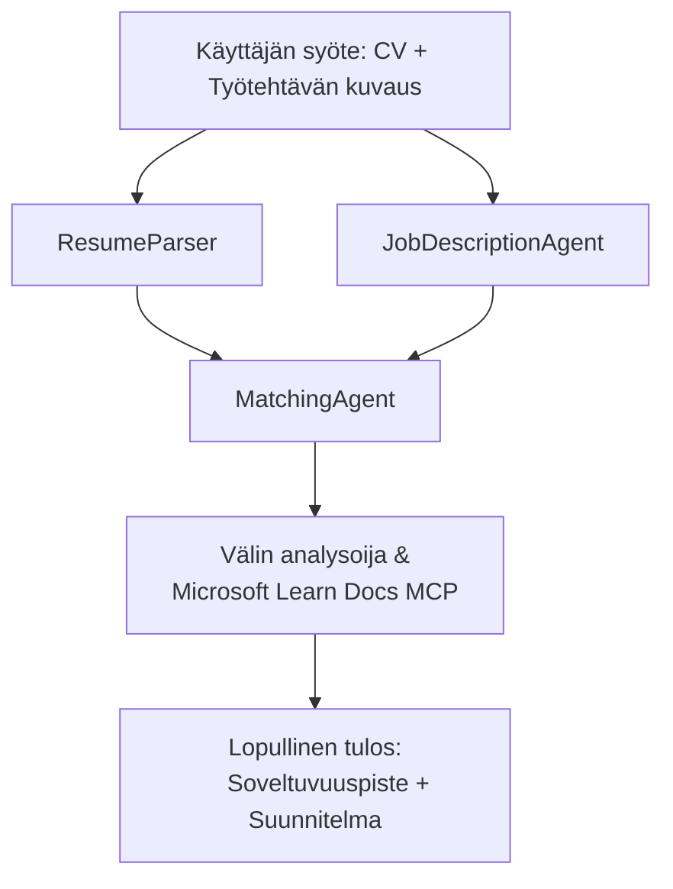

# PersonalCareerCopilot - CV → Työn sopivuuden arvioija

Moniagenttinen työnkulku, joka arvioi kuinka hyvin CV vastaa työkuvausta, ja luo sitten henkilökohtaisen oppimispolun puutteiden korjaamiseksi.

---

## Agentit

| Agentti | Rooli | Työkalut |
|---------|-------|----------|
| **ResumeParser** | Ottaa jäsenneltyjä taitoja, kokemusta ja sertifikaatteja CV:n tekstistä | - |
| **JobDescriptionAgent** | Ottaa vaaditut/halutut taidot, kokemuksen, sertifikaatit työkuvauksesta | - |
| **MatchingAgent** | Vertaa profiilia vaatimuksiin → sopivuuspisteet (0-100) + vastaavat/puuttuvat taidot | - |
| **GapAnalyzer** | Laatii henkilökohtaisen oppimispolun Microsoft Learn -resursseilla | `search_microsoft_learn_for_plan` (MCP) |

## Työnkulku


---

## Pika-aloitus

### 1. Ympäristön asennus

```powershell
cd workshop\lab02-multi-agent\PersonalCareerCopilot
python -m venv .venv
.\.venv\Scripts\Activate.ps1          # Windows PowerShell
# source .venv/bin/activate            # macOS / Linux
pip install -r requirements.txt
```

### 2. Tunnistetietojen määrittäminen

Kopioi esimerkkitiedoston sisältö ja täytä Foundry-projektisi tiedot:

```powershell
cp .env.example .env
```

Muokkaa `.env`:

```env
PROJECT_ENDPOINT=https://<your-account>.services.ai.azure.com/api/projects/<your-project>
MODEL_DEPLOYMENT_NAME=gpt-4.1-mini
```

| Arvo | Mistä löytää |
|-------|-----------------|
| `PROJECT_ENDPOINT` | Microsoft Foundry -sivupalkki VS Codessa → oikeaklikkaa projektiasi → **Kopioi projektin päätepiste** |
| `MODEL_DEPLOYMENT_NAME` | Foundry-sivupalkki → laajenna projekti → **Mallit + päätepisteet** → käyttöönoton nimi |

### 3. Suorita paikallisesti

```powershell
python -m debugpy --listen 127.0.0.1:5679 -m agentdev run main.py --verbose --port 8088
```

Tai käytä VS Coden tehtävää: `Ctrl+Shift+P` → **Tasks: Run Task** → **Run Lab02 HTTP Server**.

### 4. Testaa Agent Inspectorilla

Avaa Agent Inspector: `Ctrl+Shift+P` → **Foundry Toolkit: Open Agent Inspector**.

Liitä tämä testikehotus:

```
Resume:
Jane Doe
Senior Software Engineer with 5 years of experience in Python, Django, and AWS.
Built microservices handling 10K+ requests/second. Led a team of 4 developers.
Certifications: AWS Solutions Architect Associate.
Education: B.S. Computer Science, State University.

Job Description:
Senior Cloud Engineer at Contoso Ltd.
Required: Python, Azure, Kubernetes, Terraform, CI/CD pipelines.
Preferred: Go, monitoring (Prometheus/Grafana), cost optimization.
Experience: 5+ years in cloud infrastructure.
Certifications: Azure Solutions Architect Expert preferred.
```

**Odotettu:** Sopivuuspistemäärä (0-100), vastaavat/puuttuvat taidot ja henkilökohtainen oppimispolku Microsoft Learn -URL-osoitteineen.

### 5. Ota käyttöön Foundryssa

`Ctrl+Shift+P` → **Microsoft Foundry: Deploy Hosted Agent** → valitse projektisi → vahvista.

---

## Projektin rakenne

```
PersonalCareerCopilot/
├── .env.example        ← Template for environment variables
├── .env                ← Your credentials (git-ignored)
├── agent.yaml          ← Hosted agent definition (name, resources, env vars)
├── Dockerfile          ← Container image for Foundry deployment
├── main.py             ← 4-agent workflow (instructions, MCP tool, WorkflowBuilder)
└── requirements.txt    ← Python dependencies
```

## Keskeiset tiedostot

### `agent.yaml`

Määrittää isännöidyn agentin Foundry Agent Service -palveluun:
- `kind: hosted` - suoritetaan hallinnoidussa säiliössä
- `protocols: [responses v1]` - tarjoaa `/responses` HTTP-päätepisteen
- `environment_variables` - `PROJECT_ENDPOINT` ja `MODEL_DEPLOYMENT_NAME` lisätään käyttöönottohetkellä

### `main.py`

Sisältää:
- **Agentin ohjeistukset** - neljä `*_INSTRUCTIONS` vakioarvoa, yksi per agentti
- **MCP-työkalu** - `search_microsoft_learn_for_plan()` kutsuu `https://learn.microsoft.com/api/mcp` Streamable HTTP -rajapinnan kautta
- **Agentin luonti** - `create_agents()` kontekstinhallinta `AzureAIAgentClient.as_agent()` avulla
- **Työnkulun kaavio** - `create_workflow()` käyttää `WorkflowBuilder`-luokkaa agenttien yhdistämiseen fan-out/fan-in/sequential -kuvioilla
- **Palvelimen käynnistys** - `from_agent_framework(agent).run_async()` portissa 8088

### `requirements.txt`

| Paketti | Versio | Tarkoitus |
|---------|--------|-----------|
| `agent-framework-azure-ai` | `1.0.0rc3` | Azure AI -integraatio Microsoft Agent Frameworkille |
| `agent-framework-core` | `1.0.0rc3` | Ydinaikakäyttöympäristö (sisältää WorkflowBuilderin) |
| `azure-ai-agentserver-agentframework` | `1.0.0b16` | Isännöidyn agentin palvelinympäristö |
| `azure-ai-agentserver-core` | `1.0.0b16` | Ydintoimintoja agenttipalvelimelle |
| `debugpy` | uusin | Pythonin virheenkorjaus (F5 VS Codessa) |
| `agent-dev-cli` | `--pre` | Paikallinen kehitystyökalu + Agent Inspectorin backend |

---

## Vianetsintä

| Ongelma | Korjaus |
|---------|---------|
| `RuntimeError: Missing required environment variable(s)` | Luo `.env` tiedosto, johon lisäät `PROJECT_ENDPOINT` ja `MODEL_DEPLOYMENT_NAME` |
| `ModuleNotFoundError: No module named 'agent_framework'` | Aktivoi virtuaaliympäristö ja suorita `pip install -r requirements.txt` |
| Microsoft Learn -URL-osoitteita ei tule ulostuloon | Tarkista verkkoyhteys `https://learn.microsoft.com/api/mcp`-palveluun |
| Vain yksi aukko-kortti (katkaistu) | Varmista, että `GAP_ANALYZER_INSTRUCTIONS` sisältää `CRITICAL:`-osion |
| Portti 8088 on käytössä | Lopeta muut palvelimet komennolla: `netstat -ano \| findstr :8088` |

Yksityiskohtaisempaan vianetsintään katso [Module 8 - Troubleshooting](../docs/08-troubleshooting.md).

---

**Täysi läpikäynti:** [Lab 02 Docs](../docs/README.md) · **Takaisin:** [Lab 02 README](../README.md) · [Työpajan etusivu](../../../README.md)

---

<!-- CO-OP TRANSLATOR DISCLAIMER START -->
**Vastuuvapauslauseke**:  
Tämä asiakirja on käännetty käyttäen tekoälykäännöspalvelua [Co-op Translator](https://github.com/Azure/co-op-translator). Vaikka pyrimme tarkkuuteen, huomioithan, että automaattikäännöksissä voi esiintyä virheitä tai epätarkkuuksia. Alkuperäistä asiakirjaa sen omalla kielellä tulee pitää virallisena lähteenä. Tärkeiden tietojen osalta suositellaan ammattimaista ihmiskäännöstä. Emme ole vastuussa mistään väärinymmärryksistä tai tulkinnoista, jotka johtuvat tämän käännöksen käytöstä.
<!-- CO-OP TRANSLATOR DISCLAIMER END -->