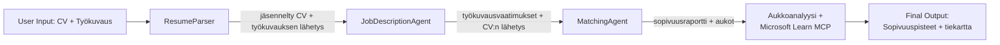

# PersonalCareerCopilot - CV → Työhön sopivuuden arvioija

Työnkulkuun perustuva moniagenttisovellus, joka arvioi, kuinka hyvin CV vastaa työkuvausta, ja luo sitten henkilökohtaisen oppimissuunnitelman puutteiden korjaamiseksi.

---

## Agentit

| Agentti | Rooli | Työkalut |
|--------|-------|---------|
| **ResumeParser** | Poimii rakenteelliset taidot, kokemukset, sertifikaatit CV-tekstistä | - |
| **JobDescriptionAgent** | Poimii tarvittavat/suositellut taidot, kokemukset, sertifikaatit työkuvauksesta | - |
| **MatchingAgent** | Vertaa profiilia vaatimuksiin → sopivuuspisteet (0-100) + löydetyt/puuttuvat taidot | - |
| **GapAnalyzer** | Laatii henkilökohtaisen oppimissuunnitelman Microsoft Learn -resursseilla | `search_microsoft_learn_for_plan` (MCP) |

## Työnkulku


```mermaid
flowchart LR
    UserInput["User Input: CV + Työkuvaus"] --> ResumeParser
    ResumeParser -- "jäsennelty CV + työkuvauksen lähetys" --> JobDescriptionAgent
    JobDescriptionAgent -- "työkuvausvaatimukset + CV:n lähetys" --> MatchingAgent
    MatchingAgent -- "sopivuusraportti + aukot" --> GapAnalyzerMCP["Aukkoanalyysi +\nMicrosoft Learn MCP"]
    GapAnalyzerMCP --> FinalOutput["Final Output:\nSopivuuspisteet + tiekartta"]
```

---

## Nopeaan alkuun

### 1. Ympäristön asetukset

Tämä kansio on työnkulkuun perustuvan Lab 02 -toteutussovelluksen viitemalli. Sen `main.py` käyttää olemassa olevia prompt-lohkoja sekä `WorkflowBuilder`-luokkaa neljän agentin yhdistämiseen.

```powershell
cd workshop\lab02-multi-agent\PersonalCareerCopilot
python -m venv .venv
.\.venv\Scripts\Activate.ps1          # Windows PowerShell
# source .venv/bin/activate            # macOS / Linux
pip install -r requirements.txt
```

### 2. Määrittele tunnistetiedot

Luo `.env`-tiedosto tähän kansioon:

```powershell
copy .env .env.bak 2>$null; echo $null > .env
```

Muokkaa `.env`-tiedostoa:

```env
FOUNDRY_PROJECT_ENDPOINT=https://<your-account>.services.ai.azure.com/api/projects/<your-project>
AZURE_AI_MODEL_DEPLOYMENT_NAME=gpt-4.1-mini
```

| Arvo | Mistä löytää |
|-------|--------------|
| `FOUNDRY_PROJECT_ENDPOINT` | Foundry Toolkit -sivupalkki → napsauta projektia oikealla → **Kopioi projektin päätelaite** |
| `AZURE_AI_MODEL_DEPLOYMENT_NAME` | Foundry-sivupalkki → laajenna projekti → **Mallit + päätelaitteet** → käyttöönoton nimi |

### 3. Aja paikallisesti

```powershell
python -m debugpy --listen 127.0.0.1:5679 main.py --port 8088
```

Tai käytä VS Code -tehtävää: `Ctrl+Shift+P` → **Tehtävät: Suorita tehtävä** → **Suorita agentin HTTP-palvelin**.

F5-virheenjäljityksessä käytä **Debug Local Agent HTTP Server**.

### 4. Testaa Agent Inspectorilla

Avaa Agent Inspector: `Ctrl+Shift+P` → **Foundry Toolkit: Open Agent Inspector**.

Liitä tämä testipromtti:

```
Resume:
Jane Doe
Senior Software Engineer with 5 years of experience in Python, Django, and AWS.
Built microservices handling 10K+ requests/second. Led a team of 4 developers.
Certifications: AWS Solutions Architect Associate.
Education: B.S. Computer Science, State University.

Job Description:
Senior Cloud Engineer at Contoso Ltd.
Required: Python, Azure, Kubernetes, Terraform, CI/CD pipelines.
Preferred: Go, monitoring (Prometheus/Grafana), cost optimization.
Experience: 5+ years in cloud infrastructure.
Certifications: Azure Solutions Architect Expert preferred.
```

**Odotettu:** Sopivuuspisteet (0-100), löydetyt/puuttuvat taidot ja räätälöity oppimissuunnitelma Microsoft Learnin URL-osoitteilla.

### 5. Ota käyttöön Foundryssa

`Ctrl+Shift+P` → **Foundry Toolkit: Ota isännöity agentti käyttöön** → valitse projektisi → vahvista.

---

## Projektin rakenne

```
PersonalCareerCopilot/
├── .env                ← Your credentials (git-ignored)
├── agent.yaml          ← Hosted agent definition (name, resources, env vars)
├── Dockerfile          ← Container image for Foundry deployment
├── main.py             ← 4-agent workflow (instructions, MCP tool, WorkflowBuilder)
└── requirements.txt    ← Python dependencies
```

## Keskeiset tiedostot

### `agent.yaml`

Määrittelee hostatun agentin Foundry Agent Serviceä varten:
- `kind: hosted` - ajetaan hallitussa kontissa
- `protocols` - `responses`-protokolla version `1.0.0` kanssa, jossa `/responses` HTTP-päätepiste
- `environment_variables` - `AZURE_AI_MODEL_DEPLOYMENT_NAME` määritellään tässä; `FOUNDRY_PROJECT_ENDPOINT` injektoidaan automaattisesti käyttöönoton yhteydessä

### `main.py`

Sisältää:
- **Agentin ohjeet** - neljä `*_INSTRUCTIONS` vakioarvoa, yksi per agentti
- **MCP-työkalu** - `search_microsoft_learn_for_plan()` kutsuu `https://learn.microsoft.com/api/mcp` Streamable HTTP:n kautta
- **Agentin luonti** - neljä `Agent()` + `AgentExecutor()` instanssia, jotka jakavat yhden `FoundryChatClient`-asiakkaan
- **Työnkulun kaavio** - `WorkflowBuilder` yhdistää agentit peräkkäiseksi putkistoksi: ResumeParser → JD Agent → MatchingAgent → GapAnalyzer
- **Palvelimen käynnistys** - `ResponsesHostServer` ajetaan portissa 8088

### `requirements.txt`

| Paketti | Tarkoitus |
|---------|----------|
| `agent-framework-foundry` | Keskeinen suoritusympäristö: `Agent`, `AgentExecutor`, `WorkflowBuilder`, `@tool`, `FoundryChatClient` |
| `agent-framework-foundry-hosting` | `ResponsesHostServer` + Foundry-isännöintiintegraatio |
| `mcp<2,>=1.24.0` | MCP-asiakas GapAnalyzerille (`streamable_http_client`) |
| `debugpy` | Pythonin virheenjäljitys (F5 VS Codessa) |

---

## Vianmääritys

| Ongelma | Ratkaisu |
|---------|---------|
| `KeyError: 'FOUNDRY_PROJECT_ENDPOINT'` tai `KeyError: 'AZURE_AI_MODEL_DEPLOYMENT_NAME'` | Luo `.env`, jossa on määritelty `FOUNDRY_PROJECT_ENDPOINT` ja `AZURE_AI_MODEL_DEPLOYMENT_NAME` |
| `ModuleNotFoundError: No module named 'agent_framework'` | Aktivoi venv ja suorita `pip install -r requirements.txt` |
| Ei Microsoft Learn -URL-osoitteita tulosteessa | Tarkista internet-yhteys osoitteeseen `https://learn.microsoft.com/api/mcp` |
| Vain 1 puutteiden kortti (leikattu) | Varmista, että `GAP_ANALYZER_INSTRUCTIONS` sisältää `CRITICAL:`-osion |
| Portti 8088 varattu | Lopeta muut palvelimet: `netstat -ano \| findstr :8088` |

Tarkempaa vianmääritystä löytyy [Module 8 - Troubleshooting](../docs/08-troubleshooting.md).

---

**Kattava opas:** [Lab 02 Docs](../docs/README.md) · **Takaisin:** [Lab 02 README](../README.md) · [Työpajan aloitussivu](../../../README.md)

---

<!-- CO-OP TRANSLATOR DISCLAIMER START -->
**Vastuuvapauslauseke**:
Tämä asiakirja on käännetty käyttämällä tekoälypohjaista käännöspalvelua [Co-op Translator](https://github.com/Azure/co-op-translator). Vaikka pyrimme tarkkuuteen, otathan huomioon, että automaattiset käännökset saattavat sisältää virheitä tai epätarkkuuksia. Alkuperäinen asiakirja sen alkuperäiskielellä on virallinen lähde. Tärkeissä asioissa suositellaan ammattimaista ihmiskäännöstä. Emme ole vastuussa tämän käännöksen käytöstä aiheutuvista väärinymmärryksistä tai tulkinnoista.
<!-- CO-OP TRANSLATOR DISCLAIMER END -->