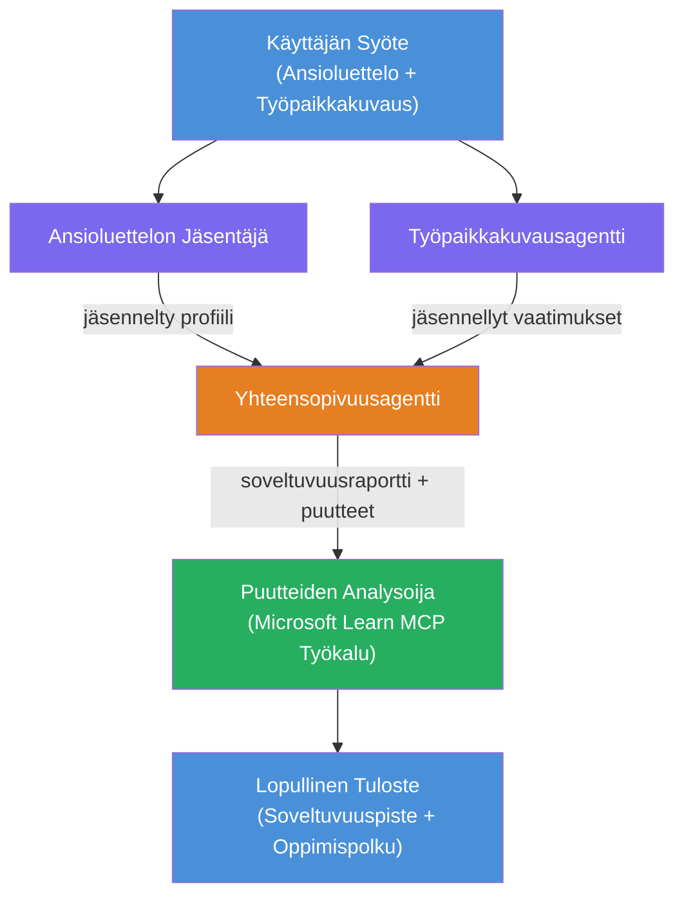

# Lab 02 - Moni-agenttinen työnkulku: CV → Työhön sopivuuden arvioija

---

## Mitä rakennat

**CV → Työhön sopivuuden arvioija** - moni-agenttinen työnkulku, jossa neljä erikoistunutta agenttia tekevät yhteistyötä arvioidakseen, kuinka hyvin ehdokkaan CV vastaa työkuvausta, ja sitten luovat henkilökohtaisen oppimispolun puutteiden korjaamiseksi.

### Agentit

| Agentti | Rooli |
|---------|-------|
| **CV-parseri** | Poimii rakenteelliset taidot, kokemukset, sertifikaatit CV-tekstistä |
| **Työkuvausagentti** | Poimii vaaditut/suosittelut taidot, kokemukset, sertifikaatit työkuvauksesta |
| **Yhteensopivuusagentti** | Vertaa profiilia vs vaatimuksia → sopivuuspisteet (0-100) + yhteensopivat/puuttuvat taidot |
| **Puutteiden analysoija** | Luo henkilökohtainen oppimispolku resurssien, aikataulujen ja nopeiden projektien kanssa |

### Demo-kulku

Lataa **CV + työkuvaus** → saa **sopivuuspisteet + puuttuvat taidot** → vastaanota **henkilökohtainen oppimispolku**.

### Työnkulkua arkkitehtuuri

> Violetti = rinnakkaiset agentit | Oranssi = yhdistämispiste | Vihreä = lopullinen agentti työkaluilla. Katso [Moduuli 1 - Arkkitehtuurin ymmärtäminen](docs/01-understand-multi-agent.md) ja [Moduuli 4 - Orkestrointimallit](docs/04-orchestration-patterns.md) yksityiskohtaiset kaaviot ja tiedonkulku.

### Käsitellyt aiheet

- Moni-agenttisen työnkulun luominen käyttäen **WorkflowBuilderia**
- Agenttien roolien ja orkestroinnin määrittely (rinnakkainen + peräkkäinen)
- Agenttien välinen viestintämallit
- Paikallinen testaus Agenttien tarkastajalla
- Moni-agenttisten työnkulkujen käyttöönotto Foundry Agent Serviceen

---

## Vaatimukset

Suorita ensin Lab 01:

- [Lab 01 - Yksittäinen Agentti](../lab01-single-agent/README.md)

---

## Aloita

Täydelliset asennusohjeet, koodin läpikäynti ja testauskomennot löytyvät:

- [Lab 2 Dokumentaatio - Vaatimukset](docs/00-prerequisites.md)
- [Lab 2 Dokumentaatio - Täydellinen oppimispolku](docs/README.md)
- [PersonalCareerCopilot käyttöohje](PersonalCareerCopilot/README.md)

## Orkestrointimallit (agenttiperusteiset vaihtoehdot)

Lab 2 sisältää oletusarvoisen **rinnakkainen → kerääjä → suunnittelija** työnkulun, ja dokumentaatiosta löytyy myös vaihtoehtoisia malleja, jotka havainnollistavat vahvempaa agenttiperusteista käyttäytymistä:

- **Fan-out/Fan-in painotetulla konsensuksella**
- **Tarkastaja/kriitikko-käynti ennen lopullista oppimispolkua**
- **Ehdollinen reititin** (polun valinta perustuen sopivuuspisteisiin ja puuttuviin taitoihin)

Katso [docs/04-orchestration-patterns.md](docs/04-orchestration-patterns.md).

---

**Edellinen:** [Lab 01 - Yksittäinen Agentti](../lab01-single-agent/README.md) · **Takaisin:** [Työpajan kotisivu](../../README.md)

---

<!-- CO-OP TRANSLATOR DISCLAIMER START -->
**Vastuuvapauslauseke**:  
Tämä asiakirja on käännetty käyttämällä tekoälypohjaista käännöspalvelua [Co-op Translator](https://github.com/Azure/co-op-translator). Vaikka pyrimme tarkkuuteen, huomioithan, että automaattikäännöksissä voi esiintyä virheitä tai epätarkkuuksia. Alkuperäistä asiakirjaa sen omalla kielellä tulee pitää virallisena lähteenä. Tärkeissä tiedoissa suositellaan ammattimaista ihmiskäännöstä. Emme ole vastuussa tämän käännöksen käytöstä aiheutuvista väärinymmärryksistä tai tulkinnoista.
<!-- CO-OP TRANSLATOR DISCLAIMER END -->