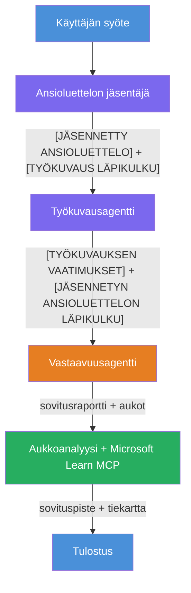

# Lab 02 - Moniagenttinen työnkulku: CV → Työpaikan sopivuuden arvioija

## Yleiskatsaus

Tässä käytännön laboratoriossa rakennat **työnkulkuorientoituneen moniagenttisovelluksen** Foundry Toolkitilla VS Codessa ja otat sen käyttöön Microsoft Foundry Agent Servicessä.

**Mitä rakennat:** CV → Työpaikan sopivuuden arvioijan, joka jäsentää CV:n ja työkuvauksen, pisteyttää yhteensopivuuden ja tuottaa henkilökohtaisen oppimissuunnitelman Microsoft Learn -resurssien avulla.

---

## Arkkitehtuuri

```mermaid
flowchart TD
    A["Käyttäjän syöte"] --> B["Ansioluettelon jäsentäjä"]
    B -->|"[JÄSENNETTY ANSIOLUETTELO] + [TYÖKUVAUS LÄPIKULKU]"| C["Työkuvausagentti"]
    C -->|"[TYÖKUVAUKSEN VAATIMUKSET] + [JÄSENNETYN ANSIOLUETTELON LÄPIKULKU]"| D["Vastaavuusagentti"]
    D -->|sovitusraportti + aukot| E["Aukkoanalyysi + Microsoft Learn MCP"]
    E -->|sovituspiste + tiekartta| F["Tulostus"]

    style A fill:#4A90D9,color:#fff
    style B fill:#7B68EE,color:#fff
    style C fill:#7B68EE,color:#fff
    style D fill:#E67E22,color:#fff
    style E fill:#27AE60,color:#fff
    style F fill:#4A90D9,color:#fff
```

**Miten se toimii:**
1. Käyttäjä liittää CV:n ja työkuvauksen.
2. **ResumeParser** jäsentää CV:n ja kopioi työkuvauksen sanasta sanaan `[TYÖKUVAUS LÄPIKULKUUN]` -osioon.
3. **JD Agent** poimii rakenteelliset vaatimukset läpikulkutekstistä, ja välittää `[JÄSENNETYN CV:N]` eteenpäin nimellä `[JÄSENNETTY CV LÄPIKULUN]`.
4. **MatchingAgent** vertaa `[JÄSENNETTÄ CV LÄPIKULUN]` ja `[TYÖKUVAUKSEN VAATIMUKSET]` ja tuottaa sopivuuspisteen.
5. **GapAnalyzer** muuttaa puutteet käytännön tiekartaksi ja hakee todellisia Microsoft Learn -linkkejä MCP:n kautta.

---

## Edellytykset

Suorita ensin Lab 01:

- [Lab 01 - Yksittäinen agentti](../lab01-single-agent/README.md)

---

## Osa 1: Lue moduulit järjestyksessä

Katso koko oppimispolku:

- [Lab 2 Dokumentaatio - Edellytykset](docs/00-prerequisites.md)
- [Lab 2 Dokumentaatio - Koko oppimispolku](docs/README.md)
- [PersonalCareerCopilot käyttöohje](PersonalCareerCopilot/README.md)

---

## Osa 2: Rakenna ja testaa työnkulku

1. Käytä Foundry Toolkit -velhoa työnkulkuun perustuvan projektin alustamiseen.
2. Kopioi kehotelohkot ja työnkulun kaavio tiedostosta `PersonalCareerCopilot/main.py` työtilaan.
3. Suorita paikallisesti Agent Inspectorilla ja varmista, että kaikki neljä agenttia sekä MCP-työkalu toimivat.
4. Ota isännöity agentti käyttöön Foundryssa, kun paikalliset testit onnistuvat.

---

## Orkestrointikaaviot

Lab 02 sisältää oletusarvoisen **fan-out → fan-in → peräkkäisen** työnkulun, ja dokumentaatiossa kuvataan myös vaihtoehtoisia orkestrointikaavioita kokeiltavaksi.

- **Fan-out/Fan-in painotetulla konsensuksella**
- **Arvioija/kriitikko ennen lopullista tiekarttaa**
- **Ehtoinen reititin** sopivuuspisteen ja puuttuvien taitojen perusteella

Katso [docs/04-orchestration-patterns.md](docs/04-orchestration-patterns.md).

---

**Edellinen:** [Lab 01 - Yksittäinen agentti](../lab01-single-agent/README.md) · **Takaisin:** [Työpajan etusivu](../../README.md)

---

<!-- CO-OP TRANSLATOR DISCLAIMER START -->
**Vastuuvapauslauseke**:
Tämä asiakirja on käännetty käyttämällä tekoälypohjaista käännöspalvelua [Co-op Translator](https://github.com/Azure/co-op-translator). Vaikka pyrimme tarkkuuteen, otathan huomioon, että automaattiset käännökset saattavat sisältää virheitä tai epätarkkuuksia. Alkuperäinen asiakirja sen alkuperäiskielellä on virallinen lähde. Tärkeissä asioissa suositellaan ammattimaista ihmiskäännöstä. Emme ole vastuussa tämän käännöksen käytöstä aiheutuvista väärinymmärryksistä tai tulkinnoista.
<!-- CO-OP TRANSLATOR DISCLAIMER END -->