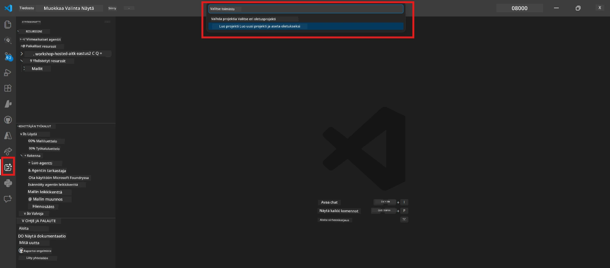

# Module 0 - Esivaatimukset

Ennen Lab 02:n aloittamista varmista, että sinulla on seuraavat valmiina. Tämä labrakerta rakentuu suoraan Lab 01:n päälle – älä jätä sitä väliin.

---

## 1. Suorita Lab 01 loppuun

Lab 02 olettaa, että olet jo:

- [x] Suorittanut kaikki 8 moduulia [Lab 01 - Yksi Agentti](../../lab01-single-agent/README.md)
- [x] Onnistuneesti ottanut käyttöön yksittäisen agentin Foundry Agent Serviceen
- [x] Vahvistanut, että agentti toimii sekä paikallisessa Agent Inspectorissa että Foundry Playgroundissa

Jos et ole suorittanut Lab 01:stä loppuun, palaa ja viimeistele se nyt: [Lab 01 Ohjeet](../../lab01-single-agent/docs/00-prerequisites.md)

---

## 2. Varmista olemassa oleva asennus

Kaikkien Lab 01:n työkalujen tulisi edelleen olla asennettuna ja toimivia. Suorita nämä pikakokeet:

### 2.1 Azure CLI

```powershell
az account show --query "{name:name, id:id}" --output table
```

Odotettu: Näyttää tilauksesi nimen ja tunnuksen. Jos tämä ei toimi, aja [`az login`](https://learn.microsoft.com/cli/azure/authenticate-azure-cli-interactively).

### 2.2 VS Code -laajennukset

1. Paina `Ctrl+Shift+P` → kirjoita **"Microsoft Foundry"** → vahvista, että näet komennot (esim. `Microsoft Foundry: Create a New Hosted Agent`).
2. Paina `Ctrl+Shift+P` → kirjoita **"Foundry Toolkit"** → vahvista, että näet komennot (esim. `Foundry Toolkit: Open Agent Inspector`).

### 2.3 Foundryn projekti ja malli

1. Klikkaa **Microsoft Foundry** -kuvaketta VS Code -toimintopalkissa.
2. Varmista, että projektisi on listattu (esim. `workshop-agents`).
3. Laajenna projekti → tarkista, että käyttöönotettu malli on olemassa (esim. `gpt-4.1-mini`) ja sen tila on **Succeeded**.

> **Jos mallisi käyttöönoton voimassaolo on päättynyt:** Jotkut ilmaisversion käyttöönotot vanhenevat automaattisesti. Ota uudelleen käyttöön [Malliluettelosta](https://learn.microsoft.com/azure/foundry/foundry-models/concepts/models-sold-directly-by-azure) (`Ctrl+Shift+P` → **Microsoft Foundry: Open Model Catalog**).



### 2.4 RBAC-roolit

Varmista, että sinulla on **Azure AI User** -rooli Foundryn projektissa:

1. [Azure-portaali](https://portal.azure.com) → sinun Foundry **projektisi** resurssi → **Access control (IAM)** → **[Role assignments](https://learn.microsoft.com/azure/foundry/concepts/rbac-foundry)** -välilehti.
2. Etsi nimesi → vahvista, että **[Azure AI User](https://aka.ms/foundry-ext-project-role)** on listattu.

---

## 3. Ymmärrä moniagenttikonseptit (uutta Lab 02:ssa)

Lab 02 esittelee konsepteja, joita ei käsitelty Lab 01:ssä. Lue nämä läpi ennen etenemistä:

### 3.1 Mikä on moniagenttityönkulku?

Yhden agentin hoitaessa kaiken sijaan **moniagenttityönkulku** jakaa työn useiden erikoistuneiden agenttien kesken. Jokaisella agentilla on:

- Oma **ohjeistuksensa** (järjestelmäkehotus)
- Oma **roolinsa** (mihin se vastaa)
- Valinnaiset **työkalut** (funktiot, joihin se voi kutsua)

Agentit kommunikoivat **orkestrointiverkon** kautta, joka määrittelee, miten tieto kulkee niiden välillä.

### 3.2 WorkflowBuilder

[`WorkflowBuilder`](https://learn.microsoft.com/agent-framework/workflows/agents-in-workflows) -luokka `agent_framework`-kirjastosta on SDK-komponentti, joka yhdistää agentit toisiinsa:

```python
from agent_framework import WorkflowBuilder

workflow = (
    WorkflowBuilder(
        name="MyWorkflow",
        start_executor=agent_a,
        output_executors=[agent_d],
    )
    .add_edge(agent_a, agent_b)
    .add_edge(agent_a, agent_c)
    .add_edge(agent_b, agent_d)
    .add_edge(agent_c, agent_d)
    .build()
)
```

- **`start_executor`** - Ensimmäinen agentti, joka vastaanottaa käyttäjän syötteen
- **`output_executors`** - Agentti(t), jonka tuotos muodostaa lopullisen vastauksen
- **`add_edge(source, target)`** - Määrittää, että `target` saa `source`-agentin tuloksen

### 3.3 MCP (Model Context Protocol) -työkalut

Lab 02 käyttää **MCP-työkalua**, joka kutsuu Microsoft Learn -rajapintaa hakemaan oppimateriaaleja. [MCP (Model Context Protocol)](https://modelcontextprotocol.io/introduction) on standardoitu protokolla, joka yhdistää tekoälymallit ulkoisiin tietolähteisiin ja työkaluihin.

| Termi | Määritelmä |
|------|------------|
| **MCP-palvelin** | Palvelu, joka tarjoaa työkaluja/resursseja [MCP-protokollan](https://learn.microsoft.com/azure/foundry/agents/how-to/tools/model-context-protocol) kautta |
| **MCP-asiakas** | Agenttikoodisi, joka yhdistää MCP-palvelimeen ja kutsuu sen työkaluja |
| **[Streamable HTTP](https://learn.microsoft.com/agent-framework/agents/tools/hosted-mcp-tools)** | Kuljetusmenetelmä, jolla kommunikoidaan MCP-palvelimen kanssa |

### 3.4 Miten Lab 02 eroaa Lab 01:stä

| Näkökulma | Lab 01 (Yksi Agentti) | Lab 02 (Moni-Agentti) |
|----------|----------------------|-----------------------|
| Agentit | 1 | 4 (erikoistuneet roolit) |
| Orkestrointi | Ei | WorkflowBuilder (rinnakkainen + peräkkäinen) |
| Työkalut | Valinnainen `@tool`-funktio | MCP-työkalu (ulkoisen API-kutsu) |
| Monimutkaisuus | Yksinkertainen kehotus → vastaus | CV + tehtävänkuvaus → soveltuvuusarvo → tiekartta |
| Kontekstin kulku | Suora | Agentilta agentille siirto |

---

## 4. Työpajakansion rakenne Lab 02:lle

Varmista, että tiedät, missä Lab 02:n tiedostot sijaitsevat:

```
workshop/
└── lab02-multi-agent/
    ├── README.md                       ← Lab overview
    ├── docs/                           ← You are here
    │   ├── README.md                   ← Learning path index
    │   ├── 00-prerequisites.md         ← This file
    │   ├── 01-understand-multi-agent.md
    │   ├── ...
    │   └── 08-troubleshooting.md
    └── PersonalCareerCopilot/          ← The agent project
        ├── agent.yaml                  ← Agent definition
        ├── main.py                     ← 4-agent workflow code
        ├── Dockerfile                  ← Container configuration
        └── requirements.txt            ← Python dependencies
```

---

### Tarkistuslista

- [ ] Lab 01 on kokonaan suoritettu (kaikki 8 moduulia, agentti otettu käyttöön ja varmennettu)
- [ ] `az account show` näyttää tilauksesi
- [ ] Microsoft Foundry ja Foundry Toolkit -laajennukset ovat asennettuina ja toimivat
- [ ] Foundryn projektissa on käyttöönotettu malli (esim. `gpt-4.1-mini`)
- [ ] Sinulla on **Azure AI User** -rooli projektissa
- [ ] Olet lukenut yllä olevan moniagenttikonseptiosion ja ymmärrät WorkflowBuilderin, MCP:n sekä agenttien orkestroinnin

---

**Seuraava:** [01 - Ymmärrä Moniagenttiarkkitehtuuri →](01-understand-multi-agent.md)

---

<!-- CO-OP TRANSLATOR DISCLAIMER START -->
**Vastuuvapauslauseke**:  
Tämä asiakirja on käännetty käyttäen tekoälypohjaista käännöspalvelua [Co-op Translator](https://github.com/Azure/co-op-translator). Vaikka pyrimme tarkkuuteen, ota huomioon, että automaattikäännöksissä saattaa esiintyä virheitä tai epätarkkuuksia. Alkuperäinen asiakirja sen alkuperäiskielellä on aina päätarkka lähde. Tärkeissä asioissa suositellaan ammattimaista ihmiskäännöstä. Emme ole vastuussa tämän käännöksen käytöstä aiheutuvista väärinymmärryksistä tai virhetulkintojen seurauksista.
<!-- CO-OP TRANSLATOR DISCLAIMER END -->