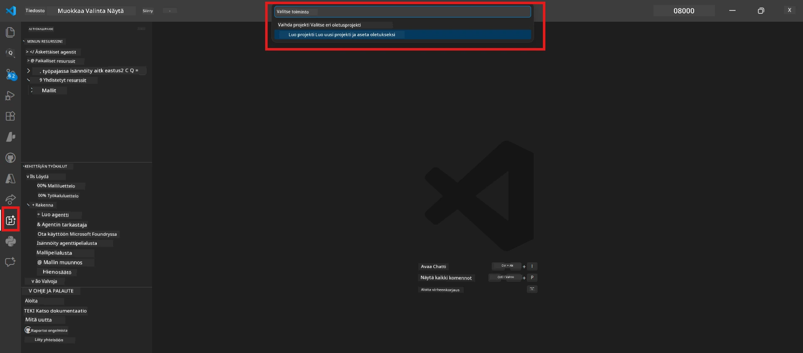

# Moduuli 0 - Johdanto

⏱️ ~10 min

> [!WARNING]
> **Esikatselu ja rajoitukset:** [Isännöidyt agentit](https://learn.microsoft.com/azure/foundry/agents/concepts/hosted-agents) ovat tällä hetkellä **julkisessa esikatselussa** - ei suositella tuotantokuormiin. Joitakin tässä työpajassa esitettyjä toimintoja saatetaan muuttaa siirryttäessä GA-versioon.

## Mitä rakennat

Tässä laboratoriossa laajennat Lab 01:stä opittuja yksittäisagenttien taitoja rakentaaksesi **moniagenttityönkulun** - ansioluettelo → työpaikan soveltuvuuden arvioija.

Liität sisään **ansioluettelon** ja **työpaikkailmoituksen**. Neljä erikoistunutta agenttia käsittelee syötteen peräkkäin ja palauttaa:
- Soveltuvuuspisteet (0–100 pistemäärän erittelyllä)
- Taidot ja sertifikaattivajeiden listan
- Personoidun oppimispolun todellisilla Microsoft Learn -linkeillä jokaista vajan kohtaa varten

**Työnkulku käyttää:**
- **Microsoft Agent Framework** - `WorkflowBuilder` peräkkäisen työnkulun orkestrointiin
- **Foundryn työkalupaketti VS Codeen** - kehys, paikallinen testaus, käyttöönotto
- **Tekoälymalli** (esim. `gpt-4.1-mini`) - jota kaikki neljä agenttia käyttävät
- **Microsoft Learn MCP -palvelin** - tarjoaa todelliset oppimisresurssilinkit jokaiselle taitovajaukselle

---

## Valitse polkusi

> ⚠️ **Jatka samalla polulla, jota käytit Lab 01:ssä.**

<details open>
<summary><strong>🅰️ Polku A - Azure-pilvi (vaatii Azure-tilauksen)</strong></summary>

| | Yksityiskohdat |
|---|---|
| **Kenelle tämä on tarkoitettu?** | Suoritit Lab 01:n käyttäen Azure-tilausta |
| **Malli** | Azure OpenAI Foundryn kautta (esim. `gpt-4.1-mini`) |
| **Käsitellyt moduulit** | Kaikki moduulit (00–09) |
| **Käyttöönotto pilveen?** | ✅ Kyllä - täysi päästä päähän käyttöönotto |

</details>

<details open>
<summary><strong>🅱️ Polku B - Foundry Local (ei vaadi Azure-tilausta)</strong></summary>

| | Yksityiskohdat |
|---|---|
| **Kenelle tämä on tarkoitettu?** | Suoritit Lab 01:n käyttäen Foundry Local -ympäristöä |
| **Malli** | Foundry Local (ilmainen, toimii koneellasi) |
| **Käsitellyt moduulit** | Moduulit 00–05 (ohita 06–07 - käyttöönotto ja pilviverifiointi) |
| **Käyttöönotto pilveen?** | ❌ Ei - pelkkä paikallinen testaus Agent Inspectorin kautta |

</details>

---

## Lab 01 tarkistus

Lab 02 rakentuu suoraan Lab 01:n päälle. Suorita Lab 01 ensin ennen tämän aloittamista.

Et ole tehnyt Lab 01:stä? Aloita täältä: [Lab 01 - Johdanto](../../lab01-single-agent/docs/00-prerequisites.md)

<details open>
<summary><strong>🅰️ Polku A - Azure-pilvi</strong></summary>

```powershell
az account show --query "{name:name, id:id}" --output table
```

Jos tämä epäonnistuu, suorita `az login`. Tarkista sitten VS Codessa:

1. `Ctrl+Shift+P` → kirjoita **Foundry Toolkit** → varmista, että komennot näkyvät.
2. Klikkaa **Foundry Toolkit** -kuvaketta → projektisi ja otettu malli näytetään **Onnistuneena**.



> **RBAC:** Määritit **Foundry User** -roolin Lab 01:ssä. Jos sinun tarvitsee määrittää uudelleen, katso [Lab 01, moduuli 1](../../lab01-single-agent/docs/01-setup.md#deploy-a-model--assign-rbac). Rooli tunnettiin aiemmin nimellä **Azure AI User** - samat oikeudet.

</details>

<details open>
<summary><strong>🅱️ Polku B - Foundry Local</strong></summary>

```powershell
Invoke-WebRequest -Uri "http://localhost:5273/v1/health" -UseBasicParsing | Select-Object StatusCode
```

Odotettu: `StatusCode: 200`. Jos ei, käynnistä Foundry Local uudelleen Foundry Toolkit -sivupalkin kautta.

> Kaikki päätteet suoritetaan koneellasi. Ainoa ulospäin suuntautuva kutsu on MCP-työkalun yhteys osoitteeseen `https://learn.microsoft.com/api/mcp`.

</details>

---

## Mitä uutta Lab 02:ssa

| | Lab 01 | Lab 02 |
|--|--------|--------|
| Agentit | 1 | 4 (ketjutettu WorkflowBuilderilla) |
| Kehysmallipohja | Perustason - Agent Framework | Työnkulut - Agent Framework |
| Uusi paketti | - | `mcp` |
| Orkestrointi | Yksittäinen keskusteluagentti | Peräkkäinen putkisto (WorkflowBuilder) |
| Uusi työkalu | - | `search_microsoft_learn_for_plan` (MCP) |

---

**Seuraava:** [01 - Ymmärrä arkkitehtuuri →](01-understand-multi-agent.md)

---

<!-- CO-OP TRANSLATOR DISCLAIMER START -->
**Vastuuvapauslauseke**:
Tämä asiakirja on käännetty käyttämällä tekoälypohjaista käännöspalvelua [Co-op Translator](https://github.com/Azure/co-op-translator). Vaikka pyrimme tarkkuuteen, otathan huomioon, että automaattiset käännökset saattavat sisältää virheitä tai epätarkkuuksia. Alkuperäinen asiakirja sen alkuperäiskielellä on virallinen lähde. Tärkeissä asioissa suositellaan ammattimaista ihmiskäännöstä. Emme ole vastuussa tämän käännöksen käytöstä aiheutuvista väärinymmärryksistä tai tulkinnoista.
<!-- CO-OP TRANSLATOR DISCLAIMER END -->