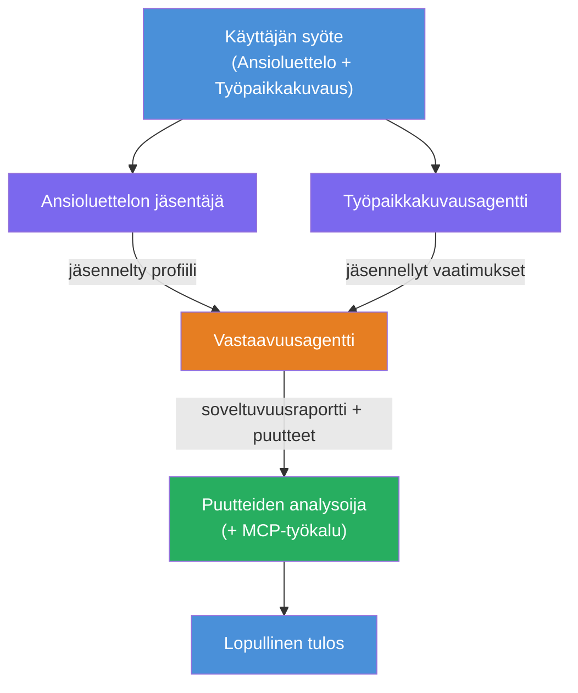
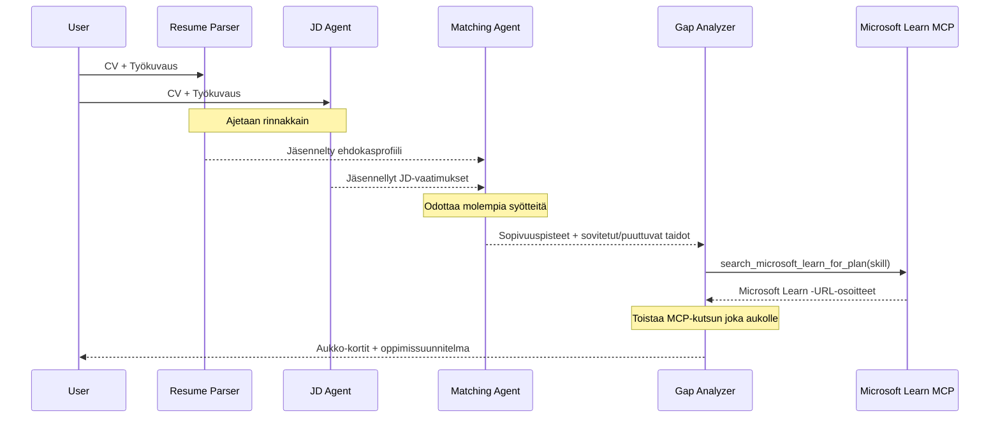
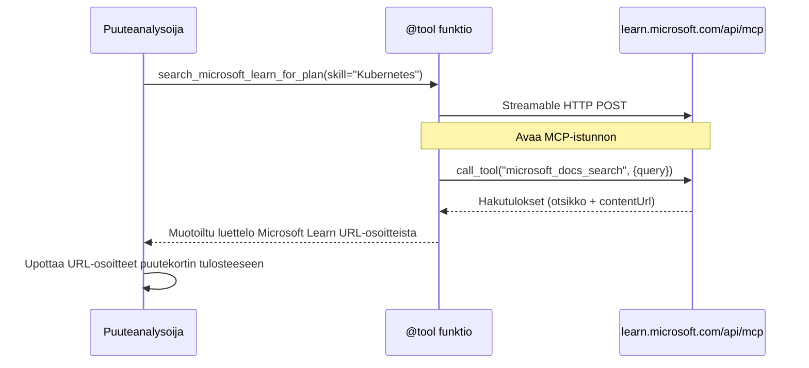

# Moduuli 1 - Ymmärrä moniagenttinen arkkitehtuuri

Tässä moduulissa opit Resume → Job Fit Evaluator -arkkitehtuurin ennen koodin kirjoittamista. Orkestrointikaavion, agenttien roolien ja tiedonkulun ymmärtäminen on kriittistä virheenkorjauksessa ja moniagenttityönkulkujen laajentamisessa [multi-agent workflows](https://learn.microsoft.com/azure/architecture/ai-ml/idea/multiple-agent-workflow-automation).

---

## Ongelma, jonka tämä ratkaisee

Ansioluettelon yhdistäminen työpaikkailmoitukseen vaatii useita erillisiä taitoja:

1. **Jäsentäminen** - Rakenteellisen datan poimiminen jäsentämättömästä tekstistä (ansioluettelo)
2. **Analyysi** - Vaateiden poimiminen työpaikkailmoituksesta
3. **Vertailu** - Sopivuusarvion laskeminen kahden välillä
4. **Suunnittelu** - Oppimispolun rakentaminen puutteiden korjaamiseksi

Yksi agentti, joka tekee kaikki neljä tehtävää yhdessä kerrannossa, tuottaa usein:
- Epätäydellisen datan poiminnan (se kiirehtii jäsentämisen läpi päästäkseen arvioon)
- Pinnallisen arvioinnin (ei näyttöön perustuvaa erittelyä)
- Yleisluontoiset oppimispolut (eivät räätälöityjä tiettyihin puutteisiin)

Jakamalla tehtävät **neljälle erikoistuneelle agentille**, kukin keskittyy omaan tehtäväänsä omien ohjeidensa mukaisesti, mikä tuottaa korkealaatuisemman lopputuloksen kaikissa vaiheissa.

---

## Neljä agenttia

Jokainen agentti on täysi [Microsoft Foundry](https://learn.microsoft.com/azure/foundry/agents/concepts/hosted-agents) agentti, joka luodaan `AzureAIAgentClient.as_agent()` -metodilla. Ne jakavat saman mallin käyttöönoton, mutta niillä on eri ohjeistukset ja (valinnaisesti) eri työkalut.

| # | Agentin nimi | Rooli | Syöte | Tuotos |
|---|--------------|-------|-------|--------|
| 1 | **ResumeParser** | Poimii rakenteellisen profiilin ansioluettelotekstistä | Raaka ansioluetteloteksti (käyttäjältä) | Ehdokasprofiili, tekniset taidot, pehmeät taidot, sertifikaatit, toimialakokemus, saavutukset |
| 2 | **JobDescriptionAgent** | Poimii rakenteelliset vaatimukset työpaikkailmoituksesta | Raaka työpaikkailmoitusteksti (käyttäjältä, välitetty ResumeParserin kautta) | Roolikatsaus, vaaditut taidot, toivotut taidot, kokemus, sertifikaatit, koulutus, vastuut |
| 3 | **MatchingAgent** | Laskee näyttöön perustuvan sopivuuspisteen | ResumeParserin + JobDescriptionAgentin tuotokset | Sopivuuspiste (0–100 erittelyllä), vastaavat taidot, puuttuvat taidot, puutteet |
| 4 | **GapAnalyzer** | Rakentaa henkilökohtaisen oppimispolun | MatchingAgentin tuotos | Puutteen kortit (taidot), oppimisjärjestys, aikataulu, Microsoft Learn -resurssit |

---

## Orkestrointikaavio

Työnkulku käyttää **rinnakkaista haarautumista** ja sen jälkeen **peräkkäistä yhdistämistä**:


> **Selite:** Violetti = rinnakkaiset agentit, Oranssi = yhdistämiskohta, Vihreä = lopullinen agentti työkaluineen

### Miten data virtaa


1. **Käyttäjä lähettää** viestin, joka sisältää ansioluettelon ja työpaikkailmoituksen.
2. **ResumeParser** vastaanottaa koko käyttäjän syötteen ja poimii rakenteellisen ehdokasprofiilin.
3. **JobDescriptionAgent** vastaanottaa käyttäjän syötteen rinnakkaisesti ja poimii rakenteelliset vaatimukset.
4. **MatchingAgent** vastaanottaa tuotokset **molemmilta** ResumeParserilta ja JobDescriptionAgenteilta (kehys odottaa molempien valmistumista ennen MatchingAgentin käynnistämistä).
5. **GapAnalyzer** vastaanottaa MatchingAgentin tuotoksen ja kutsuu **Microsoft Learn MCP -työkalun** hakemaan todellisia oppimisresursseja jokaista puutetta varten.
6. **Lopullinen tulos** on GapAnalyzerin vastaus, joka sisältää sopivuuspisteen, puutteen kortit ja täydellisen oppimispolun.

### Miksi rinnakkainen haarautuminen on tärkeää

ResumeParser ja JobDescriptionAgent toimivat **rinnakkain**, koska kumpikaan ei riipu toisesta. Tämä:
- Vähentää kokonaisviivettä (molemmat toimivat samanaikaisesti sen sijaan, että olisivat peräkkäin)
- On luonnollinen jako (ansioluettelon jäsentäminen vs. työpaikkailmoituksen jäsentäminen ovat riippumattomia tehtäviä)
- Havainnollistaa yleistä moniagenttimallia: **haarauta → yhdistä → toimi**

---

## WorkflowBuilder koodissa

Näin yllä oleva kaavio vastaa [`WorkflowBuilder`](https://learn.microsoft.com/agent-framework/workflows/agents-in-workflows) API-kutsuja `main.py`-tiedostossa:

```python
from agent_framework import WorkflowBuilder

workflow = (
    WorkflowBuilder(
        name="ResumeJobFitEvaluator",
        start_executor=resume_parser,       # Ensimmäinen agentti, joka vastaanottaa käyttäjän syötteen
        output_executors=[gap_analyzer],     # Viimeinen agentti, jonka tulos palautetaan
    )
    .add_edge(resume_parser, jd_agent)      # ResumeParser → Työkuvausagentti
    .add_edge(resume_parser, matching_agent) # ResumeParser → Vastaavuusagentti
    .add_edge(jd_agent, matching_agent)      # Työkuvausagentti → Vastaavuusagentti
    .add_edge(matching_agent, gap_analyzer)  # Vastaavuusagentti → Aukkoanalyytikko
    .build()
)
```

**Reunojen ymmärtäminen:**

| Reuna | Mitä se tarkoittaa |
|-------|-------------------|
| `resume_parser → jd_agent` | JD Agent saa ResumeParserin tuotoksen |
| `resume_parser → matching_agent` | MatchingAgent saa ResumeParserin tuotoksen |
| `jd_agent → matching_agent` | MatchingAgent saa myös JD Agentin tuotoksen (odottaa kumpaakin) |
| `matching_agent → gap_analyzer` | GapAnalyzer saa MatchingAgentin tuotoksen |

Koska `matching_agent`:lla on **kaksi sisääntulevaa reunaa** (`resume_parser` ja `jd_agent`), kehys odottaa automaattisesti molempien valmistumista ennen MatchingAgentin käynnistämistä.

---

## MCP-työkalu

GapAnalyzer-agentilla on yksi työkalu: `search_microsoft_learn_for_plan`. Tämä on **[MCP-työkalu](https://learn.microsoft.com/agent-framework/agents/tools/hosted-mcp-tools)**, joka kutsuu Microsoft Learn API:ta hakeakseen kuratoituja oppimisresursseja.

### Miten se toimii

```python
@tool
async def search_microsoft_learn_for_plan(
    skill: str, role: str = "", max_results: int = 5
) -> str:
    """Search Microsoft Learn MCP and return curated official links."""
    # Yhdistää https://learn.microsoft.com/api/mcp -osoitteeseen käyttäen Streamable HTTP:tä
    # Kutsuu 'microsoft_docs_search' -työkalua MCP-palvelimella
    # Palauttaa muotoillun luettelon Microsoft Learn -URL-osoitteista
```

### MCP-kutsun kulku


1. GapAnalyzer päättää tarvitsevansa oppimisresursseja taidolle (esim. "Kubernetes")
2. Kehys kutsuu `search_microsoft_learn_for_plan(skill="Kubernetes")`
3. Funktio avaa [Streamable HTTP](https://learn.microsoft.com/agent-framework/agents/tools/hosted-mcp-tools) -yhteyden osoitteeseen `https://learn.microsoft.com/api/mcp`
4. Se kutsuu `microsoft_docs_search` -työkalua [MCP-palvelimella](https://learn.microsoft.com/azure/foundry/agents/how-to/tools/model-context-protocol)
5. MCP-palvelin palauttaa hakutulokset (otsikko + URL)
6. Funktio muotoilee tulokset ja palauttaa ne merkkijonona
7. GapAnalyzer käyttää saatuja URL-osoitteita puutteen korttien tulosteessa

### Odotettavissa olevat MCP-lokit

Työkalun suorittaessa näet lokimerkintöjä kuten:

```
GET https://learn.microsoft.com/api/mcp → 405 (Method Not Allowed)
POST https://learn.microsoft.com/api/mcp → 200
DELETE https://learn.microsoft.com/api/mcp → 405 (Method Not Allowed)
```

**Nämä ovat normaaleja.** MCP-asiakas kokeilee GET- ja DELETE-pyyntöjä alustuksessa — niiden 405-vastaukset ovat odotettua toimintaa. Varsinainen työkalukutsu käyttää POSTia ja palauttaa 200. Huolehdi vain, jos POST-kutsut epäonnistuvat.

---

## Agentin luontipattern

Jokainen agentti luodaan käyttämällä **[`AzureAIAgentClient.as_agent()`](https://learn.microsoft.com/python/api/overview/azure/ai-agents-readme) asynkronista kontekstinhallintaa**. Tämä on Foundryn SDK:n malli agenttien luomiseen, jotka siivotaan automaattisesti pois:

```python
async with (
    get_credential() as credential,
    AzureAIAgentClient(
        project_endpoint=PROJECT_ENDPOINT,
        model_deployment_name=MODEL_DEPLOYMENT_NAME,
        credential=credential,
    ).as_agent(
        name="ResumeParser",
        instructions=RESUME_PARSER_INSTRUCTIONS,
    ) as resume_parser,
    # ... toista jokaiselle agentille ...
):
    # Kaikki 4 agenttia ovat täällä olemassa
    workflow = create_workflow(resume_parser, jd_agent, matching_agent, gap_analyzer)
```

**Tärkeimmät kohdat:**
- Jokainen agentti saa oman `AzureAIAgentClient`-instanssin (SDK vaatii agentin nimen olevan sidottu asiakkaaseen)
- Kaikki agentit jakavat saman `credential`, `PROJECT_ENDPOINT` ja `MODEL_DEPLOYMENT_NAME` -arvot
- `async with` -lohko varmistaa, että kaikki agentit siivotaan pois palvelimen sammutuksessa
- GapAnalyzer saa lisäksi `tools=[search_microsoft_learn_for_plan]`

---

## Palvelimen käynnistys

Agenttien luomisen ja työnkulun rakentamisen jälkeen palvelin käynnistyy:

```python
from azure.ai.agentserver.agentframework import from_agent_framework

agent = create_workflow(resume_parser, jd_agent, matching_agent, gap_analyzer)
await from_agent_framework(agent).run_async()
```

`from_agent_framework()` käärii työnkulun HTTP-palvelimeksi, joka tarjoaa `/responses`-päätepisteen portissa 8088. Tämä on sama malli kuin Lab 01 -harjoituksessa, mutta "agentti" on nyt koko [työnkulkuverkko](https://learn.microsoft.com/agent-framework/workflows/as-agents).

---

### Tarkistuspiste

- [ ] Ymmärrät 4-agenttisen arkkitehtuurin ja kunkin agentin roolin
- [ ] Osaat seurata tiedonkulkua: Käyttäjä → ResumeParser → (rinnakkaisesti) JD Agent + MatchingAgent → GapAnalyzer → Lopputulos
- [ ] Ymmärrät, miksi MatchingAgent odottaa sekä ResumeParserin että JD Agentin (kaksi sisääntulevaa reunaa)
- [ ] Ymmärrät MCP työkalun: mitä se tekee, miten sitä kutsutaan ja että GET 405 -lokit ovat normaaleja
- [ ] Ymmärrät `AzureAIAgentClient.as_agent()`-mallin ja miksi jokaisella agentilla on oma asiakasinstanssi
- [ ] Osaat lukea `WorkflowBuilder`-koodin ja yhdistää sen visuaaliseen kaavioon

---

**Edellinen:** [00 - Esivaatimukset](00-prerequisites.md) · **Seuraava:** [02 - Moniagenttiprojektin kehikko →](02-scaffold-multi-agent.md)

---

<!-- CO-OP TRANSLATOR DISCLAIMER START -->
**Vastuuvapauslauseke**:  
Tämä asiakirja on käännetty käyttämällä tekoälypohjaista käännöspalvelua [Co-op Translator](https://github.com/Azure/co-op-translator). Pyrimme tarkkuuteen, mutta ole hyvä ja huomioi, että automaattiset käännökset saattavat sisältää virheitä tai epätarkkuuksia. Alkuperäistä asiakirjaa sen omalla kielellä tulee pitää virallisena lähteenä. Tärkeissä asioissa suositellaan ammattimaista ihmiskäännöstä. Emme ole vastuussa mahdollisista väärinymmärryksistä tai virheellisistä tulkinnoista, jotka johtuvat tästä käännöksestä.
<!-- CO-OP TRANSLATOR DISCLAIMER END -->