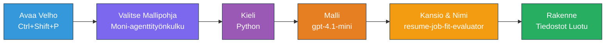
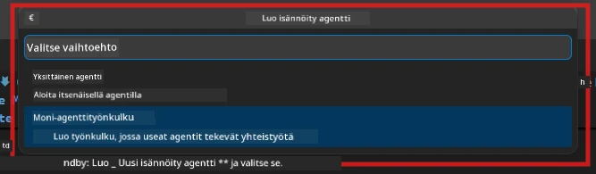

# Module 2 - Moniagenttiprojektin luominen

Tässä moduulissa käytät [Microsoft Foundry -laajennusta](https://marketplace.visualstudio.com/items?itemName=TeamsDevApp.vscode-ai-foundry) **moniagenttisen työnkulkuprojektin luomiseen**. Laajennus generoi koko projektin rakenteen - `agent.yaml`, `main.py`, `Dockerfile`, `requirements.txt`, `.env` ja virheenkorjausasetukset. Mukautat näitä tiedostoja moduuleissa 3 ja 4.

> **Huom:** Tässä työpajassa oleva `PersonalCareerCopilot/`-kansio on toimiva esimerkki räätälöidystä moniagenttiprojektista. Voit joko luoda tuoreen projektin (suositeltavaa oppimista varten) tai tutkia olemassa olevaa koodia suoraan.

---

## Vaihe 1: Avaa Hosted Agent -luontivalikko


1. Paina `Ctrl+Shift+P` avataksesi **Command Paletten**.
2. Kirjoita: **Microsoft Foundry: Create a New Hosted Agent** ja valitse se.
3. Hosted agent -luontiohjattu toiminto aukeaa.

> **Vaihtoehto:** Klikkaa **Microsoft Foundry** -kuvaketta Aktiviteettipalkissa → klikkaa **+** kuvaketta **Agents**-kohdan vieressä → **Create New Hosted Agent**.

---

## Vaihe 2: Valitse Moniagenttinen työnkulku -malli

Ohjattu toiminto pyytää valitsemaan mallin:

| Malli | Kuvaus | Milloin käyttää |
|----------|-------------|-------------|
| Yksittäinen agentti | Yksi agentti ohjeilla ja valinnaisilla työkaluilla | Lab 01 |
| **Moniagenttinen työnkulku** | Useita agenteja, jotka tekevät yhteistyötä WorkflowBuilderin kautta | **Tämä työpaja (Lab 02)** |

1. Valitse **Moniagenttinen työnkulku**.
2. Klikkaa **Seuraava**.



---

## Vaihe 3: Valitse ohjelmointikieli

1. Valitse **Python**.
2. Klikkaa **Seuraava**.

---

## Vaihe 4: Valitse mallisi

1. Ohjattu toiminto näyttää mallin, joka on otettu käyttöön Foundry-projektissasi.
2. Valitse sama malli kuin Lab 01:ssa (esim. **gpt-4.1-mini**).
3. Klikkaa **Seuraava**.

> **Vinkki:** [`gpt-4.1-mini`](https://learn.microsoft.com/azure/foundry/foundry-models/concepts/models-sold-directly-by-azure#gpt-41-series) on suositeltava kehitykseen – se on nopea, edullinen ja toimii hyvin moniagenttisten työnkulkujen kanssa. Vaihda tarvittaessa tuotantokäyttöön `gpt-4.1` –malliin, jos haluat korkealaatuisempaa tulosta.

---

## Vaihe 5: Valitse kansion sijainti ja agentin nimi

1. Tiedostoselain aukeaa. Valitse kohdekansio:
   - Jos seuraat työpajaa repo-oppaassa: navigoi `workshop/lab02-multi-agent/` -kansioon ja luo alikansio
   - Jos aloitat tyhjästä: valitse mikä tahansa kansio
2. Anna **nimi** hosted agentille (esim. `resume-job-fit-evaluator`).
3. Klikkaa **Luo**.

---

## Vaihe 6: Odota työkalurakenteen valmistumista

1. VS Code avaa uuden ikkunan (tai nykyinen ikkuna päivitetään) luodulla projektilla.
2. Näet tämän tiedostorakenteen:

```
resume-job-fit-evaluator/
├── .env                ← Environment variables (placeholders)
├── .vscode/
│   └── launch.json     ← Debug configuration
├── agent.yaml          ← Agent definition (kind: hosted)
├── Dockerfile          ← Container configuration
├── main.py             ← Multi-agent workflow code (scaffold)
└── requirements.txt    ← Python dependencies
```

> **Työpajan huomautus:** Työpajan repossa `.vscode/` -kansio on **työtilan juuritasolla** ja sisältää jaetut `launch.json` ja `tasks.json` -tiedostot. Lab 01:n ja Lab 02:n virheenkorjausasetukset ovat molemmat mukana. Kun painat F5, valitse pudotusvalikosta **"Lab02 - Multi-Agent"**.

---

## Vaihe 7: Ymmärrä luodut tiedostot (moniagentti erikoisuudet)

Moniagenttirakenteen eroavaisuudet yksittäisagentin rakenteeseen nähden:

### 7.1 `agent.yaml` - Agentin määrittely

```yaml
kind: hosted
name: resume-job-fit-evaluator
description: >
  A multi-agent workflow that evaluates resume-to-job fit.
metadata:
  authors:
    - Microsoft
  tags:
    - Multi-Agent Workflow
    - Resume Evaluator
protocols:
  - protocol: responses
    version: v1
environment_variables:
  - name: PROJECT_ENDPOINT
    value: ${PROJECT_ENDPOINT}
  - name: MODEL_DEPLOYMENT_NAME
    value: ${MODEL_DEPLOYMENT_NAME}
```

**Keskeinen ero Lab 01:een:** `environment_variables` -osiossa voi olla lisämuuttujia MCP-päätepisteille tai muille työkalujen asetuksille. `name` ja `description` heijastavat moniagenttista käyttötapausta.

### 7.2 `main.py` - Moniagenttinen työnkulkukoodi

Luotu rakenne sisältää:
- **Useita agenttien ohjestrengejä** (yksi vakio per agentti)
- **Useita [`AzureAIAgentClient.as_agent()`](https://learn.microsoft.com/python/api/overview/azure/ai-agents-readme) kontekstinhallintaa** (yksi agenttia kohden)
- **[`WorkflowBuilder`](https://learn.microsoft.com/agent-framework/workflows/agents-in-workflows)** agenttien yhdistämiseen työnkulussa
- **`from_agent_framework()`** työnkulun tarjoamiseen HTTP-päätepisteenä

```python
from agent_framework import WorkflowBuilder, tool
from agent_framework.azure import AzureAIAgentClient
from azure.ai.agentserver.agentframework import from_agent_framework
```

Lisätuonti [`WorkflowBuilder`](https://learn.microsoft.com/agent-framework/workflows/agents-in-workflows) on uusi verrattuna Lab 01:een.

### 7.3 `requirements.txt` - Lisäriippuvuudet

Moniagenttiprojekti käyttää samoja perustarpeita kuin Lab 01, sekä mahdollisia MCP-paketteja:

```
agent-framework-azure-ai==1.0.0rc3
agent-framework-core==1.0.0rc3
azure-ai-agentserver-agentframework==1.0.0b16
azure-ai-agentserver-core==1.0.0b16
debugpy
agent-dev-cli --pre
```

> **Tärkeä versiohuomautus:** `agent-dev-cli` -paketti vaatii `--pre` -lipun `requirements.txt` -tiedostossa asennettaessa viimeisintä esiversiota. Tämä on tarpeen Agent Inspectorin yhteensopivuuteen `agent-framework-core==1.0.0rc3` kanssa. Katso lisätietoja [Moduulista 8 - Vianetsintä](08-troubleshooting.md).

| Paketti | Versio | Tarkoitus |
|---------|---------|---------|
| [`agent-framework-azure-ai`](https://learn.microsoft.com/agent-framework/overview/) | `1.0.0rc3` | Azure AI -integraatio [Microsoft Agent Frameworkiin](https://github.com/microsoft/agent-framework) |
| [`agent-framework-core`](https://learn.microsoft.com/agent-framework/overview/) | `1.0.0rc3` | Ydinaikaajo (sisältää WorkflowBuilderin) |
| `azure-ai-agentserver-agentframework` | `1.0.0b16` | Hosted agent -palvelimen runtime |
| `azure-ai-agentserver-core` | `1.0.0b16` | Agenttipalvelimen ydinastraktiot |
| `debugpy` | uusin | Pythonin virheenkorjaus (F5 VS Codessa) |
| `agent-dev-cli` | `--pre` | Paikallinen kehitystyökalu CLI + Agent Inspector -backend |

### 7.4 `Dockerfile` - Sama kuin Lab 01

Dockerfile on identtinen Lab 01:n kanssa – kopioi tiedostot, asentaa riippuvuudet `requirements.txt` -tiedostosta, avaa portin 8088 ja ajaa `python main.py`.

```dockerfile
FROM python:3.14-slim
WORKDIR /app
COPY ./ .
RUN pip install --upgrade pip && \
    if [ -f requirements.txt ]; then \
        pip install -r requirements.txt; \
    else \
      echo "No requirements.txt found" >&2; exit 1; \
    fi
EXPOSE 8088
CMD ["python", "main.py"]
```

---

### Välitarkistus

- [ ] Ohjattu luontitoiminto valmis → uusi projektin rakenne näkyvissä
- [ ] Kaikki tiedostot näkyvissä: `agent.yaml`, `main.py`, `Dockerfile`, `requirements.txt`, `.env`
- [ ] `main.py` sisältää `WorkflowBuilder` -tuonnin (vahvistaa moniagenttimallin valinnan)
- [ ] `requirements.txt` sisältää sekä `agent-framework-core` että `agent-framework-azure-ai`
- [ ] Ymmärrät, miten moniagenttirakenne eroaa yksittäisagentin rakenteesta (useita agentteja, WorkflowBuilder, MCP-työkalut)

---

**Edellinen:** [01 - Ymmärrä moniagenttiarkkitehtuuri](01-understand-multi-agent.md) · **Seuraava:** [03 - Konfiguroi agentit ja ympäristö →](03-configure-agents.md)

---

<!-- CO-OP TRANSLATOR DISCLAIMER START -->
**Vastuuvapauslauseke**:  
Tämä asiakirja on käännetty tekoälypohjaisen käännöspalvelun [Co-op Translator](https://github.com/Azure/co-op-translator) avulla. Vaikka pyrimme tarkkuuteen, huomioithan, että automaattiset käännökset saattavat sisältää virheitä tai epäjohdonmukaisuuksia. Alkuperäistä asiakirjaa sen omalla kielellä tulee pitää virallisena lähteenä. Tärkeiden tietojen osalta suositellaan ammattimaisen ihmiskääntäjän palveluja. Emme ole vastuussa tämän käännöksen käytöstä aiheutuvista väärinkäsityksistä tai tulkinnoista.
<!-- CO-OP TRANSLATOR DISCLAIMER END -->