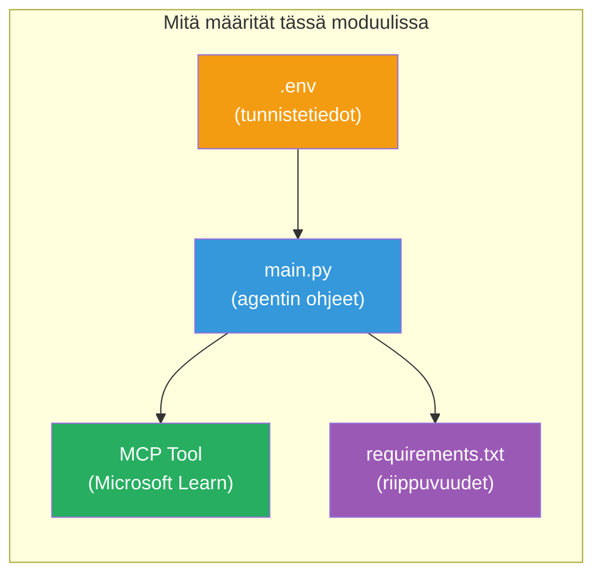

# Module 3 - Määritä agentit, MCP-työkalu ja ympäristö

Tässä moduulissa mukautat valmista monitoimiprojektia. Kirjoitat ohjeet kaikille neljälle agentille, otat käyttöön MCP-työkalun Microsoft Learnille, määrität ympäristömuuttujat ja asennat riippuvuudet.


> **Viite:** Täydellinen toimiva koodi löytyy tiedostosta [`PersonalCareerCopilot/main.py`](../../../../../workshop/lab02-multi-agent/PersonalCareerCopilot/main.py). Käytä sitä referenssinä, kun rakennat omaasi.

---

## Vaihe 1: Määritä ympäristömuuttujat

1. Avaa **`.env`**-tiedosto projektisi juuressa.
2. Täytä Foundry-projektisi tiedot:

   ```env
   PROJECT_ENDPOINT=https://<your-account>.services.ai.azure.com/api/projects/<your-project>
   MODEL_DEPLOYMENT_NAME=gpt-4.1-mini
   ```

3. Tallenna tiedosto.

### Mistä löydät nämä arvot

| Arvo | Mistä löytää |
|-------|---------------|
| **Projektin päätepiste** | Microsoft Foundry sivupalkki → napsauta projektiasi → päätepisteen URL yksityiskatselussa |
| **Mallin käyttöönoton nimi** | Foundry sivupalkki → laajenna projekti → **Mallit + päätepisteet** → nimi käyttöönotetun mallin vieressä |

> **Tietoturva:** Älä koskaan tallenna `.env`-tiedostoa versionhallintaan. Lisää se `.gitignore`-tiedostoon, jos ei jo ole siellä.

### Ympäristömuuttujien vastaavuus

Moniagenttinen `main.py` lukee sekä standardi- että työpajasidonnaiset ympäristömuuttujien nimet:

```python
PROJECT_ENDPOINT = os.getenv("AZURE_AI_PROJECT_ENDPOINT") or os.getenv("PROJECT_ENDPOINT")
MODEL_DEPLOYMENT_NAME = os.getenv(
    "AZURE_AI_MODEL_DEPLOYMENT_NAME",
    os.getenv("MODEL_DEPLOYMENT_NAME", "gpt-4.1-mini"),
)
MICROSOFT_LEARN_MCP_ENDPOINT = os.getenv(
    "MICROSOFT_LEARN_MCP_ENDPOINT", "https://learn.microsoft.com/api/mcp"
)
```

MCP:n päätepisteellä on järkevä oletusarvo – sinun ei tarvitse asettaa sitä `.env`-tiedostossa, ellei halua korvata sitä.

---

## Vaihe 2: Kirjoita agenttien ohjeet

Tämä on kriittisin vaihe. Jokaiselle agentille tarvitaan huolellisesti laaditut ohjeet, jotka määrittelevät roolin, lähtömuodon ja säännöt. Avaa `main.py` ja luo (tai muokkaa) ohjevakiot.

### 2.1 CV-parseri-agentti

```python
RESUME_PARSER_INSTRUCTIONS = """\
You are the Resume Parser.
Extract resume text into a compact, structured profile for downstream matching.

Output exactly these sections:
1) Candidate Profile
2) Technical Skills (grouped categories)
3) Soft Skills
4) Certifications & Awards
5) Domain Experience
6) Notable Achievements

Rules:
- Use only explicit or strongly implied evidence.
- Do not invent skills, titles, or experience.
- Keep concise bullets; no long paragraphs.
- If input is not a resume, return a short warning and request resume text.
"""
```

**Miksi nämä osiot?** MatchingAgent tarvitsee jäsenneltyä dataa pisteyttämistä varten. Johdonmukaiset osiot mahdollistavat luotettavan tiedonsiirron agenttien välillä.

### 2.2 Työkuvaus-agentti

```python
JOB_DESCRIPTION_INSTRUCTIONS = """\
You are the Job Description Analyst.
Extract a structured requirement profile from a JD.

Output exactly these sections:
1) Role Overview
2) Required Skills
3) Preferred Skills
4) Experience Required
5) Certifications Required
6) Education
7) Domain / Industry
8) Key Responsibilities

Rules:
- Keep required vs preferred clearly separated.
- Only use what the JD states; do not invent hidden requirements.
- Flag vague requirements briefly.
- If input is not a JD, return a short warning and request JD text.
"""
```

**Miksi erotella vaaditut ja toivottavat?** MatchingAgent käyttää eri painotuksia kummallekin (Vaaditut taidot = 40 pistettä, Toivottavat taidot = 10 pistettä).

### 2.3 MatchingAgent

```python
MATCHING_AGENT_INSTRUCTIONS = """\
You are the Matching Agent.
Compare parsed resume output vs JD output and produce an evidence-based fit report.

Scoring (100 total):
- Required Skills 40
- Experience 25
- Certifications 15
- Preferred Skills 10
- Domain Alignment 10

Output exactly these sections:
1) Fit Score (with breakdown math)
2) Matched Skills
3) Missing Skills
4) Partially Matched
5) Experience Alignment
6) Certification Gaps
7) Overall Assessment

Rules:
- Be objective and evidence-only.
- Keep partial vs missing separate.
- Keep Missing Skills precise; it feeds roadmap planning.
"""
```

**Miksi selkeä pisteytys?** Toistettava pisteytys mahdollistaa suoritusten vertailun ja virheiden selvittämisen. 100 pisteen asteikko on loppukäyttäjälle helppo tulkita.

### 2.4 Puutteiden analysoija -agentti

```python
GAP_ANALYZER_INSTRUCTIONS = """\
You are the Gap Analyzer and Roadmap Planner.
Create a practical upskilling plan from the matching report.

Microsoft Learn MCP usage (required):
- For EVERY High and Medium priority gap, call tool `search_microsoft_learn_for_plan`.
- Use returned Learn links in Suggested Resources.
- Prefer Microsoft Learn for free resources.

CRITICAL: You MUST produce a SEPARATE detailed gap card for EVERY skill listed in
the Missing Skills and Certification Gaps sections of the matching report. Do NOT
skip or combine gaps. Do NOT summarize multiple gaps into one card.

Output format:
1) Personalized Learning Roadmap for [Role Title]
2) One DETAILED card per gap (produce ALL cards, not just the first):
   - Skill
   - Priority (High/Medium/Low)
   - Current Level
   - Target Level
   - Suggested Resources (include Learn URL from tool results)
   - Estimated Time
   - Quick Win Project
3) Recommended Learning Order (numbered list)
4) Timeline Summary (week-by-week)
5) Motivational Note

Rules:
- Produce every gap card before writing the summary sections.
- Keep it specific, realistic, and actionable.
- Tailor to candidate's existing stack.
- If fit >= 80, focus on polish/interview readiness.
- If fit < 40, be honest and provide a staged path.
"""
```

**Miksi "CRITICAL"-korostus?** Ilman nimenomaisia ohjeita tuottaa KAIKKI puuteluokat malli generoi tyypillisesti vain 1–2 korttia ja tiivistää loput. "CRITICAL"-lohko estää tämän lyhennyksen.

---

## Vaihe 3: Määritä MCP-työkalu

GapAnalyzer käyttää työkalua, joka kutsuu [Microsoft Learn MCP -palvelinta](https://learn.microsoft.com/azure/foundry/agents/how-to/tools/model-context-protocol). Lisää tämä `main.py`-tiedostoon:

```python
import json
from agent_framework import tool
from mcp.client.session import ClientSession
from mcp.client.streamable_http import streamable_http_client

@tool
async def search_microsoft_learn_for_plan(
    skill: str, role: str = "", max_results: int = 5
) -> str:
    """Search Microsoft Learn MCP and return curated official links for roadmap planning."""
    query = " ".join(part for part in [skill, role, "learning path module"] if part).strip()
    query = query or "job skills learning path"

    try:
        async with streamable_http_client(MICROSOFT_LEARN_MCP_ENDPOINT) as (
            read_stream, write_stream, _,
        ):
            async with ClientSession(read_stream, write_stream) as session:
                await session.initialize()
                result = await session.call_tool(
                    "microsoft_docs_search", {"query": query}
                )

        if not result.content:
            return (
                "No results returned from Microsoft Learn MCP. "
                "Fallback: https://learn.microsoft.com/training/support/catalog-api"
            )

        payload_text = getattr(result.content[0], "text", "")
        data = json.loads(payload_text) if payload_text else {}
        items = data.get("results", [])[:max(1, min(max_results, 10))]

        if not items:
            return f"No direct Microsoft Learn results found for '{skill}'."

        lines = [f"Microsoft Learn resources for '{skill}':"]
        for i, item in enumerate(items, start=1):
            title = item.get("title") or item.get("url") or "Microsoft Learn Resource"
            url = item.get("url") or item.get("link") or ""
            lines.append(f"{i}. {title} - {url}".rstrip(" -"))
        return "\n".join(lines)
    except Exception as ex:
        return (
            f"Microsoft Learn MCP lookup unavailable. Reason: {ex}. "
            "Fallbacks: https://learn.microsoft.com/api/mcp"
        )
```

### Näin työkalu toimii

| Vaihe | Mitä tapahtuu |
|------|-------------|
| 1 | GapAnalyzer päättää tarvitsevansa resursseja taidolle (esim. "Kubernetes") |
| 2 | Kehys kutsuu `search_microsoft_learn_for_plan(skill="Kubernetes")` |
| 3 | Funktio avaa [Streamable HTTP](https://learn.microsoft.com/agent-framework/agents/tools/hosted-mcp-tools) -yhteyden osoitteeseen `https://learn.microsoft.com/api/mcp` |
| 4 | Kutsuu `microsoft_docs_search` -palvelua [MCP-palvelimella](https://learn.microsoft.com/azure/foundry/agents/how-to/tools/model-context-protocol) |
| 5 | MCP-palvelin palauttaa hakutulokset (otsikko + URL) |
| 6 | Funktio muotoilee tulokset numeroiduksi listaksi |
| 7 | GapAnalyzer liittää URL-osoitteet puutekorttiin |

### MCP-riippuvuudet

MCP-asiakas kirjastot sisältyvät välillisesti [`agent-framework-core`](https://learn.microsoft.com/agent-framework/overview/)-pakettiin. Sinun ei tarvitse lisätä niitä erikseen `requirements.txt`-tiedostoon. Jos saat import-virheitä, varmista:

```powershell
pip list | Select-String "mcp"
```

Odotettu: `mcp`-paketti on asennettu (versio 1.x tai uudempi).

---

## Vaihe 4: Kytke agentit ja työnkulku

### 4.1 Luo agentit kontekstinhallinnoijilla

```python
from contextlib import asynccontextmanager

@asynccontextmanager
async def create_agents():
    async with (
        get_credential() as credential,
        AzureAIAgentClient(
            project_endpoint=PROJECT_ENDPOINT,
            model_deployment_name=MODEL_DEPLOYMENT_NAME,
            credential=credential,
        ).as_agent(
            name="ResumeParser",
            instructions=RESUME_PARSER_INSTRUCTIONS,
        ) as resume_parser,
        AzureAIAgentClient(
            project_endpoint=PROJECT_ENDPOINT,
            model_deployment_name=MODEL_DEPLOYMENT_NAME,
            credential=credential,
        ).as_agent(
            name="JobDescriptionAgent",
            instructions=JOB_DESCRIPTION_INSTRUCTIONS,
        ) as jd_agent,
        AzureAIAgentClient(
            project_endpoint=PROJECT_ENDPOINT,
            model_deployment_name=MODEL_DEPLOYMENT_NAME,
            credential=credential,
        ).as_agent(
            name="MatchingAgent",
            instructions=MATCHING_AGENT_INSTRUCTIONS,
        ) as matching_agent,
        AzureAIAgentClient(
            project_endpoint=PROJECT_ENDPOINT,
            model_deployment_name=MODEL_DEPLOYMENT_NAME,
            credential=credential,
        ).as_agent(
            name="GapAnalyzer",
            instructions=GAP_ANALYZER_INSTRUCTIONS,
            tools=[search_microsoft_learn_for_plan],
        ) as gap_analyzer,
    ):
        yield resume_parser, jd_agent, matching_agent, gap_analyzer
```

**Tärkeimmät kohdat:**
- Jokaisella agentilla on oma `AzureAIAgentClient`-instanssi
- Vain GapAnalyzer saa `tools=[search_microsoft_learn_for_plan]`
- `get_credential()` palauttaa [`ManagedIdentityCredential`](https://learn.microsoft.com/python/api/overview/azure/identity-readme#managed-identity-support) Azuren sisällä, [`DefaultAzureCredential`](https://learn.microsoft.com/azure/developer/python/sdk/authentication/credential-chains#defaultazurecredential-overview) paikallisesti

### 4.2 Rakenna työnkulkuverkko

```python
def create_workflow(resume_parser, jd_agent, matching_agent, gap_analyzer):
    workflow = (
        WorkflowBuilder(
            name="ResumeJobFitEvaluator",
            start_executor=resume_parser,
            output_executors=[gap_analyzer],
        )
        .add_edge(resume_parser, jd_agent)
        .add_edge(resume_parser, matching_agent)
        .add_edge(jd_agent, matching_agent)
        .add_edge(matching_agent, gap_analyzer)
        .build()
    )
    return workflow.as_agent()
```

> Katso [Työnkulut agentteina](https://learn.microsoft.com/agent-framework/workflows/as-agents) ymmärtääksesi `.as_agent()`-mallin.

### 4.3 Käynnistä palvelin

```python
async def main() -> None:
    validate_configuration()
    async with create_agents() as (resume_parser, jd_agent, matching_agent, gap_analyzer):
        agent = create_workflow(resume_parser, jd_agent, matching_agent, gap_analyzer)
        from azure.ai.agentserver.agentframework import from_agent_framework
        await from_agent_framework(agent).run_async()

if __name__ == "__main__":
    asyncio.run(main())
```

---

## Vaihe 5: Luo ja aktivoi virtuaaliympäristö

### 5.1 Luo ympäristö

```powershell
cd workshop\lab02-multi-agent\PersonalCareerCopilot
python -m venv .venv
```

### 5.2 Aktivoi se

**PowerShell (Windows):**
```powershell
.\.venv\Scripts\Activate.ps1
```

**macOS/Linux:**
```bash
source .venv/bin/activate
```

### 5.3 Asenna riippuvuudet

```powershell
pip install -r requirements.txt
```

> **Huom:** `agent-dev-cli --pre` -rivi `requirements.txt`-tiedostossa varmistaa, että viimeisin esiversio asennetaan. Tämä on tarpeen yhteensopivuuden takia `agent-framework-core==1.0.0rc3` kanssa.

### 5.4 Varmista asennus

```powershell
pip list | Select-String "agent-framework|agentserver|agent-dev"
```

Odotettu tulos:
```
agent-dev-cli                  0.0.1b260316
agent-framework-azure-ai       1.0.0rc3
agent-framework-core            1.0.0rc3
azure-ai-agentserver-agentframework 1.0.0b16
azure-ai-agentserver-core      1.0.0b16
```

> **Jos `agent-dev-cli` näyttää vanhemman version** (esim. `0.0.1b260119`), Agent Inspector epäonnistuu 403/404-virheillä. Päivitä: `pip install agent-dev-cli --pre --upgrade`

---

## Vaihe 6: Tarkista todennus

Suorita sama tunnistautumistarkistus kuin Lab 01:ssä:

```powershell
az account show --query "{name:name, id:id}" --output table
```

Jos tämä epäonnistuu, suorita [`az login`](https://learn.microsoft.com/cli/azure/authenticate-azure-cli-interactively).

Moniagenttisissa työnkuluissa kaikki neljä agenttia jakavat saman tunnistetiedon. Jos todennus toimii yhdelle, se toimii kaikille.

---

### Tarkistuslista

- [ ] `.env`-tiedostossa on kelvolliset `PROJECT_ENDPOINT` ja `MODEL_DEPLOYMENT_NAME` -arvot
- [ ] Kaikki 4 agentin ohjevakiota on määritelty `main.py`-tiedostossa (ResumeParser, JD Agent, MatchingAgent, GapAnalyzer)
- [ ] `search_microsoft_learn_for_plan` MCP-työkalu on määritelty ja rekisteröity GapAnalyzerin kanssa
- [ ] `create_agents()` luo kaikki 4 agenttia omilla `AzureAIAgentClient`-instansseillaan
- [ ] `create_workflow()` rakentaa oikean verkon `WorkflowBuilder`illä
- [ ] Virtuaaliympäristö on luotu ja aktivoitu (`(.venv)` näkyvissä)
- [ ] `pip install -r requirements.txt` suoritetaan ilman virheitä
- [ ] `pip list` näyttää kaikki odotetut paketit oikeilla versioilla (rc3 / b16)
- [ ] `az account show` palauttaa tilauksesi tiedot

---

**Edellinen:** [02 - Ohjelmallinen projekti monitoimijana](02-scaffold-multi-agent.md) · **Seuraava:** [04 - Orkestrointimallit →](04-orchestration-patterns.md)

---

<!-- CO-OP TRANSLATOR DISCLAIMER START -->
**Vastuuvapauslauseke**:
Tämä asiakirja on käännetty käyttämällä tekoälypohjaista käännöspalvelua [Co-op Translator](https://github.com/Azure/co-op-translator). Vaikka pyrimme tarkkuuteen, otathan huomioon, että automaattikäännöksissä saattaa esiintyä virheitä tai epätarkkuuksia. Alkuperäistä asiakirjaa sen alkuperäiskielellä tulee pitää luotettavana lähteenä. Tärkeissä tiedoissa suositellaan ammattilaisen tekemää ihmiskäännöstä. Emme ole vastuussa tämän käännöksen käytöstä aiheutuvista väärinymmärryksistä tai virhetulkintojen seurauksista.
<!-- CO-OP TRANSLATOR DISCLAIMER END -->