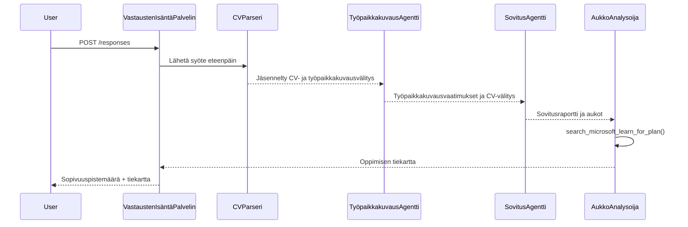

# Moduuli 3 - Konfiguroi ohjeet, ympäristö ja asenna riippuvuudet

⏱️ ~15 min

Tässä moduulissa muunnat ohjelmallisen rungon **oman** monitoimittajatyönkuluksesi - asettamalla ympäristömuuttujat, kirjoittamalla toimittajaohjeet, lisäämällä MCP-työkalun, kytkemällä työnkulun kaavion ja asentamalla riippuvuudet.

> **Viite:** Täydellinen toimiva koodi on [`PersonalCareerCopilot/main.py`](../../../../../workshop/lab02-multi-agent/PersonalCareerCopilot/main.py). Käytä sitä viitteenä rakentaessasi omaa työnkulun kaaviotasi ja kehotelohkojasi.

---

## Kuinka neljä toimittajaa sopivat yhteen


```mermaid
sequenceDiagram
    participant User
    participant Server as VastaustenIsäntäPalvelin
    participant RP as CVParseri
    participant JD as TyöpaikkakuvausAgentti
    participant MA as SovitusAgentti
    participant GA as AukkoAnalysoija

    User->>Server: POST /responses
    Server->>RP: Lähetä syöte eteenpäin
    RP-->>JD: Jäsennelty CV- ja työpaikkakuvausvälitys
    JD-->>MA: Työpaikkakuvausvaatimukset ja CV-välitys
    MA-->>GA: Sovitusraportti ja aukot
    GA->>GA: search_microsoft_learn_for_plan()
    GA-->>Server: Oppimisen tiekartta
    Server-->>User: Sopivuuspistemäärä + tiekartta
```

---

## Vaihe 1: Määritä ympäristömuuttujat

1. Avaa projektisi juurikansiossa oleva **`.env`**-tiedosto (luotu ohjelmallisen rungon ohjaimella).
2. Korvaa paikkamerkit oikeilla arvoillasi Lab 01:stä.

<details open>
<summary><strong>🅰️ Polku A - Foundry-tilaus</strong></summary>

```env
FOUNDRY_PROJECT_ENDPOINT=https://<your-account>.services.ai.azure.com/api/projects/<your-project>
AZURE_AI_MODEL_DEPLOYMENT_NAME=gpt-4.1-mini
```

> **Arvojen löytöpaikka:** Katso [Lab 01, Moduuli 1](../../lab01-single-agent/docs/01-setup.md#deploy-a-model--assign-rbac).

</details>

<details open>
<summary><strong>🅱️ Polku B - Foundry Local</strong></summary>

```env
FOUNDRY_PROJECT_ENDPOINT=http://localhost:5273/v1
AZURE_AI_MODEL_DEPLOYMENT_NAME=phi-4-mini
```

> Kaikki päätelmät suoritetaan koneellasi - data ei poistu laitteeltasi. Suorita `foundry model list` varmistaaksesi tarkan mallin aliaksen. Ainoa ulkoinen kutsu on MCP-työkalun pyyntö osoitteeseen `https://learn.microsoft.com/api/mcp`.

> **Arvojen löytöpaikka:** Katso [Lab 01, Moduuli 1 - paikallinen polku](../../lab01-single-agent/docs/01-setup.md#step-2-set-up-based-on-your-access).

</details>

> **Turvallisuus:** Älä koskaan tallenna `.env`-tiedostoa versionhallintaan. Sen pitäisi olla jo `.gitignore`-tiedostossa.

---

## Vaihe 2: Kirjoita toimittajaohjeet

Ohjeet määrittelevät kunkin toimittajan roolin, tulostusmuodon ja säännöt. Avaa `main.py` ja määritä (tai korvaa) neljä ohjevakioita - täydelliset merkkijonot löytyvät [`PersonalCareerCopilot/main.py`](../../../../../workshop/lab02-multi-agent/PersonalCareerCopilot/main.py).

### 2.1 `RESUME_PARSER_INSTRUCTIONS`
Jäsentää ansioluettelon rakenteelliseksi ehdokasprofiiliksi **ja** kopioi työkuvauksen sanasta sanaan kohtaan `[JOB DESCRIPTION PASS-THROUGH]`. Molempien merkittyjen osioiden on oltava tulosteessa.

> **Miksi pass-through?** `context_mode="last_agent"`-asetuksella ResumeParser on **ainoa** toimittaja, joka näkee alkuperäisen käyttäjän viestin. Jos se ei kopioi työkuvausta eteenpäin, jälkimmäiset toimittajat eivät koskaan näe sitä.

### 2.2 `JOB_DESCRIPTION_INSTRUCTIONS`
Lukee ResumeParserin tulosteesta `[PARSED RESUME]` ja `[JOB DESCRIPTION PASS-THROUGH]`. Tuottaa `[JD REQUIREMENTS]` (jäsennellyt vaatimukset) ja `[PARSED RESUME PASS-THROUGH]` (sanasta sanaan kopioitu ansioluettelo MatchingAgentille).

### 2.3 `MATCHING_AGENT_INSTRUCTIONS`
Lukee `[JD REQUIREMENTS]` ja `[PARSED RESUME PASS-THROUGH]`. Laatii pistetyn yhteensopivuusraportin (0–100) laskelmineen, vastaavine taitoineen, puuttuvine taitoineen ja kokemuksen vastavuoroisuuden kanssa.

### 2.4 `GAP_ANALYZER_INSTRUCTIONS`
Lukee sopivuusraportin. Kutsuu jokaiselle puuttuvalle taidolle `search_microsoft_learn_for_plan` -funktion hakemaan Microsoft Learn -resursseja. Laatii jokaisesta taidosta yksityiskohtaisen aukkojen kortin ja viikkoittaisen oppimissuunnitelman.

---

## Vaihe 3: Lisää MCP-työkalu

GapAnalyzer kutsuu [Microsoft Learnin MCP-palvelinta](https://learn.microsoft.com/azure/foundry/agents/how-to/tools/model-context-protocol) noutaakseen aitoja oppimisresursseja kutakin taitoaukkoa varten. Täysi `search_microsoft_learn_for_plan` -funktio on [`PersonalCareerCopilot/main.py`](../../../../../workshop/lab02-multi-agent/PersonalCareerCopilot/main.py).

Rekisteröi työkalu GapAnalyzerille toimittajaa luodessasi:

```python
gap_analyzer = Agent(
    client=client,
    instructions=GAP_ANALYZER_INSTRUCTIONS,
    name="GapAnalyzer",
    tools=[search_microsoft_learn_for_plan],
)
```

> Katso [`PersonalCareerCopilot/main.py`](../../../../../workshop/lab02-multi-agent/PersonalCareerCopilot/main.py) täydellinen `WorkflowBuilder`-kaavio `FoundryChatClient`, `AgentExecutor` ja kaikkien `add_edge()`-kutsujen kanssa.

---

## Vaihe 4: Luo virtuaaliympäristö ja asenna riippuvuudet

> ⚠️ **Älä ohita tätä vaihetta.** Riippuvuuksien asentamatta jättäminen estää F5-debuggauksen toiminnan.

### 4.1 Luo virtuaaliympäristö

```powershell
python -m venv .venv
```

### 4.2 Aktivoi se

| Käyttöjärjestelmä | Komento |
|----|---------|
| **Windows (PowerShell)** | `.\.venv\Scripts\Activate.ps1` |
| **Windows (CMD)** | `.venv\Scripts\activate.bat` |
| **macOS / Linux** | `source .venv/bin/activate` |

Näet komentokehotteessa `(.venv)`.

### 4.3 Asenna riippuvuudet

```powershell
pip install -r requirements.txt
```

### 4.4 Tarkista

```powershell
pip list | Select-String "agent-framework|mcp|debugpy"
```

Odotettu: `agent-framework-foundry`, `agent-framework-foundry-hosting`, `mcp` ja `debugpy` näkyvät listassa.

---

## Vaihe 5: Tarkista tunnistautuminen

<details open>
<summary><strong>🅰️ Polku A - Azure-todistus</strong></summary>

```powershell
az account show --query "{name:name, id:id}" --output table
```

Jos tämä epäonnistuu, suorita [`az login`](https://learn.microsoft.com/cli/azure/authenticate-azure-cli-interactively).

Kaikki neljä toimittajaa jakavat yhden `FoundryChatClient`in ja yhden `DefaultAzureCredential`in. Jos tunnistautuminen toimii yhdelle, se toimii kaikille.

</details>

<details open>
<summary><strong>🅱️ Polku B - Foundry Local</strong></summary>

Paikalliseen testaamiseen ei vaadita tunnistautumista.

</details>

---

### ✅ Tarkistuspiste

> Älä **jatka** Moduuli 04:ään ennen kuin: **(1)** `(.venv)` näkyy komentokehotteessasi JA **(2)** `pip install -r requirements.txt` on suoritettu onnistuneesti.

- [ ] `.env` sisältää oikean päätepisteen ja mallin asennuksen nimen (ei paikkamerkkejä)
- [ ] Kaikki 4 toimittajaohjevakioa määritelty `main.py`:ssä (ResumeParser, JD Agent, MatchingAgent, GapAnalyzer)
- [ ] `search_microsoft_learn_for_plan` MCP-työkalu määritelty ja rekisteröity GapAnalyzerille
- [ ] `FoundryChatClient` + 4 `Agent` + 4 `AgentExecutor` -objektia luotu `main()`-funktiossa
- [ ] `WorkflowBuilder` rakentaa oikean peräkkäisen kaavion kaikilla 3 `add_edge()`-kutsulla
- [ ] Virtuaaliympäristö luotu ja aktivoitu (`(.venv)` näkyy komentokehotteessa)
- [ ] `pip install -r requirements.txt` suoritettu ilman virheitä
- [ ] **Polku A:** `az account show` onnistuu TAI VS Code Tilit-kuvake näyttää kirjautuneen käyttäjän

---

**Edellinen:** [02 - Luo Monitoimittajaprojekti](02-scaffold-multi-agent.md) · **Seuraava:** [04 - Orkestrointimallit →](04-orchestration-patterns.md)

---

<!-- CO-OP TRANSLATOR DISCLAIMER START -->
**Vastuuvapauslauseke**:
Tämä asiakirja on käännetty käyttämällä tekoälypohjaista käännöspalvelua [Co-op Translator](https://github.com/Azure/co-op-translator). Vaikka pyrimme tarkkuuteen, otathan huomioon, että automaattiset käännökset saattavat sisältää virheitä tai epätarkkuuksia. Alkuperäinen asiakirja sen alkuperäiskielellä on virallinen lähde. Tärkeissä asioissa suositellaan ammattimaista ihmiskäännöstä. Emme ole vastuussa tämän käännöksen käytöstä aiheutuvista väärinymmärryksistä tai tulkinnoista.
<!-- CO-OP TRANSLATOR DISCLAIMER END -->