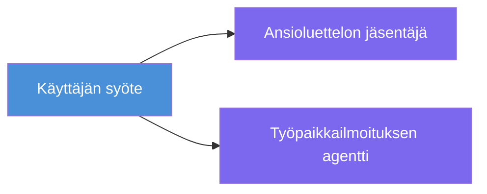
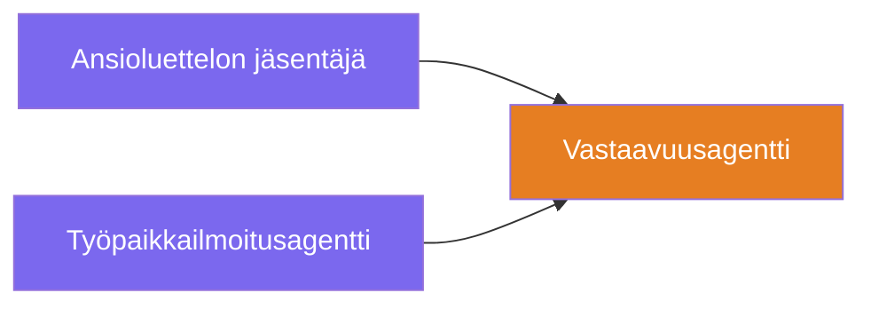
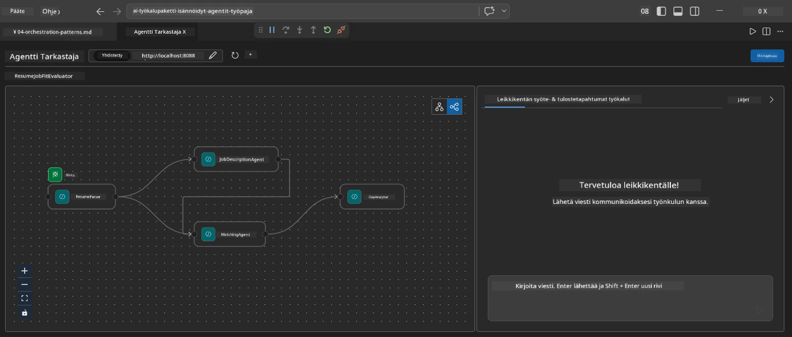
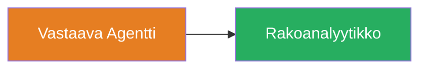
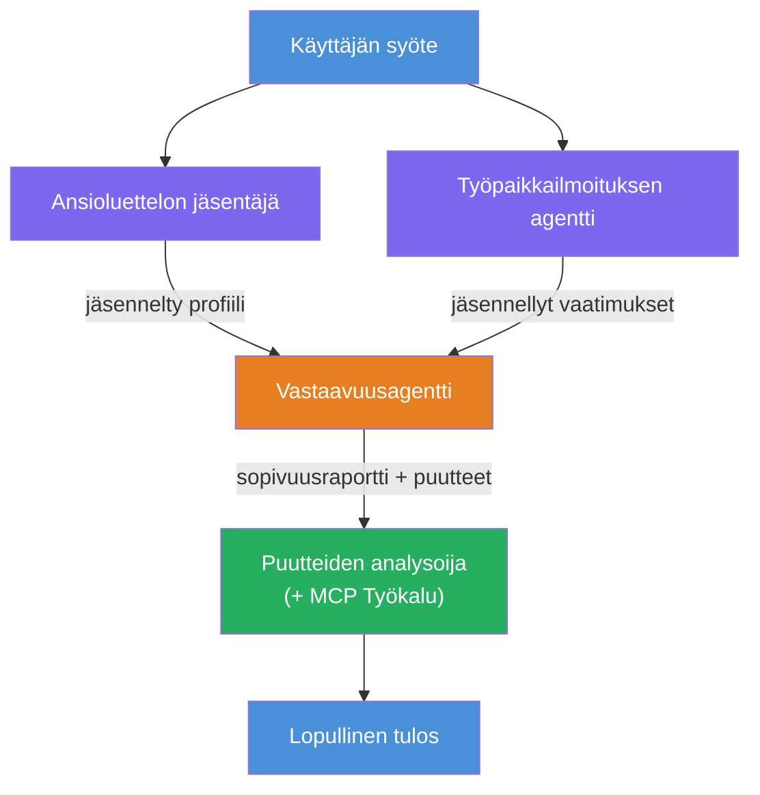
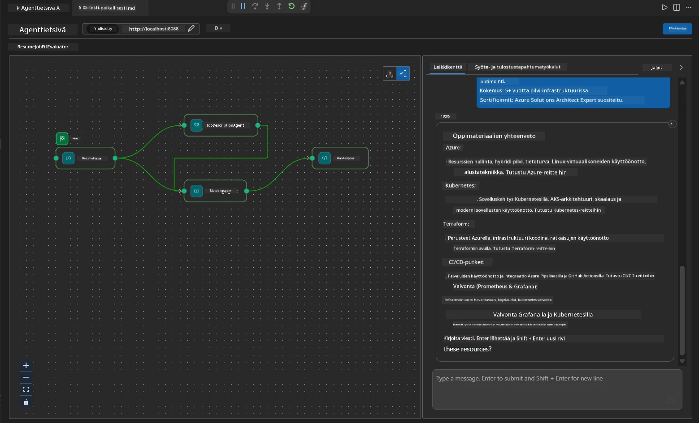

# Moduuli 4 - Orkestrointimallit

Tässä moduulissa tutustut Resume Job Fit Evaluatorissa käytettyihin orkestrointimalleihin ja opit lukemaan, muokkaamaan ja laajentamaan työnkulun graafia. Näiden mallien ymmärtäminen on olennaista tietovirheiden vianmäärityksessä ja omien [moniagenttityönkulkujen](https://learn.microsoft.com/agent-framework/workflows/) rakentamisessa.

---

## Malli 1: Fan-out (rinnakkainen haarautuminen)

Työnkulun ensimmäinen malli on **fan-out** - yksi syöte lähetetään samanaikaisesti useille agenteille.


Koodissa tämä tapahtuu, koska `resume_parser` on `start_executor` - se vastaanottaa käyttäjän viestin ensin. Sitten, koska sekä `jd_agent` että `matching_agent` saavat yhteydet `resume_parserilta`, kehys reitittää `resume_parserin` tulosteen molemmille agenteille:

```python
.add_edge(resume_parser, jd_agent)         # ResumeParser-tulos → JD Agent
.add_edge(resume_parser, matching_agent)   # ResumeParser-tulos → MatchingAgent
```

**Miksi tämä toimii:** ResumeParser ja JD Agent käsittelevät eri osa-alueita samasta syötteestä. Niiden rinnakkainen ajo vähentää kokonaisviivettä verrattuna peräkkäiseen suoritukseen.

### Milloin käyttää fan-outia

| Käyttötapaus | Esimerkki |
|----------|---------|
| Riippumattomat osatehtävät | CV:n jäsentäminen vs. JD:n jäsentäminen |
| Ylimääräisyys / äänestäminen | Kaksi agenttia analysoi samoja tietoja, kolmas valitsee parhaan vastauksen |
| Moniformaattinen tuloste | Yksi agentti tuottaa tekstiä, toinen tuottaa jäsenneltyä JSONia |

---

## Malli 2: Fan-in (yhteenkeräys)

Toinen malli on **fan-in** - useiden agenttien tuotokset kerätään ja lähetetään yhdelle alavirran agentille.


Koodissa:

```python
.add_edge(resume_parser, matching_agent)   # ResumeParser tuloste → MatchingAgent
.add_edge(jd_agent, matching_agent)        # JD Agent tuloste → MatchingAgent
```

**Keskeinen käyttäytyminen:** Kun agentilla on **kaksi tai useampia saapuvia kaaria**, kehys odottaa automaattisesti, että **kaikki** ylövirran agentit ovat suorittaneet tehtävänsä ennen alavirran agentin ajoa. MatchingAgent ei käynnisty ennen kuin sekä ResumeParser että JD Agent ovat valmiit.

### Mitä MatchingAgent saa

Kehys liittää yhteen kaikkien ylövirran agenttien tulosteet. MatchingAgentin syöte näyttää tältä:

```
[ResumeParser output]
---
Candidate Profile:
  Name: Jane Doe
  Technical Skills: Python, Azure, Kubernetes, ...
  ...

[JobDescriptionAgent output]
---
Role Overview: Senior Cloud Engineer
Required Skills: Python, Azure, Terraform, ...
...
```

> **Huom:** Tarkka liitosmuoto riippuu kehyksen versiosta. Agentin ohjeet tulisi kirjoittaa käsittelemään sekä jäsenneltyjä että jäsentämättömiä ylövirran tulosteita.



---

## Malli 3: Peräkkäinen ketju

Kolmas malli on **peräkkäinen ketjuttaminen** - yhden agentin tuloste syötetään suoraan seuraavalle.


Koodissa:

```python
.add_edge(matching_agent, gap_analyzer)    # MatchingAgentulostulo → GapAnalyzer
```

Tämä on yksinkertaisin malli. GapAnalyzer saa MatchingAgentin fit-pistemäärän, sopivat/puuttuvat taidot ja aukot. Sitten se kutsuu [MCP-työkalua](https://learn.microsoft.com/azure/foundry/agents/how-to/tools/model-context-protocol) kutakin aukkoa varten noutaakseen Microsoft Learn -resursseja.

---

## Kokonainen graafi

Kaikkien kolmen mallin yhdistäminen tuottaa täydellisen työnkulun:


### Suoritusajanjana

```mermaid
gantt
    title Agentin Suoritus Aikajana
    dateFormat X
    axisFormat %s

    section Samanaikaisesti
    CV:n Jäsennin       :rp, 0, 3
    Työpaikkailmoitus Agentti :jd, 0, 2

    section Peräkkäin
    Vastaavuus Agentti  :ma, 3, 5
    Aukko Analysoija    :ga, 5, 9
```


> Kokonaisaika on suunnilleen `max(ResumeParser, JD Agent) + MatchingAgent + GapAnalyzer`. GapAnalyzer on yleensä hitain, koska se tekee useita MCP-työkalukutsuja (yksi per aukko).

---

## WorkflowBuilder-koodin lukeminen

Tässä on täydellinen `create_workflow()`-funktio tiedostosta `main.py`, kommentoituna:

```python
def create_workflow(resume_parser, jd_agent, matching_agent, gap_analyzer):
    workflow = (
        WorkflowBuilder(
            name="ResumeJobFitEvaluator",

            # Ensimmäinen agentti, joka vastaanottaa käyttäjän syötteen
            start_executor=resume_parser,

            # Agentti(t), jonka tuotos muodostaa lopullisen vastauksen
            output_executors=[gap_analyzer],
        )
        # Fan-out: ResumeParserin tuotos menee sekä JD Agentille että MatchingAgentille
        .add_edge(resume_parser, jd_agent)
        .add_edge(resume_parser, matching_agent)

        # Fan-in: MatchingAgent odottaa sekä ResumeParserin että JD Agentin
        .add_edge(jd_agent, matching_agent)

        # Peräkkäinen: MatchingAgentin tuotos syötetään GapAnalyzerille
        .add_edge(matching_agent, gap_analyzer)

        .build()
    )
    return workflow.as_agent()
```

### Kaarien yhteenvetotaulukko

| # | Kaari | Malli | Vaikutus |
|---|------|---------|--------|
| 1 | `resume_parser → jd_agent` | Fan-out | JD Agent saa ResumeParserin tulosteen (plus alkuperäisen käyttäjän syötteen) |
| 2 | `resume_parser → matching_agent` | Fan-out | MatchingAgent saa ResumeParserin tulosteen |
| 3 | `jd_agent → matching_agent` | Fan-in | MatchingAgent saa myös JD Agentin tulosteen (odottaa molempia) |
| 4 | `matching_agent → gap_analyzer` | Peräkkäinen | GapAnalyzer saa fit-raportin + aukkojen listan |

---

## Graafin muokkaaminen

### Uuden agentin lisääminen

Jos haluat lisätä viidennen agentin (esim. **InterviewPrepAgent**, joka luo haastattelukysymyksiä aukkoanalyysin perusteella):

```python
# 1. Määritä ohjeet
INTERVIEW_PREP_INSTRUCTIONS = """\
You are the Interview Prep Agent.
Given a gap analysis and fit report, generate 10 targeted interview questions
the candidate should prepare for.
"""

# 2. Luo agentti (async with -lohkon sisällä)
AzureAIAgentClient(
    project_endpoint=PROJECT_ENDPOINT,
    model_deployment_name=MODEL_DEPLOYMENT_NAME,
    credential=credential,
).as_agent(
    name="InterviewPrepAgent",
    instructions=INTERVIEW_PREP_INSTRUCTIONS,
) as interview_prep,

# 3. Lisää reunat create_workflow()-funktiossa
.add_edge(matching_agent, interview_prep)   # vastaanottaa sovitusraportin
.add_edge(gap_analyzer, interview_prep)     # vastaanottaa myös aukko-kortit

# 4. Päivitä output_executors
output_executors=[interview_prep],  # nyt lopullinen agentti
```

### Suoritusjärjestyksen muuttaminen

Jos haluat, että JD Agent käynnistyy **ResumeParserin jälkeen** (peräkkäin, ei rinnakkain):

```python
# Poista: .add_edge(resume_parser, jd_agent)  ← on jo olemassa, pidä se
# Poista implisiittinen rinnakkaisuus jättämällä jd_agent vastaanottamatta käyttäjän syötettä suoraan
# start_executor lähettää ensin resume_parserille, ja jd_agent saa
# resume_parserin tulosteen kaaren kautta. Tämä tekee niistä peräkkäiset.
```

> **Tärkeää:** `start_executor` on ainoa agentti, joka saa raakasyötteen käyttäjältä. Kaikki muut agentit saavat syötteen ylövirran kaariltaan. Jos haluat agentin saavan myös raakasyötteen, sillä täytyy olla kaari `start_executorilta`.

---

## Yleiset graafivirheet

| Virhe | Oire | Korjaus |
|---------|---------|-----|
| Puuttuva kaari `output_executors`iin | Agentti toimii, mutta tulos on tyhjä | Varmista, että `start_executorilta` on polku jokaiseen `output_executors`in agenttiin |
| Syklinen riippuvuus | Ikuinen silmukka tai aikakatkaisu | Tarkista, ettei mikään agentti syötä ylövirran agentille |
| Agentti `output_executors`issa ilman saapuvaa kaarta | Tyhjä tuloste | Lisää ainakin yksi `add_edge(lähde, tuo_agentti)` |
| Useita `output_executors` ilman fan-inia | Tuloste sisältää vain yhden agentin vastauksen | Käytä yhtä tulostavaa agenttia, joka kokoaa vastaukset, tai hyväksy useat vastaukset |
| Puuttuva `start_executor` | `ValueError` rakennusvaiheessa | Määritä aina `start_executor` `WorkflowBuilderissa()` |

---

## Graafin vianmääritys

### Agent Inspectorin käyttö

1. Käynnistä agentti paikallisesti (F5 tai terminaali - ks. [Moduuli 5](05-test-locally.md)).
2. Avaa Agent Inspector (`Ctrl+Shift+P` → **Foundry Toolkit: Open Agent Inspector**).
3. Lähetä testiviesti.
4. Inspectorin vastaus-paneelissa etsi **suoratoistettu tuloste** - se näyttää kunkin agentin panoksen järjestyksessä.



### Lokituksen käyttö

Lisää lokitus `main.py`:hen tietovirran jäljittämiseksi:

```python
import logging
logger = logging.getLogger("resume-job-fit")

# create_workflow()-funktiossa, rakentamisen jälkeen:
logger.info("Workflow graph built with edges: RP→JD, RP→MA, JD→MA, MA→GA")
```

Palvelimen lokit näyttävät agenttien suoritustilauksen ja MCP-työkalukutsut:

```
INFO:resume-job-fit:Starting Resume -> Job Fit Evaluator HTTP server...
INFO:resume-job-fit:Server running on http://localhost:8088
INFO:agent_framework:Executing agent: ResumeParser
INFO:agent_framework:Executing agent: JobDescriptionAgent
INFO:agent_framework:Waiting for upstream agents: ResumeParser, JobDescriptionAgent
INFO:agent_framework:Executing agent: MatchingAgent
INFO:agent_framework:Executing agent: GapAnalyzer
INFO:agent_framework:Tool call: search_microsoft_learn_for_plan(skill="Kubernetes")
POST https://learn.microsoft.com/api/mcp → 200
INFO:agent_framework:Tool call: search_microsoft_learn_for_plan(skill="Terraform")
POST https://learn.microsoft.com/api/mcp → 200
```

---

### Tarkistuslista

- [ ] Osaat tunnistaa kolme orkestrointimallia työnkulussa: fan-out, fan-in ja peräkkäinen ketju
- [ ] Ymmärrät, että agenteilla, joilla on useita saapuvia kaaria, odotetaan kaikkien ylövirran agenttien valmistumista
- [ ] Osaat lukea `WorkflowBuilder`-koodia ja yhdistää jokaisen `add_edge()`-kutsun visuaaliseen graafiin
- [ ] Ymmärrät suorituksen aikajanan: rinnakkaiset agentit käynnistyvät ensin, sitten yhteenkeräys, sitten peräkkäinen suoritus
- [ ] Osaat lisätä uuden agentin graafiin (määritä ohjeet, luo agentti, lisää kaaret, päivitä tuloste)
- [ ] Osaat tunnistaa yleisimmät graafivirheet ja niiden oireet

---

**Edellinen:** [03 - Agentsien ja ympäristön määrittäminen](03-configure-agents.md) · **Seuraava:** [05 - Testaa paikallisesti →](05-test-locally.md)

---

<!-- CO-OP TRANSLATOR DISCLAIMER START -->
**Vastuuvapauslauseke**:  
Tämä asiakirja on käännetty käyttämällä tekoälykäännöspalvelua [Co-op Translator](https://github.com/Azure/co-op-translator). Pyrimme tarkkuuteen, mutta otathan huomioon, että automaattikäännöksissä saattaa esiintyä virheitä tai epätarkkuuksia. Alkuperäistä asiakirjaa sen alkuperäiskielellä tulee pitää virallisena lähteenä. Tärkeissä asioissa suositellaan ammattimaista ihmiskäännöstä. Emme ole vastuussa tämän käännöksen käytöstä aiheutuvista väärinymmärryksistä tai tulkinnoista.
<!-- CO-OP TRANSLATOR DISCLAIMER END -->