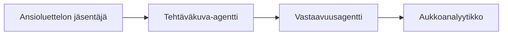
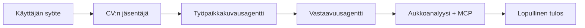

# Moduuli 4 - Orkestrointimallit

⏱️ ~10 min

Tässä moduulissa tutustut Resume Job Fit Evaluatorissa käytettyihin orkestrointimalleihin ja opit lukemaan, muokkaamaan ja laajentamaan työnkulun graafia. Näiden mallien ymmärtäminen on olennaista datavirheen vianmäärityksessä ja omien [moniagenttityönkulkujesi](https://learn.microsoft.com/agent-framework/workflows/) rakentamisessa.

---

## Malli 1: Peräkkäinen ketju

Työnkulun perusmalli on **peräkkäinen ketju** - kunkin agentin tuotos syötetään suoraan seuraavalle.


```mermaid
flowchart LR
    RP[Ansioluettelon jäsentäjä] --> JD[Tehtäväkuva-agentti]
    JD --> MA[Vastaavuusagentti]
    MA --> GA[Aukkoanalyytikko]
```

Koodissa jokainen `add_edge()`-kutsu luo yhden askeleen ketjuun:

```python
.add_edge(resume_executor, jd_executor)       # ResumeParser tuloste → JD Agent
.add_edge(jd_executor, matching_executor)     # JD Agent tuloste → MatchingAgent
.add_edge(matching_executor, gap_executor)    # MatchingAgent tuloste → GapAnalyzer
```

> **Miksi peräkkäinen, eikä haarautuva/hanautuva?** `WorkflowBuilder` käyttää **TAI-semanttiikkaa** saapuville reunoille: alaspäin toimiva suorittaja käynnistyy heti, kun **mikä tahansa** edeltäjä on valmis. Jos `matching_executor`:lla olisi kaksi saapuvaa reunaa (sekä `resume_executor`:lta että `jd_executor`:lta), se käynnistyisi kahdesti - kerran kun ResumeParser päättyy ja uudelleen kun JD Agent päättyy - aiheuttaen GapAnalyzerin ajamisen kahdesti ja tuotoksen ilmestymisen kahdesti. Peräkkäinen putki välttää tämän kokonaan.

## Malli 2: Sisällön välitys

Koska `context_mode="last_agent"` tarkoittaa, että jokainen suorittaja näkee vain **suoraa edeltäjänsä tuotoksen**, peräkkäisen ketjun agenttien on nimenomaisesti välitettävä eteenpäin kaikki tiedot, joita alaspäin olevat agentit tarvitsevat.

Tässä työnkulussa:
- **ResumeParser** kopioi JD:n sanasta sanaan `[JOB DESCRIPTION PASS-THROUGH]` -kenttään (jotta JD Agent löytää sen).
- **JD Agent** kopioi `[PARSED RESUME]` sanasta sanaan `[PARSED RESUME PASS-THROUGH]` -kenttään (jotta MatchingAgent voi vertailla molempia profiileja).

```
ResumeParser output
└─ [PARSED RESUME]               ← extracted by JD Agent
└─ [JOB DESCRIPTION PASS-THROUGH] ← extracted by JD Agent

JD Agent output
└─ [JD REQUIREMENTS]             ← extracted by MatchingAgent
└─ [PARSED RESUME PASS-THROUGH]  ← extracted by MatchingAgent
```

Jokainen välityskohde on kopioitava **sanasta sanaan** - tiivistäminen tai parafraasien käyttö rikkoo sitä seuraavaa agenttia, joka on riippuvainen siitä.

---

## Kokonaisgraafi

Peräkkäisen ketjun ja sisällön välitysmallien yhdistelmä muodostaa täydellisen työnkulun:


```mermaid
flowchart LR
    U[Käyttäjän syöte] --> RP[CV:n jäsentäjä]
    RP --> JD[Työpaikkakuvausagentti]
    JD --> MA[Vastaavuusagentti]
    MA --> GA[Aukkoanalyysi + MCP]
    GA --> O[Lopullinen tulos]
```

Agent Inspector näyttää tämän saman graafirakenteen, kun agentti toimii paikallisesti. Ks. [Moduuli 5 - Testaa paikallisesti](05-test-locally.md) kuvakaappauksia.

---

## WorkflowBuilder-koodin lukeminen

Koko `create_workflow()`-funktio löytyy tiedostosta [`PersonalCareerCopilot/main.py`](../../../../../workshop/lab02-multi-agent/PersonalCareerCopilot/main.py). Kolme `add_edge()`-kutsua rakentavat peräkkäisen putken:

| # | Reuna | Vaikutus |
|---|--------|----------|
| 1 | `resume_executor → jd_executor` | JD Agent saa `[PARSED RESUME]` + `[JOB DESCRIPTION PASS-THROUGH]` |
| 2 | `jd_executor → matching_executor` | MatchingAgent saa `[JD REQUIREMENTS]` + `[PARSED RESUME PASS-THROUGH]` |
| 3 | `matching_executor → gap_executor` | GapAnalyzer saa fit-raportin + aukkojen listan |

---

## Graafin muokkaaminen

### Uuden agentin lisääminen

Viidennen agentin lisäämiseksi (esim. **InterviewPrepAgent** GapAnalyzerin jälkeen):

1. Määrittele vakio `INTERVIEW_PREP_INSTRUCTIONS`.
2. Luo `Agent`- ja `AgentExecutor`-objektit (sama malli kuin neljällä olemassa olevalla).
3. Lisää `.add_edge(gap_executor, interview_exec)` `WorkflowBuilder`-rakenteeseen.
4. Päivitä `output_executors=[interview_exec]`.

> **Tärkeää:** `start_executor` on ainoa agentti, joka saa suoran käyttäjän syötteen. Kaikki muut agentit saavat tuloksen ylävirran reunalta.

---

## Yleisiä graafivirheitä

| Virhe | Oire | Korjaus |
|-------|-------|--------|
| Puuttuva reuna `output_executors`-agentille | Agentti toimii, mutta tulos on tyhjä | Varmista, että polku `start_executor`:sta johtaa jokaiseen agenttiin `output_executors`-listassa |
| Ympyräriippuvuus | Loputon silmukka tai aikakatkaisu | Tarkista, ettei mikään agentti syötä tietoa takaisin ylävirran agentille |
| Agentti `output_executors`-listassa ilman saapuvaa reunaa | Tyhjä tulos | Lisää vähintään yksi `add_edge(lähde, kyseinen_agentti)` |
| Useita `output_executors` ilman yhteen yhdistämistä | Tuloksena vain yhden agentin vastaus | Käytä yhtä yhdistävää output-agenttia tai hyväksy useamman tulos |
| Puuttuva `start_executor` | `ValueError` rakennusvaiheessa | Määrittele aina `start_executor` `WorkflowBuilder()`-kutsussa |

---

## Graafin vianmääritys

### Agent Inspectorin käyttö

1. Käynnistä agentti paikallisesti F5-näppäimellä.
2. Avaa Agent Inspector (`Ctrl+Shift+P` → **Foundry Toolkit: Open Agent Inspector**).
3. Lähetä testiviesti.
4. Katso Inspectorin vastauspaneelista **streaming output** -näyttöä, joka näyttää kunkin agentin panoksen järjestyksessä.


### Lokituksen käyttö

Lisää lokitus `main.py`-tiedostoon datavirheen jäljittämiseen:

```python
import logging
logger = logging.getLogger("resume-job-fit")

# Pääohjelmassa (main()), työnkulun rakentamisen jälkeen:
logger.info("Workflow graph built with edges: RP→JD, JD→MA, MA→GA")
```

Palvelimen lokista näkyy agenttien suorituksen järjestys ja MCP-työkalujen kutsut:

```
INFO:agent_framework:Executing agent: ResumeParser
INFO:agent_framework:Executing agent: JobDescriptionAgent
INFO:agent_framework:Executing agent: MatchingAgent
INFO:agent_framework:Executing agent: GapAnalyzer
INFO:agent_framework:Tool call: search_microsoft_learn_for_plan(skill="Kubernetes")
POST https://learn.microsoft.com/api/mcp → 200
INFO:agent_framework:Tool call: search_microsoft_learn_for_plan(skill="Terraform")
POST https://learn.microsoft.com/api/mcp → 200
```

---

### Välitarkistus

- [ ] Osaat tunnistaa työnkulun kaksi orkestrointimallia: peräkkäinen ketju ja sisällön välitys
- [ ] Ymmärrät miksi `context_mode="last_agent"` vaatii nimenomaista datan välitystä agenttien välillä
- [ ] Osaat lukea `WorkflowBuilder`-koodin ja yhdistää jokaisen `add_edge()`-kutsun visuaaliseen graafiin
- [ ] Osaat lisätä uuden agentin putken loppuun
- [ ] Osaat tunnistaa yleisiä graafivirheitä ja niiden oireita

---

**Edellinen:** [03 - Agenttien ja ympäristön konfigurointi](03-configure-agents.md) · **Seuraava:** [05 - Testaa paikallisesti →](05-test-locally.md)

---

<!-- CO-OP TRANSLATOR DISCLAIMER START -->
**Vastuuvapauslauseke**:
Tämä asiakirja on käännetty käyttämällä tekoälypohjaista käännöspalvelua [Co-op Translator](https://github.com/Azure/co-op-translator). Vaikka pyrimme tarkkuuteen, otathan huomioon, että automaattiset käännökset saattavat sisältää virheitä tai epätarkkuuksia. Alkuperäinen asiakirja sen alkuperäiskielellä on virallinen lähde. Tärkeissä asioissa suositellaan ammattimaista ihmiskäännöstä. Emme ole vastuussa tämän käännöksen käytöstä aiheutuvista väärinymmärryksistä tai tulkinnoista.
<!-- CO-OP TRANSLATOR DISCLAIMER END -->