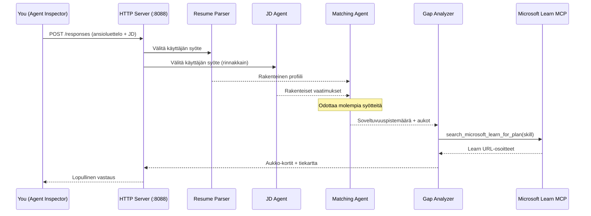
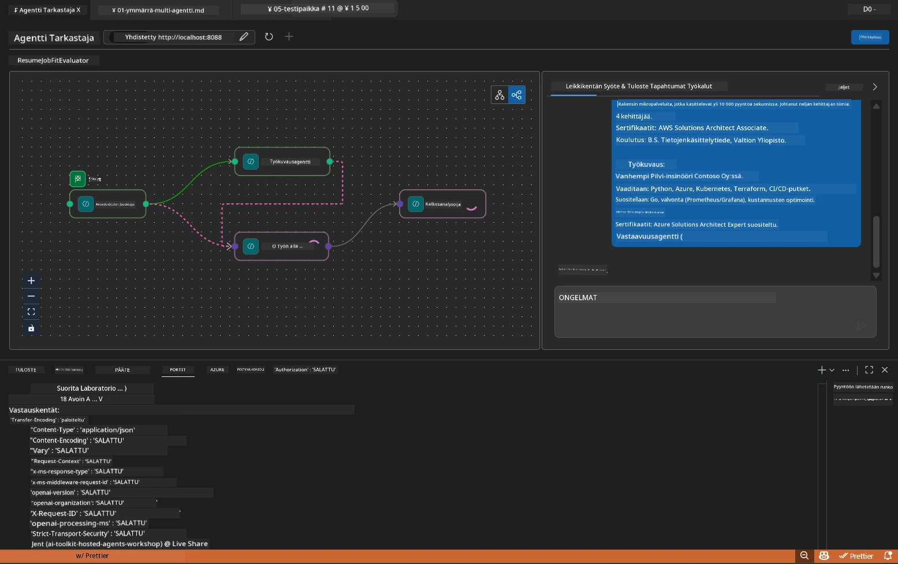

# Modul 5 - Testaa paikallisesti (Moni-agentti)

Tässä moduulissa suoritat moni-agenttityönkulun paikallisesti, testaat sitä Agent Inspectorilla ja varmistat, että kaikki neljä agenttia ja MCP-työkalu toimivat oikein ennen käyttöönottoa Foundryssa.

### Mitä tapahtuu paikallisessa testiajossa


---

## Vaihe 1: Käynnistä agenttipalvelin

### Vaihtoehto A: VS Code -tehtävän käyttäminen (suositeltu)

1. Paina `Ctrl+Shift+P` → kirjoita **Tasks: Run Task** → valitse **Run Lab02 HTTP Server**.
2. Tehtävä käynnistää palvelimen debugpy-liitännällä portissa `5679` ja agentin portissa `8088`.
3. Odota, että tuloste näyttää:

```
INFO:resume-job-fit:Starting Resume -> Job Fit Evaluator HTTP server...
INFO:resume-job-fit:Server running on http://localhost:8088
```

### Vaihtoehto B: Päätekäyttö manuaalisesti

```powershell
cd workshop\lab02-multi-agent\PersonalCareerCopilot
```

Aktivoi virtuaaliympäristö:

**PowerShell (Windows):**
```powershell
.\.venv\Scripts\Activate.ps1
```

**macOS/Linux:**
```bash
source .venv/bin/activate
```

Käynnistä palvelin:

```powershell
python -m debugpy --listen 127.0.0.1:5679 -m agentdev run main.py --verbose --port 8088
```

### Vaihtoehto C: F5-näppäimen käyttäminen (debug-tila)

1. Paina `F5` tai siirry kohtaan **Run and Debug** (`Ctrl+Shift+D`).
2. Valitse pudotusvalikosta **Lab02 - Multi-Agent** -käynnistyskonfiguraatio.
3. Palvelin käynnistyy täydellä breakpoint-tukitoiminnolla.

> **Vinkki:** Debug-tila antaa sinun asettaa breakpointteja funktioon `search_microsoft_learn_for_plan()` tutkiaksesi MCP-vastauksia tai agentin ohjausmerkkijonoihin nähdäksesi, mitä kukin agentti vastaanottaa.

---

## Vaihe 2: Avaa Agent Inspector

1. Paina `Ctrl+Shift+P` → kirjoita **Foundry Toolkit: Open Agent Inspector**.
2. Agent Inspector avautuu selainvälilehdelle osoitteessa `http://localhost:5679`.
3. Näet agentin käyttöliittymän valmiina vastaanottamaan viestejä.

> **Jos Agent Inspector ei avaudu:** Varmista, että palvelin on kokonaan käynnistynyt (näet "Server running" -lokin). Jos portti 5679 on varattu, katso [Moduuli 8 - Vianmääritys](08-troubleshooting.md).

---

## Vaihe 3: Suorita savutestit

Suorita nämä kolme testiä järjestyksessä. Kukin testaa työnkulun yhä laajemmin.

### Testi 1: Perusansioluettelo + työpaikkakuvaus

Liitä seuraava Agent Inspectoriin:

```
Resume:
Jane Doe
Senior Software Engineer with 5 years of experience in Python, Django, and AWS.
Built microservices handling 10K+ requests/second. Led a team of 4 developers.
Certifications: AWS Solutions Architect Associate.
Education: B.S. Computer Science, State University.

Job Description:
Senior Cloud Engineer at Contoso Ltd.
Required: Python, Azure, Kubernetes, Terraform, CI/CD pipelines.
Preferred: Go, monitoring (Prometheus/Grafana), cost optimization.
Experience: 5+ years in cloud infrastructure.
Certifications: Azure Solutions Architect Expert preferred.
```

**Odotettu tulostusrakenne:**

Vastauksen tulee sisältää kaikkien neljän agentin tuloste peräkkäin:

1. **Resume Parserin tuloste** – Rakenteinen ehdokasprofiili taidoilla ryhmiteltynä kategorioittain
2. **JD Agentin tuloste** – Rakenteiset vaatimukset, vaaditut ja toivottavat taidot eriteltyinä
3. **Matching Agentin tuloste** – Soveltuvuuspisteet (0–100) erittelyineen, osuvat taidot, puuttuvat taidot, aukot
4. **Gap Analyzerin tuloste** – Yksittäiset aukkokortit jokaista puuttuvaa taitoa varten, kukin Microsoft Learn -URL-osoitteineen



### Mitä tarkistaa testissä 1

| Tarkistus | Odotettu | OK? |
|-----------|----------|-----|
| Vastaus sisältää soveltuvuuspisteen | Luku 0–100 erittelyllä | |
| Osuvat taidot on listattu | Python, CI/CD (osittain), jne. | |
| Puuttuvat taidot on listattu | Azure, Kubernetes, Terraform, jne. | |
| Aukkokortteja on jokaista puuttuvaa taitoa varten | Yksi kortti per taito | |
| Microsoft Learn -URL-osoitteet ovat läsnä | Aitoja `learn.microsoft.com` -linkkejä | |
| Ei virheilmoituksia vastauksessa | Selkeä ja rakenteinen tuloste | |

### Testi 2: Vahvista MCP-työkalun suoritus

Testin 1 aikana tarkista **palvelimen pääte** MCP-lokimerkinnät:

```
GET https://learn.microsoft.com/api/mcp → 405 (Method Not Allowed)
POST https://learn.microsoft.com/api/mcp → 200
DELETE https://learn.microsoft.com/api/mcp → 405 (Method Not Allowed)
```

| Lokimerkintä | Merkitys | Odotettu? |
|--------------|----------|-----------|
| `GET ... → 405` | MCP-asiakas tarkistaa GET-pyynnöllä alustuksessa | Kyllä – normaalia |
| `POST ... → 200` | Varsinainen työkalupyyntö Microsoft Learn MCP -palvelimelle | Kyllä – tämä on varsinainen pyyntö |
| `DELETE ... → 405` | MCP-asiakas tarkistaa DELETE-pyynnöllä siivouksessa | Kyllä – normaalia |
| `POST ... → 4xx/5xx` | Työkalupyyntö epäonnistui | Ei – katso [Vianmääritys](08-troubleshooting.md) |

> **Tärkeää:** `GET 405` ja `DELETE 405` -rivit ovat odotettua toimintaa. Huolehdi vain, jos `POST`-pyynnöt palauttavat ei-200 -statuksia.

### Testi 3: Reunatapaus – korkean soveltuvuuden ehdokas

Liitä ansioluettelo, joka vastaa läheisesti työpaikkakuvausta, ja varmista, että GapAnalyzer käsittelee korkean soveltuvuuden tilanteet:

```
Resume:
Alex Chen
Senior Cloud Engineer with 7 years of experience.
Skills: Python, Azure (AKS, Functions, DevOps), Kubernetes, Terraform, CI/CD (GitHub Actions, Azure Pipelines), Go, Prometheus, Grafana, cost optimization.
Certifications: Azure Solutions Architect Expert, Azure DevOps Engineer Expert.
Led infrastructure migration to Azure for 3 enterprise clients.
Education: M.S. Computer Science, Tech University.

Job Description:
Senior Cloud Engineer at Contoso Ltd.
Required: Python, Azure, Kubernetes, Terraform, CI/CD pipelines.
Preferred: Go, monitoring (Prometheus/Grafana), cost optimization.
Experience: 5+ years in cloud infrastructure.
Certifications: Azure Solutions Architect Expert preferred.
```

**Odotettu toiminta:**
- Soveltuvuuspisteen tulee olla **80+** (useimmat taidot vastaavat)
- Aukkokorttien tulee keskittyä viimeistelyyn / haastatteluun valmistautumiseen perustavan oppimisen sijaan
- GapAnalyzerin ohjeissa sanotaan: "Jos soveltuvuus >= 80, keskity viimeistelyyn / haastatteluun valmistautumiseen"

---

## Vaihe 4: Varmista tulosteen kattavuus

Testien suorittamisen jälkeen varmista, että tuloste vastaa näitä kriteerejä:

### Tulosteen rakenne -tarkistuslista

| Osa | Agentti | Läsnä? |
|-----|---------|--------|
| Ehdokasprofiili | Resume Parser | |
| Teknisiä taitoja (ryhmitelty) | Resume Parser | |
| Roolin yleiskuvaus | JD Agent | |
| Vaaditut ja toivottavat taidot | JD Agent | |
| Soveltuvuuspiste erittelyllä | Matching Agent | |
| Osuvat / puuttuvat / osittaiset taidot | Matching Agent | |
| Aukkokortti jokaista puuttuvaa taitoa varten | Gap Analyzer | |
| Microsoft Learn -URL:t aukkokorteissa | Gap Analyzer (MCP) | |
| Oppimisen järjestys (numeroitu) | Gap Analyzer | |
| Aikajanan yhteenveto | Gap Analyzer | |

### Yleiset ongelmat tässä vaiheessa

| Ongelma | Syy | Korjaus |
|---------|-----|---------|
| Vain 1 aukkokortti (muut katkenneet) | GapAnalyzerin ohjeista puuttuu TÄRKEÄ kappale | Lisää `CRITICAL:`-kappale `GAP_ANALYZER_INSTRUCTIONS` -kohtaan – katso [Moduuli 3](03-configure-agents.md) |
| Ei Microsoft Learn -URL-osoitteita | MCP-päätepistettä ei saavuteta | Tarkista internetyhteys. Varmista `.env`-tiedostossa, että `MICROSOFT_LEARN_MCP_ENDPOINT` on `https://learn.microsoft.com/api/mcp` |
| Tyhjä vastaus | `PROJECT_ENDPOINT` tai `MODEL_DEPLOYMENT_NAME` ei asetettu | Tarkista `.env`-tiedoston arvot. Aja terminaalissa `echo $env:PROJECT_ENDPOINT` |
| Soveltuvuuspiste on 0 tai puuttuu | MatchingAgent ei saanut ylävirran dataa | Varmista, että `add_edge(resume_parser, matching_agent)` ja `add_edge(jd_agent, matching_agent)` ovat `create_workflow()` -funktiossa |
| Agentti käynnistyy mutta sulkeutuu heti | Import-virhe tai riippuvuus puuttuu | Suorita `pip install -r requirements.txt` uudelleen. Tarkista terminaalin virheilmoitukset |
| `validate_configuration` -virhe | Puuttuvat ympäristömuuttujat | Luo `.env`-tiedosto, jossa on `PROJECT_ENDPOINT=<your-endpoint>` ja `MODEL_DEPLOYMENT_NAME=<your-model>` |

---

## Vaihe 5: Testaa omilla tiedoillasi (valinnainen)

Kokeile liittää oma ansioluettelosi ja todellinen työpaikkakuvaus. Tämä auttaa varmistamaan:

- Agentit käsittelevät eri ansioluettelomuotoja (kronologinen, funktionaalinen, hybridi)
- JD Agent käsittelee eri työpaikkakuvaustyylejä (luettelomerkit, kappaleet, rakenteellinen)
- MCP-työkalu palauttaa olennaisia resursseja todellisiin taitoihin
- Aukkokortit ovat personoituja sinun taustaasi vastaaviksi

> **Tietosuoja:** Paikallisessa testauksessa datasi pysyy omalla koneellasi ja lähetetään vain Azure OpenAI -käyttöönottoosi. Se ei tallennu eikä kirjaudu työpajainfrastruktuurissa. Käytä halutessasi nimimerkkitietoja (esim. "Jane Doe" oikean nimen sijaan).

---

### Tarkistuspiste

- [ ] Palvelin käynnistyi onnistuneesti portissa `8088` (lokissa "Server running")
- [ ] Agent Inspector avautui ja yhdistettiin agenttiin
- [ ] Testi 1: Täydellinen vastaus soveltuvuuspisteineen, osuvat/puuttuvat taidot, aukkokortit ja Microsoft Learn -URL:t
- [ ] Testi 2: MCP-lokit näyttävät `POST ... → 200` (työkalukutsut onnistuivat)
- [ ] Testi 3: Korkean soveltuvuuden ehdokas saa pisteen 80+, painottaen viimeistelyä
- [ ] Kaikki aukkokortit läsnä (yksi per puuttuva taito, ei katkenneita)
- [ ] Ei virheitä tai virhejälkiä palvelimen pääteikkunassa

---

**Edellinen:** [04 - Orkestrointimallit](04-orchestration-patterns.md) · **Seuraava:** [06 - Ota käyttöön Foundryssa →](06-deploy-to-foundry.md)

---

<!-- CO-OP TRANSLATOR DISCLAIMER START -->
**Vastuuvapauslauseke**:  
Tämä asiakirja on käännetty käyttämällä tekoälypohjaista käännöspalvelua [Co-op Translator](https://github.com/Azure/co-op-translator). Vaikka pyrimme tarkkuuteen, huomioithan, että automaattiset käännökset voivat sisältää virheitä tai epätarkkuuksia. Alkuperäistä asiakirjaa sen alkuperäisellä kielellä tulee pitää virallisena lähteenä. Tärkeissä tiedoissa suositellaan ammattilaisen tekemää ihmiskäännöstä. Emme ole vastuussa tämän käännöksen käytöstä mahdollisesti johtuvista väärinymmärryksistä tai tulkinnoista.
<!-- CO-OP TRANSLATOR DISCLAIMER END -->